# Promise深入 + 自定义Promise

## 1. 准备

### 1.1. 函数对象与实例对象

    1. 函数对象: 将函数作为对象使用时, 简称为函数对象
    2. 实例对象: new 函数产生的对象, 简称为对象

### 1.2. 回调函数的分类

    1. 同步回调: 
        理解: 立即执行, 完全执行完了才结束, 不会放入回调队列中
        例子: 数组遍历相关的回调函数 / Promise的excutor函数
    2. 异步回调: 
        理解: 不会立即执行, 会放入回调队列中将来执行
        例子: 定时器回调 / ajax回调 / Promise的成功|失败的回调

异步回调举例：

```
fs文件操作：
require('fs').readFile('/index.html',(err,data)+>{})

AJAX操作：
router.get('/info',(request,response)=>{})

定时器：
setTimeout(function(){},1000)
```

### 1.3. JS中的Error

    1. 错误的类型
        Error: 所有错误的父类型
        ReferenceError: 引用的变量不存在
        TypeError: 数据类型不正确的错误
        RangeError: 数据值不在其所允许的范围内
        SyntaxError: 语法错误
    2. 错误处理
        捕获错误: try ... catch
        抛出错误: throw error
    3. 错误对象
        message属性: 错误相关信息
        stack属性: 函数调用栈记录信息

## 2. Promise的理解和使用

### 2.1. Promise是什么?

    1.抽象表达: 
        Promise是JS中进行异步编程的新的解决方案(旧的是谁?)
    2.具体表达:
        从语法上来说: Promise是一个构造函数
        从功能上来说: promise对象用来封装一个异步操作并可以获取其结果
    3. promise的状态改变(只有2种, 只能改变一次)
        pending变为resolved
        pending变为rejected
    4. promise的基本流程


### 2.2 promise的模块化练习

1 定时器

```
// resolve和reject都是函数类型的参数
// 当异步任务成功时，调用resolve(),失败时自动调用reject()
const  p = new Promise((resolve,reject)=>{
    setTimeout(()=>{
        let n = rand(1,100);
        if(n<=30){
            // 将promise的状态改为成功，并且将n传递给成功的回调
            resolve(n);  
        }else{
        	// 将promise的状态改为失败，并且将n传递给失败的回调
            reject(n);   
        }
    },1000)
})
// then方法传递两个函数参数，分别是成功和失败的回调
p.then((value)=>{
    alert('恭喜，中奖了,中奖号码为：'+value)
},(reason)=>{
    alert('谢谢惠顾，号码为：'+reason)
})
```

2 fs模块

```
const fs = require('fs');

// 不适用promise的形式
// fs.readFile('bkpp.txt',(err,data)=>{
//     if(err){
//         throw err;
//     }
//     console.log(data);
// })

// Promise形式    
  
let p = new Promise((resolve,reject)=>{
    fs.readFile('bkp.txt',(err,data)=>{
        if(err){  
                   reject(err);
        }
        resolve(data);
    })
})
p.then((data)=>{
    console.log(data.toString());
},(reason)=>{
    console.log(reason)
})
```

3 ajax请求

```
// 不用promise
const xhr = new XMLHttpRequest();
xhr.open('get','https://api.apiopen.top/getJok');
xhr.send();    
xhr.onreadystatechange = function(){
    if(xhr.readyState == 4){
        if(xhr.status>=200 && xhr.status<=300){
            // 控制台输出响应状态码
            console.log(xhr.response)
        }else{
            // 控制天输出无响应状态码
            console.log(xhr.status)
        }
    }  
}

// 使用promise
let p = new Promise((resolve,reject)=>{   
    const xhr = new XMLHttpRequest();
    xhr.open('get','https://api.apiopen.top/getJoke');
    xhr.send();    
    xhr.onreadystatechange = function(){
        if(xhr.readyState == 4){
            if(xhr.status>=200 && xhr.status<=300){
                // 控制台输出响应状态码
                resolve(xhr.response);
            }else{
                // 控制台输出无响应状态码
                reject(xhr.status)
            }
        }  
    }
})
p.then((data)=>{
    console.log(data)
},(reason)=>{
    console.log(reason)
})
```

### 2.3 promise的封装练习

1 fs模块封装

```
function mineReadFile(path){
    return new Promise((resolve,reject)=>{
        // 读取文件
        require('fs').readFile(path,(err,data)=>{
            if(err){
                reject(err);
            }
            resolve(data);
        })
    })
}

mineReadFile('./bkpp.txt')   // 返回一个promise对象
.then((data)=>{
    console.log(data.toString());
},(reason)=>{
    console.log(reason)
})
```

2 ajax封装

```
function sendAJAX(url){
    return new Promise((resolve,reject)=>{
        const xhr = new XMLHttpRequest();
        xhr.open('get',url);
        xhr.send();    
        xhr.onreadystatechange = function(){
            if(xhr.readyState == 4){
                if(xhr.status>=200 && xhr.status<=300){
                    // 控制台输出响应结果
                    resolve(xhr.response);
                }else{
                    // 控制台输出无响应状态码
                    reject(xhr.status)
                }
            }  
        }
    })
}
// 调用
sendAJAX('https://api.apiopen.top/getJoke').then((data)=>{
    console.log(data)
},(reason)=>{
    console.log(reason)
})
```

### 2.4 Promise实例对象的两个属性

```
PromiseState：表示异步任务当前的状态
	取值：
		pending  未决定的，初始状态
		resolved(fullfilled)  成功
		rejected  失败，发生错误
	状态只能从pending到其他，并且只能改变一次

PromiseResult：存放异步任务成功/或者失败的结果
	resolve和reject函数可以修改这个值
	其他方法均不能修改
```

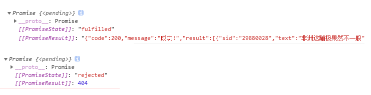

### 2.2. 为什么要用Promise?

    1. 指定回调函数的方式更加灵活: 可以在请求发出甚至结束后指定回调函数
    	Promise.then(resolve);
    2. 支持链式调用, 可以解决回调地狱问题
    	回调地狱问题：回调中嵌套包含另一个异步任务，该异步任务中又包含异步回调

### 2.3. 如何使用Promise?

#### 2.3.1 主要API

```
Promise构造函数: Promise (excutor) {}
    (1) excutor 函数: 执行器 (resolve, reject) => {}
    	在Promise内部同步调用，异步操作在执行器中执行
    (2) resolve 函数: 内部定义成功时我们调用的函数 value => {}
    (3) reject 函数: 内部定义失败时我们调用的函数 reason => {}
    
Promise.prototype.then方法: (onResolved, onRejected) => {}
	(1) onResolved 函数: 成功的回调函数 (value) => {}
    (2) onRejected 函数: 失败的回调函数 (reason) => {}
    说明: 指定用于得到成功 value 的成功回调和用于得到失败 reason 的失败回调
    返回一个新的 promise 对象

Promise.prototype.catch 方法: (onRejected) => {}
    (1) onRejected 函数: 失败的回调函数 (reason) => {}
    说明: then()的语法糖, 相当于: then(undefined, onRejected)
    只能指定失败的回调
    返回一个新的 promise 对象
    
Promise.resolve 方法: (value) => {}
    (1) value: 成功的数据或 promise 对象
    说明: 返回一个成功/失败的 promise 对象
    无论传递什么值，都会返回一个Promise对象，只是对象的状态有区别：
        如果传入的值不是Promise实例对象，则返回一个状态为成功的Promise对象，结果是传入的参数
        如果传入的值是Promise实例对象1，则该对象1的结果就决定了新的Promise对象的状态
        	成功，则新的Promise对象的状态也会成功，结果也是对象1的结果
        	失败，则新的Promise对象的状态也会失败，结果就是对象1的结果
```

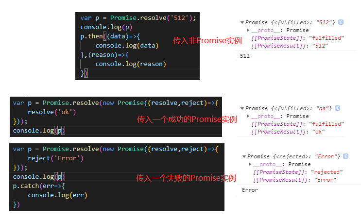

```
Promise.reject 方法: (reason) => {}
    (1) reason: 失败的原因
    说明: 返回一个失败的 promise 对象,结果是传入的参数
    参数：
    	非Promise对象：返回一个失败的 promise 对象,结果是传入的非Promise对象
    	成功的Promise对象：返回一个失败的 promise 对象,结果是传入的成功的Promise对象
    	失败的Promise对象：返回一个失败的 promise 对象,结果是传入的失败的Promise对象
```

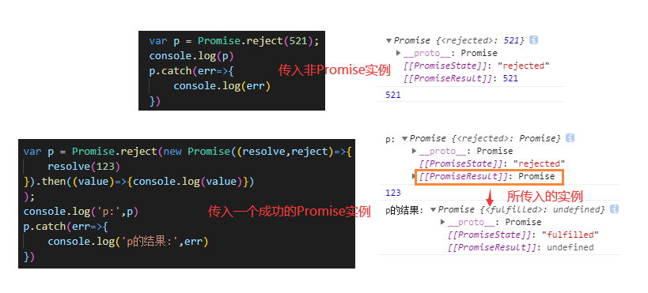

```
Promise.all 方法: (promises) => {}
    (1) promises: 包含 n 个 promise 的数组
    说明: 返回一个新的 promise, 只有所有的 promise 都成功才成功, 只要有一个失败了就直接失败
    成功的结果是所有成功的promise实例的结果组成的一个数组
    失败的结果是这个数组中第一个失败的promise对象的结果
```

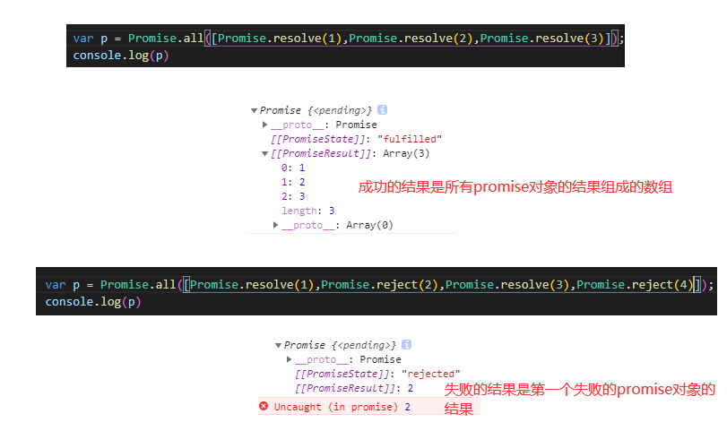

```
Promise.race 方法: (promises) => {}
    (1) promises: 包含 n 个 promise 的数组
    说明: 返回一个新的 promise, 第一个完成的 promise 的结果状态就是最终的结果状态
    不一定是按照参数顺序来的
```

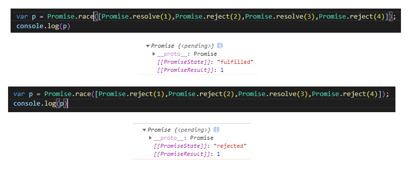

```
Promise.allSettled([p1,p2,...])
	返回一个成功的promise对象
	结果是各个promise对象组成的数组，例如
		[
			{status:'fulfilled',reason:'成功啦'}，
			{status:'rejected',value:'失败啦'}
		]
	无论每一个promise对象成功与否，最后返回的结果都是成功的
```

Promise.finally

> - 如果想在 promise 执行完毕后无论其结果怎样都做一些处理或清理时，`finally()` 方法可能是有用的。
> - then的结果不会传递给finally的回调作为参数

```
Promise.prototype.finally(function(){
  // 一定会执行的代码
})
```

#### 2.3.2 几个重要问题

> - 1 如何改变promise的状态?

```
    1.调用resolve函数，pending--->resolved
    2.调用reject函数，pending--->rejected
    3.抛出错误：throw 'Error'    pending--->rejected
```

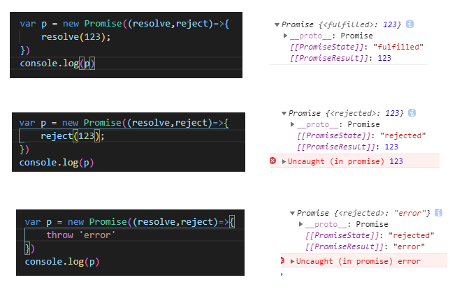

> - 2 一个promise指定多个成功/失败回调函数, 都会调用吗?

```
	当 promise 改变为对应状态时都会调用
```

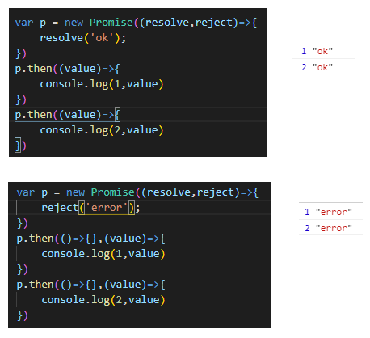

> - 3 改变promise状态和指定回调函数谁先谁后?

```
	(1) 都有可能, 正常情况下是先指定回调再改变状态, 但也可以先改状态再指定回调
    (2) 如何先改状态再指定回调?
        1 在执行器中直接调用 resolve()/reject()
        2 延迟更长时间才调用 then()
    (3) 什么时候才能得到数据?
        1 如果先指定的回调, 那当状态发生改变时, 回调函数就会调用, 得到数据
        2 如果先改变的状态, 那当指定回调时, 回调函数就会调用, 得到数据
        
先指定回调，再改变状态：
// setTimeout是宏任务，交给定时器模块处理，然后把回调交给任务队列
// 所以执行then，then是微任务，放入微任务队列，等待数据
// 等到状态改变，然后再执行微任务
var p = new Promise((resolve,reject)=>{
    setTimeout(function(){
        resolve('ok');
    },5000)
})
p.then((value)=>{
    console.log(1,value)
})
```

> - 4 promise.then()返回的新promise的结果状态由什么决定?

```
	(1) 简单表达: 由 then()指定的回调函数执行的结果决定
	(2) 详细表达:
        1 如果抛出异常, 新 promise 变为 rejected, 结果为抛出的异常
        2 如果返回的是非 promise 的任意值, 新 promise 变为 resolved, 结果为返回的值
        3 如果返回的是另一个新 promise, 此 promise 的结果就会成为新 promise 的结果
```

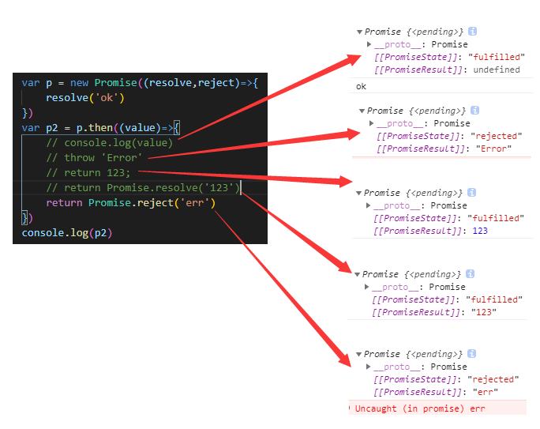

> - 5 promise如何串连多个操作任务?

```
	(1) promise 的 then()返回一个新的 promise, 可以开成 then()的链式调用
	(2) 通过 then 的链式调用串连多个同步/异步任务
```

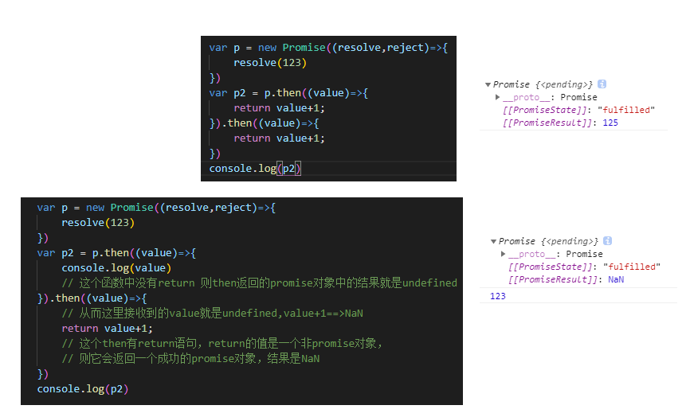

> - 6 promise异常传(穿)透?

```
    (1) 当使用 promise 的 then 链式调用时, 可以在最后指定失败的回调,
    (2) 前面任何操作出了异常, 都会传到最后失败的回调中处理
```

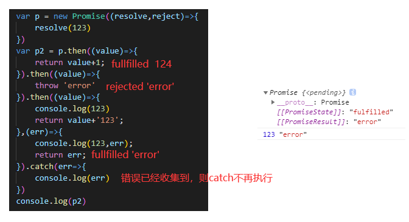

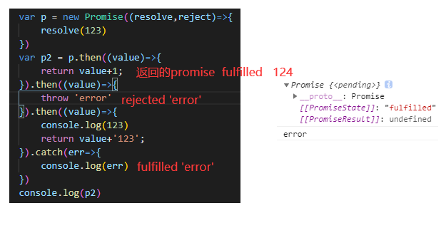

> - 7 中断promise链

```
	(1) 当使用 promise 的 then 链式调用时, 在中间中断, 不再调用后面的回调函数
	(2) 办法: 在回调函数中返回一个 pendding 状态的 promise 对象
		return new Promise(()=>{})
		因为then方法的回调需要状态改变为resolved或者rejected后才可以执行，返回一个pending 状态的promise,会导致then方法也是一个pending状态的promise对象，从而之后的then方法就不能执行
```

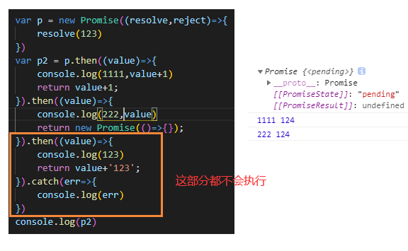

## 3. 自定义Promise

### 3.1 定义整体结构

Promise构造函数传递了一个executor函数作为参数，并且在函数体内调用了该函数

声明构造函数时需要干两件事：

1. 初始化其实例对象的两个属性：PromiseState和PromiseResult。
2. 同步调用其传递的参数

```
function Promise(executor) {

  // 设置实例对象的属性
  this.PromiseState = "pending";
  this.PromiseResult = null;
  
  function resolve(data) {}
  function reject(data) {}
  // 同步调用执行器函数
  executor(resolve, reject);
}

// 添加then方法
/* 
	为 promise 指定成功/失败的回调函数
	函数的返回值是一个新的 promise 对象
*/
Promise.prototype.then = function (onResolved, onRejected) {};
```

### 3.2 实现resolve和reject代码

resolve和reject函数干一件事：修改实例对象的两个属性

1. 修改对象的状态。resolve将状态变为pending，reject将状态变为rejected
2. 修改对象的结果值。对象的结果值由resolve和reject函数的参数决定

> - 需要注意：this的指向问题

```
// 声明构造函数
function Promise(executor) {
  // 设置实例对象的属性
  this.PromiseState = "pending";
  this.PromiseResult = null;
  
  const self = this;
  function resolve(data) {
    // 修改状态
    self.PromiseState = "fulfilled";
    // 设置对象结果值
    self.PromiseResult = data;
  }
  function reject(data) {
    // 修改状态
    self.PromiseState = "rejected";
    // 设置对象结果值
    self.PromiseResult = data;
  }
  executor(resolve, reject);
}

// 添加then方法
Promise.prototype.then = function (onResolved, onRejected) {};
```

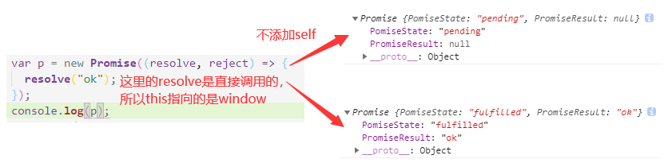

### 3.3 通过throw抛出异常改变promise实例对象的状态

前面已经实现了两种改变对象状态的方法，接下来实现第三种:

```
// 声明构造函数
function Promise(executor) {
  // 设置实例对象的属性
  this.PomiseState = "pending";
  this.PromiseResult = null;
  const self = this;
  function resolve(data) {
    // 修改状态
    self.PomiseState = "fulfilled";
    // 设置对象结果值
    self.PromiseResult = data;
  }
  function reject(data) {
    // 修改状态
    self.PomiseState = "rejected";
    // 设置对象结果值
    self.PromiseResult = data;
  }
  try {
    // 同步调用执行器函数
    executor(resolve, reject);
  } catch (e) {
    // 修改Promise对象的状态为失败
    reject(e);
  }
}

// 添加then方法
Promise.prototype.then = function (onResolved, onRejected) {};
```

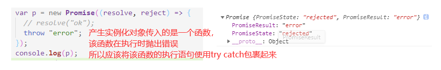

### 3.4 Promise实例对象状态只能修改一次

```
// 声明构造函数
function Promise(executor) {
  // 设置实例对象的属性
  this.PromiseState = "pending";
  this.PromiseResult = null;
  const self = this;
  function resolve(data) {
    // 限制promise实例的状态只能更改一次
    if (self.PromiseState !== "pending") return;
    // 修改状态
    self.PromiseState = "fulfilled";
    // 设置对象结果值
    self.PromiseResult = data;
  }
  function reject(data) {
    // 限制promise实例的状态只能更改一次
    if (self.PromiseState !== "pending") return;
    // 修改状态
    self.PromiseState = "rejected";
    // 设置对象结果值
    self.PromiseResult = data;
  }
  try {
    // 同步调用执行器函数
    executor(resolve, reject);
  } catch (e) {
    // 修改Promise对象的状态为失败
    reject(e);
  }
}

// 添加then方法
Promise.prototype.then = function (onResolved, onRejected) {};
```

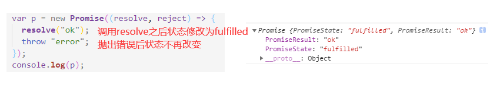

### 3.5 then方法执行回调

```
// 添加then方法
Promise.prototype.then = function (onResolved, onRejected) {
  // 判断状态，执行回调
  if (this.PromiseState === "fulfilled") {
    onResolved(this.PromiseResult);
  }
  if (this.PromiseState === "rejected") {
    onRejected(this.PromiseResult);
  }
};
```

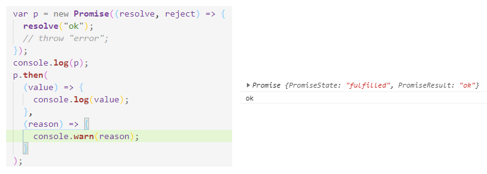

### 3.6 执行异步回调任务

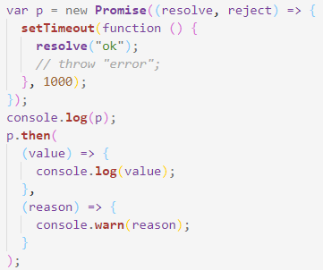

> - 目前我们的代码，在实例化Promise对象时，遇到异步任务，则将其放入异步队列中，继续执行下面的then方法，指定回调函数，但是此时promise对象的状态还是pending ,但是目前then中并没有设置对于pending状态的处理

```
// 声明构造函数
function Promise(executor) {
  // 设置实例对象的属性
  this.PromiseState = "pending";
  this.PromiseResult = null;
  // 声明属性，保存回调
  this.callback = {};
  const self = this;
  function resolve(data) {
    // 限制promise实例的状态只能更改一次
    if (self.PromiseState !== "pending") return;
    // 修改状态
    self.PromiseState = "fulfilled";
    // 设置对象结果值
    self.PromiseResult = data;

    // 调用回调函数
    self.callback.onResolved && self.callback.onResolved(data);
  }
  function reject(data) {
    // 限制promise实例的状态只能更改一次
    if (self.PromiseState !== "pending") return;
    // 修改状态
    self.PromiseState = "rejected";
    // 设置对象结果值
    self.PromiseResult = data;

    // 调用回调函数
    self.callback.onRejected && self.callback.onRejected(data);
  }
  try {
    // 同步调用执行器函数
    executor(resolve, reject);
  } catch (e) {
    // 修改Promise对象的状态为失败
    reject(e);
  }
}

// 添加then方法
Promise.prototype.then = function (onResolved, onRejected) {
  // 判断状态，执行回调
  if (this.PromiseState === "fulfilled") {
    onResolved(this.PromiseResult);
  }
  if (this.PromiseState === "rejected") {
    onRejected(this.PromiseResult);
  }
  // 遇到异步任务，promise状态还是初始pending时
  if (this.PromiseState === "pending") {
    // 保存当前的回调函数，等待异步任务结束之后，在resolve或者reject中执行该回调
    this.callback = {
      onResolved: onResolved,
      onRejected: onRejected,
    };
  }
};
```

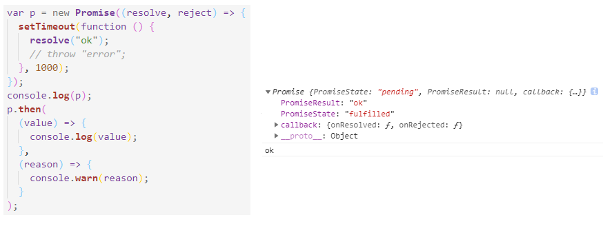

### 3.7 多个回调的执行

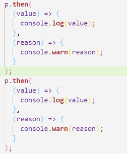

目前，只会执行第一个回调，因为每次存放的回调名字都是onResolved或者onRejected,从而多次存放，会发生内容的重叠，但是该函数只会执行一次

> - 考虑将保存回调函数的属性callback改为一个数组，每次then都保存一个对象，该对象中存放该次then的回调
> - 并且在调用时，循环调用，这样就不会发生重叠

```
// 声明构造函数
function Promise(executor) {
  // 设置实例对象的属性
  this.PromiseState = "pending";
  this.PromiseResult = null;
  // 声明属性，保存回调
  this.callbacks = [];
  const self = this;
  function resolve(data) {
    // 限制promise实例的状态只能更改一次
    if (self.PromiseState !== "pending") return;
    // 修改状态
    self.PromiseState = "fulfilled";
    // 设置对象结果值
    self.PromiseResult = data;

    // 调用回调函数
    self.callbacks.forEach((item) => {
      item.onResolved(data);
    });
  }
  function reject(data) {
    // 限制promise实例的状态只能更改一次
    if (self.PromiseState !== "pending") return;
    // 修改状态
    self.PromiseState = "rejected";
    // 设置对象结果值
    self.PromiseResult = data;

    // 调用回调函数
    self.callbacks.forEach((item) => {
      item.onRejected(data);
    });
  }
  try {
    // 同步调用执行器函数
    executor(resolve, reject);
  } catch (e) {
    // 修改Promise对象的状态为失败
    reject(e);
  }
}

// 添加then方法
Promise.prototype.then = function (onResolved, onRejected) {
  // 判断状态，执行回调
  if (this.PromiseState === "fulfilled") {
    onResolved(this.PromiseResult);
  }
  if (this.PromiseState === "rejected") {
    onRejected(this.PromiseResult);
  }
  if (this.PromiseState === "pending") {
    // 保存当前的回调函数，等待异步任务结束之后，在resolve或者reject中执行该回调
    this.callbacks.push({
      onResolved: onResolved,
      onRejected: onRejected,
    });
  }
};
```

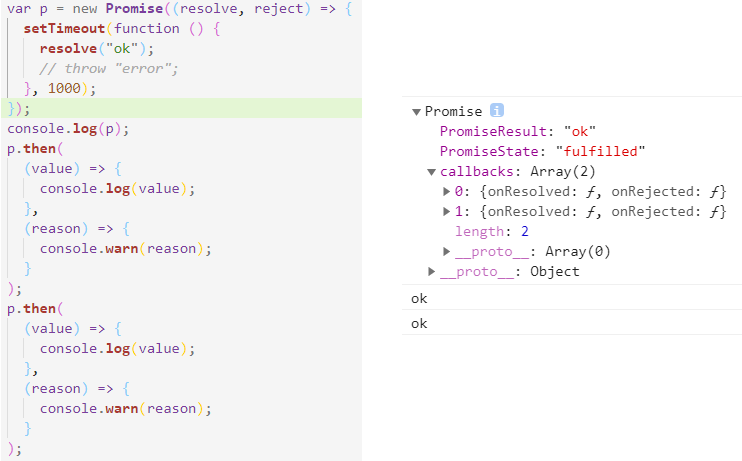

### 3.8 同步任务时，实现then方法返回的结果

> - then方法返回的永远都是一个promise对象，只是对象的结果需要根据回调的返回值决定
>   - 如果回调的返回值不是promise对象，则直接返回一个成功的promise对象
>   - 如果回调的返回值是promise对象1，则
>     - 如果对象1成功，则返回成功的promise对象
>     - 如果对象1失败，则返回失败的promise对象

```
// 添加then方法
Promise.prototype.then = function (onResolved, onRejected) {
  // then方法返回一个Promise实例对象
  // then方法返回的promise对象的状态由回调执行的结果(返回值)决定
  return new Promise((resolve, reject) => {
    // 判断状态，执行回调
    if (this.PromiseState === "fulfilled") {
      var result = onResolved(this.PromiseResult);
      // 判断回调的返回值 promise对象 非promise对象
      if (result instanceof Promise) {
        // promise对象，则可以调用then方法
        // 根据该promise对象的成功与否判断新返回的对象的成功与否
        result.then(
          (value) => {
            resolve(value); // 修改状态
          },
          (error) => {
            reject(error);
          }
        );
      } else {
        // 非promise对象，状态修改为成功
        resolve(result);
      }
    }
    if (this.PromiseState === "rejected") {
      var result = onRejected(this.PromiseResult);
      if (result instanceof Promise) {
        result.then(
          (value) => {
            resolve(value);
          },
          (error) => {
            reject(error);
          }
        );
      } else {
        // 状态修改为resolve
        resolve(result);
      }
    }
    if (this.PromiseState === "pending") {
      // 保存当前的回调函数，等待异步任务结束之后，在resolve或者reject中执行该回调
      this.callbacks.push({
        onResolved: onResolved,
        onRejected: onRejected,
      });
    }
  });
};
```

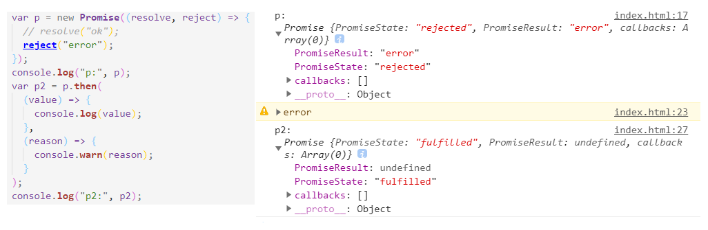

### 3.9 回调中抛出异常

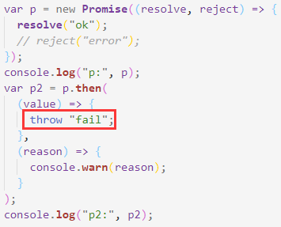

```
Promise.prototype.then = function (onResolved, onRejected) {
  // then方法返回一个Promise实例对象
  // then方法返回的promise对象的状态由回调执行的结果(返回值)决定
  return new Promise((resolve, reject) => {
    // 判断状态，执行回调
    if (this.PromiseState === "fulfilled") {
      // 如果在执行回调的时候报错，则catch到，将状态修改为rejected
      try {
        var result = onResolved(this.PromiseResult);
        // 判断回调的返回值 promise对象 非promise对象
        if (result instanceof Promise) {
          // promise对象，则可以调用then方法
          // 根据该promise对象的成功与否判断新返回的对象的成功与否
          result.then(
            (value) => {
              resolve(value); // 修改状态
            },
            (error) => {
              reject(error);
            }
          );
        } else {
          // 非promise对象，状态修改为成功
          resolve(result);
        }
      } catch (e) {
        reject(e);
      }
    }
    if (this.PromiseState === "rejected") {
      // 如果在执行回调的时候报错，则catch到，将状态修改为rejected
      try {
        var result = onRejected(this.PromiseResult);
        if (result instanceof Promise) {
          result.then(
            (value) => {
              resolve(value);
            },
            (error) => {
              reject(error);
            }
          );
        } else {
          // 状态修改为resolve
          resolve(result);
        }
      } catch (e) {
        reject(e);
      }
    }
    if (this.PromiseState === "pending") {
      // 保存当前的回调函数，等待异步任务结束之后，在resolve或者reject中执行该回调
      this.callbacks.push({
        onResolved: onResolved,
        onRejected: onRejected,
      });
    }
  });
};
```

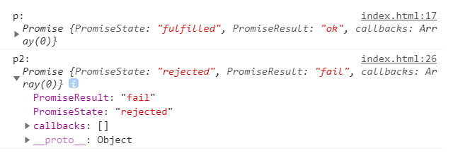

### 3.10 异步任务下：then方法返回结果的实现

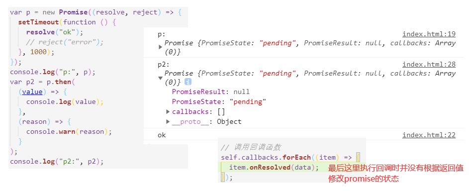

> - 由于存在异步任务，导致在执行then语句，指定回调函数时发现此时promise对象状态仍然是pending ,所以此时保存了回调，等待异步任务完成后，修改promise的状态，并且执行回调
> - 但是此时只是执行了回调，并没有根据回调修改要返回的新的promise的状态，也没有返回新的promise对象
> - 所以可以在保存该回调时，将修改状态语句也放进去
> - 同理：由于回调中可能会抛出错误，所以使用try catch包裹回调的执行语句

```
if (this.PromiseState === "pending") {
  // 保存当前的回调函数，等待异步任务结束之后，在resolve或者reject中执行该回调
  this.callbacks.push({
    onResolved: function () {
      // 调用回调
      try {
        var result = onResolved(self.PromiseResult);
        // 修改状态
        // 判断回调的返回值 promise对象 非promise对象
        if (result instanceof Promise) {
          // promise对象，则可以调用then方法
          // 根据该promise对象的成功与否判断新返回的对象的成功与否
          result.then(
            (value) => {
              resolve(value); // 修改状态
            },
            (error) => {
              reject(error);
            }
          );
        } else {
          // 非promise对象，状态修改为成功
          resolve(result);
        }
      } catch (e) {
        reject(e);
      }
    },
    onRejected: function () {
      try {
        var result = onRejected(self.PromiseResult);
        if (result instanceof Promise) {
          result.then(
            (value) => {
              resolve(value);
            },
            (error) => {
              reject(error);
            }
          );
        } else {
          // 状态修改为resolve
          resolve(result);
        }
      } catch (e) {
        reject(e);
      }
    },
  });
}
```

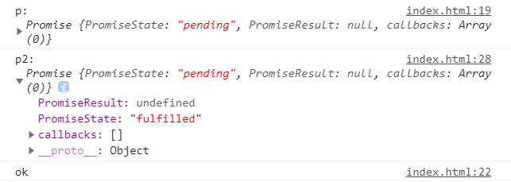

### 3.11 then方法的优化

目前整体代码段为：

```
// 声明构造函数
function Promise(executor) {
  // 设置实例对象的属性
  this.PromiseState = "pending";
  this.PromiseResult = null;
  // 声明属性，保存回调
  this.callbacks = [];
  const self = this;
  function resolve(data) {
    // 限制promise实例的状态只能更改一次
    if (self.PromiseState !== "pending") return;
    // 修改状态
    self.PromiseState = "fulfilled";
    // 设置对象结果值
    self.PromiseResult = data;

    // 调用回调函数
    self.callbacks.forEach((item) => {
      item.onResolved(data);
    });
  }
  function reject(data) {
    // 限制promise实例的状态只能更改一次
    if (self.PromiseState !== "pending") return;
    // 修改状态
    self.PromiseState = "rejected";
    // 设置对象结果值
    self.PromiseResult = data;

    // 调用回调函数
    self.callbacks.forEach((item) => {
      item.onRejected(data);
    });
  }
  try {
    // 同步调用执行器函数
    executor(resolve, reject);
  } catch (e) {
    // 修改Promise对象的状态为失败
    reject(e);
  }
}

// 添加then方法
Promise.prototype.then = function (onResolved, onRejected) {
  const self = this;
  // then方法返回一个Promise实例对象
  // then方法返回的promise对象的状态由回调执行的结果(返回值)决定
  return new Promise((resolve, reject) => {
    // 判断状态，执行回调
    if (this.PromiseState === "fulfilled") {
      // -------------------------------------------------------
      try {
        var result = onResolved(this.PromiseResult);
        // 判断回调的返回值 promise对象 非promise对象
        if (result instanceof Promise) {
          // promise对象，则可以调用then方法
          // 根据该promise对象的成功与否判断新返回的对象的成功与否
          result.then(
            (value) => {
              resolve(value); // 修改状态
            },
            (error) => {
              reject(error);
            }
          );
        } else {
          // 非promise对象，状态修改为成功
          resolve(result);
        }
      } catch (e) {
        reject(e);
      }
      // -------------------------------------------------------
    }
    if (this.PromiseState === "rejected") {
      // -------------------------------------------------------
      try {
        var result = onRejected(this.PromiseResult);
        if (result instanceof Promise) {
          result.then(
            (value) => {
              resolve(value);
            },
            (error) => {
              reject(error);
            }
          );
        } else {
          // 状态修改为resolve
          resolve(result);
        }
      } catch (e) {
        reject(e);
      }
      // -------------------------------------------------------
    }
    if (this.PromiseState === "pending") {
      // 保存当前的回调函数，等待异步任务结束之后，在resolve或者reject中执行该回调
      this.callbacks.push({
        onResolved: function () {
          // 调用回调
          // -------------------------------------------------------
          try {
            var result = onResolved(self.PromiseResult);
            // 修改状态
            // 判断回调的返回值 promise对象 非promise对象
            if (result instanceof Promise) {
              // promise对象，则可以调用then方法
              // 根据该promise对象的成功与否判断新返回的对象的成功与否
              result.then(
                (value) => {
                  resolve(value); // 修改状态
                },
                (error) => {
                  reject(error);
                }
              );
            } else {
              // 非promise对象，状态修改为成功
              resolve(result);
            }
          } catch (e) {
            reject(e);
          }
          // -------------------------------------------------------
        },
        onRejected: function () {
          // -------------------------------------------------------
          try {
            var result = onRejected(self.PromiseResult);
            if (result instanceof Promise) {
              result.then(
                (value) => {
                  resolve(value);
                },
                (error) => {
                  reject(error);
                }
              );
            } else {
              // 状态修改为resolve
              resolve(result);
            }
          } catch (e) {
            reject(e);
          }
          // -------------------------------------------------------
        },
      });
    }
  });
};
```

> - 可以发现其中具备四段相似代码，可以将其提炼为一个函数

```
// 声明构造函数
function Promise(executor) {
  // 设置实例对象的属性
  this.PromiseState = "pending";
  this.PromiseResult = null;
  // 声明属性，保存回调
  this.callbacks = [];
  const self = this;
  function resolve(data) {
    // 限制promise实例的状态只能更改一次
    if (self.PromiseState !== "pending") return;
    // 修改状态
    self.PromiseState = "fulfilled";
    // 设置对象结果值
    self.PromiseResult = data;

    // 调用回调函数
    self.callbacks.forEach((item) => {
      item.onResolved(data);
    });
  }
  function reject(data) {
    // 限制promise实例的状态只能更改一次
    if (self.PromiseState !== "pending") return;
    // 修改状态
    self.PromiseState = "rejected";
    // 设置对象结果值
    self.PromiseResult = data;

    // 调用回调函数
    self.callbacks.forEach((item) => {
      item.onRejected(data);
    });
  }
  try {
    // 同步调用执行器函数
    executor(resolve, reject);
  } catch (e) {
    // 修改Promise对象的状态为失败
    reject(e);
  }
}

// 添加then方法
Promise.prototype.then = function (onResolved, onRejected) {
  const self = this;
  // then方法返回一个Promise实例对象
  // then方法返回的promise对象的状态由回调执行的结果(返回值)决定

  return new Promise((resolve, reject) => {
    // 相同代码块提炼的函数
    function callback(type) {
      try {
        // 注意：这里是self
        var result = type(self.PromiseResult);
        // 判断回调的返回值 promise对象 非promise对象
        if (result instanceof Promise) {
          // promise对象，则可以调用then方法
          // 根据该promise对象的成功与否判断新返回的对象的成功与否
          result.then(
            (value) => {
              resolve(value); // 修改状态
            },
            (error) => {
              reject(error);
            }
          );
        } else {
          // 非promise对象，状态修改为成功
          resolve(result);
        }
      } catch (e) {
        reject(e);
      }
    }
    // 判断状态，执行回调
    if (this.PromiseState === "fulfilled") {
      callback(onResolved);
    }
    if (this.PromiseState === "rejected") {
      callback(onRejected);
    }
    if (this.PromiseState === "pending") {
      // 保存当前的回调函数，等待异步任务结束之后，在resolve或者reject中执行该回调
      this.callbacks.push({
        onResolved: function () {
          // 调用回调
          callback(onResolved);
        },
        onRejected: function () {
          callback(onRejected);
        },
      });
    }
  });
};
```

### 3.12 Promise.catch 异常穿透  值传递

> - 1 实现catch
>   - then的特例，只包含失败回调

```
// 添加catch方法
Promise.prototype.catch = function (onRejected) {
  return this.then(undefined, onRejected);
};

```

> - 2 异常穿透

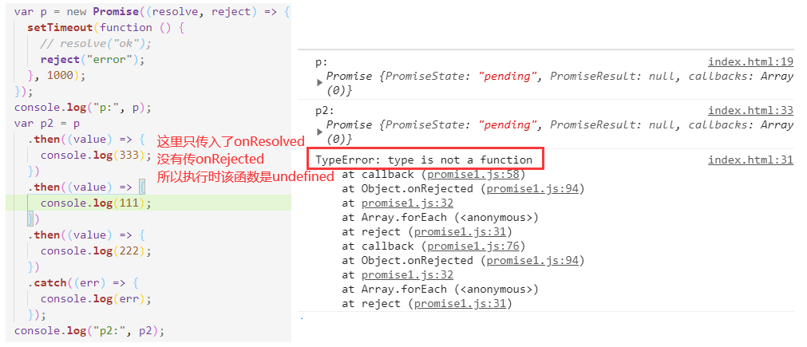

```
在then方法最开始先判断，如果没有传，则throw错误

if (typeof onRejected !== "function") {
    onRejected = function (error) {
      throw error;
    };
}
```

> - 3 值传递
>   - 两个回调函数都不传

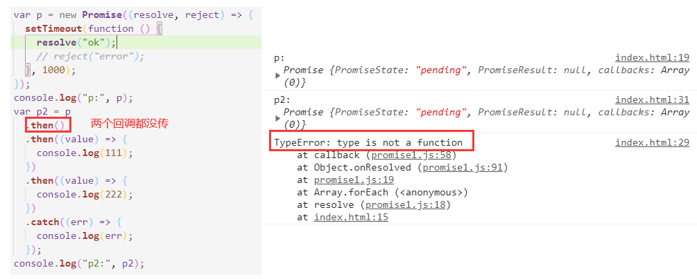

```
在then方法最开始先判断，如果没有传，则直接传递值
if (typeof onRejected !== "function") {
    onResolved = function (value) {
      return value;
    };
  }
```

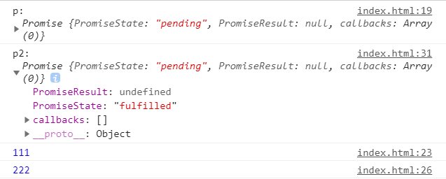

### 3.13 Promise.resolve()的实现

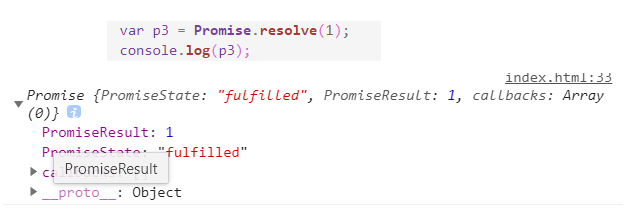

```
// 
Promise.resolve = function (value) {
  return new Promise((resolve, reject) => {
    if (value instanceof Promise) {
      // promise对象，则可以调用then方法
      // 根据该promise对象的成功与否判断新返回的对象的成功与否
      value.then(
        (value) => {
          resolve(value); // 修改状态
        },
        (error) => {
          reject(error);
        }
      );
    } else {
      resolve(value);
    }
  });
};
```

### 3.14 Promise.reject()的实现

> - 它一定返回一个失败的promise对象，值是所传入的参数

```
// 
Promise.reject = function (value) {
  return new Promise((resolve, reject) => {
    reject(value);
  });
};
```

### 3.15 Promise.all()的实现

```
// Promise.all
Promise.all = function (promises) {
  return new Promise((resolve, reject) => {
    let count = 0;
    let res = [];
    for (let i = 0; i < promises.length; i++) {
      promises[i].then(
        (value) => {
          count++;
          res[i] = value;
          if (count === promises.length) {
            resolve(res);
          }
        },
        (error) => {
          reject(error);
        }
      );
    }
  });
};
```

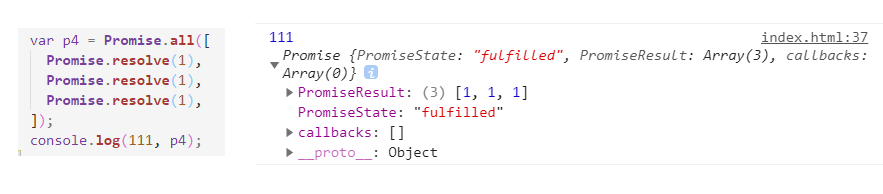

### 3.16 Promise.race()的实现

```
// Promise.race
Promise.race = function (promises) {
  return new Promise((resolve, reject) => {
    for (let i = 0; i < promises.length; i++) {
      promises[i].then(
        (value) => {
          resolve(value);
        },
        (error) => {
          reject(error);
        }
      );
    }
  });
};
```

### Promise.allSettled()

> - 返回一个成功的promise,并且结果是所有promise对象组成的数组，无论失败或者成功

```
Promise.allSettled = function (promises) {
  return new Promise((resolve) => {
    const data = [],
      len = promises.length;
    let count = len;
    for (let i = 0; i < len; i += 1) {
      const promise = promises[i];
      promise
        .then(
          (res) => {
            data[i] = { status: "fulfilled", value: res };
          },
          (error) => {
            data[i] = { status: "rejected", reason: error };
          }
        )
        .finally(() => {
          // promise has been settled
          if (!--count) {
            resolve(data);
          }
        });
    }
  });
};
```


### 3.17 Promise.resolveDelay()/rejectDelay()的实现

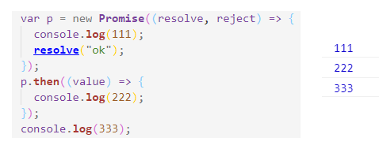

> - 执行回调时需要等待，直到所有的同步代码执行完毕才可以
>   - 目前我们实现的功能并没有完成这一项
> - 所以暂时使用定时器为其添加延时效果，为所有调用callback函数的语句添加定时器，模拟将其添加到微任务队列中
> - 在then方法中：
>   - 如果promise的状态变为resolved或者rejected,则将其加入到微任务队列中，等待宏任务执行完毕后执行
>   - 如果promise的状态为pending,则将then方法的回调保存起来，等待promise变为resolved或者pending后，加入微任务队列，再执行

```
setTimeout(function () {
	callback(onRejected);
});
          
setTimeout(function () {
	callback(onResolved);
});
```

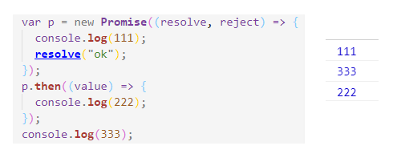

### 3.18 整体代码

```
// 声明构造函数
function Promise(executor) {
  // 设置实例对象的属性
  this.PromiseState = "pending";
  this.PromiseResult = null;
  // 声明属性，保存回调
  this.callbacks = [];
  const self = this;
  function resolve(data) {
    // 限制promise实例的状态只能更改一次
    if (self.PromiseState !== "pending") return;
    // 修改状态
    self.PromiseState = "fulfilled";
    // 设置对象结果值
    self.PromiseResult = data;

    // 调用回调函数
    self.callbacks.forEach((item) => {
      item.onResolved(data);
    });
  }
  function reject(data) {
    // 限制promise实例的状态只能更改一次
    if (self.PromiseState !== "pending") return;
    // 修改状态
    self.PromiseState = "rejected";
    // 设置对象结果值
    self.PromiseResult = data;

    // 调用回调函数
    self.callbacks.forEach((item) => {
      item.onRejected(data);
    });
  }
  try {
    // 同步调用执行器函数
    executor(resolve, reject);
  } catch (e) {
    // 修改Promise对象的状态为失败
    reject(e);
  }
}

// 添加then方法
Promise.prototype.then = function (onResolved, onRejected) {
  const self = this;
  if (typeof onRejected !== "function") {
    onRejected = function (error) {
      throw error;
    };
  }
  if (typeof onResolved !== "function") {
    onResolved = function (value) {
      return value;
    };
  }
  // then方法返回一个Promise实例对象
  // then方法返回的promise对象的状态由回调执行的结果(返回值)决定

  return new Promise((resolve, reject) => {
    function callback(type) {
      try {
        var result = type(self.PromiseResult);
        // 判断回调的返回值 promise对象 非promise对象
        if (result instanceof Promise) {
          // promise对象，则可以调用then方法
          // 根据该promise对象的成功与否判断新返回的对象的成功与否
          result.then(
            (value) => {
              resolve(value); // 修改状态
            },
            (error) => {
              reject(error);
            }
          );
        } else {
          // 非promise对象，状态修改为成功
          resolve(result);
        }
      } catch (e) {
        reject(e);
      }
    }
    // 判断状态，执行回调
    if (this.PromiseState === "fulfilled") {
      setTimeout(function () {
        callback(onResolved);
      });
    }
    if (this.PromiseState === "rejected") {
      setTimeout(function () {
        callback(onRejected);
      });
    }
    if (this.PromiseState === "pending") {
      // 保存当前的回调函数，等待异步任务结束之后，在resolve或者reject中执行该回调
      this.callbacks.push({
        onResolved: function () {
          // 调用回调
          setTimeout(function () {
            callback(onResolved);
          });
        },
        onRejected: function () {
          setTimeout(function () {
            callback(onRejected);
          });
        },
      });
    }
  });
};

// 添加catch方法
Promise.prototype.catch = function (onRejected) {
  return this.then(undefined, onRejected);
};

//
Promise.resolve = function (value) {
  return new Promise((resolve, reject) => {
    if (value instanceof Promise) {
      // promise对象，则可以调用then方法
      // 根据该promise对象的成功与否判断新返回的对象的成功与否
      value.then(
        (value) => {
          resolve(value); // 修改状态
        },
        (error) => {
          reject(error);
        }
      );
    } else {
      resolve(value);
    }
  });
};

//
Promise.reject = function (value) {
  return new Promise((resolve, reject) => {
    reject(value);
  });
};

// Promise.all
Promise.all = function (promises) {
  return new Promise((resolve, reject) => {
    let count = 0;
    let res = [];
    for (let i = 0; i < promises.length; i++) {
      promises[i].then(
        (value) => {
          count++;
          res[i] = value;
          if (count === promises.length) {
            resolve(res);
          }
        },
        (error) => {
          reject(error);
        }
      );
    }
  });
};

// Promise.race
Promise.race = function (promises) {
  return new Promise((resolve, reject) => {
    for (let i = 0; i < promises.length; i++) {
      promises[i].then(
        (value) => {
          resolve(value);
        },
        (error) => {
          reject(error);
        }
      );
    }
  });
};
```


### 3.19 ES6 class版本

> - 实例对象的方法直接放在类中即可
> - 类原型上的方法则需要使用static关键字修饰

```
class Promise {
  constructor(executor) {
    // 设置实例对象的属性
    this.PromiseState = "pending";
    this.PromiseResult = null;
    // 声明属性，保存回调
    this.callbacks = [];
    const self = this;
    function resolve(data) {
      // 限制promise实例的状态只能更改一次
      if (self.PromiseState !== "pending") return;
      // 修改状态
      self.PromiseState = "fulfilled";
      // 设置对象结果值
      self.PromiseResult = data;

      // 调用回调函数
      self.callbacks.forEach((item) => {
        item.onResolved(data);
      });
    }
    function reject(data) {
      // 限制promise实例的状态只能更改一次
      if (self.PromiseState !== "pending") return;
      // 修改状态
      self.PromiseState = "rejected";
      // 设置对象结果值
      self.PromiseResult = data;

      // 调用回调函数
      self.callbacks.forEach((item) => {
        item.onRejected(data);
      });
    }
    try {
      // 同步调用执行器函数
      executor(resolve, reject);
    } catch (e) {
      // 修改Promise对象的状态为失败
      reject(e);
    }
  }

  // then方法的封装
  then(onResolved, onRejected) {
    const self = this;
    if (typeof onRejected !== "function") {
      onRejected = function (error) {
        throw error;
      };
    }
    if (typeof onResolved !== "function") {
      onResolved = function (value) {
        return value;
      };
    }
    // then方法返回一个Promise实例对象
    // then方法返回的promise对象的状态由回调执行的结果(返回值)决定

    return new Promise((resolve, reject) => {
      function callback(type) {
        try {
          var result = type(self.PromiseResult);
          // 判断回调的返回值 promise对象 非promise对象
          if (result instanceof Promise) {
            // promise对象，则可以调用then方法
            // 根据该promise对象的成功与否判断新返回的对象的成功与否
            result.then(
              (value) => {
                resolve(value); // 修改状态
              },
              (error) => {
                reject(error);
              }
            );
          } else {
            // 非promise对象，状态修改为成功
            resolve(result);
          }
        } catch (e) {
          reject(e);
        }
      }
      // 判断状态，执行回调
      if (this.PromiseState === "fulfilled") {
        setTimeout(function () {
          callback(onResolved);
        });
      }
      if (this.PromiseState === "rejected") {
        setTimeout(function () {
          callback(onRejected);
        });
      }
      if (this.PromiseState === "pending") {
        // 保存当前的回调函数，等待异步任务结束之后，在resolve或者reject中执行该回调
        this.callbacks.push({
          onResolved: function () {
            // 调用回调
            setTimeout(function () {
              callback(onResolved);
            });
          },
          onRejected: function () {
            setTimeout(function () {
              callback(onRejected);
            });
          },
        });
      }
    });
  }
  // catch方法的封装
  catch(onRejected) {
    return this.then(undefined, onRejected);
  }

  // 类原型上的方法，使用static修饰
  static resolve = function (value) {
    return new Promise((resolve, reject) => {
      if (value instanceof Promise) {
        // promise对象，则可以调用then方法
        // 根据该promise对象的成功与否判断新返回的对象的成功与否
        value.then(
          (value) => {
            resolve(value); // 修改状态
          },
          (error) => {
            reject(error);
          }
        );
      } else {
        resolve(value);
      }
    });
  };

  //
  static reject = function (value) {
    return new Promise((resolve, reject) => {
      reject(value);
    });
  };

  // Promise.all
  static all = function (promises) {
    return new Promise((resolve, reject) => {
      let count = 0;
      let res = [];
      for (let i = 0; i < promises.length; i++) {
        promises[i].then(
          (value) => {
            count++;
            res[i] = value;
            if (count === promises.length) {
              resolve(res);
            }
          },
          (error) => {
            reject(error);
          }
        );
      }
    });
  };

  // Promise.race
  static race = function (promises) {
    return new Promise((resolve, reject) => {
      for (let i = 0; i < promises.length; i++) {
        promises[i].then(
          (value) => {
            resolve(value);
          },
          (error) => {
            reject(error);
          }
        );
      }
    });
  };
}
```

## 4. async与await

`async`和`await`关键字让我们可以用一种更简洁的方式写出基于[`Promise`](https://developer.mozilla.org/zh-CN/docs/Web/JavaScript/Reference/Global_Objects/Promise)的异步行为，而无需刻意地链式调用`promise`。

### 4.1 原理

    1. async 函数
        函数的返回值为promise对象
        promise对象的结果由async函数return的值决定
        	如果函数return的值是一个非promise类型---> 返回一个成功的promise对象
        	如果函数return的值是一个promise类型：调用then方法得到结果值再返回新的promise
        		该对象成功---->返回一个成功的promise对象，结果是该对象的结果
        		该对象失败---->返回一个失败的promise对象，结果是该对象的结果
       
    2. await 表达式
        await右侧的表达式一般为promise对象, 但也可以是其它的值
        如果表达式是promise对象, await返回的是promise成功的值，相当于执行了promise.then(val=>undefined),获取到该值，然后才会继续执行await下面的代码块,等于创建了一个微任务，await后续的内容都会添加到该微任务中
        如果表达式是其它值, 则会先执行Promise.resolve(value)将其变为promise对象，然后再执行
    
    3. 注意:
        await必须写在async函数中, 但async函数中可以没有await
        如果await的promise失败了, 就会抛出异常, 需要通过try...catch来捕获处理

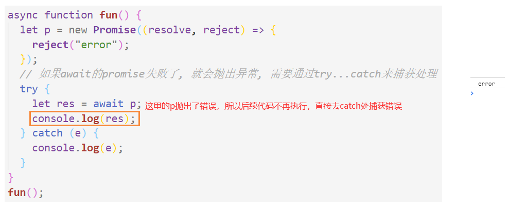

### 4.2 应用

> - 1 async与await结合 读取多个文件的内容
>   - 无需嵌套回调
>   - 使用try catch直接获取错误

```
const fs = require("fs");
const util = require("util");
// 将fs.readFile转换为一个返回promise对象的函数
const mineReadFile = util.promisify(fs.readFile);

// 1 直接使用fs.readFile读取文件，需要嵌套
/* fs.readFile("./01.txt", (err, data1) => {
  if (err) throw err;
  fs.readFile("./02.txt", (err, data2) => {
    if (err) throw err;
    fs.readFile("./03.txt", (err, data3) => {
      if (err) throw err;
      console.log(data1 + data2 + data3);
    });
  });
}); */

// 2 async与await实现：不需要嵌套，使用方便
async function main() {
  try {
    // 读取第一个文件的内容
    var data1 = await mineReadFile("./01.txt");
    var data2 = await mineReadFile("./02.txt");
    var data3 = await mineReadFile("./03.txt");
    console.log(data1 + data2 + data3);
  } catch (e) {
    console.log(e);
  }
}
main();
```

> - 2 async和await结合 发送ajax请求

```
function sendAJAX(url) {
  return new Promise((resolve, reject) => {
    const xhr = new XMLHttpRequest();
    xhr.open("get", url);
    xhr.send();
    xhr.onreadystatechange = function () {
      if (xhr.readyState == 4) {
        if (xhr.status >= 200 && xhr.status <= 300) {
          resolve(xhr.response); // 修改promise状态为成功
        } else {
          reject(xhr.status); // 修改promise状态为失败
        }
      }
    };
  });
}

btn.addEventListener("click", async function () {
  // 这里会直接得到promise的结果
  let res = await sendAJAX("https://api.apiopen.top/getJoke");
  console.log(res);
});
```

### 4.3 async await和promise的关系

`async`和`await`关键字让我们可以用一种更简洁的方式写出基于[`Promise`](https://developer.mozilla.org/zh-CN/docs/Web/JavaScript/Reference/Global_Objects/Promise)的异步行为，而无需刻意地链式调用`promise`。

添加了async标志的函数fn一定会返回一个promise对象。如果一个添加了async标志的函数fn的返回值不是promise，那么它将会被隐式地包装在一个promise中。

> - 添加了async标志的函数fn内部会对返回值的类型进行判断：
>   - fn返回值不是promise，则会使用Promise.resolve将其转换为promise对象
>   - fn函数返回值本身就是promise时：则会先执行该promise.then,将该promise的结果作为新的promise的结果返回。所以内部会再添加一个微任务
>     - 实现方式和Promise.resolve比较像，成功与否取决于返回的promise

```
async function foo() {
   return 1
}
等价于
function foo() {
   return Promise.resolve(1)
}

两者执行完毕后都会返回一个 resolved状态的promise对象
```

> - 比较重要的是async 函数中 await语句实际的转换代码
> - 实际上就是调用了promise.then方法获取promise对象结果，然后接着执行下面的内容的过程
> - 所以就是创建了一个微任务，从而让出了线程

```
async function foo() {
   await 1
   console.log(123);
   return 123
}
等价于
function foo() {
   return Promise.resolve(1).then(() => {
       console.log(123);
       return Promise.resolve(123)
   })
}
```

### 4.4 async await执行顺序

#### 1 总结

根据await后面跟的内容：

> - 1 如果是一个同步函数(不具备async标志，`function fn(){}`)的执行结果,**都只创建一个微任务**
>   - 非promise对象value：Promise.resolve(value).then 创建微任务
>   - promise对象p1： p1.then创建微任务
> - 2 如果是一个添加了async标志的函数(`async function fn(){}`)，返回值类型分为两种：
>   - 2.1 fn无返回值或者返回值不是promise对象：让出线程，后续代码放入微任务中，**只创建一个微任务**
>     - fn返回undefined：async标识会返回一个结果为undefined、状态为resolved的promise对象
>     - fn返回一个非promise对象：async标识会返回一个结果为该返回值、状态为resolved的promise对象
>   - 2.2 fn返回值是promise对象p1：**先后创建两个微任务**，前一个执行完毕创建下一个，直到这两个微任务执行完毕,得到promise对象p2，返回到await处，await  p2就是执行p2.then获取p2的promiseResult属性，所以会开启第三个微任务，让出执行线程，**所以前后总共最少会创建三个微任务**,这里使用最少，是因为可能在fn函数得到返回值时还存在其他微任务，例如题目6
>     - 第一个微任务就是为了将p1的结果拿到，返回新的promise对象而执行的p1.then()
>     - 微任务1执行完毕后，紧接着会添加第二个微任务，第二个微任务就很奇怪，**具体可以参见这篇文章，感觉一个微任务就可以了，但是promise底层加了两个https://juejin.cn/post/6945319439772434469#heading-27**
>     - 第二个微任务执行完毕，则该异步函数就返回了一个promise对象p2，await p2, 就是执行p2.then获取p2的promiseResult属性，所以会开启第三个微任务，让出执行线程

#### 2 题目举例:

题目1：   1  **fn无async标识**

> - 执行async1函数：
>   - 先执行async2: 打印'async2 end'，返回undefined, await undefined，相当于创建一个新的值为undefined的resolved状态的promise，并且调用then,所以**创建一个微任务micro1**，该微任务执行结束后就会接着执行await语句下面的代码
>   - 然后打印'Promise'，返回一个resolved状态的promise对象，promiseResult是undefined，'promise1'进入微任务队列
>   - micro1执行，打印'async1 end'
>   - 'promise1'执行，'promise2'进入微任务队列

```
console.log('script start')     

async function async1() {
    await async2()  
    console.log('async1 end')
}
function async2() {
	console.log('async2 end')   
}
async1()

setTimeout(function() {
	console.log('setTimeout')  
}, 0)

new Promise(resolve => {    
	console.log('Promise')    
	resolve()
})
.then(function() {
	console.log('promise1')   
})
.then(function() {
	console.log('promise2')   
})

console.log('script end')   

script start
async2 end
Promise
script end
async1 end
promise1
promise2
setTimeout
```

题目2：2.1   **fn返回undefined**

> - 执行async1函数：
>   - 先执行async2: 打印'async2 end'，返回一个resolved状态值为undefined的Promise对象p1，await p1就是执行p1的then方法，得到p1中保存的promiseResult,所以**创建一个微任务micro1**，该微任务执行结束后就会接着执行await语句下面的代码
>   - 然后打印'Promise'，返回一个resolved状态的promise对象，promiseResult是undefined，'promise1'进入微任务队列
>   - micro1执行，打印'async1 end'
>   - 'promise1'执行，'promise2'进入微任务队列

```
console.log('script start')     

async function async1() {
    await async2()  
    console.log('async1 end')
}
async function async2() {
	console.log('async2 end')   
}
async1()

setTimeout(function() {
	console.log('setTimeout')  
}, 0)

new Promise(resolve => {    
	console.log('Promise')    
	resolve()
})
.then(function() {
	console.log('promise1')   
})
.then(function() {
	console.log('promise2')   
})

console.log('script end')   

script start
async2 end
Promise
script end
async1 end
promise1
promise2
setTimeout
```

题目3：2.1 **fn有返回值，但不是promise对象**

> - 和题目1相同，只不过异步的async2函数最终返回的promise的promiseResult属性是111

```
console.log('script start')     // 1

async function async1() {
    await async2()  // await 一个promise对象，直接将await下面的内容加入微任务
    console.log('async1 end')
}
async function async2() {
	console.log('async2 end')   // 2,微：[async1 end]    // 5
	return 111;
}
async1()

setTimeout(function() {
	console.log('setTimeout')  // 宏：[setTimeout]   // 9
}, 0)

new Promise(resolve => {    
	console.log('Promise')     // 3
	resolve()
})
.then(function() {
	console.log('promise1')   // 微：[async end,promise1]  // 6 
})
.then(function() {
	console.log('promise2')   // 7,微:[promise2]      // 8
})
.then(function() {
	console.log('promise3')   // 7,微:[promise2]      // 8
})
.then(function() {
	console.log('promise4')   // 7,微:[promise2]      // 8
})

console.log('script end')   // 4

script start
async2 end
Promise
script end
async1 end
promise1
promise2
setTimeout
```

题目4：2.1  

> - await后面又多嵌套了一层promise，不会增加微任务数量

```
console.log('script start')     // 1

async function async1() {
    await Promise.resolve(async2())  // await 一个promise对象，直接将await下面的内容加入微任务
    console.log('async1 end')
}
async function async2() {
	console.log('async2 end')   // 2,微：[async1 end]    // 5
}
async1()

setTimeout(function() {
	console.log('setTimeout')  // 宏：[setTimeout]   // 9
}, 0)

new Promise(resolve => {    
	console.log('Promise')     // 3
	resolve()
})
.then(function() {
	console.log('promise1')   // 微：[async end,promise1]  // 6 
})
.then(function() {
	console.log('promise2')   // 7,微:[promise2]      // 8
})

console.log('script end')   // 4

script start
async2 end
Promise
script end
async1 end
promise1
promise2
setTimeout
```

题目5： 2.2  **fn返回一个promise对象**

例子4：async2本身就返回一个Promise对象，则async标志会对于该promise对象再次进行包装，执行then,产生另外的微任务

> - async2本身返回一个promise对象，添加async标志后，会先执行该promise对象，然后返回一个新的promise对象，所以这个过程中会产生一个微任务micro1，**实际上它会再micro执行结束后，再添加一个微任务micro2，具体可以参见这篇文章，感觉一个微任务就可以了，但是promise底层加了两个https://juejin.cn/post/6945319439772434469#heading-27**
> - 所以跳出执行下一个promise任务，输出'Promise'，'promise1'放入微任务中
> - 执行micro1,返回一个promise对象，将micro2加入微任务中
> - 执行'promise1'，将'promise2'加入微任务中
> - 执行micro2，则异步async2执行结束，返回一个成功的promise对象，从而接着将await下面的代码放入微任务队列中，让出执行线程
> - 执行promise2，将promise3加入微任务中
> - 输出：'async1 end'
> - 执行promise3，将promise4加入微任务中
> - 执行promise4
> - 最后执行宏任务

```
console.log('script start')      

async function async1() {
    await async2();  
    console.log('async1 end')  
}
async function async2() {
	console.log('async2 end')   
	return Promise.resolve()   
}
async1()

setTimeout(function() {
	console.log('setTimeout')  
}, 0)

new Promise(resolve => {    
	console.log('Promise')    
	resolve()
})
.then(function() {
	console.log('promise1')  
})
.then(function() {
	console.log('promise2')  
})
.then(function() {
	console.log('promise3')  
})
.then(function() {
	console.log('promise4')  
})

console.log('script end')   // 7 

script start
async2 end
Promise
script end
promise1
promise2
async1 end   // 注意这里的顺序
promise3
promise4
undefined
setTimeout
```

题目6： 2.2  **fn返回promise对象，并且内部还有其他逻辑**

> - 执行async1
> - 执行async2,打印'async2 end'，Promise.resolve()得到一个resolved状态的promise,then创建一个微任务u1，[u1]
> - setTimeout创建宏任务0
> - 打印'Promise'，'promise1'进入微任务队列 [u1,'promise1']
> - 打印'script end'
> - u1执行，打印'async2 end1'，不添加async标识的async2函数返回一个promise对象p1
> - async标识的存在，执行p1.then,创建第一个微任务micro1 ['promise1',micro1 ]
> - 打印'promise1','promise2'进入微任务队列   [micro1,'promise2']
> - 执行micro1，继续创建micro微任务，['promise2'，micro2]
> - 打印'promise2'
> - 执行micro2，添加了async标识的async2返回一个成功的promise对象p2,  await p2相当于执行p2.then获取p2的结果值，所以创建微任务[micro3]
> - 执行micro3,继续执行await下面的代码段，打印'async1 end'
> - 打印setTimeout

```
console.log('script start')  

async function async1() {
    await async2()
    console.log('async1 end')  
}
async function async2() {
    console.log('async2 end')  
    return Promise.resolve().then(()=>{
        console.log('async2 end1')  
    })
}
async1()

setTimeout(function() {
    console.log('setTimeout')   
}, 0)

new Promise(resolve => {
    console.log('Promise')   
    resolve()
})
.then(function() {
    console.log('promise1') 
})
.then(function() {
    console.log('promise2') 
})

console.log('script end')

script start
async2 end
Promise
script end
async2 end1
promise1
promise2
async1 end
setTimeout
```

### 4.5 async await结合forEach

> - forEach内部是并发执行的，即对于每一个元素，下一个元素的回调的执行不需要等待前一个元素的回调执行完毕后再执行，是并发执行的
>
> - 所以使用forEach结合async await，会导致所有的await后面的函数块同时执行
>
> - 注意这里对于并发的理解：后一个不需要等前一个执行结束再执行，即就是并发
>
>   ```
>   while(i<list.length){
>   	fn();
>   }
>   ```
>
> - for循环、while循环等都是等待前一次循环执行完毕后再执行下一次的循环
>
> - await后面跟一个同步函数的返回值，如果不是promise对象，则先将其变为promise,再创建微任务(then回调)获取该返回值；微任务加入微任务队列，让出执行线程，但外层没有其他微任务，则返回继续执行该微任务，进入下一轮循环

```
const list = [1, 2, 3];

const square = (num) => {
  return new Promise((resolve, reject) => {
    setTimeout(() => {
      resolve(num * num);
    }, 1000);
  });
};

async function test() {
  //   for (let x of list) {
  //     const res = await square(x);
  //     console.log(res);
  //   }
  list.forEach(async (x) => {
    const res = await square(x);
    console.log(res);
  });
}
test();
```

## 5. JS异步之宏队列与微队列

JS分为同步任务和异步任务

同步任务都在主线程(这里的主线程就是JS引擎线程)上执行，会形成一个`执行栈`。主线程之外，事件触发线程管理着一个`任务队列`，只要异步任务有了运行结果，就在`任务队列`之中放一个事件回调

一旦`执行栈`中的所有同步任务执行完毕(也就是JS引擎线程空闲了)，系统就会读取`任务队列`，将可运行的异步任务(任务队列中的事件回调，只要任务队列中有事件回调，就说明可以执行)添加到执行栈中，开始执行

异步任务又分为宏任务和微任务，一部分人认为script整体代码属于宏任务

宏任务macro-task大概包括：

- script(整体代码)
- setTimeout
- setInterval
- setImmediate:只有最新版本的 Internet Explorer 和Node.js 0.10+实现了该方法
- I/O
- UI render

微任务micro-task大概包括:

- process.nextTick(node中的API，与普通微任务有区别，在微任务队列执行之前执行)
- Promise
- Async/Await(实际就是promise)
- MutationObserver(html5新特性)

**注意：setTimeout本身是同步执行的，但是它的回调是异步执行的**


	1. 宏列队: 用来保存待执行的宏任务(回调), 比如: 定时器回调/DOM事件回调/ajax回调
	2. 微列队: 用来保存待执行的微任务(回调), 比如: promise的回调/MutationObserver的回调
	3. JS执行时会区别这2个队列
		JS引擎首先必须先执行所有的初始化同步任务代码
		每次准备取出第一个宏任务执行前, 都要将所有的微任务一个一个取出来执行
		
		所有微任务队列中的任务执行完之后，再开始执行宏任务，如果微任务队列中存在任务，则先执行微任务。即执行宏任务的前提是：微任务队列为空
		即：某一时刻，
			宏任务队列包含三个任务：ma1,ma2,ma3
			微任务队列包含两个任务：mi1,mi2
			
			1 主线程先将所有的微任务逐个入栈执行完毕，此时微任务队列为空
			2 然后取出第一个宏任务，执行过程中，js引擎会间隔地查看当前微任务队列中没有新的任务，如果此时微任务队列中又进入了任务三：mi3
			3 执行完ma1后，先执行mi3,判断微任务队列为空，则取出第二个宏任务ma2开始执行,...
			
	    总的结论就是，执行宏任务，然后执行该宏任务产生的微任务，若微任务在执行过程中产生了新的微任务，则继续执行微任务，微任务执行完毕后，再回到宏任务中进行下一轮循环。

例题：

```
// js引擎会立即将回调和时间交给定时器模块进行处理，而由于时间是0，所以该回调会立即被放入宏任务队列中等待处理
setTimeout(()=>{
	console.log('timeout callback1()')
	Promise.resolve(2).then(
        value=>{
            console.log('Promise onResolved2()',value)
        }
    )
},0)

setTimeout(()=>{
	console.log('timeout callback2()')
},0)

// Promise.resolve(1)是一个立即成功的promise的对象，结果是1,所以会立即指定回调函数，将onResolved回调立即放到微任务队列中
Promise.resolve(1).then(
	value=>{
		console.log('Promise onResolved1()',value)
	}
)

// 微任务优于宏任务
Promise onResolved()
timeout callback1()
Promise onResolved2()
timeout callback2()
```

process.nextTick 是一个独立于 eventLoop 的任务队列,node环境下具备的。

> - **在每一个 eventLoop 阶段完成后会去检查 nextTick 队列，如果里面有任务，会让这部分任务优先于微任务执行。**
>
> - ```
>   setImmediate(() => {  // 1,宏:[1]
>     console.log("timeout1");   // 5
>     Promise.resolve().then(() => console.log("promise resolve")); // 6,微[1] // 9 
>     process.nextTick(() => console.log("next tick1")); // 7,nextTick微任务[1] // 8
>   });
>   setImmediate(() => {  // 2,宏:[1,2]
>     console.log("timeout2"); // 10
>     process.nextTick(() => console.log("next tick2")); // 11,nextTick微任务[2]  // 12
>   });
>   setImmediate(() => console.log("timeout3")); // 3,宏:[1,2,3] //13
>   setImmediate(() => console.log("timeout4")); // 4,宏:[1,2,3,4]  //14
>         
>   ```

### setTimeout组合for循环

> - for循环和setTimeout本身都是同步执行的，但是setTimeout的回调是异步执行的

```
for(let i=0;i<5;i++){
	setTimeout(function(){
		console.log(i);
	},2000*i)
}
结果：直接输出0，2s后输出1，2s后输出2，2s后输出3，2s后输出4

过程：i=0,setTimeout直接执行，定时0,则直接将回调放入宏任务队列中
	 i=1,setTimeout直接执行，定时2s
	 i=2,setTimeout直接执行，定时4s
	 i=3,setTimeout直接执行，定时6s
	 i=4,setTimeout直接执行，定时8s
同步任务执行完毕，输出0，2s后1进入宏任务队列，输出1；2s后，2进入宏任务队列，输出2；2s后，3进入宏任务队列，输出3；2s后，4进入宏任务队列，输出4；

for(let i=0;i<5;i++){
	setTimeout(function(){
		console.log(i);
	},2000)
}
结果：2s后同时输出0 1 2 3 4

for (let i = 0; i < 5; i++) {
    setTimeout(async function () {
      await console.log(i);
    }, 2000);
}
结果：2s后同时输出0 1 2 3 4
分析：i=0,setTimeout直接执行，定时2s
	 i=1,setTimeout直接执行，定时2s
	 i=2,setTimeout直接执行，定时2s
	 i=3,setTimeout直接执行，定时2s
	 i=4,setTimeout直接执行，定时2s
	 2s后，01234进入宏任务队列
	 取出宏任务0，然后await，输出0，创建微任务，跳出，发现无其他微任务，执行微任务
	 取出宏任务1，然后await，输出1，创建微任务，跳出，发现无其他微任务，执行微任务
	 ...
	 
for (let i = 0; i < 5; i++) {
    setTimeout(async function () {
      await console.log(i);
    }, 2000*i);
}
结果：直接输出0，2s后输出1，2s后输出2，2s后输出3，2s后输出4
分析：i=0,setTimeout直接执行，定时0s,0进入宏任务队列
	 i=1,setTimeout直接执行，定时2s
	 i=2,setTimeout直接执行，定时4s
	 i=3,setTimeout直接执行，定时6s
	 i=4,setTimeout直接执行，定时8s
	 取出宏任务0，然后await，输出0，创建微任务，跳出，发现无其他微任务，执行微任务
	 2s后，1进入宏任务队列
	 取出宏任务1，然后await，输出1，创建微任务，跳出，发现无其他微任务，执行微任务
	 2s后，2进入宏任务队列
	 取出宏任务2，然后await，输出2，创建微任务，跳出，发现无其他微任务，执行微任务
	 ...
```

## 6 Promise面试题目

> - 注意：then也是同步执行的
>   - 如果定义then的promise对象状态改变，则执行then就是将回调放入微任务回调队列中
>   - 如果定义then的promise对象状态为pending，则执行then只是保存回调，并不会直接将其放入任务队列，而需要等待该对象状态改变后再放入任务队列等待被执行

```
<script type="text/javascript">
    setTimeout(()=>{  // js引擎会立即将回调和时间交给定时器模块进行处理，而由于时间是0，所以该回调会立即被放入宏任务队列中等待处理
    	console.log(1)   // 1,宏:[1]  //7
	},0)
    Promise.resolve().then(()=>{  
    	console.log(2)    // 2,微:[2]  //5
    })
    Promise.resolve().then(()=>{
    	console.log(4) // 3,微:[2,3]  //6
    })
    console.log(3)  // 4
</script>
```

> - 分析：
>   - setTimeout,js引擎会立即将回调和时间交给定时器模块进行处理，而由于时间是0，所以该回调会立即被放入宏任务队列中等待处理。**宏任务：1**
>   - Promise.resolve()会立即得到一个fulfilled状态的promise对象，由于状态成功，则直接将回调其加入微任务队列。**微任务：2**
>   - Promise.resolve()会立即得到一个fulfilled状态的promise对象，由于状态成功，则直接将回调加入微任务队列。**微任务：2  4**
>   - console.log(3)直接**输出 3**
>   - 逐个执行微任务队列中的任务：**输出2  4**
>   - 微任务队列为空，则取出第一个宏任务执行，：**输出1**

```
setTimeout(() => {
	console.log(1);  //1,宏:[1]  // 8
}, 0);
new Promise((resolve) => {
	console.log(2);  //2
	resolve();
})
.then(() => {   
  console.log(3); //3.微:[1]  //5
})
.then(() => {
  console.log(4);  //6,微:[2]  //7
});
console.log(5);  //4
```

> - 分析：
>   - setTimeout,js引擎会立即将回调和时间交给定时器模块进行处理，而由于时间是0，所以该回调会立即被放入宏任务队列中等待处理。**宏任务：[1]**
>   - new Promise中的executor同步执行，**输出2**，resolve将promise状态修改为fulfilled,返回一个成功的p1
>   - p1.then微任务，因为p1成功，所以直接将回调放入**微任务队列：[3]  **。then返回一个pending状态的p2
>   - **输出5**
>   - p2.then,由于p1目前状态未发生改变，所以只是将回调保存，并不会直接将回调4放入任务队列，返回一个pending状态的p3
>   - 执行微任务：**输出 **3，p2变成fulfilled状态，值为undedined，则此时p2的回调函数进入**微任务队列：[4]**
>   - 执行微任务： **输出 4**，p3变为fulfilled状态，值为undedined
>   - 执行宏任务：**输出1**

```
<script type="text/javascript">
  const first = () =>
    new Promise((resolve, reject) => {
      console.log(3);   // 1
      let p = new Promise((resolve, reject) => {
        console.log(7);  // 2
        setTimeout(() => {
          console.log(5);  // 3,宏:[1]  //8
          resolve(6);
        }, 0);
        resolve(1);
      });
      resolve(2);
      p.then((arg) => {
        console.log(arg); // 4,微:[1]   //7
      });
    });
  first().then((arg) => {  // 5,微:[1,2]  //8
    console.log(arg);
  });
  console.log(4);// 6
</script>
```

> - 分析：
>   - new Promise返回一个pending状态的p1，该对象的executor同步执行
>     - **输出3**
>     - 新建一个promise对象p2,该对象的executor同步执行
>       - **输出7** 
>       - setTimeout1由于时间是0，则直接放入**宏任务队列 [5]**
>       - resolve(1)将p2状态修改为fulfilled,并且结果是1
>     - resolve(2)将p1状态修改为fulfilled,结果是2
>     - p2.then微任务,由于此时p2是成功状态，则直接将回调放入**微任务队列中： [1]**
>   - first().then即p1.then,微任务，由于此时p1是成功状态,则直接将回调放入**微任务队列中： [1 2]**
>   - **输出4**
>   - 执行微任务：**输出 1 2**
>   - 执行宏任务setTimeout1 ：**输出5**  p2的状态已经是fulfilled,每个promise状态只能改变一次，所以resolve(6)不起作用

```
<script type="text/javascript">
  setTimeout(() => {
    console.log("0");   
  }, 0);
  new Promise((resolve, reject) => {
    console.log("1");
    resolve();
  })
    .then(() => {
      console.log("2");
      new Promise((resolve, reject) => {
        console.log("3");
        resolve();
      })
        .then(() => {
          console.log("4");
        })
            .then(() => {
              console.log("5");
            });
    })
    .then(() => {
      console.log("6");
    });
  new Promise((resolve, reject) => {
    console.log("7");
    resolve();
  }).then(() => {
    console.log("8");
  });
</script>

宏：[]
微：[]
输出：[1 7 2 3 8 4 6 5 0]

then也是同步执行的
注意：当promise为resolved或者rejected状态时，遇到then,会将其内部的所有均放入回调队列中，then方法的then也是。比如，上面的例子中：当3所在的promise经过resolve之后变成resolved状态后，下面：
.then(() => {
          console.log("4");
        })
            .then(() => {
              console.log("5");
            });
均会放入回调队列中，然后2所在promise的then回调就执行完毕了，所以将6加入微任务队列中
```

> - 分析：
>   - 第一波：
>     - setTimeout1 **宏任务：[0]**
>     - new Promise返回p1,executor同步执行，**输出1**，resolve()将p1状态修改为fulfilled，**则p1的回调处理就可以加入微任务队列了**
>       - p1.then同步执行，为p1指定回调，由于p1状态成功，则回调直接加入**微任务队列:[2]**，并且它返回一个pending状态的值为undefined的promise对象p2，由于p2状态未改变，所以p2.then只是保存回调6，并不会立即放入微任务队列中
>     - new Promise返回一个pending状态的p3,executor同步执行，**输出7**，resolve()将p3状态修改为fulfilled，则p3的回调可以直接加入微任务队列
>       - p3.then为p3指定回调，p3状态成功，所以其回调可以加入**微任务队列： [2 8]**，并且它返回一个pending状态的promise对象p4
>   - 第二波：
>     - 执行微任务2：
>       - **输出2** 
>       - new Promise返回一个pending状态的p5,executor同步执行，**输出3**，resolve()将p5状态修改为fulfilled，则p5的回调可以加入微任务队列
>         - p5.then为p5指定回调4，p5状态成功，加入**微任务队列:[8 4]**，并且它返回一个pending状态的值为undefined的promise对象p6
>         - p6.then同步执行，但是由于p6状态为pending ,所以只是保存回调函数，并不放入任务队列
>         - 但是由于p1的回调执行完毕，所以p2变成fulfilled状态，6进入**微任务队列:[8 4 6]**
>     - 执行微任务8：
>       - 输出8，p4变成fulfilled状态
>     - 执行微任务4：
>       - 输出4，p6变成fulfilled状态，5进入**微任务队列:[6 5]**
>     - 执行微任务6：
>       - 输出6
>     - 执行微任务5：
>       - 输出5
>   - 第三波：
>     - 执行宏任务1：**输出0**

面试题目5：catch后面紧跟的then方法会执行吗？

会执行，catch相当于then方法的第一个参数为null，只会设置失败的回调，所以它自身也会返回一个promise对象

返回值为空时，返回一个undefined值的成功的promise对象

```
Promise.resolve().then(() => {
  console.log(0);
  return Promise.resolve(4);
}).then((e) => {
  console.log(e);
})
Promise.resolve().then(() => {
  console.log(1);
}).then(() => {
  console.log(2);
}).then(() => {
  console.log(3);
}).then(() => {
  console.log(5);
}).then(() => {
  console.log(6);
})

// 微:[0 1]
输出0后，返回了一个promise的实例对象p，然后由于是promise对象，则会执行该对象的then方法，然后将它的then方法加入微任务队列中  微：[1 实例p的回调]
然后从微任务队列中取出1，输出1，将2放入微任务队列中   微：[实例p的回调 2]
然后从微任务队列中取出实例p的回调,执行后，0所在的promise对象就会返回一个成功的值为4的promise对象，然后将4放入微任务队列中   微：[2 4]
执行2，3放入微任务队列
执行4
```

# 串行和并行

串行：

```
三个promise对象：p1,p2,p3
p1.then(()=>{
	p2.then(  // p1成功了再执行p2,像这样的形式就是串行
        ()=>{
        	p3.then(()=>{})
        }
	)
})
```

并行：p1,p2,p3几乎同时执行

```
p1.then(()=>{})
p2.then(()=>{})
p3.then(()=>{})
```

Promise.all中promise对象的执行就是并行的过程，后一个对象的执行不需要等待前一个对象完成之后。

> 1. 传入的不是数组，直接报错
> 2. 数组中传入的不是promise对象，先把其转换为一个成功的promise对象，然后再调用then方法

```
// Promise.all
Promise.all = function (promises) {
  return new Promise((resolve, reject) => {
    if(!(promises instanceof Array)){
    	reject("输入的参数不是数组!");
    }
    let count = 0;
    let res = [];
    for (let i = 0; i < promises.length; i++) {
      Promise.resolve(promises[i]).then(
        (value) => {
          count++;
          res[i] = value;   //注意这里用res[i]，而不是res.push，因为promise的成功的顺序是不一定的
          if (count === promises.length) {
            resolve(res);
          }
        },
        (error) => {
          reject(error);
        }
      );
    }
  });
};
```

