由于`React`支持跨平台，所以不同平台有不同的**Renderer**。我们前端最熟悉的是负责在浏览器环境渲染的**Renderer** —— [ReactDOM](https://www.npmjs.com/package/react-dom)。

除此之外，还有：

- [ReactNative](https://www.npmjs.com/package/react-native)渲染器，渲染App原生组件
- [ReactTest](https://www.npmjs.com/package/react-test-Renderer)渲染器，渲染出纯Js对象用于测试
- [ReactArt](https://www.npmjs.com/package/react-art)渲染器，渲染到Canvas, SVG 或 VML (IE8)

在每次更新发生时，**Renderer**接到**Reconciler**通知，将变化的组件渲染在当前宿主环境。

**Renderer渲染器用于管理一棵 React 树，使其根据底层平台进行不同的调用。**

- [React DOM Renderer](https://github.com/facebook/react/tree/master/packages/react-dom) 将 React 组件渲染成 DOM。它实现了全局 [`ReactDOM`API](https://zh-hans.reactjs.org/docs/react-dom.html)，这在npm上作为 [`react-dom`](https://www.npmjs.com/package/react-dom) 包。这也可以作为单独浏览器版本使用，称为 `react-dom.js`，导出一个 `ReactDOM` 的全局对象.
- [React Native Renderer](https://github.com/facebook/react/tree/master/packages/react-native-renderer) 将 React 组件渲染为 Native 视图。此渲染器在 React Native 内部使用。
- [React Test Renderer](https://github.com/facebook/react/tree/master/packages/react-test-renderer) 将 React 组件渲染为 JSON 树。这用于 [Jest](https://facebook.github.io/jest) 的[快照测试](https://facebook.github.io/jest/blog/2016/07/27/jest-14.html)特性。在 npm 上作为 [react-test-renderer](https://www.npmjs.com/package/react-test-renderer) 包发布。

## React新老架构介绍

### 1. react15老架构

这部分来自于：[react15老架构](https://kasong.gitee.io/just-react/preparation/oldConstructure.html#react15%E6%9E%B6%E6%9E%84)

React15架构可以分为两层：

- Reconciler（协调器）—— 负责找出变化的组件
- Renderer（渲染器）—— 负责将变化的组件渲染到页面上

我们知道，在`React`中可以通过`this.setState`、`this.forceUpdate`、`ReactDOM.render`等API触发更新。

每当有更新发生时，**Reconciler**会做如下工作：

- 调用函数组件、或class组件的`render`方法，将返回的JSX转化为虚拟DOM
- 将虚拟DOM和上次更新时的虚拟DOM对比
- 通过对比找出本次更新中变化的虚拟DOM
- 通知**Renderer**将变化的虚拟DOM渲染到页面上

**也就是说在react15中，reconciler和renderer是交替执行的，有一个节点的信息发生变化，就会产生一次虚拟DOM，diff比较，renderer渲染，然后继续执行下一个节点的更新，循环往复**

缺点：react15的reconciler是stack-reconciler,即是采用递归形式工作的，是同步的，在生成虚拟dom树并diff过程中是无法中断的。这样在组件层级过深时，会造成js执行时间过长，,从而导致没有时间去执行渲染进程导致掉帧，浏览器无法布局和绘制，造成视觉上的丢帧。

比如在初始化渲染页面的时候，我们在文本框中输入了一个内容，则该js代码的执行和渲染需要等到页面中的其他内容渲染完毕再执行，如果初始需要渲染的内容太多，则就会给用户造成页面卡顿的感觉。现在在每一帧内，都预留了5ms执行优先级更高的任务，例如用户的输入等，这样该代码段就会被先执行并且被渲染。

考虑解决办法：

主流的浏览器刷新频率为60Hz，即每（1000ms / 60Hz）16.6ms浏览器刷新一次。我们知道，JS可以操作DOM，**`GUI渲染线程`与`JS线程`是互斥的**，同时只能执行一个。所以**JS脚本执行**和**浏览器布局、绘制**不能同时执行。在每16.6ms时间内，需要完成如下工作：

```text
JS脚本执行 -----  样式布局 ----- 样式绘制
```

当JS执行时间过长，超出了16.6ms，这次刷新就没有时间执行**样式布局**和**样式绘制**了。从而界面的显示效果就会差一些，例如在键盘上敲击了文字，但是在界面上不能实时显示

将js任务切片，分到每一帧去执行。在浏览器每一帧的时间中，预留一些时间给JS线程，`React`利用剩余时间更新组件（在[源码](https://github.com/facebook/react/blob/4c7036e807fa18a3e21a5182983c7c0f05c5936e/packages/scheduler/src/forks/SchedulerHostConfig.default.js#L119)中，预留的初始时间是5ms，也就是在每一帧(每16.6ms)中js代码使用5ms）。当预留的时间到点时，js线程就将控制权交还给渲染线程使其有时间渲染UI，`React`则等待下一帧时间到来继续被中断的工作。

dom-diff算法：拿老的jsx和新的jsx比较，比较的规则是一样的

### 2. react16新架构：

react16中引入了Fiber,Fiber 其实指的是一种数据结构，它可以用一个纯 JS 对象来表示。虚拟dom节对应变为Fiber节点，虚拟dom树对应变为Fiber树。

注意：

**但是目前为止，react16还是使用的同步更新的方式进行的，异步更新的模式，也就是react官方说的Concurrent模式，该模式的开启需要将`ReactDOM.render修改为ReactDOM.unstable_createRoot()`，对于react的版本也有要求，只有实验版本的react和react-dom包中具备该方法**

**（默认的同步渲染也使用了fiber,只不过没有暂停，没有设置中断）**

需要使用特定的包执行该语句：

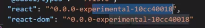

#### 2.1 架构介绍

React16架构可以分为三层：

- Scheduler（调度器）—— 调度任务的优先级，高优任务优先进入**Reconciler**。除了在空闲时触发回调的功能外，**Scheduler**还提供了多种调度优先级供任务设置。
  - **`window.requestIdleCallback()`**方法将在浏览器的空闲时段内调用的函数排队。这使开发者能够在主事件循环上执行后台和低优先级工作，而不会影响延迟关键事件，如动画和输入响应。
  - `React`实现了功能更完备的`requestIdleCallback`polyfill，这就是**Scheduler**
  - 比如我们有一个任务fn需要在浏览器空闲的时候调用它，则直接在代码中加入`requestIdleCallback(fn)`,则浏览器会自动在空闲的时候执行fn函数，不影响关键事件。例子可以查看文档第五节
  - **react不是使用requestIdleCallback实现的，因为目前只有Chrome浏览器支持requestIdleCallback，所以react为了兼容性，使用requestAnimationFrame和MessageChannel模拟实现了requestIdleCallback**
- Reconciler（协调器）—— 负责找出变化的组件,`React16`的`Reconciler`基于`Fiber节点`实现，被称为`Fiber Reconciler`。
- Renderer（渲染器）—— 负责将变化的组件渲染到页面上

在React16中，**Reconciler**与**Renderer**不再是交替工作。当**Scheduler**将任务交给**Reconciler**后，**Reconciler**会为变化的虚拟DOM打上代表增/删/更新的标记，整个**Scheduler**与**Reconciler**的工作都在内存中进行。只有当所有组件都完成**Reconciler**的工作，才会统一交给**Renderer**。

**在React15中Reconciler是递归处理虚拟DOM的,在React16中更新工作从递归变成了可以中断的循环过程。每次循环都会调用`shouldYield`判断当前是否有剩余时间。**

**Scheduler**与**Reconciler**的步骤随时可能由于以下原因被中断：

- 有其他更高优任务需要先更新
- 当前帧没有剩余时间

**Renderer**根据**Reconciler**为虚拟DOM打的标记，同步执行对应的DOM操作。

可以看到，相较于React15，React16中新增了**Scheduler（调度器）**

#### 2.2 Fiber的目标：

1. **能够把可中断的任务切片处理**
2. **能够调整优先级，重置并且复用任务**

Fiber的三层含义：

1. 作为架构来说，之前`React15`的`Reconciler`采用递归的方式执行，数据保存在递归调用栈中，所以被称为`stack Reconciler`。`React16`的`Reconciler`基于`Fiber节点`实现，被称为`Fiber Reconciler`。
2. 作为静态的数据结构来说，每个`Fiber节点`对应一个组件，保存了该组件的类型（函数组件/类组件/原生组件...）、对应的DOM节点等信息。
3. 作为动态的工作单元来说，每个`Fiber节点`保存了本次更新中该组件改变的状态、要执行的工作（需要被删除/被插入页面中/被更新...）。

### 2.3 构建Fiber树

react16中，dom diff过程是使用老的Fiber链表和新的JSX对象构建新的Fiber链表的过程，最主要是构建隐藏在Fiber链表中的EffectList链表

最终，创建Fiber树的结果是：Fiber树其实就是一个对象，每个Fiber树的节点是fiber节点(对象)，各个节点之间使用指针连接，所以一个Fiber树其实也是一个Fiber链表,只不过该链表包含了很多条支路，不是单链表

1. 新的Fiber树也创建了，通过fiber节点的return,sibling,child指针连接。
   1. 新的Fiber树可以复用老的Fiber树的节点，如果key和type均相同，表示可以复用；则再比较属性的区别，如果属性不同则复制该老fiber节点的指针，将其return属性指向新的Fiber树中对应的父节点，并将新Fiber树的中的该节点标记为更新，新老Fiber树对应节点使用alternate指针连接。
   2. 如果不相同则参照2.3.3
2. 更加重要的是在新的Fiber树的节点之间存在一个EffectList单链表(通过fiber节点的firstEffect,nextEffect,lastEffect指针连接)，指针连接着所有发生了变化的fiber节点，从子节点一直到根节点(包含所有flags不是Noflags的节点)，按照一定的顺序排列
3. 最终得到了整棵树的EffectList后，更新渲染的过程就是按照EffectList链表的nextEffect指针指向的节点的顺序执行

#### 2.3.1 初始化构建Fiber树

从根节点开始，根据return返回的虚拟DOM对象开始创建Fiber树

虚拟DOM对象（就是return返回的JSX）类似于下面的形式：

```
let A = {
  type: "div",
  key: "A",
  props: {
    style,   // 保存样式
    children: [
      { type: "div", key: "B1", props: { style, children: [] } },
      { type: "div", key: "B2", props: { style, children: [] } },
    ],
  },
};
```

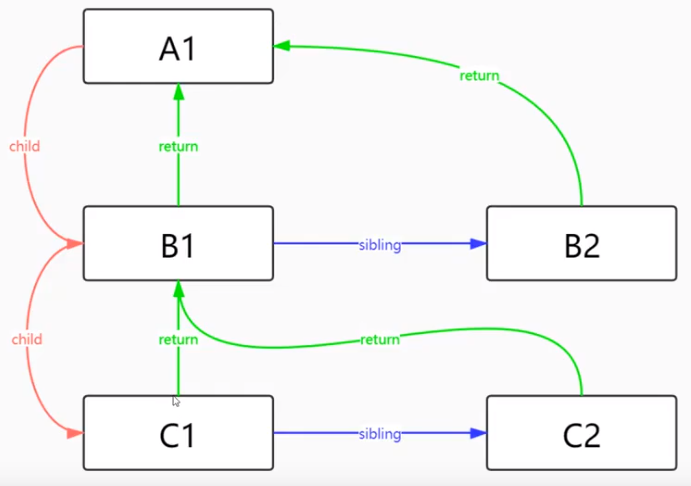

各个fiber节点之间通过指针可以获取到：`return表示父节点，child表示子节点，sibling表示兄弟节点`，注意：父亲到大儿子之间具备child指针，到二儿子就没有了

每个fiber节点就是一个对象，

```
// 根据虚拟DOM节点创建Fiber节点
function createFiber(element) {
  return {
    tag: TAG_HOST, // Fiber的类型
    type: element.type, //具体类型，div span
    key: element.key, // 唯一标签
    props: element.props, // 属性对象
  };
}
```

创建根节点A对应的Fiber树：

1. 就相当于开启了一个工作单元。
2. 创建根A对应的fiber节点
3. 创建第一个儿子对应的fiber节点，相当于开启B1的工作单元，如果B1有儿子，则创建第一个儿子对应的fiber节点，相当于开启第一个儿子的工作单元。当前例子中B1没有儿子节点，所以B1的工作单元结束，该Fiber子树就只有B1一个fiber节点。
4. 创建B1的兄弟B2对应的fiber节点，相当于开启B2的工作单元，如果B2有儿子，则创建第一个儿子对应的fiber节点，相当于开启第一个儿子的工作单元。当前例子中B2没有儿子节点，所以B2的工作单元结束，该Fiber子树就只有B2一个fiber节点。
5. 创建B2的叔叔对应的fiber节点，B2没有叔叔，则创建A的叔叔的fiber节点，A没有叔叔，则Fiber树构建完成

*构建Fiber树是可以暂停的*


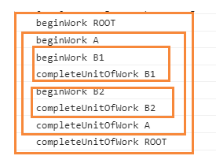

创建EffectList单链表：

在某个fiber节点的工作单元结束的时候，就需要创建它的EffectList单链表，最终构建得到整个Fiber树的EffectList。所以EffectList是一层层向上收集的，从最先结束工作单元的子节点开始一直到根节点，例如上面的例子中最终构建的EffectList就是：B1->B2->A->ROOT,如果是B2不需要更新或者进行其他操作，则最终的EffectList就是B1->A->ROOT

1. *EffectList是一个单链表：*
   1. 每一个节点的EffectList都包含两个指针：firstEffect和lastEffect,每个元素之间使用nextEffect指针连接
   2. 初始渲染的时候，所有的fiber节点都会被添加上Placement标记，表示该节点是要新增的
   3. *有元素发生更新时，则EffectList只包含有副作用的fiber节点，不需要更新的节点就不包含了*

3. *建立好一整个Fiber树并且标记完成，获得该树的EffectList后，将其交给commitRoot(首次就负责创建真实dom节点并且添加到文档中)进行渲染*


最终得到整棵树的EffectList:

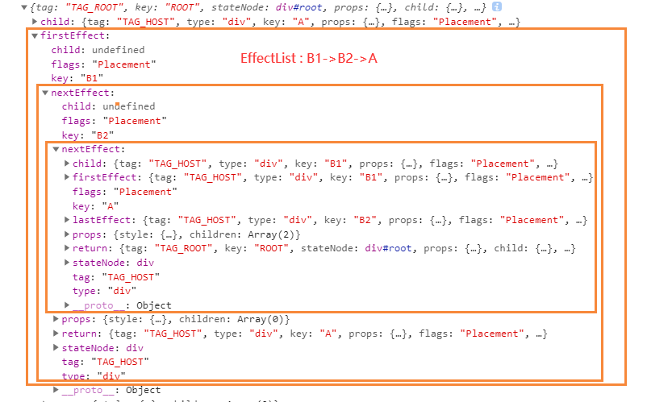

#### 2.3.2 双缓存机制---更新

双缓存机制：直接使用内存中创建的fiber树替换当前的fiber树，而不是删除当前的fiber树

在`React`中最多会同时存在两棵`Fiber树`。当前屏幕上显示内容对应的`Fiber树`称为`current Fiber树`，正在内存中构建的`Fiber树`称为`workInProgress Fiber树`。


[举例说明](https://kasong.gitee.io/just-react/process/doubleBuffer.html#mount%E6%97%B6)

rootFiberNode是当前应用的根节点，rootFiber是当前应用中App组件树的根节点。

1. 首屏渲染时，页面中还没有挂载任何`DOM`，所以`rootFiberNode.current`指向的rootFiber树为空

2. 进入`render阶段`，根据组件返回的`JSX`在内存中依次创建`Fiber节点`并连接在一起构建`Fiber树`，被称为`workInProgress Fiber树`。

3. workInProgress Fiber树渲染到页面，rootFiberNode`的`current`指针指向`workInProgress Fiber树`使其变为`current Fiber 树

4. 更新时：根据老的Fiber树和新的JSX对象构建一棵新的`workInProgress Fiber 树`，可以复用`current Fiber树`对应的节点数据, 这就是diff的过程

   例如：下面根据老的Fiber树和JSX对象生成的新的Fiber树，新的Fiber树的fiber节点和老的Fiber树的节点使用alternate指针连接。如果是更新操作，则拷贝老fiber节点的指针。commit阶段，直接利用新的Fiber树中的EffectList链表实现更新

   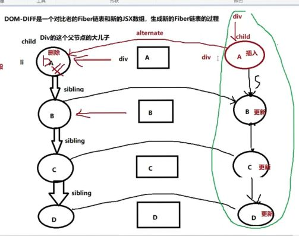

#### 2.3.3 Diff算法

[Diff算法](https://kasong.gitee.io/just-react/diff/prepare.html)

DOM diffing算法就是**根据老的Fiber树和最新的JSX(虚拟DOM对象)对比生成新的Fiber树的过程，主要看哪些节点可以复用(复用就是不将其放入EffectList中)，哪些节点需要更新**

为了降低算法复杂度，`React`的`diff`会预设三个限制：

1. 只对同级元素进行`Diff`。如果一个`DOM节点`在前后两次更新中跨越了层级，那么`React`不会尝试复用他。
2. 两个不同类型的元素会产生出不同的树。
3. 开发者可以通过 `key prop`来暗示哪些子元素在不同的渲染下能保持稳定。如果key没有指定则就是null,在dom diff的时候会默认使用索引来进行比较。

可以从同级的节点数量将Diff分为两类：

1. 当`newChild`类型为`object`、`number`、`string`，代表同级只有一个节点
2. 当`newChild`类型为`Array`，同级有多个节点

##### 1. 单节点DIff：新的节点只有一个

React通过先判断`key`是否相同，如果`key`相同则判断`type`是否相同，只有都相同时一个`DOM节点`才能复用。如果key和type均相同，则再比较属性的区别，如果不同则将复制该老fiber节点的指针，将其return属性指向新的Fiber树中对应的父节点，并将新Fiber树的中的该节点标记为更新，新老Fiber树对应节点使用alternate指针连接。

当`key相同`且`type不同`时，代表我们已经找到本次更新的节点对应的上次的`fiber`节点，但是两者的`type`不同，不能复用。既然唯一的可能性已经不能复用，则剩下的`fiber`节点都没有机会了，所以将老Fiber树中的节点都需要标记删除。

当`key不同`时只代表遍历到的该旧`fiber`节点不能被`p`复用，后面还有兄弟`fiber`节点还没有遍历到。所以仅仅标记该`fiber`节点删除。

如果节点没有key,默认就是索引

在reconciler阶段：

1. key不同或者type不同，则直接将老的Fiber树的fiber节点添加删除标记，并新建新节点及其子孙节点对应的fiber节点。如果该节点是大儿子，则将新的Fiber树中该节点的父节点的child属性指向该fiber节点，并且为其添加插入标记。例如div变成h2

在commit阶段：

1. 先删除标记为删除的对应的老fiber节点和dom节点
2. 然后把h2 dom节点插入进来

##### 2 多节点diff：新节点有多个

存在以下几种情况：

1. 节点更新
   1. 节点属性变化
   2. 节点类型变化
2. 新增节点或减少节点
3. 节点位置变化

`Diff算法`的整体逻辑会经历两轮遍历：

1. 第一轮遍历：处理`更新`的节点。因为更新的比例比较高

2. 第二轮遍历：处理新增、删除或者位置变化的节点。

```
第一轮：
1. let i = 0，遍历newFiberArray，将newFiberArray[i]与oldFiber比较，判断DOM节点是否可复用。
2. 如果可复用，i++，继续比较newFiberArray[i]与oldFiber.sibling，可以复用则继续遍历。
3. 如果不可复用，立即跳出整个遍历，第一轮遍历结束。
4. 如果newFiberArray遍历完（即i === newFiberArray.length - 1）或者oldFiber遍历完（即oldFiber.sibling === null），跳出遍历，第一轮遍历结束。

第二轮遍历：
第一轮遍历结束存在以下几种情况：
	1. newFiberArray遍历完了，oldFiber没有遍历完，则意味着本次更新比之前的节点数量少，有节点被删除了。所以需要遍历剩下的oldFiber，依次标记Deletion。
	2. newFiberArray没有遍历完，oldFiber遍历完了。已有的DOM节点都复用了，这时还有新加入的节点，意味着本次更新有新节点插入，我们只需要遍历剩下的newChildren为生成的workInProgress fiber依次标记Placement。
	3. newFiberArray和oldFiber都遍历完了，则最理想的情况，只存在组件更新，此时Diff结束。
	4. newFiberArray和oldFiber都没遍历完。这意味着有节点在这次更新中改变了位置。
	
对于4，需要使用key。

为了快速的找到key对应的oldFiber，我们将所有还未处理的oldFiber存入以key为key，oldFiber为value的Map中。接下来遍历剩余的newChildren，通过newChildren[i].key就能在Map中找到key相同的oldFiber。
lastPlacedIndex初始为0,表示第一个可复用的fiber节点在oldFiber中的索引
遍历剩余的newFiberArray：
	如果在Map中找到相同的key,并且类型相同，则复用，并且在Map删除该键值对
		1. lastPlacedIndex修改为该fiber节点在oldFiber中的索引
		2. 如果oldIndex < lastPlacedIndex，代表本次更新该节点需要向后移动，为其添加移动并且更新的标记
		3. 如果oldIndex >= lastPlacedIndex，代表本次更新该节点不需要移动，为其添加更新标记
	结束后，如果Map中还具备键值对，则将其全部标记为删除
```

例子：下面的节点的key就是对应的'A'-'G',上面一排是老的Fiber链表(同一层级，使用sibling指针连接)，下面一排是JSX对象

其中，2,4,6,8分别是react设置的各种操作的标志字段

删除操作总是先执行

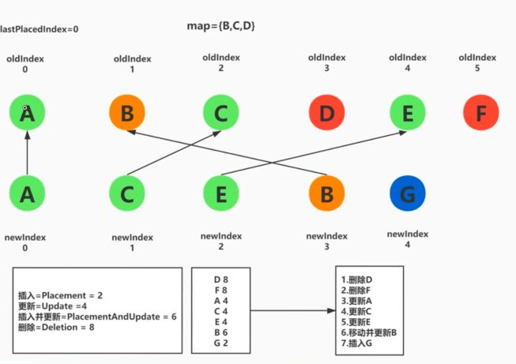

```
老的fiber节点
<ul>
	<li key='A'>A</li>
	<li key='B'>B</li>
	<li key='C'>C</li>
	<li key='D'>D</li>
</ul>

新的JSX节点
<ul>
	<li key='A'>A-new</li>
	<li key='B'>B-new</li>
	<li key='C'>C-new</li>
	<li key='D'>D-new</li>
</ul>

最后得到一个操作步骤：四个节点均只有属性变化
1. 更新A
2. 更新B
3. 更新C 
4. 更新D
```

例子2：

```
老的fiber节点
<ul>
	<li key='A'>A</li>  标记删除
	<li key='B'>B</li>
	<li key='C'>C</li>
	<li key='D'>D</li>
</ul>

新的JSX节点
<ul>
	<div key='A'>A-new</div>   标记插入
	<li key='B'>B-new</li>     
	<li key='C'>C-new</li>
	<li key='D'>D-new</li>
</ul>

reconciler阶段：
    1. 标记li老fiber节点为删除，新建div对应的fiber节点，标记为插入
    2. 标记B更新
    3. 更新C更新
    4. 更新D更新
```


### 2.4 状态更新

首先，我们将可以触发更新的方法所隶属的组件分类：

- ReactDOM.render —— HostRoot
- this.setState —— ClassComponent
- this.forceUpdate —— ClassComponent
- useState —— FunctionComponent
- useReducer —— FunctionComponent

可以看到，一共三种组件（`HostRoot` | `ClassComponent` | `FunctionComponent`）可以触发更新。

由于不同类型组件工作方式不同，所以存在两种不同结构的`Update`，其中`ClassComponent`与`HostRoot`共用一套`Update`结构，`FunctionComponent`单独使用一种`Update`结构。

## 1 React简介

> - React是用于构建用户界面的javascript库，是一个将数据渲染为HTML视图的开源js
>
> - React是facebook开发的
>
> - 为什么要学习React?
>
>   - 原生js操作DOM繁琐、效率低，直接使用DOM API操作UI页面
>   - 原生js没有**组件化**的编码方案，代码复用率很低
>
> - React的特点：
>
>   - 1 采用**组件化模式、声明式编码**，提高代码开发效率和组件复用率
>
>     - 命令式编程：命令式编程描述代码如何工作，告诉计算机一步步地执行、先做什么后做什么。
>
>       ```
>       比如，去酒吧点一杯酒，指挥服务员：
>           从架子上取下一个玻璃杯；
>           把杯子放在酒桶前；
>           打开酒桶开关，直到酒杯满；
>           把杯子递给顾客；
>          
>       编码举例：处理传入包含大写字符串的数组，返回包含相同小写字符串的数组。 
>       const toLowerCase = arr => {
>           // 1 创建一个空数组用于保存结果
>           const res = [];
>           // 2遍历输入数组的所有元素
>           for (let i = 0, len = arr.length; i < len; i++) {
>               // 3 将每项元素的小写值存入空数组中
>               res.push(arr[i].toLowerCase());
>           }
>           // 4 返回结果数组
>           return res;
>       }
>       ```
>
>     - 声明式编码：声明式编程表明想要实现什么目的，应该做什么，但是不指定具体怎么做。
>
>       ```
>       声明式点一杯酒，只要告诉服务员：我要一杯酒即可；
>                                                       
>       声明式编程实现toLowerCase: 输入数组的元素传递给 map函数，然后返回包含小写值的新数组
>       	至于内部如何操作，不需要管
>       const toLowerCase = arr => arr.map(
>           value => value.toLowerCase();
>       }
>       map 函数所作的事情是将直接遍历整个数组的过程归纳抽离出来，让我们专注于描述我们想要的是什么(what)
>                                                       
>       react中的声明式操作：
>                                                       
>       ```
>
>   - 2 在React Native中可以使用React语法进行**移动端开发**
>
>   - 3 使用**虚拟DOM+优秀的Diffing算法**，尽量减少与真实DOM的交互


例如，要实现下面的功能，在页面中展示后台传过来的数据：

则如果此时又加入了一个人的数据，则原生js会直接产生一个新的DOM替换掉之前的DOM

如果是React会保存虚拟DOM，在数据产生变化时，则对比虚拟DOM，新增一条虚拟DOM，进而映射到真实DOM上

### 1.1 React基本使用-16.8版本

首先，下载react的依赖包：

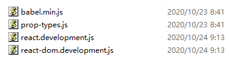

> - react.development.js:
>   - react核心库
> - react-dom.development.js
>   - react操作DOM的库
> - prop-types.js
>   - 用来校验父组件传递过来值的类型
> - babel.min.js是babel.js的压缩版本
>   - 用法1：将es6中的语法转换成es5
>   - 用法2：将jsx转译为js

```
<body>
    <!-- 准备好一个容器 -->
    <div id="test"></div>
    <!-- 引入库文件 -->
    <script src="./js/react.development.js"></script>
    <script src="./js/react-dom.development.js"></script>
    <script src="./js/babel.min.js"></script>
    <!-- 这里一定要写babel,否则默认就是js -->
    <script type="text/babel">
      // 1 创建虚拟DOM
      const VDOM = (
        <h1>Hello React</h1>
      ); /*此处一定不要写引号，不是字符串，是虚拟DOM*/
      // 2 渲染虚拟DOM
      ReactDOM.render(VDOM, document.getElementById("test"));
    </script>
</body>
```

### 1.2 虚拟DOM创建的两种方式

> - 方式1：jsx
>
>   - 优势：解决了更加简单创建虚拟DOM的结构,更加直观地可以写出虚拟DOM的结构
>   - 但是浏览器不能识别jsx,所以需要使用babel将其转译为方式2的写法
>
>   ```
>   const VDOM = (
>   	<h1 id='title'>
>   		<span>Hello React</span>
>   	</h1>
>   );
>   ```
>
> - 方式2：
>
>   ```
>   React.createElement(标签名，标签属性，标签体内容)
>   const VDOM = React.createElement('h1'，{id:'title'}，React.createElement('span',{},'Hello React'));
>   ```

### 1.3 虚拟DOM到底是啥？

> - 虚拟DOM本质就是一个一般的Js对象，它包含$$typeof,其他属性，props属性等，props中包含children属性，表示其内部的虚拟DOM对象，children属性可以是null|string|number|object|Array类型，Array中就存放着null|string|number|object。
>   - 例如下面的例子中，虚拟DOm就是一个对象，其props属性的children属性就是一个js对象，如果它包含两个span,则children属性就会变成一个数组
> - 虚拟DOM比较轻，真实DOM比较重，因为虚拟DOM是React内部在用，无需真实DOM上那么多的属性
> - 虚拟DOM最终会被React转化为真实DOM呈现在页面上
> - 虚拟DOM的价值：
>   - **增量更新**：不管数据怎么变化，都可以用最小的代价来更新 DOM，而且掩盖了底层的 DOM 操作，让你用更声明式的方式来描述你的目的，从而让你的代码更容易维护。
>   - **处理了浏览器的兼容问题**，直接，比如给react元素绑定某个事件，则我们不需要管它在底层是如何给真实dom绑定的，(如果我们直接给dom元素绑定，则需要根据不同的浏览器设置不同的绑定方式)，jsx会在底层自动处理，所以避免了兼容性问题
>   - 容易实现**跨平台开发**（例如Android,IOS等），虚拟DOM结构的通用性
>   - 在默认情况下，React DOM会将所有嵌入JSX的值进行编码。这样可以有效避免xss攻击。
> - 虚拟DOM是不是更快？    不是
>   - 初次渲染时，并不快，还需要构建真实dom,然后将虚拟dom渲染到页面上去
>   - 更新时，可以实现定点更新，不需要全部dom元素删除再添加，减少页面回流和重绘
> - 缺点：
>   - 需要消耗额外的内存
>   - 首次渲染不一定会更快

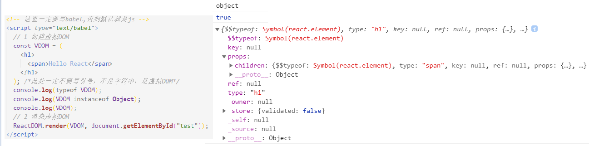

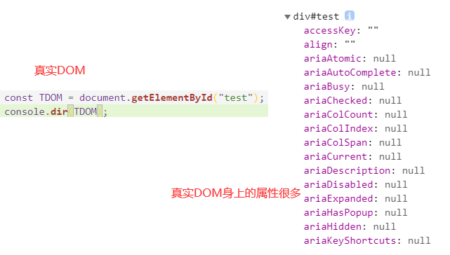

### 1.4 jsx语法规则

> - 定义虚拟DOM时，不要用引号
>
> - 在 jsx 中嵌入 js 表达式,需要使用大括号{}将 js 语句包围起来
>
>   - 注意区分js表达式和js语句(代码)
>     - js表达式：一个表达式产生一个值，可以放在任何一个需要值的地方
>       - 例如：a   a+b  demo(1)  
>         - arr.map 返回一个数组
>         - function test(){} 返回函数本身
>     - js语句：
>       - if()    for()   while  switch(){case:xxx}   
>
> - 样式的类名要用`className`指定，不能使用class
>
> - 内联样式，要用style={{key:value}}的形式
>
> - 虚拟DOM只能有一个根标签，需要使用div将所有标签包裹起来
>
> - 标签必须闭合
>
> - 标签首字母
>
>   - 1 如果是小写字母，则将该标签转为html中的同名元素，若html中无同名标签，则报错
>   - 2 如果是大写字母，React会认为这是一个组件，React就去渲染对应的组件，若组件没有定义，则报错
>
>   ```
>   const name = 'Lily';
>   const name1 = 'Rose';
>   const VDOM = (
>   	<div>
>   		<h1 className='info' style={{color:'red'}}>Hello,{name}</h1>
>   		<h1 className='info' style={{color:'green'}}>Hello,{name1}</h1>
>   	</div>
>   )
>   ```

jsx是React.createElement的语法糖，React使用Babel编译jsx文件

### jsx工作原理

1 安装依赖包

```
yarn add @babel/core @babel/plugin-syntax-jsx @babel/plugin-transform-react-jsx @babel/types --save
 yarn add @babel/plugin-transform-react-jsx
```

2 AST抽象语法树

抽象语法树是源代码结构的一种抽象表示，它以树状的形式表现编程语言的语法结构，树上每个节点都表示源代码中的一种结构

3 babel工作流

3.1 老转换：

```
const babel = require("@babel/core");

const sourceCode = `<h1>hello</h1>`;

const result = babel.transform(sourceCode, {
  plugins: [["@babel/plugin-transform-react-jsx", { runtime: "classic" }]],
});

console.log(result);

// 结果：
import React from 'react';

React.createElement('h1', null, 'Hello world');
```

3.2 新转换

React 17 在 React 的 package 中引入了两个新入口:`react/jsx-runtime` 和 `react/jsx-dev-runtime` ，这些入口只会被 Babel 和 TypeScript 等编译器使用。新的 JSX 转换**不会将 JSX 转换为 `React.createElement`**，而是自动从 React 的 package 中引入新的入口函数并调用。

1. 使用全新的转换，你可以**单独使用 JSX 而无需引入 React**。
2. **此次升级不会改变 JSX 语法，也并非必须**。旧的 JSX 转换将继续工作，没有计划取消对它的支持。
3. 此时源代码**无需引入 React** 即可使用 JSX 了！（但仍需引入 React，以便使用 React 提供的 Hook 或其他导出。）
4. [React 17 的 RC 版本](https://reactjs.bootcss.com/blog/2020/08/10/react-v17-rc.html) 及更高版本支持它,Create React App [4.0.0](https://github.com/facebook/create-react-app/releases/tag/v4.0.0)+ 使用了兼容 React 版本的 JSX 转换

```
const babel = require("@babel/core");

const sourceCode = `<h1>hello</h1>`;

const result = babel.transform(sourceCode, {
  plugins: [["@babel/plugin-transform-react-jsx", { runtime: "automatic" }]],
});

console.log(result);

// 结果：

// 由编译器引入（禁止自己引入！）
import {jsx as _jsx} from 'react/jsx-runtime';

_jsx('h1', { children: 'hello' });
```

### 1.5 key属性的作用

> - key是虚拟DOM的唯一标识，key应该是唯一的
> - Diffing算法会使用到

### 1.6 模块与组件

> - 模块：向外提供特定功能的js文件，拆分成模块可以实现代码的复用，提高运行效率,**它只包含js**
> - 组件：实现局部功能效果的代码和资源的集合**(html,js,image)**
>   - 例如一个页面分成头部、main和footer三个组件，则头部组件Header就包含了所有使得该头部正常显示和交互的js,html,css,img,video,font... 等资源
>   - 对于具备相同结构的区域，可以为其共同提取一个组件，只需要修改传入的数据即可显示
>   - 复用编码，简化项目编码
> - 模块化：应用的js都以模块来编写的，则这个应用就是一个模块化的应用
> - 组件化：应用都是以多组件的方式实现的，则这个应用就是一个组件化的应用

### 1.7 安装react开发者工具

> - Chrome浏览器  react-developer-tools

### 1.8 函数式组件

> - **函数式组件中的this是undefined**
> - 这是由于babel在将jsx转译为dom API时开启了严格模式`use strict`,严格模式下this就是undefined
> - babel官网：https://www.babeljs.cn
> - 执行了ReactDOM.render之后发生了什么？？
>   - react解析组件标签，找到对应组件
>   - 发现组件是使用函数定义的，调用该函数，将返回的虚拟DOM转为真实DOM，随后呈现在页面中

```
import React from 'react'  // 虽然这段代码中没有用到React，但是babel在转译jsx时，使用了React,所以需要引入
import ReactDOM from 'react-dom'   

function MyComponent(){
	console.log(this)  // undefined
	return <h1>Hello,React</h1>
}

ReactDOM.render(<MyComponent/>,document.getElementById('test'))

转译后的结果：
"use strict";   // 添加了use strict模式

function MyComponent() {
  console.log(this); // undefined

  return /*#__PURE__*/React.createElement("h1", null, "Hello,React");
}
```

### 1.9 类式组件

> - 执行了ReactDOM.render后发生了什么？？？
>   - 1 React解析组件标签，找到了MyComponent组件
>   - 发现组件是类定义的，所以new出来该类的实例对象，并且通过该实例调用类原型上的render方法
>   - 将render返回的虚拟DOM转为真实DOM，随后呈现在页面中
> - render中的this是MyComponent类的实例对象，就是组件实例对象

```
class MyComponent extends React.Component {
	// render放在类MyComponent的原型对象上，供实例使用
	render(){
		return (
			<h2>
				Hello,React
			</h2>
		)
	}
}
ReactDOM.render(<MyComponent/>,document.getElementById('test'))

babel转译：
"use strict";

class MyComponent extends React.Component {
  // render放在类MyComponent的原型对象上，供实例使用
  render() {
    return /*#__PURE__*/React.createElement("h2", null, "Hello,React");
  }

}
```

类的实例对象(组件实例对象)上包含很多属性，其中最重要的就是`state props refs`,这些属性都是通过继承React.Component得到的

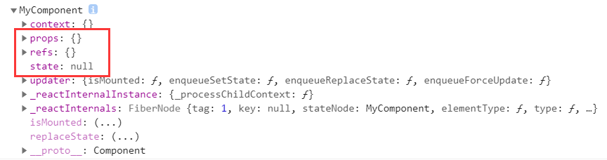

### 1.10 函数式组件和类组件的区别

相同点：

1. 它们都可以接收属性并且返回React元素

不同点：

1. 编程思想不同：类组件需要创建实例，是基于面向对象的方式编程，而函数式组件不需要创建实例，直接接收输入，返回输出，是基于函数式编程的思想写的
2. 内存占用：类组件需要创建并且保存实例，需要一定的内存；函数式组件不需要
3. 捕获特性：函数式组件具有捕获特性，状态变量在其内部的函数中被引用后，永远指向渲染时产生的值，不会被状态的更新而影响，除非在该函数内部修改引用的值
4. 可测试性：函数式组件更方便编写单元测试，直接调用该函数，检查输出即可，类组件还需创建实例对象
5. 状态：类组件有自己的实例，可以定义状态，而且可以修改状态更新组件；函数式组件没有状态，不过现在可以通过useState修改状态
6. 生命周期：类组件有自己完整的生命周期，而且可以在生命周期内编写逻辑；函数式组件以前没有生命周期，现在可以使用useEffect实现类似类组件的生命周期
7. 跳过更新：类组件可以使用shouldComponentUpdate和PureComponent来跳过更新，而函数式组件可以使用React.memo来跳过更新
8. 逻辑复用：类组件可以通过继承实现逻辑复用，函数组件可以通过自定义hook实现逻辑复用
   1. 类组件逻辑复用一般使用HOC，如果复用的逻辑太多，需要多层嵌套
9. 发展前景：未来函数式组件会成为主流，因为它可以很好地屏蔽this问题，规范和复用逻辑，更好地适合时间切片和并发渲染，方便暂停和恢复

#### （1）捕获特性

类组件：

```
class ClassComponent extend React.Component{
	state = {number:0};
	handleClick = function(event=>{
		setTimeout(()=>{
			console.log(this.state.number);
		},3000)
	    this.setState({number:this.state.number+1});	
	})
	render(){
		return (
			<div>
				<p>{this.state.number}</p>
				<button onClick={this.handleClick}>点我+1</button>
			</div>
		)
	}
}
```

点击按钮后，界面中显示1，3秒后，后台也打印1

this.setState不会立刻改变React组件中state的值，每一次setState都会触发一系列生命周期函数（勾子函数）:
			shouldComponentUpdate
			componentWillUpdate
			render
			componentDidUpdate
执行到render时，才会实现state的改变

**即状态改变并不会创建一个新的实例对象，此时this还是指向之前的实例对象，从而获取到的就是该state状态修改之后的值**

函数组件：

```
function FunctionComponent(props){
	[number,setNumber] = useState(0);
	handleClick = function(event=>{
		setTimeout(()=>{
			console.log(number);   //产生了闭包，保存当时渲染时产生的number值，而不是使用最新的值
		},3000)
	    setNumber({number+1});	
	})
	return (
        <div>
            <p>{number}</p>
            <button onClick={this.handleClick}>点我+1</button>
        </div>
    )
}
```

点击按钮后，页面显示1，3秒后，控制台打印0

在类组件中，如果需要得到和函数组件相同的效果，则需要

```
class ClassComponent extend React.Component{
	state = {number:0};
	handleClick = function(event=>{
		const {number} = this.state.number;
		setTimeout(()=>{
			console.log(number);   // 这样也会产生闭包
		},3000)
	    this.setState({number:this.state.number+1});	
	})
	render(){
		return (
			<div>
				<p>{this.state.number}</p>
				<button onClick={this.handleClick}>点我+1</button>
			</div>
		)
	}
}
```

#### （2）函数组件自定义hooks实现函数调用

```
function useNumber(){
	let [number,setNumber] = useState(0);
	return number;
}
function FunctionComponent(props){
	let number = useNumber(); // 可以很方便地在函数组件之间共享业务逻辑
	handleClick = function(event=>{
		setTimeout(()=>{
			console.log(number);   //产生了闭包，保存当时渲染时产生的number值，而不是使用最新的值
		},3000)
	    setNumber({number+1});	
	})
	return (
        <div>
            <p>{number}</p>
            <button onClick={this.handleClick}>点我+1</button>
        </div>
    )
}
```

#### （3) 组件跳过更新

类组件的PureComponent:

```
class PureComponent extends React.Component{
	// 实际上它就是重写了shouldComponentUpdate方法
	shouldComponentUpdate(newProps,newState){
		return !isShallowEqual(newProps,oldProps) || !isShallowEqual(newState,oldState);
	}
}

function isShallowEqual(obj1,obj2){
	if(obj1===obj2){return true;}
	if(typeof obj1!=="object" || obj1===null || typeof obj2!=="object" || obj2===null){
		return false;
	}
	let keys1 = Object.keys(obj1);
	let keys2 = Object.keys(obj2);
	if(keys1.length !== keys2.length){return false;}
	for(let i=0;i<keys1.length;i++){
		if(!obj2.hasOwnProperty(keys1[i]) || obj1[keys1[i]] !== obj2[keys1[i]]){
			return false;
		}
	}
	return true;
}

所以我们有两个办法跳过更新：
	（1）继承PureComponent
	(2) 重写shouldComponentUpdate
```

函数组件：

```
function FunctionComponent(props){
	console.log('render');
	const name = this.props.name;
	return (
        <div>
            <p>{name}</p>
        </div>
    )
}

const MemoFunctionComponent = React.memo(FcuntionComponent);

class ClassComponent extend React.Component{
	state = {number:0};
	handleClick = function(event=>{
		const {number} = this.state.number;
		setTimeout(()=>{
			console.log(number);   // 这样也会产生闭包
		},3000)
	    this.setState({number:this.state.number+1});	
	})
	render(){
		return (
			<div>
				<p>{this.state.number}</p>
				<button onClick={this.handleClick}>点我+1</button>
				<MemoFunctionComponent name="whh" />
			</div>
		)
	}
}

ReactDOM.render(<ClassComponent />,document.getElementById('root'));
```

如果没有使用React.memo,则每次点击按钮都会导致FunctionComponent函数的执行，即使diff后发现该部分并没有产生变化，即fiber链表和新产生的JSX相同，不重新渲染，但是该函数肯定会执行

如果使用了React.memo，则只要传入的props的值没有变化，就不会产生该组件的重新渲染

## 2 组件实例对象的三大属性

> - state props refs是组件实例对象上的三大属性，由于函数组件不具备实例对象，所以函数组件就不具备state属性，最新版本的react提供了hooks,帮助函数组件实现了三大属性，这里先针对类组件
>
> - react中给标签设定事件时，小驼峰写法，和js不同
>
>   ```
>   js中：<button onclick="demo()">登录</button>
>                           
>   例如：下面的在创建虚拟DOM时，就会执行赋值语句onClick={demo},将demo函数赋值给button的onClick事件，所以不能写onClick={demo()},这样会直接执行demo(),然后将返回值赋值给onClick事件
>   <button onClick={demo}>登录</button>
>   ```

### 2.1 state属性

解决的问题：

    1 组件中自定义的方法中的this为undefined,为什么，如何解决？？
        为什么：因为当类中的方法默认开启了局部的严格模式(函数内部：'use strict')，从而导致this指向了undefined。只有使用该类的实例对象调用类中的方法时，this才是指向类的实例对象
        	例如，给button标签添加onClick=this.handleClick,此时是直接将该函数赋值给了onClick,但是当我们点击函数时，handleClick是全局调用的，则this应该指向window,但是由于类中的自定义方法开启了局部的严格模式，所以导致this指向了undefined
        如何解决：
            1 使用bind方法绑定类中定义的方法中的this指向当前实例对象
            	实际上是使用bind方法将组件原型上的方法的this修改为组件实例对象，并且将该方法放到组件实例对象自身属性上
            2 使用箭头函数
    2 状态数据，不能直接赋值
    3 更新状态数据setState({A:value})是一种合并的操作，对于同名的状态A则用新的value值替换，不影响其他的状态

> - 方法1：使用bind方法绑定

```
<script type="text/babel">
    //1.创建组件
    class Weather extends React.Component{
        
        //构造器调用几次？ ———— 1次
        constructor(props){
            console.log('constructor');
            super(props)
            //初始化状态
            this.state = {isHot:false,wind:'微风'}
            //解决changeWeather中this指向问题
            this.changeWeather = this.changeWeather.bind(this)
        }

        //render调用几次？ ———— 1+n次 1是初始化的那次 n是状态更新的次数
        render(){
            console.log('render');
            //读取状态
            const {isHot,wind} = this.state
            return <h1 onClick={this.changeWeather}>今天天气很{isHot ? '炎热' : '凉爽'}，{wind}</h1>
        }

        //changeWeather调用几次？ ———— 点几次调几次
        changeWeather(){
            //changeWeather放在哪里？ ———— Weather的原型对象上，供实例使用
            //由于changeWeather是作为onClick的回调，所以不是通过实例调用的，是直接调用
            //类中的方法默认开启了局部的严格模式，所以changeWeather中的this为undefined
            
            console.log('changeWeather');
            //获取原来的isHot值
            const isHot = this.state.isHot
            //严重注意：状态必须通过setState进行更新,且更新是一种合并，不是替换。
            this.setState({isHot:!isHot})
            console.log(this);

            //严重注意：状态(state)不可直接更改，下面这行就是直接更改！！！
            //this.state.isHot = !isHot //这是错误的写法
        }
    }
    //2.渲染组件到页面
    ReactDOM.render(<Weather/>,document.getElementById('test'))
            
</script>
```

> - 方法2：直接使用箭头函数指定,要用赋值语句的形式+箭头函数
>   - 箭头函数的this恒指向**该函数所在的作用域指向的对象**  或者说 该函数定义时所在的对象
>   - 因为onClick=this.changeWeather   此时this是实例对象，所以onClick函数定义时内部this就是实例对象，调用时this也不会发生改变

```
//1.创建组件
class Weather extends React.Component{
    //初始化状态，给组件的实例对象添加属性
    state = {isHot:false,wind:'微风'}

    render(){
        const {isHot,wind} = this.state
        return <h1 onClick={this.changeWeather}>今天天气很{isHot ? '炎热' : '凉爽'}，{wind}</h1>
    }

    //自定义方法————要用赋值语句的形式+箭头函数
    changeWeather = ()=>{
        const isHot = this.state.isHot
        this.setState({isHot:!isHot})
    }
}
//2.渲染组件到页面
ReactDOM.render(<Weather/>,document.getElementById('test'))
```

### 2.2 props属性

#### 2.2.1 类组件接收props属性

之前所有的信息都是从标签内部的实例对象的state属性中获取的，现在我们想从标签外部获取信息，带入标签内部**<Person {...p}>**，这个信息会直接传递到组件的实例对象的props属性中

注意：展开运算符...只能展开带有Iterator的数据类型，例如数组，而对象不具备迭代器，所以不能直接使用...obj,但是es6中规定可以使用obj1={...obj},将obj的所有可遍历属性复制到当前对象obj1中

在下面的代码中，在组建后面使用{...p},外层的{}表示内部的语句是js代码，而由于babel+react的作用，就可以使得...p成立,但是只能在组件后面使用，在其他地方使用虽然不会报错，但是也不会产生任何的效果,只适用于标签属性的传递

```
//创建组件
class Person extends React.Component{
    render(){
        // 
        const {name,age,sex} = this.props
        return (
            <ul>
                <li>姓名：{name}</li>
                <li>性别：{sex}</li>
                <li>年龄：{age+1}</li>
            </ul>
        )
    }
}
//渲染组件到页面
ReactDOM.render(<Person name="jerry" age={19}  sex="男"/>,document.getElementById('test1'))
ReactDOM.render(<Person name="tom" age={18} sex="女"/>,document.getElementById('test2'))

const p = {name:'老刘',age:18,sex:'女'}
// console.log('@',...p);   // @     在其它地方使用不起作用
ReactDOM.render(<Person name={p.name} age={p.age} sex={p.sex}/>,document.getElementById('test3'))
ReactDOM.render(<Person {...p}/>,document.getElementById('test3'))
```

> - **对props进行限制**：使用`prop-types.js`依赖
>
>   ```
>   组件名.属性规则 = {
>       name:'必传,字符串',
>       age:'',
>   }
>                           
>   //指定默认标签属性值
>   Person.defaultProps = {
>       sex:'男',//sex默认值为男
>       age:18 //age默认值为18
>   }
>   ```

```
<script type="text/javascript" src="../js/prop-types.js"></script>

<script type="text/babel">
    //创建组件
    class Person extends React.Component{
        render(){
            // console.log(this);
            const {name,age,sex} = this.props
            //props是只读的
            //this.props.name = 'jack' //此行代码会报错，因为props是只读的
            return (
                <ul>
                    <li>姓名：{name}</li>
                    <li>性别：{sex}</li>
                    <li>年龄：{age+1}</li>
                </ul>
            )
        }
    }
    //对标签属性进行类型、必要性的限制,这个属性添加到类自身
    Person.propTypes = {
        name:PropTypes.string.isRequired, //限制name必传，且为字符串
        sex:PropTypes.string,//限制sex为字符串
        age:PropTypes.number,//限制age为数值
        speak:PropTypes.func,//限制speak为函数
    }
    //指定默认标签属性值
    Person.defaultProps = {
        sex:'男',//sex默认值为男
        age:18 //age默认值为18
    }
    //渲染组件到页面
    ReactDOM.render(<Person name={100} speak={speak}/>,document.getElementById('test1'))
    ReactDOM.render(<Person name="tom" age={18} sex="女"/>,document.getElementById('test2'))

    const p = {name:'老刘',age:18,sex:'女'}
    // console.log('@',...p);
    // ReactDOM.render(<Person name={p.name} age={p.age} sex={p.sex}/>,document.getElementById('test3'))
    ReactDOM.render(<Person {...p}/>,document.getElementById('test3'))

    function speak(){
        console.log('我说话了');
    }
</script>
```

> - **props的简写方式**：上面的propTypes和defaultProps都是直接加给类自身的（写在了类的外面），还有一个写法，直接在类里面加，使用static关键字

```
class Person{
    // 对标签属性进行限制,加给类自身
    static propTypes = {
        name:PropTypes.string.isRequired, //限制name必传，且为字符串
        sex:PropTypes.string,//限制sex为字符串
        age:PropTypes.number,//限制age为数值
        speak:PropTypes.func,//限制speak为函数
    }
    //指定默认标签属性值，加给类自身
    static defaultProps = {
        sex:'男',//sex默认值为男
        age:18 //age默认值为18
    }
    // 设置状态值，加给标签实例对象
    state = {};
    render(){

    }
}
```

> - **类组件的构造器接收props**:是否传递给super
> - 取决于：是否希望在构造器中通过this访问props,因为子类对象没有自己的this对象，需要继承父类的this对象，之后才可以在constructor构造器中使用

```
class Person{
    constructor(props){
        //构造器是否接收props，是否传递给super，取决于：是否希望在构造器中通过this访问props
        // console.log(props);
        super(props)
        console.log('constructor',this.props);
    }
}
```

#### 2.2.2 **函数组件使用props**

函数组件由于不具备this对象，所以不能使用state属性和refs属性。但是因为它可以接收参数，所以可以使用props属性

```
<script type="text/babel">
    //创建组件
    function Person (props){
        const {name,age,sex} = props
        return (
                <ul>
                    <li>姓名：{name}</li>
                    <li>性别：{sex}</li>
                    <li>年龄：{age}</li>
                </ul>
            )
    }
    Person.propTypes = {
        name:PropTypes.string.isRequired, //限制name必传，且为字符串
        sex:PropTypes.string,//限制sex为字符串
        age:PropTypes.number,//限制age为数值
    }

    //指定默认标签属性值
    Person.defaultProps = {
        sex:'男',//sex默认值为男
        age:18 //age默认值为18
    }
    //渲染组件到页面
    ReactDOM.render(<Person name="jerry"/>,document.getElementById('test1'))
</script>
```

### 2.3 组件实例对象的属性：refs和事件处理

#### 2.3.1 refs

> - **写法1：字符串形式的ref**:目前**不推荐**使用了，效率不高
>
>   ```
>   // 在实例对象的refs属性中就会多一个属性
>   // key就是我们加入的值,value就是当前的节点input
>   <input ref='input1'>
>   
>   this.refs.input1     // input真实dom节点
>   ```
>
> - **写法2：回调函数形式的ref**:
>
>   ```
>   1：内联形式：`<input ref={node=>this.input1=node} />`
>   this.input1   // input真实dom节点
>   
>   react会自动调用这个函数
>   
>   回调函数的调用次数：在第一次渲染页面时，遇到ref,会将当前节点传入回调函数中，自动调用一次，然后该函数会被在内存中释放。
>   当页面更新(部分页面内容发生变化)时，再次render,会调用构造函数新建一个组件实例对象，所以会调用两次回调函数，第一次传入参数null,去除之前函数调用的影响，清空旧的ref; 第二次将当前节点传入，所以回调函数调用次数为1+2n(n是render的次数)，但是这并不影响页面的显示，这种做法**最常使用**
>   
>   2：将方法置于实例自身：`<input ref={this.saveInput} />`,即直接将回调函数指定为标签实例对象自身的一个方法，这样重新render时，就不会调用回调函数了，所以回调函数只在第一次渲染页面时执行一次
>   saveInput =(c) => {
>   	this.input1 = c;
>   	// 这样直接将input1添加到实例自身，再次创建一个新的实例，则会直接将该实例添加给该新的实例，而不会调用该函数
>   }
>   ```
>
> - **写法3：createRef的使用**
>
>   - React.createRef调用后可以产生一个容器（对象），使用`myRef = this.createRef();`之后，该容器中就会存储着被ref标识的节点，
>   - this.myRef.current.value就是所对应的input节点
>   - 一个容器只能存入一个节点，所以要想保存多个节点，就需要创建多个容器
>   - **最麻烦，但是官方推荐**
>   
>   ```
>   class Demo extends React.Component{
>       myRef = this.createRef();
>       myRef2 = this.createRef();
>       showData = () => {
>           alert(this.myRef.current.value);
>       }
>       render(){
>           return(
>               <div>
>                   {/*将input节点直接保存到myRef中*/}
>                   <input ref = {this.myRef} />
>                   <input ref = {this.myRef2} />
>               </div>
>           )
>       }
>   }
>   ```
>
> 

#### 2.3.2 事件处理

通过onXxx属性指定事件处理函数，注意大小写

1. react使用的是自定义的事件，即on+Xxx，而不是使用原生的DOM事件(on+xxx)，它将原生中的事件都重新写了一份，**主要是为了更好的兼容性**

2. **react中的事件是通过事件委派方式处理的，委托给组件最外层的元素，是为了高效**, 比如很多的li上需要添加click事件，则直接给外部的ul添加click事件，实现高效地处理。可以通过event.target获取到发生事件的对象

3. **如果发生事件的对象正好是我们要操作的元素对象，则直接使用event.target获取该元素节点即可**

   1. 例如：input失去焦点后alert它的输入信息，失去焦点的对象就是input,要获取的信息也是input的，即input就是事件发生的对象，则可以省略ref,修改为：

      ```
      showData2 = (event) => {
          alert(event.target.value);
      }
      <input onBlur={showData2}>
      ```

   2. 而点击button显示左边input节点的内容，则不能使用event.target,因为发生事件的对象是button，而我们要操作的对象是input，两者不同，所以需要使用ref保存

4. 带委派的事件监听：

```
/* 
语法：myAddEventListener(element, type, fn, selector)
    element:父级元素选择器
    type:事件类型
    fn:事件回调
    selector:子元素选择器
说明：
    1 如果selector没有，直接给element绑定事件，这样由于冒泡，所有的子元素点击都会触发事件
    2 如果selector有，将selector对应的多个元素的事件委托绑定给父元素element，只有满足selector的子元素点击才可以触发事件
        例如：给父元素添加了事件点击，selector是子元素btn1,则实际上只有点击了btn1时才会触发事件，点击父元素的其他btn不会触发事件
*/
function myAddEventListener(element, type, fn, selector) {
  // 获取父元素
  if (typeof element === "string") {
    element = document.querySelector(element);
  }
  // 如果没有指定selector, 普通的事件绑定,直接绑定为父元素 element
  if (!selector) {
    element.addEventListener(type, fn);
  } else {
    // 否则是带委托的事件绑定：将事件绑定给父元素，但是是在子元素点击时调用的
    element.addEventListener(type, function (event) {
      // 得到真正发生事件的目标元素,即子元素
      const target = event.target;
      // 如果与选择器匹配
      if (target.matches(selector)) {
        // 调用处理事件的回调fn, 并指定this为目标元素, 参数为event
        fn.call(target, event);
      }
    });
  }
}
```

## 3 React收集表单数据

### 3.1 组件分类

包含表单的组件分类：受控组件和非受控组件

#### 3.1.1 非受控组件

现用现取，与state无关

```
class Demo extends React.Component {
    // 取状态值
    handleSubmit = () => {
    	const {username} = this;
        alert(username.value)
    }
    render(){
        return (
            <form>
                <input ref={c=>this.username = c;}>
                <button onClick={this.handleSubmit}> 提交</button>
            </form>
        )
    }
}
```

#### 3.1.2 受控组件

1. 将所有输入类的DOM标签的值通过事件处理程序保存在状态state中
2. 使用时再通过state取即可

```
class Demo extends React.Component {
    // 初始化状态值,放在类的原型对象上
    state = {username:''};
    // 存状态值
    saveUsername = (event) => {
        this.setState({username:event.target.value});
    }
    // 取状态值
    handleSubmit = () => {
        alert(this.state.username)
    }
    render(){
        return (
            <form>
                <input onChange={this.saveUsename}>
                <button onClick={this.handleSubmit}> 提交</button>
            </form>
        )
    }
}
```

### 3.2 高阶函数和函数的柯里化

高阶函数：如果一个函数符合下面2个规范中的任何一个，那该函数就是高阶函数。

    1.若A函数，接收的参数是一个函数，那么A就可以称之为高阶函数。
    2.若A函数，调用的返回值依然是一个函数，那么A就可以称之为高阶函数。
    常见的高阶函数有：Promise、setTimeout、arr.map()等等

函数的柯里化：通过函数调用继续返回函数的方式，实现多次接收参数最后统一处理的函数编码形式。 

    function sum(a){
        return(b)=>{
            return (c)=>{
                return a+b+c
            }
        }
    }

例如：

1. onChange={this.saveFormData("username") } 在页面第一次渲染时，就会执行该函数,实际上赋值给onChange的事件处理程序是saveFormData的返回函数

```
class Login extends React.Component {
    //初始化状态
    state = {
        username: "", //用户名
        password: "", //密码
    };

    // 保存表单数据到状态中,需要保证onChange是一个函数，onChange是this.saveFormData("username")的返回值
    saveFormData = (dataType) => {
        return (event) => {
        
        this.setState({ [dataType]: event.target.value });
        };
    };

    //表单提交的回调
    handleSubmit = (event) => {
        event.preventDefault(); //阻止表单提交
        const { username, password } = this.state;
        alert(`你输入的用户名是：${username},你输入的密码是：${password}`);
    };
    render() {
        return (
        <form onSubmit={this.handleSubmit}>
            用户名：
            <input onChange={this.saveFormData("username")} type="text" name="username" />
            密码：
            <input onChange={this.saveFormData("password")} type="password" name="password" />
            <button>登录</button>
        </form>
        );
    }
}
//渲染组件
ReactDOM.render(<Login />, document.getElementById("test"));
```

#### 3.2.1 不用柯里化

1. onChange={event=>this.saveFormData("password",event)}， onChange指定的函数就是event=>this.saveFormData("password",event) 
2. 这个函数先传入了event作为参数，保存当前的事件对象，后又返回了另一个函数的执行结果，添加了新的参数

```
class Login extends React.Component {
    //初始化状态
    state = {
        username: "", //用户名
        password: "", //密码
    };

    // 保存表单数据到状态中,需要保证onChange是一个函数，onChange是this.saveFormData("username")的返回值
    saveFormData = (dataType,event) => {
        this.setState({ [dataType]: event.target.value });
    };

    //表单提交的回调
    handleSubmit = (event) => {
        event.preventDefault(); //阻止表单提交
        const { username, password } = this.state;
        alert(`你输入的用户名是：${username},你输入的密码是：${password}`);
    };
    render() {
        return (
        <form onSubmit={this.handleSubmit}>
            用户名：
            /*将this.saveFormData("username",event)}赋值给onChange,这样就达到了同时传递event和username的效果*/
            <input onChange={(event)=>{this.saveFormData("username",event)}} type="text" name="username" />
            密码：
            <input onChange={event=>this.saveFormData("password",event)} type="password" name="password" />
            <button>登录</button>
        </form>
        );
    }
}
//渲染组件
ReactDOM.render(<Login />, document.getElementById("test"));
```

### 3.3 组件的生命周期

挂载：mount
卸载节点1：unmountComponentAtNode(节点1)  

组件从创建到死亡会经历一些特定的阶段，而react组件中也包含一些勾子函数（生命周期回调函数），会在特定的时刻调用，我们在定义组件时，也可以在特定的勾子函数中做特定的工作

这些生命周期勾子是类组件独有的，函数组件并不具备这些勾子函数，函数组件想要实现这些功能，需要使用hooks中的useEffect

#### 3.3.1 组件生命周期(旧)


1. 初始化阶段: 由ReactDOM.render()触发---初次渲染
   1.	constructor()
   2.	componentWillMount()
   3.	render()
   4.	componentDidMount() =====> 常用
         	一般在这个勾子中做一些初始化的事，例如：开启定时器、发送网络请求、订阅消息
2. 更新阶段: 由组件内部this.setSate()或父组件render触发
   1.	shouldComponentUpdate()   应该更新组件吗，返回true,则继续向下执行，如果我们不写，则默认返回true,否则不再执行后续步骤
   2.	componentWillUpdate()
   3.	render() =====> 必须使用的一个
   4.	componentDidUpdate()
3. 卸载组件: 由ReactDOM.unmountComponentAtNode()触发
   1.	componentWillUnmount()  =====> 常用
         		一般在这个勾子中做一些收尾的事，例如：关闭定时器、取消订阅消息

setState更新页面的那一路：

1. Count---shouldComponentUpdate
2. Count---componentWillUpdate
3. Count---render
4. Count---componentDidUpdate

```
class Count extends React.Component{

   //构造器
   constructor(props){
   	console.log('Count---constructor');
   	super(props)
   	//初始化状态
   	this.state = {count:0}
   }

   //加1按钮的回调
   add = ()=>{
   	//获取原状态
   	const {count} = this.state
   	//更新状态
   	this.setState({count:count+1})
   }

   //组件将要挂载的勾子
   componentWillMount(){
   	console.log('Count---componentWillMount');
   }

   //组件挂载完毕的勾子
   componentDidMount(){
   	console.log('Count---componentDidMount');
   }

   //控制组件更新的“阀门”
   shouldComponentUpdate(){
   	console.log('Count---shouldComponentUpdate');
   	return true
   }

   //组件将要更新的勾子
   componentWillUpdate(){
   	console.log('Count---componentWillUpdate');
   }

   //组件更新完毕的勾子
   componentDidUpdate(){
   	console.log('Count---componentDidUpdate');
   }

   render(){
   	console.log('Count---render');
   	const {count} = this.state
   	return(
   		<div>
   			<h2>当前求和为：{count}</h2>
   			<button onClick={this.add}>点我+1</button>
   		</div>
   	)
   }
}

// 初始化界面后：
Count---constructor
Count---componentWillMount
Count---render
Count---componentDidMount

// 点击+1后：
Count---shouldComponentUpdate
Count---componentWillUpdate
Count---render
Count---componentDidUpdate
```

forceUpdate那一路：强制更新，数据没修改，不修改状态，只是更新一下界面，那个刷新按钮不会动

1. Count---componentWillUpdate
2. Count---render
3. Count---componentDidUpdate

```
class Count extends React.Component{

   //构造器
   constructor(props){
   	console.log('Count---constructor');
   	super(props)
   	//初始化状态
   	this.state = {count:0}
   }

   //强制更新按钮的回调
   force = ()=>{
   	this.forceUpdate()
   }

   //组件将要更新的勾子
   componentWillUpdate(){
   	console.log('Count---componentWillUpdate');
   }

   //组件更新完毕的勾子
   componentDidUpdate(){
   	console.log('Count---componentDidUpdate');
   }

   render(){
   	console.log('Count---render');
   	const {count} = this.state
   	return(
   		<div>
   			<h2>当前求和为：{count}</h2>
   			<button onClick={this.force}>不更改任何状态中的数据，强制更新一下</button>
   		</div>
   	)
   }
}
```

父组件render那一路：父组件将自身的state的状态传递给了子组件，当父组件修改自身的state,则子组件会依次调用：

1. B---componentWillReceiveProps {carName: "奥拓"}
2.  B---shouldComponentUpdate
3. B---componentWillUpdate
4. B---render
5. B---componentDidUpdate

```
//父组件A
class A extends React.Component{
   //初始化状态
   state = {carName:'奔驰'}

   changeCar = ()=>{
   	this.setState({carName:'奥拓'})
   }

   render(){
   	return(
   		<div>
   			<div>我是A组件</div>
   			<button onClick={this.changeCar}>换车</button>
   			<B carName={this.state.carName}/>
   		</div>
   	)
   }
}

//子组件B
class B extends React.Component{
   //组件将要接收新的props的勾子
   componentWillReceiveProps(props){
   	console.log('B---componentWillReceiveProps',props);
   }

   //控制组件更新的“阀门”
   shouldComponentUpdate(){
   	console.log('B---shouldComponentUpdate');
   	return true
   }
   //组件将要更新的勾子
   componentWillUpdate(){
   	console.log('B---componentWillUpdate');
   }

   //组件更新完毕的勾子
   componentDidUpdate(){
   	console.log('B---componentDidUpdate');
   }

   render(){
   	console.log('B---render');
   	return(
   		<div>我是B组件，接收到的车是:{this.props.carName}</div>
   	)
   }
}
```

#### 3.3.2 组件生命周期(新)

需要下载react的新版本。react   17.0.1

在使用新版本的react，添加了旧的生命周期勾子时，会在控制台报出一些警告，指明当前的勾子不安全（不是指安全性不高，而是为了避免被滥用，尤其是加入了异步操作以后，这些勾子并没有删除，而是添加了UNSAFE_前缀）

在react   17.0.1后，如果要用，就需要加前缀，否则就只能使用新的勾子

**组件生命周期（新）**


上图中**React更新DOM和refs**在旧的生命周期中也具备，只是没有标出来，所以不用管它。

1. 初始化阶段: 由ReactDOM.render()触发---初次渲染

   1. constructor()

   2. getDerivedStateFromProps(props,preState)：从props中获取派生状态，即从父组件中传递的数据保存在了props中，该数据又从props中拿出来放入了state中

      ```
      - 参数1是从父组件中传递过来的，state是当前组件未更新前的状态
      
      - **注意：这个方法是给类组件调用的，不是给实例调用的，需要添加static属性，并且应该返回null或者状态对象**，状态对象指的是和组件state中的属性相同的一个对象
      
      - 如果返回一个状态对象，则会直接将组件的状态修改为所返回的那个对象。并且使用之前定义的更新state的方法已经无法实现state的更新了，除非返回的对象发生变化
      
      - 有一个用法：直接将父组件传递过来的props返回，这样，除非父组件传递过来的props发生变化，否则该状态值永远都不会发生变化。也就是说：**若state的值在任何时候都取决于props**，那么可以使用getDerivedStateFromProps
      
      - 极少用，使用场景单一
      ```

   3. render()

   4. componentDidMount() =====> 常用
        	一般在这个勾子中做一些初始化的事，例如：开启定时器、发送网络请求、订阅消息

2. 更新阶段: 由组件内部this.setSate()或父组件重新render触发
   1. getDerivedStateFromProps

   2. shouldComponentUpdate()

   3. render()

   4. getSnapshotBeforeUpdate(preProps,preState)

      ```
      - preProps：父组件传递过来的props,preState更新之前的state
      
      - 必须返回一个快照值或者null。 字符串，数组，函数等都可以作为快照值snapshotValue
      
      - 它的返回值会传递给componentDidUpdate
      
      - 不常用
      ```

   5. componentDidUpdate(preProps,preState,snapshotValue)

3. 卸载组件: 由ReactDOM.unmountComponentAtNode()触发
   1.	componentWillUnmount()  =====> 常用
         	一般在这个勾子中做一些收尾的事，例如：关闭定时器、取消订阅消息

```
<!DOCTYPE html>
<html lang="en">
<head>
	<meta charset="UTF-8">
	<title>3_react生命周期(新)</title>
</head>
<body>
	<!-- 准备好一个“容器” -->
	<div id="test"></div>
	
	<!-- 引入react核心库 -->
	<script type="text/javascript" src="../js/17.0.1/react.development.js"></script>
	<!-- 引入react-dom，用于支持react操作DOM -->
	<script type="text/javascript" src="../js/17.0.1/react-dom.development.js"></script>
	<!-- 引入babel，用于将jsx转为js -->
	<script type="text/javascript" src="../js/17.0.1/babel.min.js"></script>

	<script type="text/babel">
		//创建组件
		class Count extends React.Component{
			
			//构造器
			constructor(props){
				console.log('Count---constructor');
				super(props)
				//初始化状态
				this.state = {count:0}
			}

			//加1按钮的回调
			add = ()=>{
				//获取原状态
				const {count} = this.state
				//更新状态
				this.setState({count:count+1})
			}

			//卸载组件按钮的回调
			death = ()=>{
				ReactDOM.unmountComponentAtNode(document.getElementById('test'))
			}

			//强制更新按钮的回调
			force = ()=>{
				this.forceUpdate()
			}
			
			//若state的值在任何时候都取决于props，那么可以使用getDerivedStateFromProps
			static getDerivedStateFromProps(props,state){
				console.log('getDerivedStateFromProps',props,state);
				return null
			}

			//在更新之前获取快照
			getSnapshotBeforeUpdate(){
				console.log('getSnapshotBeforeUpdate');
				return 'atguigu'
			}

			//组件挂载完毕的勾子
			componentDidMount(){
				console.log('Count---componentDidMount');
			}

			//组件将要卸载的勾子
			componentWillUnmount(){
				console.log('Count---componentWillUnmount');
			}

			//控制组件更新的“阀门”
			shouldComponentUpdate(){
				console.log('Count---shouldComponentUpdate');
				return true
			}

			//组件更新完毕的勾子
			componentDidUpdate(preProps,preState,snapshotValue){
				console.log('Count---componentDidUpdate',preProps,preState,snapshotValue);
			}
			
			render(){
				console.log('Count---render');
				const {count} = this.state
				return(
					<div>
						<h2>当前求和为：{count}</h2>
						<button onClick={this.add}>点我+1</button>
						<button onClick={this.death}>卸载组件</button>
						<button onClick={this.force}>不更改任何状态中的数据，强制更新一下</button>
					</div>
				)
			}
		}
		
		//渲染组件
		ReactDOM.render(<Count count={199}/>,document.getElementById('test'))
	</script>
</body>
</html>
```

##### 1 getSnapshotBeforeUpdate应用举例

每1秒产生一条新闻，并且最新产生的新闻位于页面的最上方。 需要给外部容器设置固定宽高以及溢出隐藏。

1. 在不滑动滚动条时，外部容器中显示的内容不变。新产生的新闻是插入到子元素最上方的，即当子元素高度达到容器高度上限，则新产生的新闻直接会隐藏，也就是说每产生一条新的新闻，子元素隐藏部分的高度就增加
2. 在getSnapshotBeforeUpdate中将前一次更新后子元素的隐藏部分的高度传给componentDidUpdate,然后在componentDidUpdate中用该值加上新产生的新闻的高度就是更新后子元素隐藏的高度

```
<!DOCTYPE html>
<html lang="en">
  <head>
    <meta charset="UTF-8" />
    <title>4_getSnapShotBeforeUpdate的使用场景</title>
    <style>
      .list {
        width: 200px;
        height: 150px;
        background-color: skyblue;
        overflow: auto;
      }
      .news {
        height: 30px;
      }
    </style>
  </head>
  <body>
    <!-- 准备好一个“容器” -->
    <div id="test"></div>

    <!-- 引入react核心库 -->
    <script
      type="text/javascript"
      src="../js/17.0.1/react.development.js"
    ></script>
    <!-- 引入react-dom，用于支持react操作DOM -->
    <script
      type="text/javascript"
      src="../js/17.0.1/react-dom.development.js"
    ></script>
    <!-- 引入babel，用于将jsx转为js -->
    <script type="text/javascript" src="../js/17.0.1/babel.min.js"></script>

    <script type="text/babel">
      class NewsList extends React.Component {
        state = { newsArr: [] };

        componentDidMount() {
          setInterval(() => {
            //获取原状态
            const { newsArr } = this.state;
            //模拟一条新闻
            const news = "新闻" + (newsArr.length + 1);
            //更新状态
            this.setState({ newsArr: [news, ...newsArr] });
          }, 1000);
        }

        getSnapshotBeforeUpdate() {
          // 更新之前的高度
          return this.refs.list.scrollHeight; //当前项的整体高度,整个滑动列表的高度
        }

        componentDidUpdate(preProps, preState, height) {
          // scrollTop是整个滑动列表的顶部距离页面顶部的距离，上边隐藏起来的高度

          // 右边：  更新之后的列表的高度 - 更新之前的高度 就是 本次更新增加的距离
          // 左边：  本次更新后列表顶部隐藏起来的高度 = 上次更新后列表顶部隐藏起来的高度 + 本次更新增加的距离
          this.refs.list.scrollTop += this.refs.list.scrollHeight - height;
        }

        render() {
          return (
            <div className="list" ref="list">
              {this.state.newsArr.map((n, index) => {
                return (
                  <div key={index} className="news">
                    {n}
                  </div>
                );
              })}
            </div>
          );
        }
      }
      ReactDOM.render(<NewsList />, document.getElementById("test"));
    </script>
  </body>
</html>
```


#### 3.3.3 新旧生命周期勾子对比

1. 新的生命周期勾子废弃了componentWillMount,componentWillReceiveProps,componentWillUpdate。 但是新的生命周期勾子添加了两个新的勾子：getDerivedStateFromProps和getSnapShotBeforeUpdate。

#### 3.3.4 重要的勾子

1. render   初始化渲染或者更新渲染
2. componentDidMount    开启监听，发送ajax请求
3. componentDidUpdate   做一些收尾工作，例如清理定时器

### 3.4 经典面试题:

#### 3.4.1 react/vue中的key有什么作用？（key的内部原理是什么？）

     1). 简单的说: key是虚拟DOM对象的标识, 在更新显示时key起着极其重要的作用。
    
     2). 详细的说: 当状态中的数据发生变化时，react会根据【新数据】生成【新的虚拟DOM】, 
     随后React进行【新虚拟DOM】与【旧虚拟DOM】的diff比较，比较规则如下：
    
        a. 旧虚拟DOM中找到了与新虚拟DOM相同的key：
         (1).若虚拟DOM中内容没变, 直接使用之前的真实DOM
         (2).若虚拟DOM中内容变了, 则生成新的真实DOM，随后替换掉页面中之前的真实DOM
    
        b. 旧虚拟DOM中未找到与新虚拟DOM相同的key
             根据数据创建新的真实DOM，随后渲染到到页面
             
     3). 组件的 key 值并不需要在全局都保证唯一，只需要在当前的同一级元素之前保证唯一即可。

#### 3.4.2 为什么遍历列表时，key最好不要用index?
用index作为key可能会引发的问题：

```
1. 若对数据进行：逆序添加、逆序删除等破坏顺序操作:
    会产生没有必要的真实DOM更新 ==> 界面效果没问题, 但效率低。

2. 如果结构中还包含输入类的DOM：
    会产生错误DOM更新 ==> 界面有问题。
                            
3. 注意！如果不存在对数据的逆序添加、逆序删除等破坏顺序操作，仅用于渲染列表用于展示，使用index作为key是没有问题的。
```
#### 3.4.3 开发中如何选择key?:

```
1.最好使用每条数据的唯一标识作为key, 比如id、手机号、身份证号、学号等唯一值。
2.如果确定只是简单的展示数据，用index也是可以的。
```

```<!DOCTYPE html>
<html>
  <head>
    <meta charset="UTF-8" />
    <title>key的作用</title>
  </head>
  <body>
    <div id="test"></div>
    <!-- 引入react核心库 -->
    <script type="text/javascript" src="../js/react.development.js"></script>
    <!-- 引入react-dom -->
    <script
      type="text/javascript"
      src="../js/react-dom.development.js"
    ></script>
    <!-- 引入babel -->
    <script type="text/javascript" src="../js/babel.min.js"></script>

    <script type="text/babel">

      /* 
		慢动作回放----使用index索引值作为key

			初始数据：
					{id:1,name:'小张',age:18},
					{id:2,name:'小李',age:19},
			初始的虚拟DOM：
					<li key=0>小张---18<input type="text"/></li>
					<li key=1>小李---19<input type="text"/></li>

			更新后的数据：
					{id:3,name:'小王',age:20},
					{id:1,name:'小张',age:18},
					{id:2,name:'小李',age:19},
			更新数据后的虚拟DOM：
					<li key=0>小王---20<input type="text"/></li>
					<li key=1>小张---18<input type="text"/></li>
					<li key=2>小李---19<input type="text"/></li>
			新的虚拟DOM和旧的虚拟DOM比较:
					存在相同的key=0,但是内容不同，生成新的真实DOA
					存在相同的key=1,但是内容不同，生成新的真实DOA
					旧的虚拟DOM中不存在key=2,生成新的真实DOA

	-----------------------------------------------------------------

	慢动作回放----使用id唯一标识作为key

			初始数据：
					{id:1,name:'小张',age:18},
					{id:2,name:'小李',age:19},
			初始的虚拟DOM：
					<li key=1>小张---18<input type="text"/></li>
					<li key=2>小李---19<input type="text"/></li>

			更新后的数据：
					{id:3,name:'小王',age:20},
					{id:1,name:'小张',age:18},
					{id:2,name:'小李',age:19},
			更新数据后的虚拟DOM：
					<li key=3>小王---20<input type="text"/></li>
					<li key=1>小张---18<input type="text"/></li>
					<li key=2>小李---19<input type="text"/></li>
			Diffing:
					key=1:存在相同的，不变
					key=2:存在相同的，不变
					key=3:虚拟DOM转真实DOM   这样就优化了整个的操作


	 */
      class Person extends React.Component {
        state = {
          persons: [
            { id: 1, name: "小张", age: 18 },
            { id: 2, name: "小李", age: 19 },
          ],
        };

        add = () => {
          const { persons } = this.state;
          const p = { id: persons.length + 1, name: "小王", age: 20 };
          this.setState({ persons: [p, ...persons] });
        };

        render() {
          return (
            <div>
              <h2>展示人员信息</h2>
              <button onClick={this.add}>添加一个小王</button>

              <h3>使用index（索引值）作为key</h3>
              <ul>
                {this.state.persons.map((personObj, index) => {
                  return (
                    <li key={index}>
                      {personObj.name}---{personObj.age}
                      <input type="text" />
                    </li>
                  );
                })}
              </ul>

              <hr />
              <hr />

              <h3>使用id（数据的唯一标识）作为key</h3>
              <ul>
                {this.state.persons.map((personObj) => {
                  return (
                    <li key={personObj.id}>
                      {personObj.name}---{personObj.age}
                      <input type="text" />
                    </li>
                  );
                })}
              </ul>
            </div>
          );
        }
      }

      ReactDOM.render(<Person />, document.getElementById("test"));
    </script>
  </body>
</html>
```

#### 3.4.4 为什么在入口文件中没有用到React，却需要引入呢？

```
React 必须在作用域内
由于 JSX 会编译为 React.createElement 调用形式，所以 React 库也必须包含在 JSX 代码作用域内。
```

# 二、基于React脚手架

## 1 todoList案例相关知识点

实现的功能如下：

    功能: 组件化实现此功能
       1. 显示所有todo列表
       2. 输入文本, 点击按钮显示到列表的首位, 并清除输入的文本


### 1.1 拆分组件


### 1.2 初始化静态页面


```
步骤如下：

（1）首先可以编写一个完整的 html 界面，其有一个 css 样式文件
（2）将该界面中的内容引入到主程序界面 App.js 中，修改其中的 class->className,修改 style='display:none'->style={{display:'none'}}
（3）新建一个 App.css 文件，将样式文件放入其中，并且在 App.jsx 中引入
（4）按照之间拆分的组件结果，拆分代码和样式，将定义该组件的样式放入该组件的文件夹下
```

### 1.3 实现动态组件

#### 1.3.1 实现动态初始化

将数组 todos 中初始化的结果展示在列表中，todos 数组定义如下,id 表示是第几条 todo,name 是想做的事情,done 表示该事情做了没：

```
todos: [
      { id: "001", name: "吃饭", done: true },
      { id: "002", name: "睡觉", done: true },
      { id: "003", name: "打豆豆", done: false },
    ]
```


**思考：**
问题 1：保存用户需求的数组应该放在哪个组件的状态中？？？

_List 组件中需要展示用户想要完成的事情，所以需要有一个数组来保存，考虑将该数组放入 List 组件的 state 中。但是因为其兄弟组件 Header 中同样需要将新的 todo 放入该数组中，而兄弟组件不能直接得到兄弟组件的 state,所以该数组就不能放入 List 的 state 中，而应该放入 App 的 state 中_

问题 2：将数组放入 App 中，子组件 Header 在接收到新的 todo 后，如何传入父组件的 state 中呢？子组件可以直接修改父组件的 state 吗？？？？

_组件的状态只能由该组件内部的方法进行修改，其他的组件不能修改它的状态，所以可以在 App 组件中定义一个方法 addTodo,在 addTodo 中修改 state,然后将该方法传递给 Header 组件，由 Header 内部的方法调用 addTodo 方法实现修改_

#### 1.3.2 实现交互

（1）添加一个 todo

就是在子组件中调用父组件传入的函数给父组件的 state 中的 todos 数组中添加 todo

这部分安装了一个 nanoid 包，这是一个用于产生全世界独一无二的字符串的包，可以将其用于产生 id

    import nanoid from 'nanoid'
    let id = nanoid();

(2) 鼠标移入某个 item 后，该列表项添加背景色并且显示右边的删除按钮

效果如下：


分析：对于每一个列表项都应该添加一个鼠标移入和移出事件的判断，给 Item 添加一个 flag 变量,flag 为 true 表示鼠标移入到该列表项，flag 为 false 表示鼠标从该列表项移出，从而根据 flag 的值判断是否添加背景颜色和展示删除按钮

（3）在页面中勾选和取消勾选某一个 todo 后，在所对应的 todos 列表中修改 done 的值

同样，想要修改 todos 数组的值，就需要在 App 组件中完成，在 App 组件中定义一个函数 updateTodo,然后将它依次传到 Item 组件中

在 Item 组件中需要为 input 复选框的 onChange 添加一个事件处理程序 handleChecked,需要将 id 传给它的回调函数，这样才能确定要修改哪个列表项的 done 值。另外，由于 input 是一个复选框类型的，并且事件处理对象本身就是 input,所以可以使用 event.target.checked 获取当前复选框被点击之后的 true 或者 false

(4)对 props 进行限制

只需要将 App 组件传递给 Header、Footer、List 组件的参数进行限制即可，react 并没有为我们提前安装 prop-types 库，所以需要自己添加

(5)为列表项的删除按钮添加事件绑定程序

同样，想要删除某个 todo 项，就需要在 App 组件中完成，在 App 组件中定义一个函数 deleteTodo,然后将它依次传到 Item 组件中

需要注意的是：在删除之前可以使用 window.confirm()函数询问一下，确定是否删除

(6)Footer 组件功能实现

a:完成已实现/全部功能

在 App 组件中将 todos 数组传递给 Footer 组件，然后在 Footer 组件中统计 done 为 true 的 todo 项的数量 doneCount

b:实现全选/全不选功能

如果已经完成任务的数量 doneCount 等于 总数 total,则全选复选框需要选中,并且需要注意总数要大于 0 的情况下两者相等才能选中

```
<input
  type="checkbox"
  checked={doneCount === total && total > 0 ? true : false}
  onChange={this.handleCheckAll}
/>
```

c:清除全部已完成任务

同样，想要删除某些 todo 项，就需要在 App 组件中完成，在 App 组件中定义一个函数 clearAllDoneTodo,然后将它传到 Footer 组件中

#### 1.3.3 总结

```中文
1.拆分组件、实现静态组件，注意：className、style的写法
2.动态初始化列表，如何确定将数据放在哪个组件的state中？
            ——某个组件使用：放在其自身的state中
            ——某些组件使用：放在他们共同的父组件state中（官方称此操作为：状态提升）
3.关于父子之间通信：
        1.【父组件】给【子组件】传递数据：通过props传递
        2.【子组件】给【父组件】传递数据：通过props传递，要求父提前给子传递一个函数
4.注意defaultChecked 和 checked的区别，类似的还有：defaultValue 和 value
	defaultChecked、defaultValue 只在初始渲染时由状态控制，之后更新不再跟状态有关系
	而checked、value在全过程中都受状态控制,需要通过onChange修改值
5.状态在哪里，操作状态的方法就在哪里
```

## 2 github 搜索案例相关知识点

### 2.1 动态化显示

> **(1) button按钮点击实现搜索：**
>
> ​		button按钮点击后实现两个功能：获取输入框的内容和发送ajax请求，其中输入框的内容需要作为url的关键字部,实现后的效果:

### 2.1 ajax跨域请求

> 1. github 网站请求时的跨域问题
>
>    我们客户端所在的地址为：`http://localhost:3000/`,而我们要请求的github的地址为：`https://api.github.com/ssearch/users?q=xxxx`。网络协议、域名、端口号全部都不相同，属于跨域操作，但是我们却可以获取请求，是因为github在后台使用`CORS方法`通过设置请求头解决了跨域问题，不然只有github自身可以访问，这违背了它是一个开源网站的初衷
>
> 2. github中网站的自我防护
>
>    ​		因为我们在测试的过程中需要不断请求github的同一个地址，当github发现短时间内同一个地址一直访问，就会拒绝响应，所以可以配置一个模拟服务器`http://localhost:5000/search/users?q=xxxx`。在这个模拟服务器中设置了模拟的默认返回数据。
>
> 3. 总之：客户端`localhost:3000`发送请求给代理`localhost:3000/api1/search/users/q=xxxx`, 代理将请求转发给github服务器`https://api.github.com/ssearch/users?q=xxxx`,服务器再返回响应依次传递给客户端。

### 2.2 跨域解决

注意：当出现同源问题时，客户端可以发送请求给服务器端，服务器端也会返回响应，但是 ajax 引擎会阻拦响应的接收;但是代理只是接收请求、转发请求、接收响应、转发响应，不具备 ajax 引擎，所以不会阻拦响应的返回过程，所以可以解决跨域问题

**方案 1：**

在 package.json 中追加如下配置:后面的地址是服务器的地址

```json
"proxy":"http://localhost:5000"
```

在客户端的 axios 请求中，地址需要修改为`http://localhost:3000/student`,这是代理的地址，端口号需要与客户端保持一致，这样客户端才可以直接发送请求给代理，而不会出现跨域问题。

另外，需要注意：代理服务器在收到请求后，会先检查自己的 public 文件夹下有没有请求的文件，例如请求地址为：`http://localhost:3000/index.html`时，代理服务器会直接返回客户端的 public 文件夹下的 index.html 文件，当所访问的文件不存在时，才会将请求转发给服务器

但是这样的写法存在问题：_只能配置一个代理，即如果还需要向另一个端口 5001 发送 ajax 请求，而代理只能转发请求到 5000 端口，则会导致出现问题_

说明：

1. 优点：配置简单，前端请求资源时可以不加任何前缀。
2. 缺点：不能配置多个代理。
3. 工作方式：上述方式配置代理，当请求了 3000 不存在的资源时，那么该请求会转发给 5000 （优先匹配前端资源）

**方案 2**

1. 第一步：创建代理配置文件

   ```
   在src下创建配置文件：src/setupProxy.js
   ```

2. 编写 setupProxy.js 配置具体代理规则：

   ```js
   const proxy = require("http-proxy-middleware");
   
   module.exports = function (app) {
     app.use(
       proxy("/api1", {
         //api1是需要转发的请求(所有带有/api1前缀的请求都会转发给target)
         target: "http://localhost:5000", //配置转发目标地址(能返回数据的服务器地址)
         /*
         	changeOrigin设置为true时，服务器收到的请求头中的host为：localhost:5000
         	changeOrigin设置为false时，服务器收到的请求头中的host为：localhost:3000
         	changeOrigin默认值为false，但我们一般将changeOrigin值设为true
   		让服务器以为请求来自于自己的同源地址localhost:5000
         */
         changeOrigin: true, //控制服务器接收到的请求头中host字段的值
         // 将请求的路径重新修改为localhost:5000/students
         pathRewrite: { "^/api1": "" }, //去除请求前缀，保证交给后台服务器的是正常请求地址(必须配置)
       }),
       proxy("/api2", {
         target: "http://localhost:5001",
         changeOrigin: true,
         pathRewrite: { "^/api2": "" },
       })
     );
   };
   ```

说明：

1. 优点：可以配置多个代理，可以灵活的控制请求是否走代理。
2. 缺点：配置繁琐，前端请求资源时必须加前缀。

### 2.3 具体解决：

模拟服务器：

```
// Search/index.js
search = () => {
    //获取输入值
    const { value } = this.input1;
    // 发送ajax请求:获取发送请求的url,method,params
    axios.get(`http://localhost:3000/api1/search/users?q=${value}`).then(
      (response) => {
        console.log("成功了", response.data);
      },
      (error) => {
        console.log("失败了", error);
      }
    );
  };

// 服务器server.js
const express = require("express")
const axios = require("axios")
const app = express()

/*
  请求地址： http://localhost:3000/search/users?q=aa

  后台路由
    key： /search/users
    value： function () {}
*/
app.get("/search/users", function (req, res) {
  const {q} = req.query
  axios({
    url: 'https://api.github.com/search/users',
    params: {q}
  }).then(response => {
    res.json(response.data)
  })
})

app.get("/search/users2", function (req, res) {
  res.json({
    items: [
      {
        login: "yyx990803",
        html_url: "https://github.com/yyx990803",
        avatar_url:
          "https://avatars3.githubusercontent.com/u/499550?s=460&u=de41ec9325e8a92e281b96a1514a0fd1cd81ad4a&v=4",
        id: 1,
      },
      {
        login: "ruanyf",
        html_url: "https://github.com/ruanyf",
        avatar_url: "https://avatars2.githubusercontent.com/u/905434?s=460&v=4",
        id: 2,
      },
      {
        login: "yyx9908032",
        html_url: "https://github.com/yyx990803",
        avatar_url:
          "https://avatars3.githubusercontent.com/u/499550?s=460&u=de41ec9325e8a92e281b96a1514a0fd1cd81ad4a&v=4",
        id: 3,
      },
      {
        login: "ruanyf2",
        html_url: "https://github.com/ruanyf",
        avatar_url: "https://avatars2.githubusercontent.com/u/905434?s=460&v=4",
        id: 4,
      },
      {
        login: "yyx9908033",
        html_url: "https://github.com/yyx990803",
        avatar_url:
          "https://avatars3.githubusercontent.com/u/499550?s=460&u=de41ec9325e8a92e281b96a1514a0fd1cd81ad4a&v=4",
        id: 5,
      },
      {
        login: "ruanyf3",
        html_url: "https://github.com/ruanyf",
        avatar_url: "https://avatars2.githubusercontent.com/u/905434?s=460&v=4",
        id: 6,
      },
      {
        login: "yyx9908034",
        html_url: "https://github.com/yyx990803",
        avatar_url:
          "https://avatars3.githubusercontent.com/u/499550?s=460&u=de41ec9325e8a92e281b96a1514a0fd1cd81ad4a&v=4",
        id: 7,
      },
      {
        login: "ruanyf4",
        html_url: "https://github.com/ruanyf",
        avatar_url: "https://avatars2.githubusercontent.com/u/905434?s=460&v=4",
        id: 8,
      },
      {
        login: "yyx9908035",
        html_url: "https://github.com/yyx990803",
        avatar_url:
          "https://avatars3.githubusercontent.com/u/499550?s=460&u=de41ec9325e8a92e281b96a1514a0fd1cd81ad4a&v=4",
        id: 9,
      },
    ],
  });
});
app.listen(5000, "localhost", (err) => {
 if (!err){
    console.log("服务器启动成功")
    console.log("请求github真实数据请访问：http://localhost:5000/search/users")
    console.log("请求本地模拟数据请访问：http://localhost:5000/search/users2")
 } 
 else console.log(err);
})
```

**(2) 在List中展示ajax请求返回的数据**

> 1. 首先分析：Search组件和List组件为兄弟组件，Search组件返回的数据如何交给兄弟组件List呢？？？
>
>    与TodoList案例相同，需要将用户数据保存在父组件App的状态中，Search组件在获取到请求结果后，需要调用父组件的方法将数据返回到App组件中进行修改
>
> 2. 接收返回的数据：`response.data.items`本身就是一个数组,保存了各个用户的信息，所以可以直接将它赋值给users数组
>
> 3. 注意：App组件的状态中，除了需要保存users用户信息外，还需要保存其他的信息，例如未发送ajax请求前，可能需要在List组件中展示一句话提醒用户进行查找，发送请求之后，可以需要显示正在请求中，返回响应错误信息后需要显示错误提示，所以还需要定义三个变量：`isFirst,isLoading,err`。

### 2.4 **消息订阅与发布：解决兄弟组件之间直接进行源代码交互**

>  1. 之前我们实现兄弟之间的信息传递是通过props属性实现的，兄弟1将信息更新到父组件中，父组件再将信息传递给兄弟2，比较麻烦
>
>  2. 消息订阅与发布：确定消息名msg1，消息名一定要对应上
>
>     ①. A实现msg1的订阅，并且设置相关的回调函数(事件处理程序)
>
>     ②. B发布msg1,A就会收到该消息，然后触发相应的事件处理程序
>
>     ③. 用法：
>
>     ​		安装：yarn add pubsub-js
>
>     ​		使用：`import Pubsub from 'pubsub-js'`
>
>     ​					组件A订阅消息：`var this.token = PubSub.subscribe('search',(msg,paras)=>{})`，search是消息名称，paras是发布消息时传入的参数。将消息的订阅保存在组件实例对象的token属性中，方便取消消息的订阅
>
>     ​					组件B发布消息：`PubSub.publish('search',paras)`，search是消息名称，paras是发布消息时传入的参数
>
>     ​		取消消息订阅：`PubSub.unsubscribe(this.token)`
>
>  3. 对于github搜索案例的消息订阅和发布方法的实现：
>
> ​		首先分析可知，App的状态中存储的所有数据都是要传递给List组件的，所以考虑将数据保存在List组件的状态中
>
> ​		在List组件中实现消息的订阅，消息订阅应该发生在页面刚渲染结束后立即执行，即在`componentDidMount`中，并且在组件被卸载之前需要取消消息的订阅，即在`componentWillUnMount`函数中取消订阅
>
> ​		在Search组件中实现消息的发布，即点击按钮事件中实现

	1.设计状态时要考虑全面，例如带有网络请求的组件，要考虑请求失败怎么办。
	2.ES6小知识点：解构赋值+重命名
	            let obj = {a:{b:1}}
	            const {a} = obj; //传统解构赋值
	            const {a:{b}} = obj; //连续解构赋值
	            const {a:{b:value}} = obj; //连续解构赋值+重命名
	3.消息订阅与发布机制
	            1.先订阅，再发布（理解：有一种隔空对话的感觉）
	            2.适用于任意组件间通信
	            3.要在组件的componentWillUnmount中取消订阅
	4.fetch发送请求（关注分离的设计思想）
	            try {
	                const response= await fetch(`/api1/search/users2?q=${keyWord}`)
	                const data = await response.json()
	                console.log(data);
	            } catch (error) {
	                console.log('请求出错',error);
	            }

## 3 react-router

- react 的一个插件库，专门用于实现一个 SPA 应用，所有基于 react 的项目基本都会使用
- 它是第三方为 react 开发单页面应用开发出来的一个库

### 3.1  SPA 的理解

- SPA(Single Page Web Application),单页面 web 应用

  - 单页面的用户体验类似于原生的 app,原生的 app 就是存在于手机里面的那些 app,一般都存在底部导航栏，在做切换的时候，页面的很多内容都会被复用。

- 整个应用只有一个完整的页面

  - 但是所有的功能并不是一股脑的全部显示出来，具体什么时候什么操作显示什么内容取决于历史
    - 锚点 hash window.onhashchange(一旦 hash 值变化就会触发该函数)
    - html5 的 history
    - ajax 也可以实现单页面应用，但是它没有历史记录
    - iframe 框架集 但是操作不方便

- 点击页面中的链接不会刷新页面，本身也不会向服务器发送请求
- 当点击**路由链接**(也就是单页链接)时, 只会做页面的局部更新
- 数据都需要通过 ajax 请求获取, 并在前端异步展现

### 3.2 对于路由的理解

- 什么是路由 router

```
  一个路由就是一个映射关系(key:value)
  key为路由路径(path), value可能是function/component(回调函数)
```

- 路由分类

```
  后台路由: node服务器端路由, value是function, 用来处理客户端提交的请求并返回一个响应数据
  前台路由: 浏览器端路由, value是component, 当请求的是路由path时, 浏览器端不发送http请求, 但界面会更新显示对应的组件
```

- 后台路由

```
  注册路由: router.get(path, function(req, res))
  当node接收到一个请求时, 根据请求路径找到匹配的路由, 调用路由中的函数来处理请求, 返回响应数据
```

- 前端路由

```
  注册路由: <Route path="/about" component={About}>
  当浏览器的hash变为#about时, 当前路由组件就会变为About组件
```

### 3.3 基本组件

- 具体的组件使用方法参见 API 部分：https://reactrouter.com/web/api/Hooks/usehistory

- react-router-dom 提供了两个路由器组件：`<BrowserRouter> `and `<HashRouter>`

```
  HashRouter提供的地址都具备一个#，hash值指的就是#及其后面的内容
  所有的组件都必须放在路由器组件中：
      ReactDOM.render(
        <BrowserRouter>
          <App />
        </BrowserRouter>,
        document.getElementById("root")
      );
```

- 路由路径匹配器 Route Matchers:`<Switch>`和`<Route>`

```
  在遇到<Switch>组件的渲染时：<Switch>组件会在它的子组件<Route>中寻找第一个url与当前url匹配的<Route>元素，一旦找到第一个匹配的，则不会再去寻找其他的
  这就要求我们将url更加具体的<Route>放在前面，否则会导致匹配不到目标<Route>
  如果没找到匹配的路由路径，则该部分不渲染任何组件

      <Switch>
        {/*  路径/一定要放在其他的路径之后，否则会导致所有的路径均匹配到/  */}
        <Route path="/about"><About /></Route>

        <Route path="/contact/:id"><Contact /></Route>
        <Route path="/contact"><AllContacts /></Route>

        {/* path='/'会匹配beginning of the URL */}
        <Route path="/"><Home /></Route>
      </Switch>

  不加Switch:
      <div>
        <Route path="/contact/:id"><Contact /></Route>
        <Route path="/contact"><AllContacts /></Route>
        <Route path="/"><Home /></Route>
      </div>
      如果当前地址为/,则会直接显示Home组件
      如果当前地址为/contact,则会直接显示AllContacts组件
```

- 导航组件：`<Link>、<NavLink>、<Redirect>`

```
这些组件会在html页面中渲染出一个超链接a标签
  Link组件：to属性指定要跳转到的页面
      <Link to="/">Home</Link>
      // <a href="/">Home</a>
      
  NavLink组件可以定义组件被选中时的样式，在与当前 URL 匹配时为其呈现元素添加样式属性。对应到html界面的超链接a元素，则就是a在选中时显示的样式
      下面会渲染得到一个超链接，并且具备一个类hurry,我们可以定义该类的样式css文件，引入确定该选项被选中时的样式
      <NavLink to="/react" activeClassName="hurry">
        React
      </NavLink>
      当url是/react时，渲染得到：<a href="/react" className="hurry">React</a>
      
  Redirect组件可以重定向，如果需要强制性导航，可以使用
      <Redirect to="/login" />
```

总结：

	1.明确好界面中的导航区、展示区
	2.导航区的a标签改为Link标签，实现组件的切换，不需要刷新界面，不需要发送请求，只是更新部分组件
	            <Link to="/xxxxx">Demo</Link>
	3.展示区写Route标签进行路径的匹配
	            <Route path='/xxxx' component={Demo}/>
	4.只有当导航区的to路径和展示区的path路径实现匹配后，才会展示对应的组件
	5.<App>的最外侧包裹了一个<BrowserRouter>或<HashRouter>，HashRouter相比于BrowserRouter在原始地址的基础上添加了一个#，#之后就是哈希值

### 3.4 前端路由的实现

```
方法1：使用url的hash,就是常用的锚点#,js通过hashChange事件监听url的变化，IE7以下需要通过轮询实现，一般常用的框架都是使用这种路由机制，比如react-router,vue-router
<a href='#angular'>啦啦啦</a>
则点击啦啦啦就会触发window.onhashchange函数

方法2：
HTML4中的go(),forward(),back()
使用HTML5的History模式，以/分割，页面并不跳转，指向同一个html文件，监听pushState和popState,replaceState实现
```

### 3.4 路由组件与一般组件

	1.写法不同：
	                一般组件：<Demo/>
	                路由组件：<Route path="/demo" component={Demo}/>，即使用Route组件匹配而展示的组件
	2.存放位置不同：
	                一般组件：components文件夹
	                路由组件：pages文件夹
	3.接收到的props不同：
	                一般组件：写组件标签时传递了什么，就能收到什么，什么都没写就什么都收不到
	                路由组件：接收到三个固定的属性，三个对象，这都是一般组件不具备的
	                       history:
	                                    go: ƒ go(n)
	                                    goBack: ƒ goBack()
	                                    goForward: ƒ goForward()
	                                    location: {pathname: "/about", search: "", hash: "", state: undefined, key: "2gd8ft"}
	                                    push: ƒ push(path, state)
	                                    replace: ƒ replace(path, state)
	                       location:
	                                    pathname: "/about"
	                                    search: ""
	                                    state: undefined
	                        match:
	                                    params: {}
	                                    path: "/about"
	                                    url: "/about"

### 3.5 NavLink与封装NavLink

	1.NavLink可以实现路由链接的高亮，通过activeClassName指定样式名
	      NavLink的设计理念就是：谁点击了我，我就给当前链接添加一个名为active的类，蓝色高亮
	      如果需要添加其他样式的高亮，就需要通过activeClassName自定义类名及样式
	            有一个问题：我们在页面中引入了bootstrap.css,bootstrap样式的权重很高，所以需要将我们自定义的暗示的权限设置为最高
	            <NavLink activeClassName='highLight'>About</NavLink>
	            .highLight {
	                background-color:orange !important;
	                color: red !important;
	            }
	2.NavLink可以使用children属性指定链接的名称，标签体内容是一个特殊的标签属性：children
	        <NavLink children='About' />
	3.NavLink的封装,属于一般组件,这样的话以后写其他样式的链接就可以直接使用当下的封装组件了
	        import React,{Component} from 'react'
	        import {NavLink} from 'react-router-dom'
	
	        export default class MyNavLink extends Component {
	            render(){
	                return (
	                    <NavLink activeClassName='highLight' {...this.props} />
	                )
	            }
	        }
	
	        使用：
	            <MyNavLink to='/about' a={1} b={2} c={3}>About</MyNavLink>
	            <MyNavLink to='/home'>Home</MyNavLink>

使用bootstrap的区别：

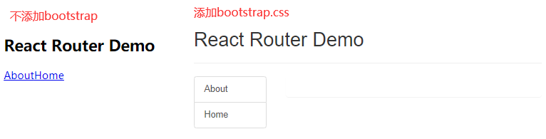

### 3.6 Switch的使用

	1.通常情况下，path和component是一一对应的关系。
	2.Switch可以提高路由匹配效率(单一匹配)。
	    一旦匹配到一个路由，后面的路由就不再匹配了
	    <Switch>
	        <Route path='home' component={Home} />
	        <Route path='test' component={Test} />
	    </Switch>

### 3.7 解决多级路径刷新页面样式丢失的问题

	存在的问题：
	        例如某个链接的路径是一个二级路由地址，类似于:/atguigu/about
	        则在访问了该路径匹配的组件后，再次刷新页面，会导致样式丢失，这是由于相对路径导致的，样式的请求路径会变为：http://localhost:3000/atguigu/css/bootstrap.css,实际真实的请求路径应该为：http://localhost:3000/css/bootstrap.css
	解决办法：
	        1.public/index.html 中 引入样式时不写 ./ 写 / （常用）
	                因为写./表示当前html文件所在路径的相对路径
	        2.public/index.html 中 引入样式时不写 ./ 写 %PUBLIC_URL% （常用）
	        3.使用HashRouter

### 3.8 路由的严格匹配与模糊匹配

	1.默认使用的是模糊匹配（简单记：【输入的路径】必须包含要【匹配的路径】，且顺序要一致）
	        例如：<Route path='/home' component={Home} />
	        则可以实现匹配的路径是/home/...../....
	2.开启严格匹配：<Route exact={true} path="/about" component={About}/>
	        例如：<Route path='/home' exact={true} component={Home} />
	        则可以实现匹配的路径是/home
	3.严格匹配不要随便开启，需要再开，有些时候开启会导致无法继续匹配二级路由

### 3.9 Redirect的使用	

	1.一般写在所有路由注册的最下方，当所有路由都无法匹配时，跳转到Redirect指定的路由
	2.具体编码：
	        <Switch>
	            <Route path="/about" component={About}/>
	            <Route path="/home" component={Home}/>
	            <Redirect to="/about"/>
	        </Switch>

### 3.10 嵌套路由

	1.注册子路由时要写上父路由的path值
	2.路由的匹配是按照注册路由的顺序进行的

### 3.11 向路由组件传递参数

	1.params参数
	            路由链接(携带参数)：<Link to={`/demo/test/${person.name}/${person.age}`}>详情</Link>
	            注册路由(声明接收)：<Route path="/demo/test/:name/:age" component={Test}/>
	            Test组件接收参数：this.props.match.params
	2.search参数
	            路由链接(携带参数)：<Link to='/demo/test?name=tom&age=18'}>详情</Link>
	            注册路由(无需声明，正常注册即可)：<Route path="/demo/test" component={Test}/>
	            接收参数：this.props.location.search   结果是：'?name=tom&age=18'
	            备注：获取到的search是urlencoded编码字符串，需要借助querystring解析
	
	                react封装了一个包：queryString
	                import qs from 'queryString'
	                用法：
	                    var obj = {id:'01',title:'消息1'};
	                    var str = qs.stringify(obj);  // str:'id=01&title=消息1'
	
	                    var str = 'id=01&title=消息1';
	                    var obj = qs.query(str); // obj={id:'01',title:'消息1'}
	
	                所以对于this.props.location.search得到的字符串需要解析：
	                    var result = this.props.location.search;
	                    var {id,title} = qs.query(resulr.slice(1)); // slice去掉?
	
	3.state参数
	            路由链接(携带参数)：<Link to={{pathname:'/demo/test',state:{name:'tom',age:18}}}>详情</Link>
	            注册路由(无需声明，正常注册即可)：<Route path="/demo/test" component={Test}/>
	            接收参数：this.props.location.state
	            备注：刷新也可以保留住参数

路由跳转的两种模式：push 和 replace

	默认开启的都是push模式，即会将该条记录放入历史栈中
	当给Link,NavLink等组件添加replace时就会直接替换掉栈顶的元素
	    <Link to='home/message' replace>消息</Link>

### 3.12 编程式路由导航

	借助this.prosp.history对象上的API对操作路由跳转、前进、后退
	        -this.prosp.history.push(path,state)
	        -this.prosp.history.replace(path,state)
	        -this.prosp.history.goBack()     回退1步
	        -this.prosp.history.goForward()  前进1步
	        -this.prosp.history.go(count)  count为正，则前进，count为负，则回退count个历史记录
	通过onClick事件触发，调用上面的API操作即可
	
	replace方法传递三种参数：
	    params参数：this.props.history.replace(`/home/message/detail/${id}/${title}`);
	    search参数：this.props.history.replace(`/home/message/detail/?id=${id}&title=${title}`);
	    state参数：this.props.history.replace(`/home/message/detail`,{id,title});
	
	注意：这里传递的哪种参数，就需要对应向路由组件传递哪种参数，声明对应的参数形式

### 3.13WithRouter函数的使用

解决非路由组件使用路由组件的相关API的问题

    只有路由组件才会在this.props中传递history,match,location三个对象
    而当我们想使用这三个对象所具备的方法时，就会出现问题
    
    import {withRouter} from 'react-router-dom'
    class Header extends Component{
    
    }
    export default withRouter(Header);  // withRouter为一个一般组件添加路由组件的API,返回一个新组件

### 3.14 BrowserRouter与HashRouter的区别

	1.底层原理不一样：
	            BrowserRouter使用的是H5的history API，不兼容IE9及以下版本。
	            HashRouter使用的是URL的哈希值。
	2.path表现形式不一样
	            BrowserRouter的路径中没有#,例如：localhost:3000/demo/test
	            HashRouter的路径包含#,例如：localhost:3000/#/demo/test
	3.刷新后对路由state参数的影响
	            (1).BrowserRouter没有任何影响，因为BrowserRouter的底层实现依赖于H5的history API,所以会存在历史记录，刷新后可以从历史记录中重新获取到state对象，state保存在history对象中。
	            (2).HashRouter刷新后会导致路由state参数的丢失！！！
	4.备注：HashRouter可以用于解决一些路径错误相关的问题。例如3.7中多级路径下页面刷新后样式的丢失问题。

### 3.15 antd-desigh组件库的使用(蚂蚁金服前端团队做的)

	这个组件库中包含了很多的已经写好了样式的组件，我们直接引入使用即可，它的主色调是蓝色
	https://ant.design/docs/react/introduce-cn
	
	    首先安装 yarn add antd
	    引入组件：import {Button} from 'antd'
	    引入样式：import 'antd/dist/antd.css'
	    使用：<Button type="primary">Primary Button</Button>

#### 3.15.1 antd的按需引入+自定主题

	上面引入组件样式时引入了antd所有组件的样式，这不太合理，需要实现按需引入
			
	1.安装依赖：
	            yarn add react-app-rewired customize-cra babel-plugin-import less 
	            yarn add less-loader@5.0.0  需要指定版本号
	
	            其中babel-plugin-import 是一个用于按需加载组件代码和样式的 babel 插件
	
	2.修改package.json：之前启动react脚手架使用的是react-scripts这个库，但是在使用customize-cra这个库修改了默认配置，实现了按需加载后就不能再使用react-scripts这个库启动、创建、测试脚手架了，就需要使用react-app-rewired库
	    之前的package.json文件的内容：
	            ....
	                "scripts": {
	                    "start": "react-scripts start",
	                    "build": "react-scripts build",
	                    "test": "react-scripts test",
	                    "eject": "react-scripts eject"
	                  }
	             ....
	     修改之后：
	            ....
	                "scripts": {
	                    "start": "react-app-rewired start",
	                    "build": "react-app-rewired build",
	                    "test": "react-app-rewired test",
	                    "eject": "react-scripts eject"
	                },
	            ....
	3.根目录下创建config-overrides.js，修改默认配置
	        //配置具体的修改规则
	        const { override, fixBabelImports, addLessLoader } = require("customize-cra");
	
	        module.exports = override(
	          fixBabelImports("import", {
	            libraryName: "antd",
	            libraryDirectory: "es",
	            style: true,
	          }),
	          addLessLoader({
	            javascriptEnabled: true,
	            modifyVars: {
	              "@primary-color": "green",
	            },
	          })
	        );
	    4.备注：不用在组件里亲自引入样式了，即：import 'antd/dist/antd.css'应该删掉

# 三、redux管理状态

## 1.求和案例\_redux 精简版

    	(1).去除Count组件自身的状态
    	(2).src下建立:
    					-redux
    						-store.js
    						-count_reducer.js
    
    	(3).store.js：
    				1).引入redux中的createStore函数，创建一个store
    				2).createStore调用时要传入一个为其服务的reducer
    				3).记得暴露store对象
    
    	(4).count_reducer.js：
    				1).reducer的本质是一个函数，接收：preState,action，返回加工后的状态
    				2).reducer有两个作用：初始化状态，加工状态
    				3).reducer被第一次调用时，是store自动触发的，
    								传递的preState是undefined,
    								传递的action是:{type:'@@REDUX/INIT_a.2.b.4}
    
    	(5).在index.js中监测store中状态的改变，一旦发生改变重新渲染<App/>
    			store.subscribe(() => {
    				// 只要redux中的状态发生任何变化，则重新渲染整个App
    				ReactDOM.render(<App />, document.getElementById("root"));
    			});
    			备注：redux只负责管理状态，至于状态的改变驱动着页面的展示，要靠我们自己写。

## 2.求和案例\_redux 完整版

    新增文件：
        1.count_action.js 专门用于创建action对象
        2.constant.js 放置容易写错的type值

## 3.求和案例\_redux 异步 action 版

    	首先如何区分同步action和异步action????
    		同步action是一个对象，异步action是一个函数
    
    	 (1).明确：延迟的动作不想交给组件自身，想交给action
    	 (2).何时需要异步action：想要对状态进行操作，但是具体的数据靠异步任务返回。
    	 (3).具体编码：
    			1).yarn add redux-thunk，并配置在store中
    			2).创建action的函数不再返回一般对象，而是一个函数，该函数中写异步任务。
    			3).异步任务有结果后，分发一个同步的action去真正操作数据。
    	 (4).备注：异步action不是必须要写的，完全可以自己等待异步任务的结果了再去分发同步action。

## 4.求和案例\_react-redux 基本使用

    (1).明确两个概念：
                1).UI组件:不能使用任何redux的api，只负责页面的呈现、交互等。
                2).容器组件：负责和redux通信，将结果交给UI组件。
    (2).如何创建一个容器组件————靠react-redux 的 connect函数
                    connect(mapStateToProps,mapDispatchToProps)(UI组件)
                        -mapStateToProps:映射状态，返回值是一个对象
                        -mapDispatchToProps:映射操作状态的方法，返回值是一个对象
    (3).备注1：容器组件中的store是靠props传进去的，而不是在容器组件中直接引入
    (4).备注2：mapDispatchToProps，也可以是一个对象
    
        /*
        最初的写法：
        mapStateToProps = (state) => ({count:state})
        mapDispatchToProps = (dispatch) => {
            return ({
                plus:(data) => dispatch(incrementAction(data));
                minus:(data) => dispatch(incrementAction(data));
                plusAsync:(data) => dispatch(incrementAsyncAction(data));
            })
        }
        export default connect(mapStateToProps,mapDispatchToProps)(CountUI);
        */
    
        简化后的写法：
        export default connect((state) => ({ count: state }), {
            plus:incrementAction,
            minus:decrementAction,
            plusAsync:incrementAsyncAction,
            })(CountUI);
    
        这是因为直接写成对象的形式时，redux会自动将所传入的创建action的函数通过dispatch调用，不用我们太过繁琐的写

## 5.求和案例\_react-redux 优化

react-redux 原理图：


    (1).容器组件和UI组件整合一个文件
    (2).无需自己给容器组件传递store，给<App/>包裹一个<Provider store={store}>即可。
    (3).使用了react-redux后也不用再自己检测redux中状态的改变了，容器组件可以自动完成这个工作。
    (4).mapDispatchToProps也可以简单的写成一个对象
    (5).一个组件要和redux“打交道”要经过哪几步？
            (1).定义好UI组件---不暴露
            (2).引入connect生成一个容器组件，并暴露，写法如下：
                    connect(
                        state => ({key:value}), //映射状态
                        {key:xxxxxAction} //映射操作状态的方法
                    )(UI组件)
            (4).在UI组件中通过this.props.xxxxxxx读取和操作状态

## 6.求和案例\_react-redux 数据共享版

    (1).定义一个Pserson组件，和Count组件通过redux共享数据。
    (2).为Person组件编写：reducer、action，配置constant常量。
    (3).重点：Person的reducer和Count的Reducer要使用redux中的combineReducers进行合并,import {combineReducers} from 'redux'
            合并后的总状态是一个对象！！！
            combineReducers({countReducer,personReducer});
            合并前，redux中的state=0
            合并后，redux中的state={count:0,persons:[]}
    (4).交给store的是总reducer，最后注意在组件中取出状态的时候，记得“取到位”。
    
    总结：各个库中需要使用的包：
            react      	React
            react-dom  	ReactDOM
            redux      	createStore, applyMiddleware, combineReducers
    
                                其中createStore负责创建store仓库
                                applyMiddleware配合redux-thunk库中的thunk负责应用中间件，处理异步action的问题
                                combineReducers负责整合所有的reducer
            redux-thunk thunk
            react-redux Provider,connect
    
                                其中Provider负责提供给所有的容器组件store仓库
                                connect负责连接容器组件和redux操作

## 7.求和案例\_react-redux 开发者工具的使用

    (1).yarn add redux-devtools-extension
    (2).store中进行配置
            import {composeWithDevTools} from 'redux-devtools-extension'
            const store = createStore(allReducer,composeWithDevTools(applyMiddleware(thunk)))


## 8.求和案例\_react-redux 最终版

    (1).所有变量名字要规范，尽量触发对象的简写形式。
    (2).reducers文件夹中，编写index.js专门用于汇总并暴露所有的reducer

# 四、React扩展

## 1. setState更新状态的2种写法

```
	(1). setState(stateChange, [callback])------对象式的setState
            1.stateChange为状态改变对象(该对象可以体现出状态的更改)
            2.callback是可选的回调函数, 它在状态更新完毕、界面也更新后(render调用后)才被调用
        
					
	(2). setState(updater, [callback])------函数式的setState
            1.updater为返回stateChange对象的函数。
            2.updater可以接收到两个参数，state和props，分别是当前组件的状态和它从父组件上接收到的参数。
            3.updater函数返回一个对象，表示对于state如何进行修改
            4.callback是可选的回调函数, 它在状态更新、界面也更新后(render调用后)才被调用。
            
总结:
		1.对象式的setState是函数式的setState的简写方式(语法糖)
		2.使用原则：
				(1).如果新状态不依赖于原状态 ===> 使用对象方式
				(2).如果新状态依赖于原状态 ===> 使用函数方式
				(3).如果需要在setState()执行后获取最新的状态数据, 
					要在第二个callback函数中读取
		3.this.setState不会立刻改变React组件中state的值，每一次setState都会触发一系列生命周期函数（勾子函数）:
			shouldComponentUpdate
			componentWillUpdate
			render
			componentDidUpdate
		执行到render时，才会实现state的改变
		4.多次setState函数调用产生的结果会合并，但是对象式的setState会存在下面的问题：
			例如：
			function update(){
				this.setState({FirstName:'Morgan'})
				this.setState({SecondName:'Cheng'})
			}
			它调用了两次this.setState,但是只会引发一次更新生命周期，不是两次，因为React会将多个setState产生的修改放在一个队列里，攒在一起，觉得差不多了再引发一次更新过程，会变成下面这样：
			this.setState({FirstName:'Morgan',SecondName:'Cheng'})
			
			所以对于经常出现的下面的例子：
			function update(){
				this.setState({count:this.state.count+1})
				this.setState({count:this.state.count+1})
				this.setState({count:this.state.count+1})
			}
			都会变成this.setState({count:this.state.count+1})
		5.函数式的setState就不会存在这个问题了
			例子：
            	this.state = {count:0}
            	function increment(state,props){
            		④ // state.count:
            		return {count:state.count+1};
            	}
            	function incrementMultiple(){
            		// increment传入的state={count:0}
            		① this.setState(increment); // this.state:{count:0}
            		// increment传入的state={count:1}
            		② this.setState(increment); // this.state:{count:0}
            		// increment传入的state={count:2}
            		③ this.setState(increment); // this.state:{count:0}
            	}
            	render(){
            		⑥
            	}
            	
            	React会保证调用每次increment时,state都已经合并了之前的状态修改结果
            	上述代码的执行顺序按照标号，①②③执行结束后，④执行三次，每次increment的参数state的count属性都会加1，但是React组件的state的count还是保持为0，然后执行⑥，此时React组件的state才会直接变为3
```

## 2. 路由组件的lazyLoad:

一般在打开一个界面后，所有的组件都会被加载，所以页面第一次展示需要的时间会有点久，为了避免这个问题，使得需要使用或者展示某个组件的时候再去加载

点击某个路径组件的时候浏览器再去加载它

```js
import React, {lazy, Suspense} from 'react';

//1.通过React的lazy函数配合import()函数动态加载路由组件 ===> 路由组件代码会被分开打包
const Login = lazy(()=>import('@/pages/Login'))

//2.通过<Suspense>指定在加载得到路由打包文件前显示一个自定义loading界面
// 如果网速慢，则需要使用fallback指定一个提示信息，fallback指定的提示信息不能使用懒加载
<Suspense fallback={<h1>loading.....</h1>}>
    <Switch>
        <Route path="/xxx" component={Xxxx}/>
        <Redirect to="/login"/>
    </Switch>
</Suspense>
```

## 3. Hooks

#### 1. React Hook/Hooks是什么?

```
(1). Hook是React 16.8.0版本增加的新特性/新语法
(2). 可以让你在函数组件中使用 state 以及其他的 React 特性
(3). Hooks实际上就是一些封装函数，使用useXXXX作为函数名，遵循React的Hooks规则
```

#### 2. 三个常用的Hook

```
(1). State Hook: React.useState()
(2). Effect Hook: React.useEffect()
(3). Ref Hook: React.useRef()
```

#### 3. State Hook

```
(1). State Hook让函数组件也可以有state状态, 并进行状态数据的读写操作
(2). 语法: const [xxx, setXxx] = React.useState(initValue)  
(3). useState(initValue)说明:
        参数initValue: 第一次初始化该状态xxx时指定的值，在内部作缓存
        返回值: 包含2个元素的数组, 第1个为内部当前状态值, 第2个为更新该状态值的函数
(4). setXxx()2种写法:
        setXxx(newValue): 参数为非函数值, 直接指定新的状态值, 内部用其覆盖原来的状态值
        setXxx(value => newValue): 参数为函数, 接收原本的状态值, 返回新的状态值, 内部用其覆盖原来的状态值
(5). 有多个状态变量时，就需要定义多个修改状态的语句
		function Demo(){
		    // count初始化值就是0, 修改count的方法就是setCount
			const [count,setCount] = React.useState(0)    
            const [name,setName] = React.useState('jack')  // name初始化值就是jack
            //加的回调
            function add(){
                //setCount(count+1) //第一种写法
                setCount(count => count+1 )
            }
            //加的回调
            function changeName(){
                //setName('tom') //第一种写法
                setName(name => 'tom' )
            }
            return (
            	<div>
            		<h2>当前求和为：{count},姓名为：{name}</h2>
            		<button onClick={add}>点我加1</button>
            		<button onClick={changeName}>点我修改姓名</button>
            	</div>
            )
		}
		export default Demo;
(6)每一次修改状态，则整个组件就需要重新渲染，react解析发现组件是使用函数定义的，调用该函数，将返回的虚拟DOM转为真实DOM，随后呈现在页面中
	所以函数组件就类似于类组件中的render方法，会被执行1+n次，n表示修改状态的次数
	则每次修改了状态后，都会调用函数组件自身，执行该函数，下面的两句话也会重新执行一次：
		const [count,setCount] = React.useState(0)    
        const [count,setName] = React.useState('jack')
    但是为什么状态变量的值还是会在原来的值的基础上改变，而不会被重新置为0或者jack呢？？？？
    这是因为react在内部缓存了状态变量的值，对上面的语句做了处理，所以不会被覆盖
    可以看一下这里的例子：https://blog.csdn.net/Morgan_sakura/article/details/108712369
```

#### 4. Effect Hook

之前在类组件中存在生命周期勾子，可以使得我们在特定的函数内实现一些异步的操作

React会等待浏览器完成画面渲染之后才会延迟调用useEffect,方便处理额外的操作。

```
(1). Effect Hook 可以让你在函数组件中执行副作用操作(用于模拟类组件中的生命周期勾子)
(2). React中的副作用操作:
        发ajax请求数据获取
        设置订阅 / 启动定时器
        手动更改真实DOM
(3). 语法和说明: 
        useEffect(() => { 
          // 在此可以执行任何带副作用操作
          return () => { 
          	// 在组件卸载前执行,相当于componentWillUnmount
            // 在此做一些收尾工作, 比如清除定时器/取消订阅等
          }
        }, [stateValue]) 
        // 如果不指定第二个参数，即没有第二个参数，则相当于 componentDidMount + componentDidUpdate，监测所有状态的变化
        // 如果指定的是[], 相当于componentDidMount,只会在初始化加载组件时，执行一次
        // 如果指定的是[count],则回调函数会在第一次render后以及count状态发生改变后执行，相当于componentDidMount以及监测count状态变化的componentDidUpdate，只监测count状态的变化
        
        componentDidMount:
                        React.useEffect(()=>{
                        	// ...
                        },[])
        componentDidMount & componentDidUpdate:
                        React.useEffect(()=>{
                        	// ...
                        },[count])
        componentWillUnmount:
                        React.useEffect(()=>{
                            return ()=>{
                                // 清理定时器,取消订阅等
                            }
                        },[]])
    
(4). 可以把 useEffect Hook 看做如下三个函数的组合
        componentDidMount()
        componentDidUpdate()
    	componentWillUnmount() 
    	
(5)举例：
	function Demo(){
        //console.log('Demo');

        const [count,setCount] = React.useState(0)
        const myRef = React.useRef()

        React.useEffect(()=>{
            let timer = setInterval(()=>{
                setCount(count => count+1 )
            },1000)
            return ()=>{
                clearInterval(timer)
            }
        },[])

        //加的回调
        function add(){
            //setCount(count+1) //第一种写法
            setCount(count => count+1 )
        }

        //提示输入的回调
        function show(){
            alert(myRef.current.value)
        }

        //卸载组件的回调
        function unmount(){
            ReactDOM.unmountComponentAtNode(document.getElementById('root'))
        }

        return (
            <div>
                <input type="text" ref={myRef}/>
                <h2>当前求和为：{count}</h2>
                <button onClick={add}>点我+1</button>
                <button onClick={unmount}>卸载组件</button>
                <button onClick={show}>点我提示数据</button>
            </div>
        )
    }
(6)  hook为了提高效率，也在内部部署了优化方案，通过跳过 Effect 进行性能优化
	浅拷贝比较，如果未发生变化，则不执行回调
```

#### 5. Ref Hook

```
(1). Ref Hook可以在函数组件中存储/查找组件内的标签或任意其它数据
(2). 语法: 
	第一步：创建容器
		const refContainer = useRef();   
	第二步：
        <input ref={refContainer} type='text' />
        function show(){
            console.log(refContainer.current.value);
        }
    第三步：获取dom节点  refContainer.current.input
    
(3). 作用:保存标签对象,功能与React.createRef()一样,存在多个标签需要存储时，就需要定义多个容器
```

#### 6 自定义Hook

```
Hook实际上就是一些完成特定功能的封装函数
	自定义hook，必须以use开头
	内部可以使用已有的hook
	例如，我们可以自定义一个hook实现string转obj   url处理  日期处理   数据请求  数据类型校验  界面唯一化处理

// 自定义发送请求的hook
export function useRequest(url) {
  // 发出请求
  const [data, setData] = useState(null);
  const [error, setError] = useState(null);
  const [loading, setLoading] = useState(true);
  // 这个函数中第二个参数为[],所以这个组件只会在第一次加载组件结束后执行一遍，其余状态更新不会引发此回调的执行
  useEffect(
    // 组件渲染结束后执行
    () => {
      axios
        .get(url)
        .then((res) => {
          console.log(2222, res);
          setData(res);
        })
        .catch((error) => {
          setError(error);
        })
        .finally(() => {
          setLoading(false);
        });
    },
    []
  );
  return { data, error, loading };
}

// 自定义数据类型校验的hook
export function useDataTypeCheck(data) {
  if (typeof data !== "object") return 0;
  if (Object.prototype.toString.call(data) === "[object Null]") return 1;
  if (Object.prototype.toString.call(data) === "[object object]") {
    if (Object.keys().length === 0) return 2;
  }
  if (Array.isArray(data) && data.length !== 0) {
    return 3;
  }
  console.log(data);
  return data;
}
```

## 5. Context

Context 提供了一种在组件之间共享此类值的方式，而不必显式地通过组件树的逐层传递 props。

### 理解

> 一种组件间通信方式, 常用于【祖组件】与【后代组件】间通信
>
> ​			组组件：A包含B，B包含C，C包含D，A和C,D就属于组组件和后代组件

### 使用

```js
1) 创建Context容器对象，放在所有需要使用该状态的组件的公共区域：
	const XxxContext = React.createContext()  
	
2) 渲染子组时，外面包裹xxxContext.Provider, 通过value属性（只能叫value）给后代组件传递数据，则只要是子组件（及其后代组件）声明后，均可以访问该数据：数据可以是一个变量或者一个对象等
	<xxxContext.Provider value={data}>
		子组件
    </xxxContext.Provider>
    
3) 后代组件读取数据：

	//第一种方式:仅适用于类组件 
	  static contextType = xxxContext  // 声明接收context，哪个后代组件需要，哪个后代组件就得声明
	  this.context // data
	  
	//第二种方式: 函数组件与类组件都可以
	  <xxxContext.Consumer>
	    {
	      value => ( // value就是data
	        要显示的内容
	      )
	    }
	  </xxxContext.Consumer>
```

### 注意

	在应用开发中一般不用context, 一般都用它的封装react插件

举例：

```
//创建Context对象
const MyContext = React.createContext();
const { Provider, Consumer } = MyContext;
export default class A extends Component {
  state = { username: "tom", age: 18 };

  render() {
    const { username, age } = this.state;
    return (
      <div className="parent">
        <h3>我是A组件</h3>
        <h4>我的用户名是:{username}</h4>
        <Provider value={{ username, age }}>
          <B />
        </Provider>
      </div>
    );
  }
}

// 不需要层层传递，B中不需要接收再传递给C
class B extends Component {
  render() {
    return (
      <div className="child">
        <h3>我是B组件</h3>
        <C />
      </div>
    );
  }
}

// 类组件接收
class C extends Component {
  //声明接收context
  static contextType = MyContext;
  render() {
    const { username, age } = this.context;
    return (
      <div className="grand">
        <h3>我是C组件</h3>
        <h4>
          我从A组件接收到的用户名:{username},年龄是{age}
        </h4>
      </div>
    );
  }
}

function C() {
  return (
    <div className="grand">
      <h3>我是C组件</h3>
      <h4>
        我从A组件接收到的用户名:
        <Consumer>{(value) => `${value.username},年龄是${value.age}`}</Consumer>
      </h4>
    </div>
  );
}
```


<hr/>

## 6. render props

之前在一个组件中，引入一个子组件都是使用自闭和的结构：`<div> <A /> </div>`,并没有传入过包含有内容体的组件，例如`<div> <A>xxxx</A> </div>`,但是页面上展示不出`xxxx`。

### 如何向组件内部动态传入带内容的结构(标签)?

	Vue中: 
		使用slot技术, 也就是通过组件标签体传入结构  <A><B/></A>
	React中:
		使用children props: 通过组件标签体传入结构
		使用render props: 通过组件标签属性传入结构,而且可以携带数据，一般用render函数属性

### children props

> - 可以传入带内容的组件
> - 但是当内容体是组件时，不能向该组件传递数据
> - 它也可以理解为在A组件中预存了一个位置
> - `props.children`
>   - 每个组件都可以获取到 `props.children`。它包含组件的开始标签和结束标签之间的内容。
> - 用法：
>   - 第一步：在其他组件中使用带内容体的A组件，例如`<A>xxxx</A>`
>   - 第二步：在A组件中，使用this.props.children或者props.children获取A组件在被使用时包含的内容体,即可得到"xxxx"
>   - 如果在使用A组件时，A组件中包含的内容体是其他的组件，则使用第二步就相当于在A组件中放入了B组件

	class Parent extends Component{
		render(){
			return(
				<div>
					<A>xxxx</A>
	            </div>
			)
		}
	}
	
	class A extends Component{
		render(){
		    console.log(this.props)  // {children:"xxxx"}
			return(
				<div>
					<h3>我是A组件</h3>
					{this.props.children}
	            </div>
			)
		}
	}
	
	// 如果A组件中又存放了B组件呢？
	class Parent extends Component{
		render(){
			return(
				<div>
					<A>
						<B />   // 第一步将B作为A的标签体内容
					</A>
	            </div>
			)
		}
	}
	
	class A extends Component{
		render(){
		    console.log(this.props)    // {children:{}}  children是一个react组件对象，保存着组件B的信息
			return(
				<div>
					<h3>我是A组件</h3>
					{this.props.children}  // 第二步：在A中使用组件B
	            </div>
			)
		}
	}
	
	class B extends Component{
		render(){ 
			return(
				<div>
					<h3>我是B组件</h3>
	            </div>
			)
		}
	}
	
	在A组件中：this.props.children:'xxxx'
	但是问题来了: 如果B组件需要得到A组件内的数据，怎么做呢？？
		==> 做不到 
		==> 目前在A组件中是通过标签体内容调用B的，不能像之前<B name={this.state.name} />传递数据了

传入组件时，this.props的形式：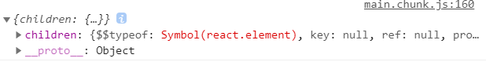

### render props

> - 在A组件中预留一个位置，存放另一个组件，还可以从A向B传递数据
> - 这也叫插槽技术
> - render属性（可以是其他名字）,该属性本身是一个函数，返回一个组件B

	第一步：在A组件内为B组件预留位置
		{this.props.render(内部state数据)}
	第二步：在其他组件中定义A和B的父子关系
		<A render={(name) => <B name={name} />} />
	第三步：B组件中读取A组件传入的数据显示 
		{this.props.data} 


​	
​	class A extends Component {
​	  state = { name: "tom" };
​	  render() {
​	    const { name } = this.state;
​	    return (
​	      <div className="a">
​	        <h3>我是A组件</h3>
​	        <span>啦啦啦</span>
​	        // 该render属性传递给A组件的this.props中，然后执行该函数就会返回组件B，则此时组件A中就会出现组件B
​	        // 预留一个位置，存在另一个组件
​	        {this.props.render(name)} // 这句话执行后返回得到组件B，A和B的父子关系才会成立，并且将A的name状态传递给了B
​	      </div>
​	    );
​	  }
​	}
​	
​	export default class Parent extends Component {
​	  render() {
​	    return (
​	      <div className="parent">
​	        <h3>我是Parent组件</h3>
​	        // render属性（可以是其他名字）,该属性本身是一个函数，返回一个组件B，定义A和B的父子关系
​	        <A render={(name) => <B name={name} />} />
​	      </div>
​	    );
​	  }
​	}
​	
​	class B extends Component {
​	  render() {
​	    console.log("B--render");
​	    return (
​	      <div className="b">
​	        <h3>我是B组件,{this.props.name}</h3>
​	      </div>
​	    );
​	  }
​	}

## 7  useReducer &  Context & childrenProps

### 7.1 useReducer

```
哪个组件需要接收父组件（祖祖祖祖父等）通过context容器传递的数据，则直接使用：
const theme = useContext(ThemeContext);  theme就是它所传递的数据

它的作用和<MyContext.Consumer>，static contextType = MyContexct相同,
```

### 7.2 useReducer结合Context可以实现redux的效果

下面举例实现一个Reducer,使得该Reducer内的数据可以供两个组件Text1,Text2使用，两个组件共享reducer中的数据

```
import React, { useReducer, createContext } from "react";

// 创建context容器对象
export const MyContext = createContext();

const reducer = (state, action) => {
  switch (action.type) {
    case "setname":
      return { ...state, name: action.name };
    case "setage":
      return { ...state, age: action.age };
    default:
      return state;
  }
};

const data = { name: "whh", age: 18 };
// 渲染子组件时，使用Provider包裹，从而通过value属性将需要传递的参数传递给子组件
const Provider = MyContext.Provider;
export function Reducer(props) {
  let [state, dispatch] = useReducer(reducer, data);
  console.log(1111, state, dispatch);
  // props.children获取当前组件被使用时包含的内容体
  return <Provider value={{ state, dispatch }}>{props.children}</Provider>;
}

```

./index.js

```
// 获取刚才的组件
import { Reducer } from "./Reducer";
import Text1 from "./Text1";
import Text2 from "./Text2";

export default function Demo() {
  return (
    <>
      <span>第一种：两个组件数据共享</span>
      // 对应的内容体就是Text1和Text2两个子组件，这两个组件共享通过context传递的数据state, dispatch
      <Reducer>    
        <Text1 />
        <Text2 />
      </Reducer>

      <br></br>
      <span>第二种：两个组件分别具备各自的reducer</span>
      <Reducer>
        // 对应的内容体就是Text1子组件，这个组件独享通过context传递的数据state, dispatch
        <Text1 />
      </Reducer>
      <Reducer>
        // 对应的内容体就是Text2子组件，这个组件独享通过context传递的数据state, dispatch
        <Text2 />
      </Reducer>
    </>
  );
}
```

Text1.jsx

```
import { MyContext } from "./Reducer";
import React, { useContext } from "react";

export default function Text1() {
  // 声明接收
  let { state, dispatch } = useContext(MyContext);
  console.log(state);
  return (
    <>
      <h1>
        我是Text1组件,姓名：{state.name}，年龄：{state.age}
      </h1>
      <button onClick={() => dispatch({ type: "setname", name: "whh1" })}>
        点我改名
      </button>
      <button onClick={() => dispatch({ type: "setage", age: "21" })}>
        点我改年龄
      </button>
    </>
  );
}

```

Text2.jsx

```
import { MyContext } from "./Reducer";
import react, { useContext } from "react";

export default function Text2() {
  // 声明接收
  let { state, dispatch } = useContext(MyContext);
  return (
    <>
      <h1>
        我是Text2组件,姓名：{state.name}，年龄：{state.age}
      </h1>
      <button onClick={() => dispatch({ type: "setname", name: "whh2" })}>
        点我改名
      </button>
      <button onClick={() => dispatch({ type: "setage", age: "22" })}>
        点我改年龄
      </button>
    </>
  );
}

```

## 8. 错误边界

**错误边界是一种 React 组件**，这种组件**可以捕获并打印发生在其子组件树任何位置的 JavaScript 错误，并且，它会渲染出备用 UI**，而不是渲染那些崩溃了的子组件树。

如果一个 class 组件中定义了 [`static getDerivedStateFromError()`](https://reactjs.bootcss.com/docs/react-component.html#static-getderivedstatefromerror) 或 [`componentDidCatch()`](https://reactjs.bootcss.com/docs/react-component.html#componentdidcatch) 这两个生命周期方法中的任意一个（或两个）时，**那么它就变成一个错误边界**。当后代组件抛出错误后，父组件就会自动调用 `static getDerivedStateFromError()` 渲染备用 UI ，使用 `componentDidCatch()` 打印错误信息。

#### 理解：

错误边界(Error boundary)：用来捕获后代组件错误，渲染出备用页面

#### 特点：

只能捕获后代组件生命周期（一般是render内部）产生的错误，不能捕获自己组件产生的错误和其他组件在合成事件、定时器中产生的错误

##### 使用方式：

getDerivedStateFromError配合componentDidCatch

```js
// 生命周期函数，一旦后台组件报错，就会触发
static getDerivedStateFromError(error) {
    console.log(error);
    // 在render之前触发
    // 返回新的state
    return {
        hasError: true,    // 用于标识子组件是否产生错误
    };
}

componentDidCatch(error, info) {
    // 统计页面的错误。发送请求发送到后台去
    console.log(error, info);
}
```

例子：

```
import React, { Component } from 'react'
import Child from './Child'

export default class Parent extends Component {

	state = {
		hasError:'' //用于标识子组件是否产生错误
	}

	//在render之前调用，当Parent的子组件出现报错时候，会触发getDerivedStateFromError调用，并携带错误信息
	static getDerivedStateFromError(error){
		console.log('@@@',error);
		// 更新 state 使下一次渲染能够显示降级后的 UI
		return {hasError:error}
	}

	// 如果getDerivedStateFromError
	componentDidCatch(){
		// 
		console.log('此处统计错误次数，反馈给服务器，用于通知编码人员进行bug的解决');
	}

	render() {
		return (
			<div>
				<h2>我是Parent组件</h2>
				{/*你可以自定义降级后的 UI(这里使用一个h2标签替代) 并渲染*/}
				{this.state.hasError ? <h2>当前网络不稳定，稍后再试</h2> : <Child/>}
			</div>
		)
	}
}
```

在开发者环境中，我们会看到上面的错误提示界面在展示之后，很快就会跳转到错误信息界面，但是在我们将项目打包npm run build之后,界面展示就会很稳定，一直保持在错误提示界面

### 错误边界结合children props举例分析：

```
// 产生一个错误边界
import React from "react";

class ErrorBoundary extends React.Component {
  state = { error: null, errorInfo: null };

  // 在render之前调用
  componentDidCatch(error, errorInfo) {
    // 如果子组件出现报错，就会调用父组件的此函数
    console.log(error, errorInfo);
    // 捕获错误，并且更新错误状态，保证后面render时得到最新的状态
    this.setState({
      error: error,
      errorInfo: errorInfo,
    });
    // 这里可以打印错误信息或者上传错误日志
  }

  render() {
    if (this.state.errorInfo) {
      // 发生错误时的备用UI
      return (
        <div>
          <h2>Something went wrong.</h2>
          <details style={{ whiteSpace: "pre-wrap" }}>
            {this.state.error && this.state.error.toString()}
            <br />
            {this.state.errorInfo.componentStack}
          </details>
        </div>
      );
    }
    // 正常渲染后代组件，这里使用childrenProps的方式,则这里可以更换组件
    return this.props.children;
  }
}

产生一个计数器组件：
class BuggyCounter extends React.Component {
  state = { counter: 0 };

  handleClick = () => {
    this.setState(({ counter }) => ({
      counter: counter + 1,
    }));
  };

  render() {
    if (this.state.counter === 5) {
      // 模拟一个JS错误，如果计数器加到5，则报错
      // 如果父组件部署了componentDidCatch 或者  static getDerivedStateFromError() 方法，则该方法就会自动调用
      throw new Error("I crashed!");
    }
    return <h1 onClick={this.handleClick}>{this.state.counter}</h1>;
  }
}

// 主组件
function Demo() {
  return (
    <div>
      <ErrorBoundary>
        <p>
          这两个计数器在一个错误边界中，当任何一个计数器出错，则这两个计数器渲染的部分就会被错误边界提供的备用UI代替
        </p>
        <BuggyCounter />
        <BuggyCounter />
      </ErrorBoundary>
      <hr />
      <p>
        这两个计数器在不同的错误边界中，所以其中一个出现错误，则另一个不受影响，只有出错的那个计数器组件被错误边界提供的UI代替
      </p>
      <ErrorBoundary>
        <BuggyCounter />
      </ErrorBoundary>
      <ErrorBoundary>
        <BuggyCounter />
      </ErrorBoundary>
    </div>
  );
}

export default Demo;

从这个例子中也可以看出childrenProps的作用，只需要写{this.props.children}，不用操心里面具体放什么内容
```

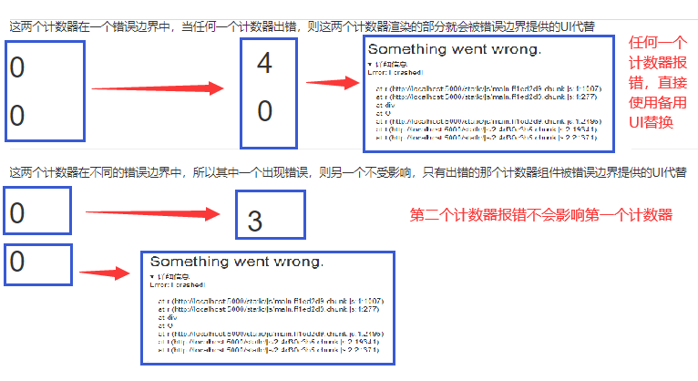

## 9. Fragment

### 使用

	import React, { Component,Fragment } from 'react'
	<Fragment></Fragment>
	<></>   可以使用空标签，但是它不支持key属性的指定
	
	因为在每个组件中都需要存在一个根标签div，包含其它所有的子标签,这样在浏览器中解析时就会出现多个无用的div,浏览器会自动忽略掉Fragment，从而得到的结果中就不会存在无用的div标签了

### 作用

> 可以不用必须有一个真实的DOM根标签了

## 10. 组件优化

### Component的2个问题 

> 1. 只要执行setState(),即使不改变状态数据（例如setState({});并不会修改状态数据）, 组件也会重新render() ==> 效率低
>
> 2. 只当前组件重新render(), 就会自动重新render子组件，纵使子组件没有用到父组件的任何数据 ==> 效率低

### 效率高的做法

>  只有当组件的state或props数据发生改变时才重新render()

### 原因

>  Component中的shouldComponentUpdate()总是返回true

### 解决

	办法1: 
		重写shouldComponentUpdate()方法
		比较新旧state或props数据, 如果有变化才返回true, 如果没有返回false
	        例如下面的父子组件中：
	        <Parent>
	            <Child count={this.state.count} />
	        </Parent>
	            在父组件中,如果状态信息不发生变化则不重新render：
	                shouldComponentUpdate(nextProps,nextState){
	                	// nextProps以及nextState是本次更新操作完成之后的结果
	                    if(this.state.count === nextState.count){
	                        return false;// 关掉阀门，不更新界面
	                    }	
	                    return true;
	                }
	            在子组件中,如果父组件传入的数据没有修改则不重新render：
	                shouldComponentUpdate(nextProps,nextState){
	                    if(this.props.count === nextProps.count){
	                        return false;// 关掉阀门，不更新界面
	                    }	
	                    return true;
	            }
	    但是，如果有一堆数据，则重写的内容就会很多，不太好
	办法2:  
		使用PureComponent
		PureComponent 和 Component 基本一样，只不过会在 render 之前帮组件自动执行一次shallowEqual（浅比较），来决定是否更新组件，浅比较类似于浅复制，只会比较第一层。使用 PureComponent 相当于省去了重写 shouldComponentUpdate 函数,当组件更新时，如果组件的 props 和 state：
	
	        1 引用和第一层数据都没发生改变， render 方法就不会触发，这是我们需要达到的效果。
	        2 虽然第一层数据没变，但引用变了，就会造成虚拟 DOM 计算的浪费。
	        3 第一层数据改变，但引用没变，会造成不渲染，所以需要很小心的操作数据。
		
			import {PureComponent} from 'react'
			class Parent extends PureComponent{}
			class Child extends PureComponent{}
			
		注意: 两种方法在以下情况下都不管用：
			不要直接修改state数据, 而是要产生新数据，即下面的方式不可取：
				const {obj} = this.state
				obj.count = 3;
				this.setState(obj);   // 这样不会产生更新，因为obj和this.setState的指针是一样的，更新时shouldUpdateComponent方法会发现obj===this.setState,所以阀门会关闭，则不会产生更改
				
	        同理：下面不会产生更新(不管是Component或者PureComponent,因为diff算法在比较时会出现问题)
	            const {stus} = this.state
	            stus.unshift('lily')
	            this.setState({stus})
	        解决办法：使用扩展运算符
	            const {stus} = this.state
	            this.setState({stus:['lily',...this.state.stus]})  // 需要构建一个新对象，这样在浅比较时，两个对象的指针不同，内部的元素也是浅比较指针的,所以也需要产生新数据


​				

			项目中一般使用PureComponent来优化

## 11. 组件通信方式总结

#### 组件间的关系：

- 父子组件
- 兄弟组件（非嵌套组件）
- 祖孙组件（跨级组件）

#### 几种通信方式：

		1.props：
			(1).children props
			(2).render props
		2.消息订阅-发布：
			pubs-sub、event等等
		3.集中式管理：
			redux、dva等等
		4.conText:
			生产者-消费者模式

#### 比较好的搭配方式：

		父子组件：props
		兄弟组件：消息订阅-发布、redux集中式管理
		祖孙组件(跨级组件)：消息订阅-发布、集中式管理、conText(开发用的少，封装插件用的多)

## react实现双向数据绑定

当数据发生变化的时候，视图也就发生变化，当视图发生变化的时候，数据也会跟着同步变化；可以这样说用户在视图上的修改会自动同步到数据模型中去，数据模型也是同样的变化。

1. 数据影响视图：input组件的显示值从组件的state属性中直接读取
2. 视图影响数据：组件的input输入内容发生变化，则修改state属性

## 原生js实现双向数据绑定

使用defineProperty方法：

```
var input1 = document.querySelector("#text1");
var data = {};
Object.defineProperty(data, "name", {
  configurable: true,
  get: function(){
      return input.value
  },
  set: function(newValue){
    //this.value = newValue;
    // 数据修改视图，input框内
    input.value = newValue;
  }
})
data.name = "sss";
// 视图修改数据
input1.onchange = function(){
  data.name = this.value;
}
```


```jsx
var input1 = document.querySelector("#text1");
var input2 = document.querySelector("#text1");
var data = {};
Object.defineProperty(data, "name", {
  configurable: true,
  get: function(){
      return input.value
  },
  set: function(newValue){
    //this.value = newValue;
    // 数据修改视图
    input1.value = newValue;
    input2.value = newValue;
  }
})
data.name = "sss";
input1.onchange = function(){
  // 视图修改数据
  data.name = this.value;
}
input2.onchange = function(){
    // 视图修改视图
  input1.value = this.value;
}
```


# 五、requestIdleCallback函数：<div id="#requestIdleCallback" />

```
<!DOCTYPE html>
<html lang="en">
  <head>
    <meta charset="UTF-8" />
    <meta name="viewport" content="width=device-width, initial-scale=1.0" />
    <title>Document</title>
  </head>
  <body>
    <script>
      works = [
        () => {
          console.log("任务1,start");
          sleep(41);
          console.log("任务1,end");
        },
        () => {
          console.log("任务2,start");
          sleep(10);
          console.log("任务2,end");
        },
        () => {
          console.log("任务3,start");
          sleep(20);
          console.log("任务3,end");
        },
      ];
      function workLoop(deadline) {
        console.log(`本帧的剩余时间${parseInt(deadline.timeRemaining())}`);
        while (deadline.timeRemaining() > 1 && works.length > 0) {
          fn();
          // 执行完某个任务后查看本帧的剩余时间
          console.log(`本帧的剩余时间${parseInt(deadline.timeRemaining())}`);
        }
        // 如果时间不够了，但是任务没有执行完
        if (works.length > 0) {
          console.log('新的一帧')
          requestIdleCallback(workLoop);
        }
        // workLoop退出表示让出控制权
      }
      function fn() {
        let work = works.shift();
        work();
      }
      function sleep(delay) {
        for (let ts = Date.now(); Date.now() - ts <= delay; ) {}
      }
      requestIdleCallback(workLoop);
    </script>
  </body>
</html>
```

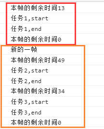

# 六、React合成事件

### 1 React16

React使用onClickCapture为标签绑定捕获事件，即事件捕获阶段触发的事件，onClick默认是在冒泡阶段触发的；dom事件中给元素添加原生捕获使用的是addEventListener，第三个参数设置为true,则表示在捕获阶段触发

React的事件绑定是在reconciliation阶段绑定的，会在原生事件的绑定前执行

React16合成事件一套机制：React并不是将click事件直接绑定在dom上面，React的事件会交到document上；当真实dom触发事件时，会先处理原生事件，然后一直冒泡到document对象后，再处理React事件

```
import React, { Component } from "react";
import ReactDOM from "react-dom";

export default class App extends Component {
  parentRef = React.createRef();
  childRef = React.createRef();
  componentDidMount() {
    // 原生事件
    this.parentRef.current.addEventListener(
      "click",
      () => {
        console.log("父元素原生捕获");
      },
      true
    );
    this.parentRef.current.addEventListener(
      "click",
      () => {
        console.log("父元素原生冒泡");
      },
      false
    );
    this.childRef.current.addEventListener(
      "click",
      () => {
        console.log("子元素原生捕获");
      },
      true
    );
    this.childRef.current.addEventListener(
      "click",
      () => {
        console.log("子元素原生冒泡");
      },
      false
    );
    document.addEventListener(
      "click",
      () => {
        console.log("document捕获");
      },
      true
    );
    // document的冒泡是在React注册后注册的，所以后执行
    // React会执行一个document.addEventListener("click",dispatchEvent)
    document.addEventListener(
      "click",
      () => {
        console.log("document冒泡");
      },
      false
    );
  }
  parentBubble = () => {
    console.log("父元素React冒泡");
  };
  childBubble = () => {
    console.log("子元素React冒泡");
  };
  parentCapture = () => {
    console.log("父元素React捕获");
  };
  ChildCapture = () => {
    console.log("子元素React捕获");
  };
  render() {
    return (
      <div>
        <div
          ref={this.parentRef}
          onClick={this.parentBubble}
          onClickCapture={this.parentCapture}
        >
          <p
            ref={this.childRef}
            onClick={this.childBubble}
            onClickCapture={this.ChildCapture}
          >
            事件执行顺序
          </p>
        </div>
      </div>
    );
  }
}

ReactDOM.render(<App />, document.getElementById("root"));
```

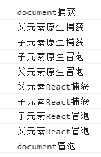

这样的结果感觉React16中的事件和dom原生事件不是很协调，一会儿捕获，一会儿冒泡。捕获的过程不是一起进行的

手写React16的合成事件: 得到上面相同的结果

```
<!DOCTYPE html>
<html lang="en">
  <head>
    <meta charset="UTF-8" />
    <meta name="viewport" content="width=device-width, initial-scale=1.0" />
    <title>Document</title>
  </head>
  <body>
    <div id="parent">
      <div id="child">事件执行顺序</div>
    </div>
    <script>
      function dispatchEvent(event) {
        event = event || window.event;
        let paths = [];
        // 依次将事件发生的元素、其父元素等放入paths中
        let current = event.target;
        while (current) {
          paths.push(current);
          current = current.parentNode;
        }
        // 模拟捕获和冒泡
        // 模拟捕获：捕获从顶层到底层，从父到子
        for (let i = paths.length - 1; i >= 0; i--) {
          let handler = paths[i].onClickCapture;
          handler && handler();
        }
        // 模拟冒泡：冒泡从底层到顶层，从子到父
        for (let i = 0; i < paths.length; i++) {
          let handler = paths[i].onClick;
          handler && handler();
        }
      }
      //   注册React事件的事件委托
      document.addEventListener("click", dispatchEvent);

      let parent = document.getElementById("parent");
      let child = document.getElementById("child");
      // 原生事件
      parent.addEventListener(
        "click",
        () => {
          console.log("父元素原生捕获");
        },
        true
      );
      parent.addEventListener(
        "click",
        () => {
          console.log("父元素原生冒泡");
        },
        false
      );
      child.addEventListener(
        "click",
        () => {
          console.log("子元素原生捕获");
        },
        true
      );
      child.addEventListener(
        "click",
        () => {
          console.log("子元素原生冒泡");
        },
        false
      );
      document.addEventListener(
        "click",
        () => {
          console.log("document原生捕获");
        },
        true
      );
      document.addEventListener(
        "click",
        () => {
          console.log("document原生冒泡");
        },
        false
      );
      parent.onClick = () => {
        console.log("父元素React冒泡");
      };
      child.onClick = () => {
        console.log("子元素React冒泡");
      };
      parent.onClickCapture = () => {
        console.log("父元素React捕获");
      };
      child.onClickCapture = () => {
        console.log("子元素React捕获");
      };
    </script>
  </body>
</html>
```

### 2 React17

在同样的情况下，得到的结果：

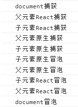

感觉这样比较合理，捕获阶段和冒泡阶段分的比较清楚。React17中改进了，**React17中事件委托的对象是挂载的容器(下面的例子中就是root div)，不是document**

```
<!DOCTYPE html>
<html lang="en">
  <head>
    <meta charset="UTF-8" />
    <meta name="viewport" content="width=device-width, initial-scale=1.0" />
    <title>Document</title>
  </head>
  <body>
    <div id="root">   
      <div id="parent">
        <div id="child">事件执行顺序</div>
      </div>
    </div>
    <script>
      let root = document.getElementById("root");
      let parent = document.getElementById("parent");
      let child = document.getElementById("child");

      //   注册React事件的事件委托
      root.addEventListener(
        "click",
        (event) => dispatchEvent(event, true),
        true
      ); // 注册一个容器节点的原生捕获监听
      root.addEventListener("click", (event) => dispatchEvent(event, false)); // 注册一个容器节点的原生冒泡监听

      function dispatchEvent(event, useCapture) {
        event = event || window.event;
        let paths = [];
        let current = event.target;
        while (current) {
          paths.push(current);
          current = current.parentNode;
        }
        // 如果是捕获阶段则模拟捕获
        if (useCapture) {
          // 模拟捕获
          for (let i = paths.length - 1; i >= 0; i--) {
            let handler = paths[i].onClickCapture;
            handler && handler();
          }
        } else {
          // 模拟冒泡
          for (let i = 0; i < paths.length; i++) {
            let handler = paths[i].onClick;
            handler && handler();
          }
        }
      }

      // 原生事件
      parent.addEventListener(
        "click",
        () => {
          console.log("父元素原生捕获");
        },
        true
      );
      parent.addEventListener(
        "click",
        () => {
          console.log("父元素原生冒泡");
        },
        false
      );
      child.addEventListener(
        "click",
        () => {
          console.log("子元素原生捕获");
        },
        true
      );
      child.addEventListener(
        "click",
        () => {
          console.log("子元素原生冒泡");
        },
        false
      );
      root.addEventListener(
        "click",
        () => {
          console.log("root原生捕获");
        },
        true
      );
      root.addEventListener(
        "click",
        () => {
          console.log("root原生冒泡");
        },
        false
      );
      parent.onClick = () => {
        console.log("父元素React冒泡");
      };
      child.onClick = () => {
        console.log("子元素React冒泡");
      };
      parent.onClickCapture = () => {
        console.log("父元素React捕获");
      };
      child.onClickCapture = () => {
        console.log("子元素React捕获");
      };
    </script>
  </body>
</html>
```

### 3 React16弊端举例分析：

看下面的例子：点击button后，本应该显示的Modal没有显示，这是因为在点击后执行了React的点击事件后，又冒泡到document上，执行了document原生事件，将show修改为了false，从而导致不显示

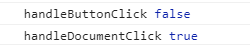

```
import React, { Component } from "react";
import ReactDOM from "react-dom";

export default class App extends Component {
  state = { show: false };
  componentDidMount() {
    document.addEventListener("click", () => {
      console.log("handleDocumentClick", this.state.show);
      this.setState({ show: false });
    });
  }
  // 在react16中 这个函数是绑定在document上的
  handleButtonClick = () => {
    this.setState({ show: true });
    console.log("handleButtonClick", this.state.show);
  };
  render() {
    return (
      <div>
        <button onClick={this.handleButtonClick}>显示</button>
        {this.state.show && (
          <div onClick={(event) => event.stopPropagation()}>Modal</div>
        )}
      </div>
    );
  }
}
ReactDOM.render(<App />, document.getElementById("root"));
```

解决办法： event是合成事件对象      event.nativeEvent是该事件对象对应的原生事件对象

1. `event.nativeEvent.stopImmediatePropagation();`  阻止向上冒泡并且阻止本级监听的执行
2. `event.nativeEvent.stopPropagation();` 阻止向上冒泡，但是不能阻止本级监听(本元素的其余监听)的执行，在上面的例子中，componentDidMount中的事件是添加到document中的，而且handleButtonClick也是添加到document上的，所以不能使用它阻止

```
handleButtonClick = () => {
    this.setState({ show: true });
    console.log("handleButtonClick", this.state.show);
    // 阻止事件冒泡，并且阻止本元素其他后续监听的执行
    event.nativeEvent.stopImmediatePropagation();
};
```

在react17中直接使用`event.stopPropagation();`,因为在react17中React事件是绑定在其外部容器上的，直接使用阻止向上冒泡的。

# 七、自定义hooks

优点：

1. 实现公用代码和逻辑的抽离，提高代码的复用性
2. 函数式组件更加简洁，开发效率更高

自定义hook是一个函数，其名称以use开头，函数内部可以调用其他的Hook

比如，下面自定义hook向后台请求数据：

```
import { useState, useEffect } from "react";

export default function useRequest(url) {
  // 查询参数
  const [options, setOptions] = useState({
    currentPage: 1,
    pageSize: 5,
  });
  //   服务器接口返回的数据
  const [data, setData] = useState({
    totalPage: 0,
    list: [],
  });

  // 发送请求获取数据
  function getData() {
    // 调用接口，返回数据
    let { currentPage, pageSize } = options;
    fetch(`${url}?currentPage=${currentPage}&pageSize=${pageSize}`)
      .then((res) => {
        return res.json();
      })
      .then((res) => {
        setData({ ...res });
      });
  }
  useEffect(getData, [options, url]); // 当组件初始渲染或者options, url状态发生变化时调用
  return [data, options, setOptions];
}
```

