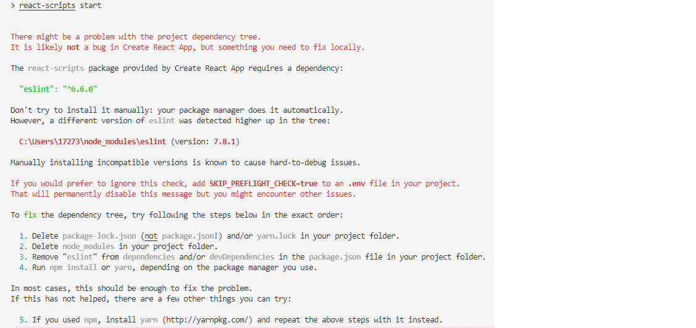
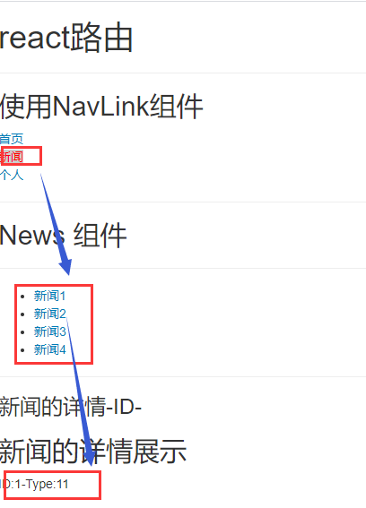

<!-- TOC -->

- [1 React 简介](#1-react-简介)
  - [1.1 JSX](#11-jsx)
    - [1.1.1 JSX 特定属性](#111-jsx-特定属性)
    - [1.1.2 jsx 指定子元素](#112-jsx-指定子元素)
    - [1.1.3 jsx 转译](#113-jsx-转译)
  - [1.2 元素渲染](#12-元素渲染)
  - [1.3 组件&Props](#13-组件props)
    - [1.3.1 函数组件](#131-函数组件)
    - [1.3.2 类组件](#132-类组件)
    - [1.3.3 渲染组件](#133-渲染组件)
    - [1.3.4 组件的组合使用](#134-组件的组合使用)
  - [1.4 State&生命周期（类组件特有）](#14-state生命周期类组件特有)
    - [1.4.1 修改 State](#141-修改-state)
    - [1.4.2 数据是单向流动的](#142-数据是单向流动的)
    - [1.4.3 组件之间是相互独立的](#143-组件之间是相互独立的)
  - [1.5 事件处理](#15-事件处理)
    - [1.5.1 给返回的 React DOM 元素添加事件处理程序](#151-给返回的-react-dom-元素添加事件处理程序)
    - [1.5.2 向事件处理程序传递参数 para](#152-向事件处理程序传递参数-para)
  - [1.6 条件渲染](#16-条件渲染)
    - [1.6.1 if 条件](#161-if-条件)
    - [1.6.2 元素变量](#162-元素变量)
    - [1.6.3 三目运算符](#163-三目运算符)
    - [1.6.4 阻止组件渲染](#164-阻止组件渲染)
  - [1.7 子组件中修改父组件的状态](#17-子组件中修改父组件的状态)
  - [1.8 列表&key](#18-列表key)
  - [1.9 表单](#19-表单)
    - [1.9.1 受控组件](#191-受控组件)
    - [1.9.2 非受控组件](#192-非受控组件)
  - [1.10 组件的生命周期](#110-组件的生命周期)
    - [1.10.1 生命周期详述](#1101-生命周期详述)
    - [1.11 虚拟 DOM 和 DOM Diffing Algorithm 的作用](#111-虚拟-dom-和-dom-diffing-algorithm-的作用)
- [2 React 应用(基于 react 脚手架)](#2-react-应用基于-react-脚手架)
  - [2.1 脚手架](#21-脚手架)
  - [2.2 使用 create-react-app 创建 react 应用](#22-使用-create-react-app-创建-react-应用)
  - [2.3 react 评论管理应用](#23-react-评论管理应用)
    - [2.3.1 拆分组件](#231-拆分组件)
    - [2.3.2 实现静态组件](#232-实现静态组件)
    - [2.3.3 实现动态组件](#233-实现动态组件)
      - [1 实现初始化数据动态显示](#1-实现初始化数据动态显示)
      - [2 动态交互——添加评论](#2-动态交互添加评论)
      - [3 动态交互—— 删除评论](#3-动态交互-删除评论)
- [3 react 中使用 ajax 请求](#3-react-中使用-ajax-请求)
  - [3.1 react 联合 ajax 实现 github 中用户名的搜索](#31-react-联合-ajax-实现-github-中用户名的搜索)
- [4 组件之间通信的两种方式](#4-组件之间通信的两种方式)
  - [4.1 方式 1：通过 props 传递](#41-方式-1通过-props-传递)
  - [4.2 方式 2：使用消息订阅(subscribe)-发布(publish)机制](#42-方式-2使用消息订阅subscribe-发布publish机制)
  - [4.3 方式 3：redux](#43-方式-3redux)
- [5 react-router](#5-react-router)
  - [5.1 SPA 的理解](#51-spa-的理解)
  - [5.2 对于路由的理解](#52-对于路由的理解)
  - [5.3 基本组件](#53-基本组件)
  - [5.4 路由参数的获取](#54-路由参数的获取)
  - [5.5 前端路由的实现](#55-前端路由的实现)
      - [5.5.1 例子 1](#551-例子-1)
      - [5.5.2 基本组件的使用](#552-基本组件的使用)
      - [5.5.3 嵌套路由](#553-嵌套路由)
  - [5.6 编程式导航的实现](#56-编程式导航的实现)
  - [5.7 钩子 hook](#57-钩子-hook)
  - [5.8 各个组件的其他属性](#58-各个组件的其他属性)

<!-- /TOC -->

# 1 React 简介

- React 是一个用于构建用户界面的 javascript 库
- React 是 React 库的入口，三种使用方法：
  - 使用 script 标签加载：使用 React 全局变量对象即可获得 React 的顶层 API
  - 使用 es6 与 npm,`import React from 'react'`
  - 使用 es5 与 npm,`var React = require('react')`
  - 在下面的应用中，我们都是使用 script 标签直接加载完成的
- React 直接操作于虚拟 DOM，不会直接修改 DOM

## 1.1 JSX

- JavaScript XML，javascript 的语法扩展
- 例如：`const element = <h1>Hello,world!</h1>`
- 不强制要求使用 JSX，但是在 Javascript 代码中将 jsx 和 ui 放在一起，在视觉上会有辅助作用

- 在 jsx 中嵌入 js 表达式
  - 需要使用大括号将 js 语句包围起来

```
const name = 'Lily';
const element = <h1>Hello,{name}</h1>
```

- **JSX 也是一个表达式**，在编译之后，JSX 会被转为普通的 javascript 函数调用

### 1.1.1 JSX 特定属性

- 使用引号，将属性值指定为字符串字面量
  - `const element = <h1 index='0'>Hello,{name}</h1>`
- 也可以使用大括号(js 表达式)指定属性值
  - `const element = <h1 tabIndex={index_x}>Hello,{name}</h1>`

### 1.1.2 jsx 指定子元素

- 无内容标签，使用/>实现闭合
  - `const element = `
- 包含很多子元素的标签，使用小括号包围起来，并且只能有一个根元素 div 或者其他

```
const element = (
  <div>
    <h1>Hello!</h1>
    <h2>Good to see you here.</h2>
  </div>
);
```

### 1.1.3 jsx 转译

- Babel 会将 jsx 转译为一个名为`React.createElement()`函数调用,创建并返回指定类型的新 React 元素
- 比如下面的 jsx 代码：

```
const element = (
  <h1 className="greeting">
    Hello, world!
  </h1>
);
```

- 转译后就是

```
const element = React.createElement(
  'h1',
  {className:'greeting'},
  'Hello,World!'
);
```

## 1.2 元素渲染

- ReactDOM 包提供了很多的方法，比如 render()
  - 使用 script 标签加载：使用 ReactDOM 全局变量对象即可获得 ReactDOM 的顶层 API
  - 使用 es6 与 npm,`import ReactDOM from 'react-dom'`
  - 使用 es5 与 npm,`var ReactDOM = require('react-dom')`
- 元素渲染使用的是`ReactDOM.render(组件,container)`,在 container 中渲染一个 React 组件
- 元素是构成 React 的最小砖块。元素描述了你在屏幕上想看到的内容
- React 创建的元素开销很小，和浏览器的 DOM 元素不同，React DOM 通过更新 DOM 使得其与 React 元素保持一致
- 通过 React 构建的应用通常只能包含一个根 DOM 节点

```
const element = <h1>Hello, world</h1>;
ReactDOM.render(element, document.getElementById('root'));
```

- React 元素是不可变对象，**一旦被创建，就不能更改它的子元素或者属性**，想要更新 UI 就是创建一个全新的元素，并且插入 render
- **React 只更新需要更新的部分**,会比较元素及其子元素与它们之前的状态，从而只进行必要的更新

## 1.3 组件&Props

- 组件允许我们将函数拆分为独立可复用的代码片段，并对每个片段进行独立构思
- 组件接收参数 props,返回用于描述页面展示内容的 React 元素
- 组件名必须大写首字母,**React 会自动将以小写字母开头的组件视为原生 DOM 标签**

### 1.3.1 函数组件

- 编写 javascript 函数，接收**唯一带有数据的 props 对象并且返回 React 元素**

```
function Welcome(props) {
  return <h1>Hello, {props.name}</h1>;
}
```

### 1.3.2 类组件

```
class Welcome extends React.Component {
    render(){
        return <h1>Hello,{this.props.name}</h1>;
    }
}
```

### 1.3.3 渲染组件

- 之前遇到 React 元素都是 DOM 标签，其实 React 元素还可以是用户自定义的组件
- **当 React 元素为自定义组件时，会将 jsx 所接收的属性以及子组件转换为单个对象"props"传递给组件**

```
function Welcome(props) {
  return <h1>Hello, {props.name}</h1>;
}

ReactDOM.render(<Welcome name="Sara"/>, document.getElementById('root'));
```

- 在这个例子中，执行顺序如下：
  - 我们 ReactDOM.render 函数，并且将<Welcome name="Sara"/>传入
  - React 调用 Welcome 组件，并且将{name:'Sara'}作为 props 传入。
  - Welcome 组件将`<h1>Hello,Sara</h1>`元素作为返回值
  - React DOM 将 DOM 高速地更新为`<h1>Hello, Sara</h1>`，将该元素插入到根元素中

### 1.3.4 组件的组合使用

- 这里面需要注意两个点：
  - （1）数据定义在哪个组件中取决于哪些组件需要，如果只有某个组件需要，则将其放在该组件中即可，如果某些组件均需要，则将其放在其共同的父组件中
  - （2）**子组件中不能直接改变父组件的状态**，状态在哪个组件，更新状态的行为都应该定义在哪个组件中，如果需要在子组件中改变父组件的状态，则可以将父组件中定义的更新状态的方法传递给子组件，然后再在子组件中定义一个方法调用所传递的方法，即可实现该功能
- 例子：[App](3.component/07_components_composing/01.html)
- 上面例子实现的功能：
  - 在文本框中输入内容，点击 add,即可添加到下面的 list 中
- 以上面为例，组件化编写的流程：
  - 1 拆分组件
  - 2 实现静态组件
  - 3 实现动态组件
    - 实现初始化数据动态显示
    - 实现交互功能

## 1.4 State&生命周期（类组件特有）

- 添加 state，私有的，完全受控于当前组件

```
// 1 创建组件
class Clock extends React.Component {
    // 将props传递到父类的构造函数中
  constructor(props) {
    super(props);
    // 初始化state的值,组件的私有属性
    this.state = {date: new Date()};
  }

  render() {
    return (
      <div>
        <h1>Hello, world!</h1>
        <h2>It is {this.state.date.toLocaleTimeString()}.</h2>
      </div>
    );
  }
}
// 2 渲染组件
ReactDOM.render(
    // 在这里如果给Clock组件添加属性，则会打包成一个对象props
  <Clock />,
  document.getElementById('root')
);
```

### 1.4.1 修改 State

- **只能使用`setState()`修改**

```
this.setState({date:new Date()});
// 错误  this.state.date = new Date();
```

### 1.4.2 数据是单向流动的

- state 是局部封装的，受控于当前组件，所以其他组件均不能访问该组件的 state,均无法知道该组件是有状态组件还是无状态组件
- 组件可以将它的 state 作为 props 传递给它的子组件，例如

```
<h1>It is {this.state.date.toLocaleTimeString()}.</h2>
```

### 1.4.3 组件之间是相互独立的

## 1.5 事件处理

- 事件命名小驼峰，**首单词首字母小写，其余单词首字母大写**
- jsx 语法要求传入一个函数(js)作为事件处理程序

```
<button onClick={myClick}>
    点击一下
</button>

传统的html:所有单词首字母小写，后面对应字符串
<button onclick="myClick()">
    点击一下
</button>
```

### 1.5.1 给返回的 React DOM 元素添加事件处理程序

- 一般将其作为组件类的一个新增函数定义
- 需要注意的是：**对于类中新增加的函数 this 默认指向 undefined,所以需要使用 bind 函数绑定**

```
// 1 建立组件
class Toggle extends React.Component{
    constructor(props){
        super(props);
        // 初始化state
        this.state = {
            isButtonON : false
        };
        // 绑定handleClick函数的this指向组件Toogle
        this.handleClick = this.handleClick.bind(this);
    }
    handleClick(){
        // 获取state
        const isButtonON = !this.state.isButtonON;
        // 更新state
        this.setState({isButtonON})
    }
    render(){
        // 返回React DOM元素
        return (  //小括号不能少，ON和OFF是字符串，所以要加引号
            <button onClick={this.handleClick}>{this.state.isButtonON ? 'ON' : 'OFF'}</button>
        )
    }
}
// 2 渲染
ReactDOM.render(<Toggle />, document.getElementById('root'));
```

- 还可以使用箭头函数，不需要再特意绑定,此语法确保了 this 倍锁定为 Toggle

```
<button onClick={()=>this.handleClick()}>{this.state.isButtonON ? 'ON' : 'OFF'}</button>
```

### 1.5.2 向事件处理程序传递参数 para

- 使用 bind 函数，不需要显式传递事件对象 e,事件对象跟在 para 之后，可以隐式传递

```
<button onClick={this.handleClick.bind(this,para)}>ON</button>
```

- 使用箭头函数,需要显式传递事件对象 e

```
<button onClick={(e)=>this.handleClick(para,e)}>ON</button>
```

## 1.6 条件渲染

- 在 React 中，可以创建不同的组件来封装各种行为，然后根据应用的不同状态，可以只渲染对应状态下的部分内容
- 条件渲染，使用 if 或者条件运算符去创建元素来表现当前的状态，然后让 React 根据它们更新 UI

### 1.6.1 if 条件

- 例如下面的两个组件：

```
function UserGreeting(props){
    return <h1>Welcone back!</h1>
}

function GuestGreeting(props){
    return <h1>Please sign up.</h1>
}
```

- 再创建一个 Greeting 组件，它会根据用户是否登录来决定显示上面的哪一个组件

```
function Greeting(props){
    const isLoggedIn = props.isLoggedIn;
    // 判断
    if(isLoggedIn){
        return <UserGreeting />;
    }else{
        return <GuestGreeting />;
    }
}
ReactDOM.render(<Greeting isLoggedIn={false} />, document.getElementBuId('root'));
```

### 1.6.2 元素变量

- 使用元素变量存储元素，从而有条件地渲染一部分组件
- 例如，下面的两个组件分别返回一个按钮，表示登录和注销

```
function LoginButton(props){
    return(
        <button onClick={props.onClick}>login</button>;
    )
}
function LogoutButton(props){
    return(
        <button onClick={props.onClick}>logout</button>;
    )
}
```

- 接下来创建一个名为 LoginControl 的组件，通过判断当前的状态变量 isLoggedIn 判断当前应该渲染哪个组件

```
class LoginControl extends React.Component{
    constructor(props){
        super(props);

        this.state = {
            isLoggedIn:false;
        }
    }

    handleLoginButton(){
        this.setState({isLoggedin:false});
    }
    handleLoginButton(){
        this.setState({isLoggedin:true});
    }
    render(){
        let button;
        const isLoggedIn = this.state.isLoggedIn;
        if(isLoggedIn){
            button = <LoginButton onClick={this.handleLogoutClick}/>;
        }else{
            return <loginoutButton onClick={this.handleLoginClick}/>;
        }

        return(
            <div>
                <Greeting isLoggedIn={isLoggedIn} />{button}
        );
    }
}

//
ReactDOM.render(<LoginControl />, document.getElelmentById('root'));
```

- 此段代码执行顺序：[执行顺序](./img/01.png)

### 1.6.3 三目运算符

- a ? result1 : result2;

### 1.6.4 阻止组件渲染

- return null

## 1.7 子组件中修改父组件的状态

- 首先在父组件中自定义函数 1 修改状态
- 将该函数 1 传递给子组件，则该函数作为 props 的一个属性传递
- 在子组件中创建函数 2 调用该 props 中的函数
- 在子组件的返回标签中使用函数 2 作为事件
- [例子](3.component/07_components_composing/01.html);

## 1.8 列表&key

- 在一个组件中渲染列表
- 必须给每一个 li 添加一个 key 属性，否则会报出警告` a key should be provided for list items`

```
function NumberList(props) {
  const numbers = props.numbers;
  const listItems = numbers.map((number,index) =><li key={index}>{number}</li>);
  return (
    <ul>{listItems}</ul>
  );
}

const numbers = [1, 2, 3, 4, 5];
ReactDOM.render(<NumberList numbers={numbers} />,
  document.getElementById('root')
);
```

- key 帮助 React 识别哪些元素改变了，比如被添加或删除。因此你应当给数组中的每一个元素赋予一个确定的标识
- **一个元素的 key 最好是这个元素在列表中拥有的一个独一无二的字符串**。通常，我们使用数据中的 id 来作为元素的 key。
- 当元素没有确定 id 的时候，可以使用元素索引 index 作为 key
- key 只是在兄弟节点之间必须唯一，不需要全局唯一，生成两个数组时可以使用相同的 key 值
- key 会传递信息给 React ，但不会传递给你的组件,也就是说不能读取

## 1.9 表单

- 常规的 html 表单,具有默认行为，用户提交表单后浏览到新页面

```
<form>
  <label>
    名字:
    <input type="text" name="name" />
  </label>
  <input type="submit" value="提交" />
</form>
```

### 1.9.1 受控组件

- 直接将 value 设置为组件的状态值，通过输入的值改变状态值，从而改变标签的 value

```
class LoginForm extends React.Component{
  constructor(props){
    super(props);
    // 1 初始化状态值，如果此时将input的value设置为组件的状态，先使用空串初始化
    this.state = {
      name: ''
    }
    this.handleSubmit = this.handleSubmit.bind(this);
    this.handleChange = this.handleChange.bind(this);
  }
  handleSubmit(e){
    // 打印
    alert('提交的名字为：'+this.state.name);
    // 阻止默认行为（提交表单）
    e.preventDefault();
  }
  handleChange(e){
    // 3 获取输入框的值
    const input_value = e.target.value;
    // 4 更新状态值，从而更新了value   如果input标签失去焦点，则更新此时的状态值为此时input中的输入值
    this.SetState({value: input_value});
  }
  render(){
    // 2 将input的value直接设定为状态值
    return(
      <form onSubmit = {this.handleSubmit}>
        用户名：<input type="text" value = {this.state.name} onChange = {handleChange}/>
        <input type='submit' value='提交' />
      </form>
    )
  }
}
```

- 上面的程序中，我们直接将 value 设置为了状态值，则只有通过改变状态值才可以改变 value,否则 value 将始终显示为初始化的状态值
- onChange 是在每次失去焦点后执行的，所以每次输入完名字后，点击提交按钮时就会执行，从而更新状态值，onSubmit 是在每次提交表单时执行的，从而打印并且阻止默认行为

### 1.9.2 非受控组件

- 直接获取 input 的当前输入 value,使用 onChange 修改 value 即可
- 为 input 标签添加属性`ref={input => this.nameInput = input}`,然后需要时即可`alert('提交的名字为：'+this.nameInput.value);`获取。

```
class LoginForm extends React.Component{
  constructor(props){
    super(props);
    this.handleSubmit = this.handleSubmit.bind(this);
  }
  handleSubmit(e){
    // 打印
    alert('提交的名字为：'+this.nameInput.value);
    // 阻止默认行为
    e.preventDefault();
  }
  render(){
    // 2 将input的value直接设定为状态值
    return(
      <form onSubmit = {this.handleSubmit}>
        用户名：<input type="text" ref={input => this.nameInput = input} />
        <input type='submit' value='提交' />
      </form>
    )
  }
}
```

- 类似的 select 标签、textarea 标签均可以作为受控组件使用
- 文件 input 标签，因为它的 value 是只读的，所以它是一个非受控标签

## 1.10 组件的生命周期

- React 组件对象从创建到死亡会经历特定的生命周期阶段
- 每个 React 组件对象均会包含一系列的勾子函数(生命周期回调函数),在生命周期特定时刻回调
- 所以我们在定义组件时就可以重写特定的生命周期回调函数，做特定的工作

### 1.10.1 生命周期详述

- 详细地：https://react.docschina.org/docs/react-component.html
- 组件的三个生命周期状态：
  - Mount:插入真实的 DOM
  - Update:被重新渲染
  - Unmount:被移除真实的 DOM
- React 为每个状态均提供了勾子函数
  - componentWillMount():
  - componentDidMount():
  - componentWillUpdate():
  - componentDidUpdate():
  - componentWillUnMount():
- 生命周期流程：

  - 第一次初始化渲染显示：ReactDOM.render()
    - constructor():创建对象初始化 state 在整个生命周期中就执行一次
    - componentWillMount():将要插入虚拟 DOM 的回调函数 在整个生命周期中就执行一次
    - render():插入虚拟 DOM 的回调函数
    - componentDidMount():组件插入 DOM 树中后立即被调用的回调函数 在整个生命周期中就执行一次
  - 每次更新 state:this.setState()
    - componentWillUpdate():将要更新 DOM 的回调函数
    - render():更新 DOM 的回调函数
    - componentDidUpdate():DOM 树更新完成后立即调用的回调函数
  - 移除组件：ReactDOM.unmountComponentAtNode(containerDom)
    - componentWillUnmount():组件被卸载或者移除之前直接调用的回调函数，如果在移除前我们需要进行任何操作就可以重写这个函数

- 例如：[例子](3.component/09_component_lifecycle/test.html)
  - 页面加载后，第一行内容逐渐消失，然后又出现，然后又逐渐消失....
  - 点击按钮后，所有内容全部消失
- 效果：

```
class Life extends React.Component{

   constructor(props){
     super(props);
     this.state = {
       // 设置标签的透明度属性，从1->0变化
       opacity: 1
     }
     this.distroyComponent = this.distroyComponent.bind(this);
   }

   // 在第一次虚拟DOM成功挂载后回调函数
   componentDidMount(){
     this.intervalId = setInterval(function(){
       // 定时器的this指向windows,所以需要使用bind绑定
       // 另一种方法：回调函数使用箭头函数，这样会自动将this指向组件
        console.log('定时器执行了...')
        let opacity = this.state.opacity;
        opacity -= 0.1;
        if(opacity<=0){
          opacity = 1;
        }
        this.setState({opacity});
     }.bind(this), 200);
  }

  // 点击按钮后，组件消除
   distroyComponent(){
     // 调用组件消除函数
     ReactDOM.unmountComponentAtNode(document.getElementById('example'));
   }

   // 在组件消除之前会自动调用的函数
   componentWillUnmount(){
     // 清理定时器
     clearInterval(this.intervalId);
   }

   render(){
     const {opacity} = this.state;
    //  {{opacity}}:外层的大括号表示js代码，内层的大括号表示对象，'opacity'表示css属性名
     return (
       <div>
        <h2 style={{opacity:opacity}}>{this.props.msg}</h2>
        <button onClick={this.distroyComponent}>不活了</button>
       </div>
     )
   }
  }
  ReactDOM.render(<Life msg='React太难了!' />, document.getElementById('example'));
```

### 1.11 虚拟 DOM 和 DOM Diffing Algorithm 的作用

- 首先初始化显示界面(产生虚拟 DOM，渲染真实 DOM，界面显示)
- 然后更新界面(setState 更新状态->重建虚拟 DOM 树->使用 DOM 差分算法比较新、旧 DOM 树的差异->在真实 DOM 中更新两者之间的差异->界面重绘)
- ReactDOM.render() 会控制你传入容器节点里的内容。当首次调用时，容器节点里的所有 DOM 元素都会被替换，后续的调用则会使用 React 的 DOM 差分算法（DOM diffing algorithm）进行高效的更新。
- 

# 2 React 应用(基于 react 脚手架)

## 2.1 脚手架

- xxx 脚手架：用来帮助程序员快速创建一个基于 xxx 库的模板项目
  - 包含了所有需要的配置
  - 指定了所有的依赖
  - 可以直接安装/编译/运行一个简单效果
- 使用脚手架开发项目的特点：模块化，组件化，工程化

## 2.2 使用 create-react-app 创建 react 应用

- **react 提供了一个用于创建 react 项目的脚手架库：create-react-app**
- 项目的整体技术架构为：react+webpack+es6+eslint
- create-react-app 官方文档：https://create-react-app.bootcss.com/
- 创建项目并且启动

```
  第一步：打开命令行，执行第一句全局安装create-react-app包(只需要执行一次)
    npm install -g create-react-app
  第二步：在命令行中打开指定的文件夹，在该文件夹下创建一个新的项目(会下载相应的包)
    create-react-app 项目名
    注意:在创建项目时会下载很多依赖的包，而这些包的源都在外网，所以速度很慢，可以将其镜像修改到淘宝即可加快速度：
      npm config set registry https://registry.npm.taobao.org
  第三步：打开项目文件夹
    cd 项目名
  第四步：启动项目
    npm start
```

- 执行下面一句可以查看 npm 的安装位置：我的在 C:\Users\17273\AppData\Roaming\npm\node_modules
  `npm root -g `
- react 脚手架项目结构
  - 这个结构在项目创建后会自动生成，不需要管

```
ReactNews
  - node_modules      第三方依赖模块文件夹
  - public
    - index.html        主页面
  - scripts
      - build.js        build打包引用配置
      - start.js        start运行引用配置
  - src               源码文件夹
      - components      react组件
      - index.js        应用入口js
  - .gitignore        git版本管制忽略的位置
  - package.json      应用包配置文件
  - README.md         应用描述说明的readme文件
```

## 2.3 react 评论管理应用

- 实现的功能如下：
- 
- 总的效果：
  - 左边界面输入用户名和评论，点击提交按钮即可添加到右边的界面
  - 右边界面点击删除，即可删除其相对应的某一条评论
  - 右边评论全部删除，则显示`暂无评论，点击左侧添加评论`
- 根据组件化编写的流程：
  - 1 拆分组件
  - 2 实现静态组件
  - 3 实现动态组件
    - 实现初始化数据动态显示
    - 实现交互功能

### 2.3.1 拆分组件


- 四个组件：

```
app
  - comment-add
  - comment-list
    - 多个comment-item
```

### 2.3.2 实现静态组件


- 对于每一个组建中用到的标签的 css 属性，在该组件所在的文件夹中再定义一个 css 文件，并且在组件中引入，这样才能实现组件渲染后的页面样式

### 2.3.3 实现动态组件

#### 1 实现初始化数据动态显示

- 首先我们把这个页面当成是一个静态页面，动态操作(提交和删除)先不实现，建立一个 html 和 css 将这个静态页面实现
- 然后实现各个组件
  - 直接将整个静态标签的排布贴到 render()的 return 中，将其中描述 add 和 list 的部分用对应的组件替换即可
  - 注意：**html 标签中的 class 属性需要修改为 className,style="display:none"需要修改为 style={{display:'none'}}**
    

#### 2 动态交互——添加评论


- 需要注意的是**子组件内是不能直接修改父组件的状态的**,子组件要修改父组件的状态，一定是在父组件中定义修改组件状态的方法 1，将其传递到子组件中，然后再在子组件中添加方法 2，在方法 2 中调用方法 1

#### 3 动态交互—— 删除评论


- **变量的使用**

```
// 定义一个变量，可以叫display或者其他的名字
const display = (comments.length === 0 ? 'block' : 'none');

// {{display:display}}前一个display指代css的规则，后一个display指代上面定义的变量display
<h2 style={{display: display}}>暂无评论，点击左侧添加评论！！！</h2>
```

# 3 react 中使用 ajax 请求

- 1 React 本身只关注于界面, 并不包含发送 ajax 请求的代码
- 2 前端应用需要通过 ajax 请求与后台进行交互(json 数据)
- 如果需要发送加载页面时就发送请求，则直接在`componentDidMount():组件插入DOM树中后立即被调用的回调函数`时直接发送请求即可，即组件第一次被插入 DOM 树后就发送请求，一般这个操作只执行一次
- axios 发送请求的方式：

```
axios.get(url,{其他配置}).then(
  response => {

  }).catch(error => {
    // 抓取错误，显示错误信息
    console.log(error.message);
  });
```

## 3.1 react 联合 ajax 实现 github 中用户名的搜索

- 搜索后需要显示具有搜索关键词的用户的头像和用户名全称
- 首先拆分组件，分成三个组件
  - app
  - search
  - user-list
- 初始化状态值
  - 由显示的结果来看，user-list 界面总共有 4 个状态：
    - 1 刚打开界面（即虚拟 DOM 插入 DOM 树)之后的一个状态`firstView=true`，显示一行文字，提示：请输入关键词进行搜索
    - 2 输入关键词之后，点击搜索按钮，首先会显示：正在 loading 中...，即将最初的状态`firstView=true`修改为 loading 状态`firstView=false,loading=true`，此时应该正在发送请求
    - 3 得到响应报文之后，直接获取报文中的相关用户信息，将正在 Loading 中...切换为显示响应的结果,`loading=false,users=users`
    - 4 如果请求出现问题，则将正在 loading 中状态修改为 error,显示错误的信息，`loading=false,errorMag=error.message`
- 动态化显示
  - 分析：我们需要的是修改 search 框中的内容导致 user-list 中的内容发生改变，即定义一个状态值 searchName，并且该状态值同时可以被这两个兄弟组件使用，则 searchName 应该定义在父组件 app 中
  - search 框中输入需要去修改 searchName，则需要在父组件 app 中定义一个改变状态值 searchName 的方法，然后在子组件中调用该方法实现状态值 searchName 的修改。 因为是点击提交按钮之后发送请求，所以在子组件中给 button 定义一个函数去调用父组件的方法修改父组件的状态值
  - 在 user-list 中需要根据 searchName 的值去发送请求（searchName 相当于请求的关键字，在 url 中需要使用），则需要将状态值 searchName 传递给 user-list; 然后有一个函数，`componentWillReceiveProps(newProps)`,当组件传入了新的属性值时会自动调用，则正好一旦 app 的状态值 searchNAme 发生变化，则就会修改 user-list 传入的值，从而调用该方法
    - 在该方法中首先需要修改此时的本组件状态值，使得从初始状态切换到 loading 状态，在发送请求后得到响应报文时再次修改状态值，从 loading 状态切换到显示 User 信息的状态
- 具体的设置可以参见[react 应用 2：github 用户名搜索](./5.ajax/user-search-github/)

- 注意：在 npm start 之后出现了这样的问题：react-script 这个库不支持太高版本的 eslint
  
- 解决办法 1：在此项目文件夹下新建一个文件`.env`,添加内容`SKIP_PREFLIGHT_CHECK=true`
- 解决办法 2：既然不支持高版本的 eslint,则安装它所推荐的 6.6.0 版本即可

```
npm uninstall --save eslint   // 先卸载原来的eslint
npm i --save-dev eslint@6.6.0    // 再安装6.6.0版本的eslint
```

# 4 组件之间通信的两种方式

## 4.1 方式 1：通过 props 传递

```
共同的数据放在父组件上，特有的数据放在自己的组件内部
通过props可以传递一般数据和函数数据，只能一层一层传递
  一般数据：父组件传递数据给子组件，子组件读取数据
  函数数据：子组件传递数据给父组件，父组件调用函数
```

## 4.2 方式 2：使用消息订阅(subscribe)-发布(publish)机制

- 一般 github 上都会存在相应的包及其使用办法：https://github.com/mroderick/PubSubJS
- 可以用于兄弟组件之间传递值

```
需要使用工具库：PubSubJS
首先需要下载该库：npm install pubsub-js --save
使用方法：
    import PubSub from 'pubsub-js'  //引入
    // 发布消息，第一个参数指定所发布的消息的名称，第二个参数是所传递的参数
    PubSub.publish('search',searchName);
    // 订阅消息：第一个参数是所订阅的消息的名称，第二个参数是一个回调函数，msg是消息名称，searchName是发布消息时传入的参数
    PubSub.subscribe('search',(msg,searchName) => {})
```

- （1）此方法可以**用于兄弟之间传递参数**，不再需要借助父组件，只需要指定消息的名称即可
  - 例子参见：[github 人员搜索](./6.pubsubjs/pubsub-use/)
- （2）此方法可以**用于多层组件之间传递参数**
  - 例如，在 react 评论管理的那个应用中，在删除评论时，由于是 item 直接对于祖父元素的 state 进行改变，所以需要先将删除操作传递给其父元素 user-list,然后再传递给 user-item,这样太麻烦啦，所以可以直接使用发布订阅处理，这样就省去了中间传递处理，具体参见:[react 评论管理](./4.react 脚手架/react-comment/src pubsubjs/)

## 4.3 方式 3：redux

- 后面专门讲

# 5 react-router

- react 的一个插件库，专门用于实现一个 SPA 应用，所有基于 react 的项目基本都会使用
- 它是第三方为 react 开发单页面应用开发出来的一个库

## 5.1 SPA 的理解

- SPA(Single Page Web Application),单页面 web 应用

  - 单页面的用户体验类似于原生的 app,原生的 app 就是存在于手机里面的那些 app,一般都存在底部导航栏，在做切换的时候，页面的很多内容都会被复用。

- 整个应用只有一个完整的页面

  - 但是所有的功能并不是一股脑的全部显示出来，具体什么时候什么操作显示什么内容取决于历史
    - 锚点 hash window.onhashchange(一旦 hash 值变化就会触发该函数)
    - html5 的 history
    - ajax 也可以实现单页面应用，但是它没有历史记录
    - iframe 框架集 但是操作不方便

- 点击页面中的链接不会刷新页面，本身也不会向服务器发送请求
- 当点击**路由链接**(也就是单页链接)时, 只会做页面的局部更新
- 数据都需要通过 ajax 请求获取, 并在前端异步展现

## 5.2 对于路由的理解

- 什么是路由 router

```
  一个路由就是一个映射关系(key:value)
  key为路由路径(path), value可能是function/component(回调函数)
```

- 路由分类

```
  后台路由: node服务器端路由, value是function, 用来处理客户端提交的请求并返回一个响应数据
  前台路由: 浏览器端路由, value是component, 当请求的是路由path时, 浏览器端不发送http请求, 但界面会更新显示对应的组件
```

- 后台路由

```
  注册路由: router.get(path, function(req, res))
  当node接收到一个请求时, 根据请求路径找到匹配的路由, 调用路由中的函数来处理请求, 返回响应数据
```

- 前端路由

```
  注册路由: <Route path="/about" component={About}>
  当浏览器的hash变为#about时, 当前路由组件就会变为About组件
```

## 5.3 基本组件

- 具体的组件使用方法参见 API 部分：https://reactrouter.com/web/api/Hooks/usehistory

- react-router-dom 提供了两个路由器组件：<BrowserRouter> and <HashRouter>

```
  HashRouter提供的地址都具备一个#，hash值指的就是#及其后面的内容
  所有的组件都必须放在路由器组件中：
      ReactDOM.render(
        <BrowserRouter>
          <App />
        </BrowserRouter>,
        document.getElementById("root")
      );
```

- 路由路径匹配器 Route Matchers:<Switch>和<Route>

```
  在遇到<Switch>组件的渲染时：<Switch>组件会在它的子组件<Route>中寻找第一个url与当前url匹配的<Route>元素，一旦找到第一个匹配的，则不会再去寻找其他的
  这就要求我们将url更加具体的<Route>放在前面，否则会导致匹配不到目标<Route>
  如果没找到匹配的路由路径，则该部分不渲染任何组件

      <Switch>
        {/*  路径/一定要放在其他的路径之后，否则会导致所有的路径均匹配到/  */}
        <Route path="/about"><About /></Route>

        <Route path="/contact/:id"><Contact /></Route>
        <Route path="/contact"><AllContacts /></Route>

        {/* path='/'会匹配beginning of the URL */}
        <Route path="/"><Home /></Route>
      </Switch>

  不加Switch:
      <div>
        <Route path="/contact/:id"><Contact /></Route>
        <Route path="/contact"><AllContacts /></Route>
        <Route path="/"><Home /></Route>
      </div>
      如果当前地址为/,则会直接显示Home组件
      如果当前地址为/contact,则会直接显示AllContacts组件
```

- 导航组件：<Link>、<NavLink>、<Redirect>

```
这些组件会在html页面中渲染出一个超链接a标签
  Link组件：to属性指定要跳转到的页面
      <Link to="/">Home</Link>
      // <a href="/">Home</a>
  NavLink组件可以定义组件被选中时的样式，在与当前 URL 匹配时为其呈现元素添加样式属性。对应到html界面的超链接a元素，则就是a在选中时显示的样式
      下面会渲染得到一个超链接，并且具备一个类hurry,我们可以定义该类的样式css文件，引入确定该选项被选中时的样式
      <NavLink to="/react" activeClassName="hurray">
        React
      </NavLink>
      当url是/react时，渲染得到：<a href="/react" className="hurray">React</a>
  Redirect组件可以重定向，如果需要强制性导航，可以使用
      <Redirect to="/login" />
```

## 5.4 路由参数的获取

- 路由参数：在 Route 组件中的地址中自定义的参数

```
在News组件中访问/news/details/:news_id/:type这个地址时，会显示Detail组件，其中news_id和type都是路由参数
<Route path='/news/details/:news_id/:type' component={Detail} />
```

- 获取方法：

```
方法1：这些路由参数会直接加载到Detail组件的this.props.match.params中，多个参数会形成一个对象
  在Detail组件中使用this.props.match.params即可获取该对象
  <p>ID:{this.props.match.params.news_id}-Type:{this.props.match.params.type}</p>

方法2：使用钩子：useParams()方法
  在Detail组件中使用let params = userParams()即可获取
```

## 5.5 前端路由的实现

- **使用 react-rooter**:

```
- 创建一个新的react项目
- react-router包(-dom表示下载web版本)：`npm install react-router-dom --save`
- react-router提供了两个路由的容器：
    - BrowserRouter 和 HashRouter
      - 路由(容)器，所有的路由操作都需要定义在该组件中
      - 开发阶段建议使用hashRouter,可以很容易看出页面的跳转
      - 上线之后使用BroswerRouter,地址更加利于seo
- Route组件：需要使用该组件定义路径和显示组件的对应关系，所有的路由组件均放在路由器中
- Link组件：就是一个a链接，实现声明式的跳转
```

#### 5.5.1 例子 1

- 例子参见：[路由组件基本知识点](./7.react-router/react-router/src-路由基本概念/)
- 首先需要下载 react-router 包(-dom 表示下载 web 版本)：`npm install react-router-dom --save`
- 注意：路由组件中可以包含非路由组件，一般在项目中将两者分开放置

```
// 首先引入相关的组件和包
import React from "react";
import {
  HashRouter as Router,
  Route,
  NavLink
} from "react-router-dom";

// 引入其他的组件及样式文件
import Home from './components/home/home'
import News from './components/news/news'
import Profile from './components/profile/profile'
import MenuLink from './components/Menulink/index'
import './css/index.css'


export default class App extends React.Component{
    render(){
        return (
            <Router>
            {/* 规定：必须放置在路由器中 */}
                <div>
                    <h1>react路由</h1>

                    {/* 声明式路由 */}
                    {/* link标签的地址与Route标签的地址相对应，这样就可以保证点击Link之后路由显示响应的组件 */}
                    {/* <Link to='/home'>首页</Link><br/>
                    <Link to='/news'>新闻</Link><br/>
                    <Link to='/profile'>个人</Link><br/> */}


                    <hr />
                    {/* 如果需要高亮某个链接，则就需要使用Navlink
                        activeClassName是react-router-dom提供的，属性的名称(即类名)自己定义，
                        样式需要自己去写，写一个css样式然后引入到当前文件夹下即可
                     */}

                     <h2>使用NavLink组件</h2>
                    <NavLink to='/home' activeClassName='selected'>首页</NavLink><br/>
                    <NavLink to='/news' activeClassName='selected'>新闻</NavLink><br/>
                    <NavLink to='/profile' activeClassName='selected'>个人</NavLink><br/>
                    {/* 使用Route定义映射关系，即路由表，哪一个路径该显示哪一个组件 */}
                    {/* Route有两个属性：path表示要跳转的路径， component表示跳转以后要显示的组件 */}
                    <Route path='/home' component={Home} />
                    <Route path='/news' component={News} />
                    <Route path='/profile' component={Profile} />

                    <hr/>
                    {/* children：无论url的地址里面的hash是否和hash匹配得上，Children组件都会被渲染 */}
                    {/* 特性2：children函数式组件接收一个参数props, 如果匹配成功，则props里面的
                    match属性就是一个对象，对象里面包含了地址相关的信息
                    反之，值为null,但是组件仍会被渲染 */}

                    <Route path='/about' children={ (props) => {
                        console.log(props)
                        return (
                            <div>
                                <h2>Children组件</h2>
                            </div>
                        )
                    } } />

                    <hr />
                     <h2>使用自己封装的MenuLink导航</h2>
                     <MenuLink to='/home' label='首页' /><br />
                     <MenuLink to='/news' label='新闻' /><br />
                     <MenuLink to='/profile' label='个人' /><br />

                     <hr />
                     <h2>render()函数式组件的渲染</h2>
                     <Route path='/renders' render={ (props) => {
                        console.log('render',props)
                        /*
                        函数式组件和类组件均包含props属性
                        打印的props包含：
                            history主要做函数式导航
                            location主要代表的是地址信息
                            match 路由传参可以用
                        */
                        return (
                            <div>
                                <h2>render函数组件的渲染</h2>
                            </div>
                        )
                    } } />
                </div>
            </Router>
        )
    }
}
```

#### 5.5.2 基本组件的使用

- 实现的效果：.gif>)
- 首先需要下载 react-router 包(-dom 表示下载 web 版本)：`npm install react-router-dom --save`
- 注意：路由组件中可以包含非路由组件，一般在项目中将两者分开放置

#### 5.5.3 嵌套路由

- 这部分参见：[嵌套路由](./7.react-router/react-router/src-路由嵌套/)
- 实现的效果：

- app 组件:3 个 Link 链接显示新的组件

```
export default class App extends React.Component{
    render(){
        return (
            <Router>
            {/* 规定：必须放置在路由器中 */}
                <div>
                    <h1>react路由</h1>

                    <hr />
                    {/* 2 方法2：使用NavLink组件替换Link组件，当选中某项时实现该选项的高亮
                    */}

                     <h2>使用NavLink组件</h2>
                    <NavLink to='/home' activeClassName='selected'>首页</NavLink><br/>
                    <NavLink to='/news' activeClassName='selected'>新闻</NavLink><br/>
                    <NavLink to='/profile' activeClassName='selected'>个人</NavLink><br/>

                    <hr/>

                    {/* 1 使用Route定义映射关系，即路由表，哪一个路径该显示哪一个组件 */}
                    {/* Route有两个属性：path表示要跳转的路径， component表示跳转以后要显示的组件 */}
                    <Route path='/home' component={Home} />
                    <Route path='/news' component={News} />
                    <Route path='/profile' component={Profile} />
                </div>
            </Router>
        )
    }
}
```

- news 组件:链接到一个新的组件 Detail

```
export default class News extends Component{

    render(){
        return(
            <div>
                <h2>News 组件</h2>
                <hr/>

                <ul>
                    <li><Link to='/news/details/1/11'>新闻1</Link></li>
                    <li><Link to='/news/details/2/22'>新闻2</Link></li>
                    <li><Link to='/news/details/3/33'>新闻3</Link></li>
                    <li><Link to='/news/details/4/44'>新闻4</Link></li>
                </ul>
                <hr/>
                <h3>新闻的详情-ID-</h3>
                {/* news_id和type会自动添加到组件Detail的match中 */}
                <Route path='/news/details/:news_id/:type' component={Detail} />
                <hr />
            </div>
        )
    }
}
```

- Detail 组件

```
import React from 'react'
export default class Detail extends React.Component{
    render(){
        return (
            <div>
                <h2>新闻的详情展示</h2>
                {/* news_id,type这些参数是在news.jsx中定义的 */}
                <p>ID:{this.props.match.params.news_id}-Type:{this.props.match.params.type}</p>
            </div>
        )
    }
}
```

## 5.6 编程式导航的实现

- 之前在 react-router 中设置导航时，都是直接使用 Link 或者 NavLink 等标签实现的，现在介绍另外一种导航方式

```
import React from 'react'
export default class Detail extends React.Component{

    handleClick = () => {
      // 使用编程式的导航实现跳转，用户点击后跳转
      // push:参数1表示要跳转的路径，参数2表示跳转时可以携带的路由参数(可选)
      this.props.history.push('/home',{info:'从'+this.props.location.pathname+'过来的'});
    }
    render(){
        return (
            <div>
                <h2>新闻的详情展示</h2>
                {/* news_id,type这些参数是在news.jsx中定义的 */}
                <p>ID:{this.props.match.params.news_id}-Type:{this.props.match.params.type}</p>
                <hr />
                <button onClick={this.handleClick}>点击回到首页</button>
            </div>
        )
    }
}
```

## 5.7 钩子 hook

- react router 提供了一些钩子可以帮助我们进入路由和离开路由
- 钩子是在 react>=16.8 被提出的
- 如果使用 hook 最好使用函数组件，类组件不知道为啥有问题，可能自己现在用的不对

```
钩子：useHistory、useLocation、useParams、useRouteMatch

1 useHistory
  这个钩子返回history对象,实现函数式导航编程
      import { useHistory } from "react-router-dom";
      function HomeButton() {
        //
        let history = useHistory();

        function handleClick() {
          history.push("/home");
        }

        return (
          <button type="button" onClick={handleClick}>
            Go home
          </button>
        );
      }

2 useLocation()
  这个钩子返回location对象，表示当前的url
    返回内容如下：
        {pathname: "/add", search: "", hash: "", state: undefined, key: "rx7ouz"}
          hash: ""
          key: "rx7ouz"
          pathname: "/add"
          search: ""
          state: undefined
          __proto__: Object

3 useParams()
  这个钩子将url参数的键值对组成一个对象返回
      <Route path="/blog/:slug">
        <BlogPost />
      </Route>

      在BlogPost组件中：
      function BlogPost() {
        // slug = {slug:值}
        let { slug } = useParams();
        return <div>Now showing post {slug}</div>;
      }

4 useRouteMatch()
  这个钩子用于规定组件的匹配url,返回一个对象
      import { useRouteMatch } from "react-router-dom";
      function BlogPost() {

        // 只有当url匹配/blog/:slug时才会渲染BlogPost组件
        let match = useRouteMatch("/blog/:slug");

        // Do whatever you want with the match...
        return <div />;
      }


      userRouteMatch()返回的内容：
      {path: "/topics", url: "/topics", isExact: false, params: {…}}
        isExact: false
        params: {}
        path: "/topics"
        url: "/topics"
        __proto__: Object
```

## 5.8 各个组件的其他属性

- 详情参见 API 部分：https://reactrouter.com/web/api/Hooks/usehistory
- 也可参考别人做的中文版：https://www.jianshu.com/p/97e4af32811a
- 中文文档：https://react-guide.github.io/react-router-cn/
