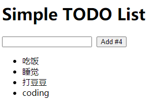
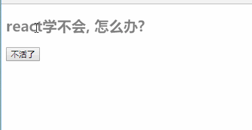
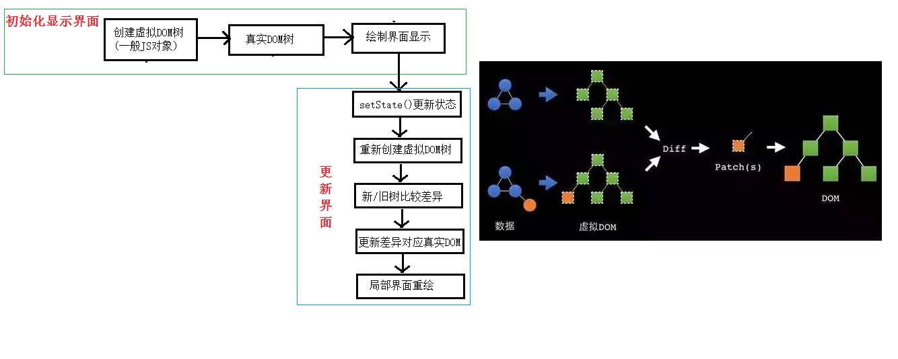
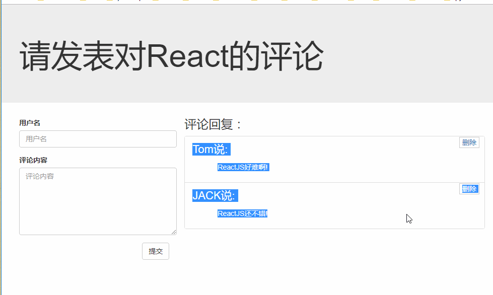
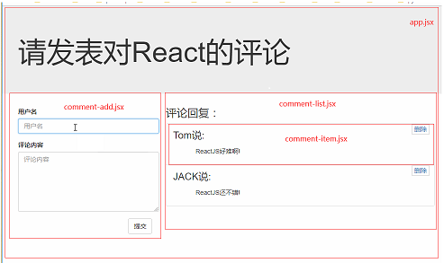
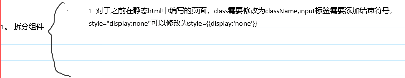
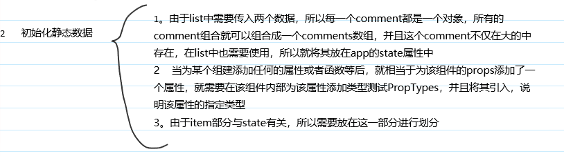
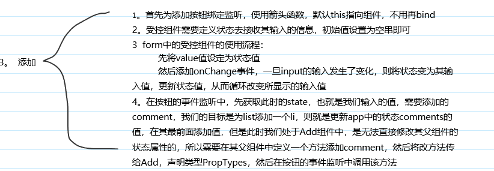
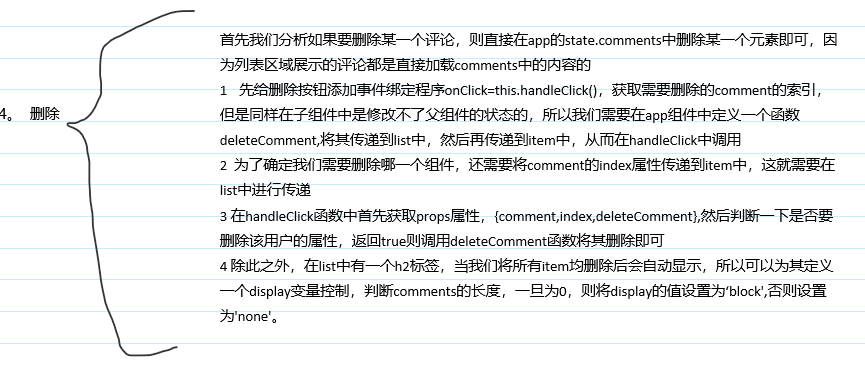

# 1 React简介
- React是一个javascript库
- React是React库的入口，三种使用方法：
  - 使用script标签加载：使用React全局变量对象即可获得React的顶层API
  - 使用es6与npm,`import React from 'react'`
  - 使用es5与npm,`var React = require('react')`
  - 在下面的应用中，我们都是使用script标签直接加载完成的


### 1.1 JSX
- JavaScript XML，javascript的语法扩展
- 例如：`const element = <h1>Hello,world!</h1>`
- 不强制要求使用JSX，但是在Javascript代码中将jsx和ui放在一起，在视觉上会有辅助作用

- 在jsx中嵌入js表达式
    - 需要使用大括号将js语句包围起来
  
```
const name = 'Lily';
const element = <h1>Hello,{name}</h1>
```
- **JSX也是一个表达式**，在编译之后，JSX会被转为普通的javascript函数调用

##### （1）JSX特定属性
- 使用引号，将属性值指定为字符串字面量
  - `const element = <h1 index='0'>Hello,{name}</h1>`
- 也可以使用大括号(js表达式)指定属性值
  - `const element = <h1 tabIndex={index_x}>Hello,{name}</h1>`

#### (2)jsx指定子元素
- 无内容标签，使用/>实现闭合
    - `const element = `
- 包含很多子元素的标签，使用小括号包围起来，并且只能有一个根元素div或者其他
  
```
const element = (
  <div>
    <h1>Hello!</h1>
    <h2>Good to see you here.</h2>
  </div>
);
```

#### (3)jsx转译
- Babel会将jsx转译为一个名为`React.createElement()`函数调用,创建并返回指定类型的新 React 元素
- 比如下面的jsx代码：
  
```
const element = (
  <h1 className="greeting">
    Hello, world!
  </h1>
);
```
  
- 转译后就是
  
```
const element = React.createElement(
  'h1',
  {className:'greeting'},
  'Hello,World!'
);
```

### 1.2 元素渲染
- ReactDOM包提供了很多的方法，比如render()
  - 使用script标签加载：使用ReactDOM全局变量对象即可获得ReactDOM的顶层API
  - 使用es6与npm,`import ReactDOM from 'react-dom'`
  - 使用es5与npm,`var ReactDOM = require('react-dom')`
- 元素渲染使用的是`ReactDOM.render(组件,container)`,在container中渲染一个React组件
- 元素是构成React的最小砖块。元素描述了你在屏幕上想看到的内容
- React创建的元素开销很小，和浏览器的DOM元素不同，React DOM通过更新DOM使得其与React元素保持一致
- 通过React构建的应用通常只能包含一个根DOM节点
  
```
const element = <h1>Hello, world</h1>;
ReactDOM.render(element, document.getElementById('root'));
```
  
- React元素是不可变对象，**一旦被创建，就不能更改它的子元素或者属性**，想要更新UI就是创建一个全新的元素，并且插入render
- **React只更新需要更新的部分**,会比较元素及其子元素与它们之前的状态，从而只进行必要的更新

### 1.3 组件&Props
- 组件允许我们将函数拆分为独立可复用的代码片段，并对每个片段进行独立构思
- 组件接收参数props,返回用于描述页面展示内容的React元素
- 组件名必须大写首字母,React会自动将以小写字母开头的组件视为原生DOM标签

#### （1）函数组件
- 编写javascript函数，接收**唯一带有数据的props对象并且返回React元素**
  
```
function Welcome(props) {
  return <h1>Hello, {props.name}</h1>;
}
```
  
#### (2)类组件
  
```
class Welcome extends React.Component {
    render(){
        return <h1>Hello,{this.props.name}</h1>;
    }
}
```
  
#### (3)渲染组件
- 之前遇到React元素都是DOM标签，其实React元素还可以是用户自定义的组件
- **当React元素为自定义组件时，会将jsx所接收的属性以及子组件转换为单个对象"props"传递给组件**
  
```
function Welcome(props) {
  return <h1>Hello, {props.name}</h1>;
}

ReactDOM.render(<Welcome name="Sara"/>, document.getElementById('root'));
```
  
- 在这个例子中，执行顺序如下：
    - 我们ReactDOM.render函数，并且将<Welcome name="Sara"/>传入
    - React调用Welcome组件，并且将{name:'Sara'}作为props传入。
    - Welcome组件将`<h1>Hello,Sara</h1>`元素作为返回值
    - React DOM 将DOM高速地更新为`<h1>Hello, Sara</h1>`，将该元素插入到根元素中

#### （4）组件的组合使用
- 这里面需要注意两个点：
  - （1）数据定义在哪个组件中取决于哪些组件需要，如果只有某个组件需要，则将其放在该组件中即可，如果某些组件均需要，则将其放在其共同的父组件中
  - （2）**子组件中不能直接改变父组件的状态**，状态在哪个组件，更新状态的行为都应该定义在哪个组件中，如果需要在子组件中改变父组件的状态，则可以在子组件中定义一个方法调用父组件中改变状态的方法，即可实现该功能
- 例子：[App](3.component/07_components_composing/01.html)
- 上面例子实现的功能：
  - 在文本框中输入内容，点击add,即可添加到下面的list中
- 以上面为例，组件化编写的流程：
  - 1 拆分组件
  - 2 实现静态组件
  - 3 实现动态组件
    - 实现初始化数据动态显示
    - 实现交互功能

### 1.4 State&生命周期（类组件特有）
- 添加state，私有的，完全受控于当前组件
  
```
// 1 创建组件
class Clock extends React.Component {
    // 将props传递到父类的构造函数中
  constructor(props) {
    super(props);
    // 初始化state的值,组件的私有属性
    this.state = {date: new Date()};
  }

  render() {
    return (
      <div>
        <h1>Hello, world!</h1>
        <h2>It is {this.state.date.toLocaleTimeString()}.</h2>
      </div>
    );
  }
}
// 2 渲染组件
ReactDOM.render(
    // 在这里如果给Clock组件添加属性，则会打包成一个对象props
  <Clock />,
  document.getElementById('root')
);
```
  

#### （1)修改State
- 只能使用`setState()`修改
  
```
this.setState({date:new Date()});
// 错误  this.state.date = new Date();
```
  
#### (2)数据是单向流动的
- state是局部封装的，受控于当前组件，所以其他组件均不能访问该组件的state,均无法知道该组件是有状态组件还是无状态组件
- 组件可以将它的state作为props传递给它的子组件，例如
  
```
<h1>It is {this.state.date.toLocaleTimeString()}.</h2>
```
  
#### （3）组件之间是相互独立的

### 1.5 事件处理
- 事件明明小驼峰，首单词首字母小写，其余单词首字母大写
- jsx语法要求传入一个函数(js)作为事件处理程序
  
```
<button onClick={myClick}>
    点击一下
</button>

传统的html:所有单词首字母小写，后面对应字符串
<button onclick="myClick()">
    点击一下
</button>
```
  
#### （1）给返回的React DOM元素添加事件处理程序
- 一般将其作为组件类的一个新增函数定义
- 需要注意的是：**对于类中新增加的函数this默认指向undefined,所以需要使用bind函数绑定**
  
```
// 1 建立组件
class Toggle extends React.Component{
    constructor(props){
        super(props);
        // 初始化state
        this.state = {
            isButtonON : false
        };
        // 绑定handleClick函数的this指向组件Toogle
        this.handleClick = this.handleClick.bind(this);
    }
    handleClick(){
        // 获取state
        const isButtonON = !this.state.isButtonON;
        // 更新state
        this.setState({isButtonON})
    }
    render(){
        // 返回React DOM元素
        return (  //小括号不能少，ON和OFF是字符串，所以要加引号
            <button onClick={this.handleClick}>{this.state.isButtonON ? 'ON' : 'OFF'}</button>
        )
    }
}
// 2 渲染
ReactDOM.render(<Toggle />, document.getElementById('root'));
```
  
- 还可以使用箭头函数，不需要再特意绑定,此语法确保了this倍锁定为Toggle
  
```
<button onClick={()=>this.handleClick()}>{this.state.isButtonON ? 'ON' : 'OFF'}</button>
```

#### （2）向事件处理程序传递参数para
- 使用bind函数，不需要显式传递事件对象e,事件对象跟在para之后，可以隐式传递
  
```
<button onClick={this.handleClick.bind(this,para)}>ON</button>
```

- 使用箭头函数,需要显式传递事件对象e
  
```
<button onClick={(e)=>this.handleClick(para,e)}>ON</button>
```

### 1.6 条件渲染
- 在React中，可以创建不同的组件来封装各种行为，然后根据应用的不同状态，可以只渲染对应状态下的部分内容
- 条件渲染，使用if或者条件运算符去创建元素来表现当前的状态，然后让React根据它们更新UI

#### (1)if条件
- 例如下面的两个组件：
  
```
function UserGreeting(props){
    return <h1>Welcone back!</h1>
}

function GuestGreeting(props){
    return <h1>Please sign up.</h1>
}
```
  
- 再创建一个Greeting组件，它会根据用户是否登录来决定显示上面的哪一个组件
  
```
function Greeting(props){
    const isLoggedIn = props.isLoggedIn;
    // 判断
    if(isLoggedIn){
        return <UserGreeting />;
    }else{
        return <GuestGreeting />;
    }
}
ReactDOM.render(<Greeting isLoggedIn={false} />, document.getElementBuId('root'));
```

#### （1）元素变量
- 使用元素变量存储元素，从而有条件地渲染一部分组件
- 例如，下面的两个组件分别返回一个按钮，表示登录和注销
  
```
function LoginButton(props){
    return(
        <button onClick={props.onClick}>login</button>;
    )
}
function LogoutButton(props){
    return(
        <button onClick={props.onClick}>logout</button>;
    )
}
```
- 接下来创建一个名为LoginControl的组件，通过判断当前的状态变量isLoggedIn判断当前应该渲染哪个组件
  
```
class LoginControl extends React.Component{
    constructor(props){
        super(props);

        this.state = {
            isLoggedIn:false;
        }
    }

    handleLoginButton(){
        this.setState({isLoggedin:false});
    }
    handleLoginButton(){
        this.setState({isLoggedin:true});
    }
    render(){
        let button;
        const isLoggedIn = this.state.isLoggedIn;
        if(isLoggedIn){
            button = <LoginButton onClick={this.handleLogoutClick}/>;
        }else{
            return <loginoutButton onClick={this.handleLoginClick}/>;
        }

        return(
            <div>
                <Greeting isLoggedIn={isLoggedIn} />{button}
        );
    }   
}

//
ReactDOM.render(<LoginControl />, document.getElelmentById('root'));
```

- 此段代码执行顺序：[执行顺序](./img/01.png)

#### （2）三目运算符
- a ? result1 : result2;

#### （3）阻止组件渲染
- return null

### 1.7 子组件中修改父组件的状态
- 首先在父组件中自定义函数1修改状态
- 将该函数1传递给子组件，则该函数作为props的一个属性传递
- 在子组件中创建函数2调用该props中的函数
- 在子组件的返回标签中使用函数2作为事件
- [例子](3.component/07_components_composing/01.html);

### 1.8 列表&key
- 在一个组件中渲染列表
- 必须给每一个li添加一个key属性，否则会报出警告` a key should be provided for list items`
  
```
function NumberList(props) {
  const numbers = props.numbers;
  const listItems = numbers.map((number,index) =><li key={index}>{number}</li>);
  return (
    <ul>{listItems}</ul>
  );
}

const numbers = [1, 2, 3, 4, 5];
ReactDOM.render(<NumberList numbers={numbers} />,
  document.getElementById('root')
);
```
  
- key 帮助 React 识别哪些元素改变了，比如被添加或删除。因此你应当给数组中的每一个元素赋予一个确定的标识
- **一个元素的 key 最好是这个元素在列表中拥有的一个独一无二的字符串**。通常，我们使用数据中的 id 来作为元素的 key。
- 当元素没有确定 id 的时候，可以使用元素索引 index 作为 key
- key 只是在兄弟节点之间必须唯一，不需要全局唯一，生成两个数组时可以使用相同的key值
- key 会传递信息给 React ，但不会传递给你的组件,也就是说不能读取

### 1.9 表单
- 常规的html表单,具有默认行为，用户提交表单后浏览到新页面
  
```
<form>
  <label>
    名字:
    <input type="text" name="name" />
  </label>
  <input type="submit" value="提交" />
</form>
```
  
#### （1）受控组件
- 直接将value设置为组件的状态值，通过输入的值改变状态值，从而改变标签的value
  
```
class LoginForm extends React.Component{
  constructor(props){
    super(props);
    // 1 初始化状态值
    this.state = {
      name: ''
    }
    this.handleSubmit = this.handleSubmit.bind(this);
    this.handleChange = this.handleChange.bind(this);
  }
  handleSubmit(e){
    // 打印
    alert('提交的名字为：'+this.state.name);
    // 阻止默认行为
    e.preventDefault();
  }
  handleChange(e){
    // 3 更新状态值，从而更新了value
    this.SetState({value:e.target.value});
  }
  render(){
    // 2 将input的value直接设定为状态值
    return(
      <form onSubmit = {this.handleSubmit}>
        用户名：<input type="text" value = {this.state.name} onChange = {handleChange}/>
        <input type='submit' value='提交' />
      </form>
    )
  }
}
```
  
- 上面的程序中，我们直接将value设置为了状态值，则只有通过改变状态值才可以改变value,否则value将始终显示为初始化的状态值
- onChange是在每次失去焦点后执行的，所以每次输入完名字后，点击提交按钮时就会执行，从而更新状态值，onSubmit是在每次提交表单时执行的，从而打印并且阻止默认行为

#### （2）非受控组件
- 直接获取input的当前输入value,使用onChange修改value即可
- 添加属性`ref={input => this.nameInput = input}`,然后需要时即可`alert('提交的名字为：'+this.nameInput.value);`获取。 
  
```
class LoginForm extends React.Component{
  constructor(props){
    super(props);
    this.handleSubmit = this.handleSubmit.bind(this);
  }
  handleSubmit(e){
    // 打印
    alert('提交的名字为：'+this.nameInput.value);
    // 阻止默认行为
    e.preventDefault();
  }
  render(){
    // 2 将input的value直接设定为状态值
    return(
      <form onSubmit = {this.handleSubmit}>
        用户名：<input type="text" ref={input => this.nameInput = input} />
        <input type='submit' value='提交' />
      </form>
    )
  }
}
```

- 类似的select标签、textarea标签均可以作为受控组件使用
- 文件input标签，因为它的value是只读的，所以它是一个非受控标签

### 1.10 组件的生命周期
- React组件对象从创建到死亡会经历特定的生命周期阶段
- 每个React组件对象均会包含一系列的勾子函数(生命周期回调函数),在生命周期特定时刻回调
- 所以我们在定义组件时就可以重写特定的生命周期回调函数，做特定的工作

#### （1）生命周期详述
- 详细地：https://react.docschina.org/docs/react-component.html
- 组件的三个生命周期状态：
  - Mount:插入真实的DOM
  - Update:被重新渲染
  - Unmount:被移除真实的DOM
- React为每个状态均提供了勾子函数
  - componentWillMount():
  - componentDidMount():
  - componentWillUpdate():
  - componentDidUpdate():
  - componentWillUnMount():
- 生命周期流程：
  - 第一次初始化渲染显示：ReactDOM.render()
    - constructor():创建对象初始化state                    在整个生命周期中就执行一次
    - componentWillMount():将要插入虚拟DOM的回调函数        在整个生命周期中就执行一次
    - render():插入虚拟DOM的回调函数
    - componentDidMount():组件插入DOM树中后立即被调用的回调函数         在整个生命周期中就执行一次
  - 每次更新state:this.setState()
    - componentWillUpdate():将要更新DOM的回调函数
    - render():更新DOM的回调函数
    - componentDidUpdate():DOM树更新完成后立即调用的回调函数
  - 移除组件：ReactDOM.unmountComponentAtNode(containerDom)
    - componentWillUnmount():组件被卸载或者移除之前直接调用的回调函数，如果在移除前我们需要进行任何操作就可以重写这个函数

- 例如：[例子](3.component/09_component_lifecycle/test.html)
  - 页面加载后，第一行内容逐渐消失，然后又出现，然后又逐渐消失....
  - 点击按钮后，所有内容全部消失
- 效果：
  
```
class Life extends React.Component{

   constructor(props){
     super(props);
     this.state = {
       // 设置标签的透明度属性，从1->0变化
       opacity: 1
     }
     this.distroyComponent = this.distroyComponent.bind(this);
   }

   // 在第一次虚拟DOM成功挂载后回调函数
   componentDidMount(){
     this.intervalId = setInterval(function(){
       // 定时器的this指向windows,所以需要使用bind绑定
       // 另一种方法：回调函数使用箭头函数，这样会自动将this指向组件
        console.log('定时器执行了...')
        let opacity = this.state.opacity;
        opacity -= 0.1;
        if(opacity<=0){
          opacity = 1;
        }
        this.setState({opacity});
     }.bind(this), 200);
  }

  // 点击按钮后，组件消除
   distroyComponent(){
     // 调用组件消除函数
     ReactDOM.unmountComponentAtNode(document.getElementById('example'));
   }

   // 在组件消除之前会自动调用的函数
   componentWillUnmount(){
     // 清理定时器
     clearInterval(this.intervalId);
   }

   render(){
     const {opacity} = this.state;
    //  {{opacity}}:外层的大括号表示js代码，内层的大括号表示对象，'opacity'表示css属性名
     return (
       <div>
        <h2 style={{opacity:opacity}}>{this.props.msg}</h2>
        <button onClick={this.distroyComponent}>不活了</button>
       </div>
     )
   }
  }
  ReactDOM.render(<Life msg='React太难了!' />, document.getElementById('example'));
```

### 1.11 虚拟DOM和DOM Diffing Algorithm的作用
- 首先初始化显示界面(产生虚拟DOM，渲染真实DOM，界面显示)
- 然后更新界面(setState更新状态->重建虚拟DOM树->使用DOM差分算法比较新、旧DOM树的差异->在真实DOM中更新两者之间的差异->界面重绘)
- ReactDOM.render() 会控制你传入容器节点里的内容。当首次调用时，容器节点里的所有 DOM 元素都会被替换，后续的调用则会使用 React 的 DOM 差分算法（DOM diffing algorithm）进行高效的更新。
- 

# 2 React应用(基于react脚手架)

### 2.1 脚手架

- xxx脚手架：用来帮助程序员快速创建一个基于xxx库的模板项目
  - 包含了所有需要的配置
  - 指定了所有的依赖
  - 可以直接安装/编译/运行一个简单效果
- 使用脚手架开发项目的特点：模块化，组件化，工程化

### 2.2 使用create-react-app创建react应用
- **react提供了一个用于创建react项目的脚手架库：create-react-app**
- 项目的整体技术架构为：react+webpack+es6+eslint
- create-react-app官方文档：https://create-react-app.bootcss.com/
- 创建项目并且启动
  
```
// 打开命令行，执行第一句全局安装create-react-app包
npm install -g create-react-app  

create-react-app 项目名   // 创建一个新的项目
cd 项目名                 // 打开项目文件夹
npm start                 // 启动项目
```
- 执行下面一句可以查看npm的安装位置：我的在C:\Users\17273\AppData\Roaming\npm\node_modules
`npm root -g ` 
- react脚手架项目结构
```
ReactNews
  - node_modules      第三方依赖模块文件夹
  - public              
    - index.html        主页面
  - scripts
      - build.js        build打包引用配置
      - start.js        start运行引用配置
  - src               源码文件夹
      - components      react组件
      - index.js        应用入口js
  - .gitignore        git版本管制忽略的位置
  - package.json      应用包配置文件
  - README.md         应用描述说明的readme文件
```

### 2.3 react评论管理应用
- 实现的功能如下：
- 
- 总的效果：
  - 左边界面输入用户名和评论，点击提交按钮即可添加到右边的界面
  - 右边界面点击删除，即可删除其相对应的某一条评论
  - 右边评论全部删除，则显示`暂无评论，点击左侧添加评论`
- 根据组件化编写的流程：
  - 1 拆分组件
  - 2 实现静态组件
  - 3 实现动态组件
    - 实现初始化数据动态显示
    - 实现交互功能
#### （1）拆分组件

- 四个组件：
  
```
app
  - comment-add
  - comment-list
    - 多个comment-item
```

#### 2 实现静态组件

- 对于每一个组建中用到的标签的css属性，在该组件所在的文件夹中再定义一个css文件，并且在组件中引入，这样才能实现组件渲染后的页面样式

#### 3 实现动态组件
##### （3-1）实现初始化数据动态显示
- 首先我们把这个页面当成是一个静态页面，动态操作(提交和删除)先不实现，建立一个html和css将这个静态页面实现
- 然后实现各个组件
  - 直接将整个静态标签的排布贴到render()的return中，将其中描述add和list的部分用对应的组件替换即可
  - 注意：**html标签中的class属性需要修改为className,style="display:none"需要修改为style={{display:'none'}}**


##### （3-21）动态交互——添加评论

- 需要注意的是**子组件内是不能直接修改父组件的状态的**,子组件要修改父组件的状态，一定是在父组件中定义修改组件状态的方法1，将其传递到子组件中，然后再在子组件中添加方法2，在方法2中调用方法1
##### （3-22）动态交互—— 删除评论

- **变量的使用**
  
```
// 定义一个变量，可以叫display或者其他的名字
const display = (comments.length === 0 ? 'block' : 'none');

// {{display:display}}前一个display指代css的规则，后一个display指代上面定义的变量display
<h2 style={{display: display}}>暂无评论，点击左侧添加评论！！！</h2>        
```

# 3 react中使用ajax请求
- 1)	React本身只关注于界面, 并不包含发送ajax请求的代码
- 2)	前端应用需要通过ajax请求与后台进行交互(json数据)