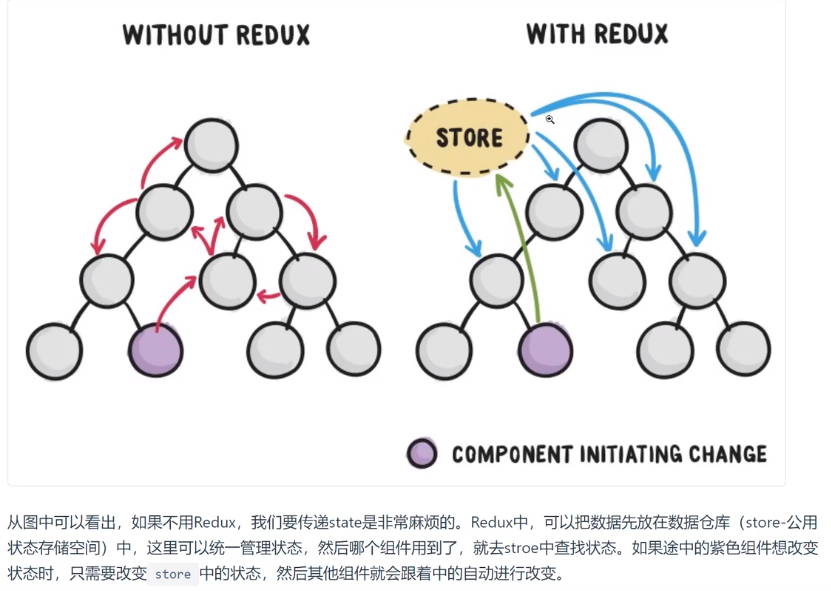
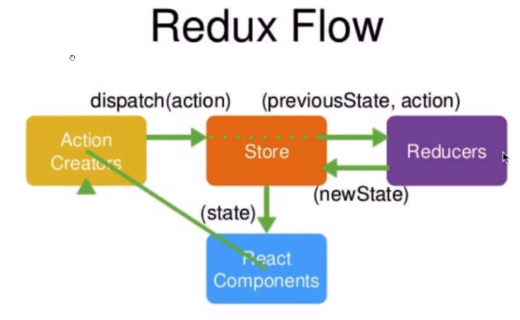

<!-- TOC -->

- [Redux](#redux)
- [Antd](#antd)
- [项目应用](#项目应用)

<!-- /TOC -->

# Redux

Redux 是一个用来管理管理数据状态和 UI 状态的 JavaScript 应用工具。随着 JavaScript 单页应用（SPA）开发日趋复杂，JavaScript 需要管理比任何时候都要多的 state（状态），Redux 就是降低管理难度的。


Redux 的工作流程：

    （1）React组件触发一个事件，该事件会产生一个action对象{type:事件的类型名称,data:新的状态}
    （2）通过dispatch方法将该action传递到状态保存对象store中
    （3）store会自动调用reducer方法(这是因为在创建store时需要将reducer作为参数传入，所以会自动调用)，并向其传递两个参数(action对象,previousState)
    （4）reducer.js中定义了改变状态的纯函数，将(action对象,previousState)这两个参数带入，得到了newState,并将其封装为一个对象，{reducer:{newState}}并将其返还给store。
            如果有多个纯函数，则使用combineReducers(reducer1,reducer2,...)将所有的纯函数组合产生一个新的函数，每个reducer将负责更新state中的一部分数据，然后这个生成的函数将所有的reducer纯函数的结果合并为一个大的对象：{reducer1:{newState1},reducer2:{newState2}}返还给store仓库



例如：
reducer.js

```
import { combineReducers } from "redux";

const initUser={name:"whh"}
function user(state=initUser,action){
    return state;
}

const initUserList = [{name:"whh"},{name:"wy"}];
function userList(state=initUserList,action){
    return state;
}

const reducers = combineReducers(   //combineReducers产生了一个函数，分配reducer
    user,
    userList
)

export default reducers;  // 向外暴露的就是一个reducers对象：

// reducer = {user:{name:"whh"}, userList:[{name:"whh"},{name:"wy"}]}
```

在 store.js 中：

```
import {createStore, applyMiddleware} from redux
import thunk from "redux-thunk";
import { composeWithDevTools } from "redux-devtools-extension";

import reducers from "./reducers";

var store = createStore(reducers, composeWithDevTools(applyMiddleware(thunk)));
console.log(store.getState());  //getState()返回当前的state树：{user:{name:"whh"},userList:[{name:"whh"},{name:"wy"}]}

// 向外暴露store对象
export default store;
```

在任意一个容器组件中：

```
// 一定是state.user或者state.userList,因为state树中只有这两个状态
connect({state=>({user:state.user})},{})(App)
```

# Antd

Ant Design 是一套面向企业级开发的 UI 框架，视觉和动效作的很好。阿里开源的一套 UI 框架，它不只支持 React，还有 ng 和 Vue 的版本。AntDesign 简称为 antd

先安装 antd 包：`npm install --save antd`
再实现按需加载：实现按需加载后只需要从 antd 包中引入需要的组件即可，不需要再引入样式文件

    首先安装需要的包：`npm install --save-dev babel-plugin-import react-app-rewired customize-cra`
    然后修改package.json文件，使用react-app-rewired启动、编译项目：
            /* package.json */
            "scripts": {
            "start": "react-app-rewired start",
            "build": "react-app-rewired build",
            "test": "react-app-rewired test",
            }
    最后在项目根目录下添加一个文件config.overrides.js:
            const { override, fixBabelImports } = require('customize-cra');
                module.exports = override(
                    fixBabelImports('import', {
                        libraryName: 'antd-mobile',
                        libraryDirectory: 'es',
                        style: 'css',
                    }),
            );

# 项目应用

- 创建一个 react 项目，入口文件：

```
import React from 'react';
import ReactDOM from 'react-dom';

import TodoList from './todoList'

ReactDOM.render(
    <TodoList />,
  document.getElementById('root')
);
```

- 在`src/todolist.js`:

```
import React from 'react'
import {Input,List,Button} from 'antd'

// import '../node_modules/antd/dist/antd.css'

const data = [
    '早8点开晨会，分配今天的开发工作',
    '早9点和项目经理作开发需求讨论会',
    '晚5:30对今日代码进行review'
]

const Item = List.Item;
export default class TodoList extends React.Component{
    render(){
        return (
            <div>
                <Input placeholder='write something' style={{width:'250px',marginRight:'10px'}}></Input>
                <Button type='primary'>增加</Button>
                {/* bordered展示边框  dataSource:列表数据源[]
                 renderItem:当使用 dataSource 时，可以用 renderItem 自定义渲染列表项
                 */}
                <List bordered dataSource={data}
                    renderItem={item => (<Item>{item}</Item>)}
                />
            </div>
        )
    }
}
```

- 接下来开始编写 Redux,Redux 的四个工作流程：
  - 创建 store 对象
  - 创建 reducer 纯函数
  - 将 reducer 引入到 store 中，管理 state
  - 创建 action 对象,并且 dispatch
- 安装 redux 包:npm install --save redux

- （1）`src/store/index.js`创建 store 对象

```
import {createStore} from 'redux'

const store = createStore();
export default store;
```

- (2) 这样虽然已经建立好了仓库，但是这个仓库很混乱，这时候就需要一个有管理能力的模块出现，这就是 Reducers。
  - state: 是整个项目中需要管理的数据信息,这里我们没有什么数据，所以用空对象来表示。
  - `src/store/reducer.js`编写 reducer 函数
  - 这个函数执行完毕后，会将新的 state 传递给 store,所以 store 对象中就已经具备了 state 状态属性了

```
const initState = {};  //初始状态

export default (state=initState, action) => {
    return state;
}
```

- （3）将 reducer 引入到 store 中，管理 state

```
import {createStore} from 'redux'

import reducer from './reducer'

const store = createStore(reducer);
export default store;
```

- （4）根据需要，初始化 state

```
const initState = {
    inputValue:'Write Something',
    list:[
        '吃饭','睡觉','打豆豆'
    ]
};

export default (state=initState, action) => {
    return state;
}
```

- （5）在 TodoList 组件中获取 store 对象中的数据

```
import React from 'react'
import {Input,List,Button} from 'antd'

// 1 获取store
import store from './store/index'

const data = [
    '早8点开晨会，分配今天的开发工作',
    '早9点和项目经理作开发需求讨论会',
    '晚5:30对今日代码进行review'
]


const Item = List.Item;
export default class TodoList extends React.Component{

    constructor(props){
        super(props);
        // 2 将store中的state数据传递给this.state
        this.state = store.getState();
    }

    render(){
        // 3 获取数据并显示的UI组件中
        const {inputValue,list} = this.state;
        return (
            <div>
                <Input placeholder='write something' value={inputValue} style={{width:'250px',marginRight:'10px'}}></Input>
                <Button type='primary'>增加</Button>
                {/* bordered展示边框  dataSource:列表数据源[]
                 renderItem:当使用 dataSource 时，可以用 renderItem 自定义渲染列表项
                 */}
                <List bordered dataSource={list}
                    renderItem={item => (<Item>{item}</Item>)}
                />
            </div>
        )
    }
}
```

- (6) 添加 redux-dev-tools

```
import {createStore} from 'redux'

import reducer from './reducer'

const store = createStore(
    reducer,
    // 添加这句话即可
    window.__REDUX_DEVTOOLS_EXTENSION__ && window.__REDUX_DEVTOOLS_EXTENSION__());
export default store;
```

- （7）增加 input 响应事件
  - 先给 input 添加 onChange 事件：
  - 定义事件内容：创建 action 对象并且 dispatch
  - 定义相应的 reducer 处理部分

todolist.js

```
<Input placeholder='write something' value={inputValue} style={{width:'250px',marginRight:'10px'}} onChange={this.handleChange}></Input>

handleChange = (e) => {
    const action = {
        type: 'change_input_value',
        value: e.target.value
    }
    store.dispatch(action);
}
```

reducer.js:

```
export default (state=initState, action) => {
    if(action.type === 'change_input_value'){
        // 先拷贝previousState
        const newState = JSON.parse(JSON.stringify(state));
        // 修改其中的值
        newState.inputValue = action.value;
        return newState;
    }
    return state;
}
```

现在如果我们在文本框中输入时，store 中的 state 已经发生了变化，但是组件的显示还没有变化，这是因为组件的属性只能通过 this.setState 变化，所以我们需要订阅 store 的更新，一旦监听到 store 发生变化，就自动调用它的回调函数

```
constructor(props){
    super(props);
    this.state = store.getState();
    store.subscribe(this.setChange);
}

setChange = () => {
    this.setState(store.getState());
}
```

- (8)点击按钮添加 items
  - 给 button 绑定事件点击函数
  - 定义点击函数：
    - 创建 action 对象并且 dispatch
    - 编写 reducer

todolist.js

```
<Button type='primary' onClick={this.addItem}>增加</Button>

addItem = () => {
    const action = {
        type: 'addItem'
    }
    store.dispatch(action);
}
```

reducer.js

```
if(action.type === 'addItem'){
    // 先拷贝previousState
    const newState = JSON.parse(JSON.stringify(state));
    // list中新添加的值就是目前的state中的inputValue,因为我们在写入input时，inputValue就改变了
    newState.list.push(newState.inputValue);
    newState.inputValue = '';
    return newState;
}
```

- （9）点击列表项该列表项自动删除
  - 给列表项绑定事件点击函数
  - 定义点击函数：
    - 创建 action 对象并且 dispatch
    - 编写 reducer

todoList.s

```
<List
    bordered
    dataSource={list}
    // 或者onClick={this.deleteItem.bind(this,index)}
    renderItem={(item,index) =>(<Item onClick={(index) => this.deleteItem(index)}>{item}</Item>)}
/>

deleteItem = (index) => {
    const action = {
        type: 'deleteItem',
        index
    }
    store.dispatch(action);
}
```

reducer.js

```
if(action.type === "deleteItem" ){
    let newState = JSON.parse(JSON.stringify(state))
    newState.list.splice(action.index,1)  //删除数组中对应的值
    return newState
}
```

- (10) 整合 action 和 action-type,规范化代码
  - 创建 action-type.js,里面暴露三个 action 类型，顺便修改 reducer.js 中的类型
  - 创建 action.js:暴露三个产生 action 对象的方法
  - 修改 todoList.js 中产生 action 对象部分的代码：

action-type.js

```
export const CHANGE_INPUT = 'changeinput';
export const ADD_ITEM = 'add_item';
export const DELETE_ITEM = 'delete_item';
```

action.js

```
import {CHANGE_INPUT,ADD_ITEM,DELETE_ITEM} from './action-type'

export const changeInputAction = (item) => ({type:CHANGE_INPUT, value:item});
export const addItemAction = () => ({type:ADD_ITEM});
export const deleteItemAction = (index) => ({type:DELETE_ITEM, value:index});
```

修改 todoList.js 的部分：

```
handleChange = (e) => {
    // 直接调用action.js中定义的产生相应action的方法即可
    const action = changeInputAction(e.target.value);
    store.dispatch(action);
}
addItem = () => {
    const action = addItemAction();
    store.dispatch(action);
}
deleteItem = (index) => {
    const action = deleteItemAction(index);
    store.dispatch(action);
}
```

- （11）拆分 UI 组件和业务逻辑
  - UI 组件：只显示，不包含其他的函数定义，可以作为无状态组件使用
  - 这部分参见：https://jspang.com/detailed?id=48#toc238 的 13-14 节

# redux-devtools-extension包

> - 配合浏览器的Redux-DevTools插件实现redux应用中state的监听
> - 如果不想安装这个包，还可以使用`window.__REDUX_DEVTOOLS_EXTENSION__&& window.__REDUX_DEVTOOLS_EXTENSION__()`

```
import {createStore} from 'redux'

import reducer from './reducer'

const store = createStore(reducer,window.__REDUX_DEVTOOLS_EXTENSION__&&window.__REDUX_DEVTOOLS_EXTENSION__ ());
export default store;
```

# redux源码实现

首先查看一下store到底是个啥？？？？store其实就是一个对象，这个对象包含有以下几个方法和属性：

```
dispatch: ƒ e(n)
getState: ƒ f()
liftedStore: {dispatch: ƒ, subscribe: ƒ, getState: ƒ, replaceReducer: ƒ, Symbol(observable): ƒ}
replaceReducer: ƒ (n)
subscribe: ƒ subscribe(listener)
Symbol(observable): ƒ ()

getState() 方法获取 state；
subscribe(listener) 注册监听器;
subscribe(listener) 返回的函数注销监听器。
dispatch(action) 方法更新 state，依次执行监听器
```

所以要实现redux就需要实现这几个方法，总体而言它是一个订阅监听模式，首先react组件从`store`中获取到原始数据，然后渲染。当react中的数据发生变化时，react就需要产生`action`,让`action`携带新的数据值派发给`store`,`store`将`action`发给`reducer`,`reducer`处理数据然后返回给`store`,最后react组件拿到更新后的数据渲染页面，达到页面更新的目的。

## 1 三大原则

> - 单一数据源：整个应用的state被保存在一棵对象树中，并且这个对象树只存在于唯一一个store中
> - **state是只读的，唯一改变state的办法就是触发action**,视图和网络请求都只能表达想要修改state的意图，不能直接修改。可以通过`store.getState()`读取  **不能直接修改state，只能通过dispatch**
> - 使用纯函数来修改，`reducer`接收先前的state和action，返回新的state  **有一个问题，store中是浅比较吗**

## 2 创建store对象

### 1 createStore

createStore接收三个参数：`reducer,[preloadedState],enhancer`

> - reducer: 定义修改state的逻辑
> - `[preloadedState]`:可选参数，初始化state
> - `enhancer`:是一个组合`store creator`的高阶函数，返回一个新的强化过的`store creator`

```
function createStore(reducer,preloadedState,enhancer){
  let state;

  //  用于存放被 subscribe 订阅的函数（监听函数）
  let listeners = [];

  // getState 是一个很简单的函数
  const getState = () => state;

  return {
    dispatch,
    getState,
    subscribe,
    replaceReducer
  }
}
```

### 2 dispatch

dispatch需要做：

> - 调用reducer得到新的state
> - 每一次状态更新后，依次 listeners 数组中的监听
> - 返回新的状态值

```
function dispatch(action) {
  state = reducer(state, action);
  // 每一次状态更新后，都需要调用 listeners 数组中的每一个监听函数
  listeners.forEach(listener => listener());
  return action;    // 返回 action
}
```

### 3 subscribe

订阅监听，保存监听函数，并且返回一个unsubscribe函数，用于取消当前的订阅。

```
function subscribe(listener){
  listeners.push(listener);
  // 函数取消订阅函数
  return () => {
    listeners = listeners.filter(fn => fn !== listener);
  }
}
```

### 4 replaceReducer

替换`reducer`,它接收一个新的`reducer`替换掉当前执行的`reducer`函数

```
function replaceReducer(reducer){
  if (typeof nextReducer !== 'function') {
    throw new Error('Expected the nextReducer to be a function.')
  }
  currentReducer = nextReducer;
}
```

## 3 combineReducers

该函数接收一个对象参数，对象的值是小的reducer函数。

### 1 使用方式

```
const initUser = {
  username: "", // 用户名
  type: "", //用户类型
  msg: "", // 存放错误提示信息
  redirectTo: "",
};
function user(state = initUser, action) {
  switch (action.type) {
    case AUTH_SUCCESS: //data存放user
      const { type, header } = action.data;
      return {
        ...state,
        ...action.data,
        redirectTo: getRedirectTo(type, header), 
      };
    case ERROR_MSG: // data存放msg
      return { ...state, msg: action.data };
    default:
      return state;
  }
}

const initUserList = [];
function userList(state = initUserList, action) {
  switch (action.type) {
    case RECEIVE_USER_LIST:
      // 某个用户信息修改以后，修改其他用户界面中的该用户的信息
      return action.data; // data是userlist
    default:
      return state;
  }
}

const rootReducer = combineReducers({
  user,
  userList
});


最终得到的state对象:{
	user: {username: "", type: "", msg: "", redirectTo: "",},
	userList: []
}
```

### 2 简单实现

```
function combineReducers(reducers){
    // 返回一个函数
    return (state = {},action) => {
        // 该函数执行后返回的是一个对象，就是state
        return Object.keys(reducers).reduce(
            (accum,currentKey) => {
                accum[currentKey] = reducers[currentKey](state[currentKey],action);
                return accum;
            },{}        // accum 初始值是空对象
        );
    }
}

combineReducers({chat,users})
```

## 3 applyMIddleWare

### 1 使用方法

```
import {createStore, applyMiddleWare} from 'redux'
import thunk from 'redux-thunk'
import reducer from './reducer'

var store = createStore(reducer, applyMiddleWare(thunk))
```

### 2 实现

createStore的第二个参数可以忽略，第三个参数是一个函数，所以我们需要保证`applyMiddleWare(thunk)`返回一个函数enhancer。

enhancer函数接收`createStore`作为参数，并且又返回一个函数`fn1`，`fn1`接收两个参数：`reducer和preloadedState`,就是`createStore`的前两个参数

```
function applyMiddleWare(...middleWare){
	return function(createStore){
		return function(reducer,preloadedState){
			// 最后返回增强后的store
			return {
				...store,
				dispatch   // 改进了dispatch，所以将原来的dispatch覆盖掉
			}
		}
	}
}
```

在此基础上改造`createStore`函数，当有`enhancer`函数时就要调用enhancer函数：

```
function createStore(reducer,preloadedState,enhancer){
  let state;

  //  用于存放被 subscribe 订阅的函数（监听函数）
  let listeners = [];

  // getState 是一个很简单的函数
  const getState = () => state;
  
  // 只有两个参数，且第二个参数是函数，则第二个参数其实指定的是enhancer
  if(typeof preloadedState === 'function' && typeof enhancer === 'undefined'){
  	enhancer = preloadedState;
  	preloadedState = undefined;    // 将preloadState设置为false
  }
  
  // 传入了三个实参
  if(typeof enchancer !== 'undefined'){
  	if(typeof enchancer !== 'function'){
  		throw new Error('Expected the enchancer to be a function.');
  	}
  	// 如果有enchancer，并且是函数，返回增强后的那四个store中的函数
  	return enchancer(createStore)(reducer,preloadedState);
  }

  return {
    dispatch,
    getState,
    subscribe,
    replaceReducer
  }
}
```

`applyMiddleWare`具体实现：

```
function applyMiddleWare(...middleWares){
	return function(createStore){
		return function(reducer,preloadedState){
		    var store = createStore(reducer,preloadedState);
		    var dispatch = store.dispatch;
		    // 存放中间件函数
		    var chain = [];
		    // 定义传递给中间件函数的参数
		    var middleWareAPI = {
		    	getState: store.getState,
		    	dispatch: (action)=>dispatch(action);
		    }
		    chain = middleWares.map(middleware => middleware(middlewareAPI));
		    // 将多个dispatch函数变成一个
		    dispatch = compose(...chain)(store.dispatch);
			// 最后返回增强后的store
			return {
				...store,
				dispatch   // 改进了dispatch，所以将原来的dispatch覆盖掉
			}
		}
	}
}


function compose(...funcs){
	if(funcs.length === 0){
		// 如果dispatch增强函数不存在时，则返回一个函数
		return arg => arg;
	}
	if(funcs.length === 1){
		return funcs[0];
	}
	return funcs.reduce((accum,currentFn)=>{
		return (...args) => {
			return accum(currentFn(..args));
		}
	})
}
```

### 3 存在中间件时的用法

```
import {createStore, applyMiddleware} from 'redux'
import thunk from 'redux-thunk'

import reducer from './reducer'

const store = createStore(
    reducer,
    applyMiddleware(thunk)
)


applyMiddleware返回的是一个函数fn1：
function(createStore){
    return function(reducer,preloadedState){
        var store = createStore(reducer,preloadedState);
        var dispatch = store.dispatch;
        // 存放中间件函数
        var chain = [];
        // 定义传递给中间件函数的参数
        var middleWareAPI = {
            getState: store.getState,
            dispatch: (action)=>dispatch(action);
        }
        chain = [thunk].map(middleware => middleware(middlewareAPI));
        // 将多个dispatch函数变成一个
        dispatch = compose(...chain)(store.dispatch);
        // 最后返回增强后的store
        return {
            ...store,
            dispatch   // 改进了dispatch，所以将原来的dispatch覆盖掉
        }
    }
}

则该函数fn1会作为enhancer传递给createStore,createStore最终返回的就是fn1(createStore)(reducer,preloadedState)
```

## 4 写一个中间件

中间件函数接收的参数是一个对象，该对象有两个函数：`getState`和`dispatch`。

```
function thunk({getState,dispatch}){  // dispatch: (action)=>dispatch(action);
	return next => action => {
		if(typeof action === ' function'){
			return action(dispatch,getState);   // 注意传参的顺序，dispatch在前
		}else{
			return next(action);
		}
	}
}

得到chain:
[
next => action => {
    if(typeof action === ' function'){
        return action(dispatch,getState);
    }else{
        return next(action);
    }
}
]

dispatch = compose(...chain)(store.dispatch);

compose(...chain)得到的结果：
next => action => {
    if(typeof action === ' function'){
        return action(dispatch,getState);
    }else{
        return next(action);
    }
}

compose(...chain)(store.dispatch)得到增强后的dispatch:

(
	next => action => {
        if(typeof action === ' function'){
            return action(dispatch,getState);
        }else{
            return next(action);
        }
    }
)(store.dispatch)

结果是：
action => {
    if(typeof action === ' function'){
        return action(dispatch,getState);
    }else{
        return next(action);
    }
}
添加了对于异步action的判断
```

# 面试涉及到的问题

## 1 可以不通过dispatch修改state值吗？

不行，state的状态只能通过`store.getState()`来读取，而只能通过`store.dispatch`通过设定`action`对象来修改

## 2 redux的原理

其实redux的内部保存着一个state对象，这个对象通过`reducer`来管理。

redux内部保存着一个变量数组`listeners`，用户通过`store.subscribe()`来监听state的变化，将回调保存在`listeners`中

当用户需要修改state中的数据时，需要先创建一个actions对象，对象中保存着修改的动作以及新的状态值，需要通过`store.dispatch(action)`来得到新的状态值，然后遍历数组`listenrer`,执行回调。**相当于发布事件，依次执行监听**

