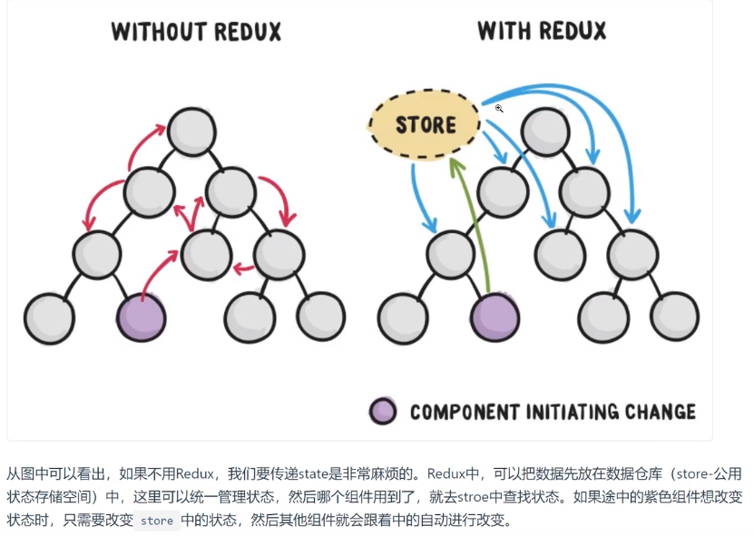
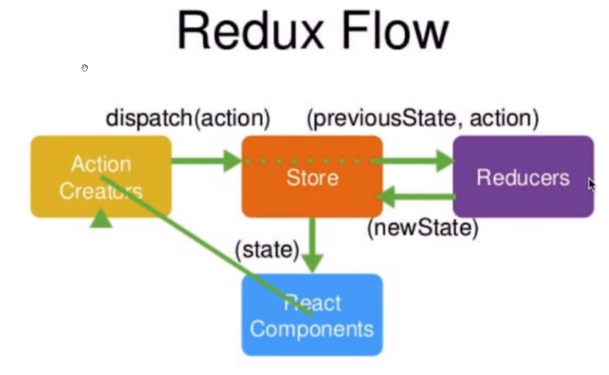

# Redux

Redux是一个用来管理管理数据状态和UI状态的JavaScript应用工具。随着JavaScript单页应用（SPA）开发日趋复杂，JavaScript需要管理比任何时候都要多的state（状态），Redux就是降低管理难度的。


Redux的工作流程：

    （1）React组件触发一个事件，该事件会产生一个action对象{type:事件的类型名称,data:新的状态}
    （2）通过dispatch方法将该action传递到状态保存对象store中
    （3）store会自动调用reducer方法(这是因为在创建store时需要将reducer作为参数传入，所以会自动调用)，并向其传递两个参数(action对象,previousState)
    （4）reducer纯函数将这两个参数带入，得到了newState,并将其返还给store。


# Antd

Ant Design是一套面向企业级开发的UI框架，视觉和动效作的很好。阿里开源的一套UI框架，它不只支持React，还有ng和Vue的版本。AntDesign简称为antd

先安装antd包：`npm install --save antd`
再实现按需加载：实现按需加载后只需要从antd包中引入需要的组件即可，不需要再引入样式文件

    首先安装需要的包：`npm install --save-dev babel-plugin-import react-app-rewired customize-cra`
    然后修改package.json文件，使用react-app-rewired启动、编译项目：
            /* package.json */
            "scripts": {
            "start": "react-app-rewired start",
            "build": "react-app-rewired build",
            "test": "react-app-rewired test",
            }
    最后在项目根目录下添加一个文件config.overrides.js:
            const { override, fixBabelImports } = require('customize-cra');
                module.exports = override(
                    fixBabelImports('import', {
                        libraryName: 'antd-mobile',
                        libraryDirectory: 'es',
                        style: 'css',
                    }),
            );

# 项目应用

- 创建一个react项目，入口文件：

```
import React from 'react';
import ReactDOM from 'react-dom';

import TodoList from './todoList'

ReactDOM.render(
    <TodoList />,
  document.getElementById('root')
);
```

- 在`src/todolist.js`:

```
import React from 'react'
import {Input,List,Button} from 'antd'

// import '../node_modules/antd/dist/antd.css'

const data = [
    '早8点开晨会，分配今天的开发工作',
    '早9点和项目经理作开发需求讨论会',
    '晚5:30对今日代码进行review' 
]

const Item = List.Item;
export default class TodoList extends React.Component{
    render(){
        return (
            <div>
                <Input placeholder='write something' style={{width:'250px',marginRight:'10px'}}></Input>
                <Button type='primary'>增加</Button>
                {/* bordered展示边框  dataSource:列表数据源[] 
                 renderItem:当使用 dataSource 时，可以用 renderItem 自定义渲染列表项
                 */}
                <List bordered dataSource={data} 
                    renderItem={item => (<Item>{item}</Item>)}
                />
            </div>
        )
    }
}
```

- 接下来开始编写Redux,Redux的四个工作流程：
  - 创建store对象
  - 创建reducer纯函数
  - 将reducer引入到store中，管理state
  - 创建action对象,并且dispatch
- 安装redux包:npm install --save redux

- （1）`src/store/index.js`创建store对象

```
import {createStore} from 'redux'

const store = createStore();
export default store;
```
 
- (2) 这样虽然已经建立好了仓库，但是这个仓库很混乱，这时候就需要一个有管理能力的模块出现，这就是Reducers。
  - state: 是整个项目中需要管理的数据信息,这里我们没有什么数据，所以用空对象来表示。
  - `src/store/reducer.js`编写reducer函数
  - 这个函数执行完毕后，会将新的state传递给store,所以store对象中就已经具备了state状态属性了

```
const initState = {};  //初始状态

export default (state=initState, action) => {
    return state;
}
```
- （3）将reducer引入到store中，管理state

```
import {createStore} from 'redux'

import reducer from './reducer'

const store = createStore(reducer);
export default store;
```

- （4）根据需要，初始化state

```
const initState = {
    inputValue:'Write Something',
    list:[
        '吃饭','睡觉','打豆豆'
    ]
};

export default (state=initState, action) => {
    return state;
}
```

- （5）在TodoList组件中获取store对象中的数据

```
import React from 'react'
import {Input,List,Button} from 'antd'

// 1 获取store
import store from './store/index'

const data = [
    '早8点开晨会，分配今天的开发工作',
    '早9点和项目经理作开发需求讨论会',
    '晚5:30对今日代码进行review' 
]


const Item = List.Item;
export default class TodoList extends React.Component{

    constructor(props){
        super(props);
        // 2 将store中的state数据传递给this.state
        this.state = store.getState();
    }

    render(){
        // 3 获取数据并显示的UI组件中
        const {inputValue,list} = this.state;
        return (
            <div>
                <Input placeholder='write something' value={inputValue} style={{width:'250px',marginRight:'10px'}}></Input>
                <Button type='primary'>增加</Button>
                {/* bordered展示边框  dataSource:列表数据源[] 
                 renderItem:当使用 dataSource 时，可以用 renderItem 自定义渲染列表项
                 */}
                <List bordered dataSource={list} 
                    renderItem={item => (<Item>{item}</Item>)}
                />
            </div>
        )
    }
}
```

- (6) 添加redux-dev-tools

```
import {createStore} from 'redux'

import reducer from './reducer'

const store = createStore(
    reducer,
    // 添加这句话即可
    window.__REDUX_DEVTOOLS_EXTENSION__ && window.__REDUX_DEVTOOLS_EXTENSION__());
export default store;
```

- （7）增加input响应事件
  - 先给input添加onChange事件：
  - 定义事件内容：创建action对象并且dispatch
  - 定义相应的reducer处理部分

todolist.js
```
<Input placeholder='write something' value={inputValue} style={{width:'250px',marginRight:'10px'}} onChange={this.handleChange}></Input>

handleChange = (e) => {
    const action = {
        type: 'change_input_value',
        value: e.target.value
    }
    store.dispatch(action);
}
```

reducer.js:

```
export default (state=initState, action) => {
    if(action.type === 'change_input_value'){
        // 先拷贝previousState
        const newState = JSON.parse(JSON.stringify(state));
        // 修改其中的值
        newState.inputValue = action.value;
        return newState;
    }
    return state;
}
```

现在如果我们在文本框中输入时，store中的state已经发生了变化，但是组件的显示还没有变化，这是因为组件的属性只能通过this.setState变化，所以我们需要订阅store的更新，一旦监听到store发生变化，就自动调用它的回调函数

```
constructor(props){
    super(props);
    this.state = store.getState();
    store.subscribe(this.setChange);
}

setChange = () => {
    this.setState(store.getState());
}
```

- (8)点击按钮添加items
  - 给button绑定事件点击函数
  - 定义点击函数：
    - 创建action对象并且dispatch
    - 编写reducer

todolist.js
```
<Button type='primary' onClick={this.addItem}>增加</Button>

addItem = () => {
    const action = {
        type: 'addItem'
    }
    store.dispatch(action);
}
```

reducer.js

```
if(action.type === 'addItem'){
    // 先拷贝previousState
    const newState = JSON.parse(JSON.stringify(state));
    // list中新添加的值就是目前的state中的inputValue,因为我们在写入input时，inputValue就改变了
    newState.list.push(newState.inputValue);
    newState.inputValue = '';
    return newState;
}
```

- （9）点击列表项该列表项自动删除
  - 给列表项绑定事件点击函数
  - 定义点击函数：
    - 创建action对象并且dispatch
    - 编写reducer

todoList.s
```
<List 
    bordered 
    dataSource={list} 
    // 或者onClick={this.deleteItem.bind(this,index)}
    renderItem={(item,index) =>(<Item onClick={(index) => this.deleteItem(index)}>{item}</Item>)}
/>

deleteItem = (index) => {
    const action = {
        type: 'deleteItem',
        index
    }
    store.dispatch(action);
}
```

reducer.js
```
if(action.type === "deleteItem" ){ 
    let newState = JSON.parse(JSON.stringify(state)) 
    newState.list.splice(action.index,1)  //删除数组中对应的值
    return newState
}
```

- (10) 整合action和action-type,规范化代码
    - 创建action-type.js,里面暴露三个action类型，顺便修改reducer.js中的类型
    - 创建action.js:暴露三个产生action对象的方法
    - 修改todoList.js中产生action对象部分的代码：

action-type.js

```
export const CHANGE_INPUT = 'changeinput';
export const ADD_ITEM = 'add_item';
export const DELETE_ITEM = 'delete_item';
```

action.js

```
import {CHANGE_INPUT,ADD_ITEM,DELETE_ITEM} from './action-type'

export const changeInputAction = (item) => ({type:CHANGE_INPUT, value:item});
export const addItemAction = () => ({type:ADD_ITEM});
export const deleteItemAction = (index) => ({type:DELETE_ITEM, value:index});
```

修改todoList.js的部分：

```
handleChange = (e) => {
    // 直接调用action.js中定义的产生相应action的方法即可
    const action = changeInputAction(e.target.value);
    store.dispatch(action);
}
addItem = () => {
    const action = addItemAction();
    store.dispatch(action);
}
deleteItem = (index) => {
    const action = deleteItemAction(index);
    store.dispatch(action);
}
```

- （11）拆分UI组件和业务逻辑
  - UI组件：只显示，不包含其他的函数定义，可以作为无状态组件使用
  - 这部分参见：https://jspang.com/detailed?id=48#toc238  的13-14节
  - 