# 个人笔记

## 1 webpack基本概念
- webpack是是一种前端资源构建工具，一个静态的模块打包器(module bundler)
- webpack会将所有的js/json/less/img/css等文件均作为模块处理
- 它会设定一个入口文件，通过分析各个模块的依赖关系形成一个依赖关系图，然后依次将所有模块打包成静态资源(bundler)

#### 1.1 webpack的5个核心概念
- Entry
    - 入口(Entry)指示 webpack 以哪个文件为入口起点开始打包，分析构建内部依赖图。 
- Output
  - 输出(Outp)指示 webpack 打包后的资源 bundles 输出到哪里去，以及如何命名。
- Loader
  - Loader 让 webpack 能够去处理那些非JavScript文件(webpack自身只理解JavScript)
- Plugins
    - 插件(Plugins)可以用于执行范围更广的任务。插件的范围包括，从打包优化和压缩，一直到重新定义环境中的变量等。
- Mode  
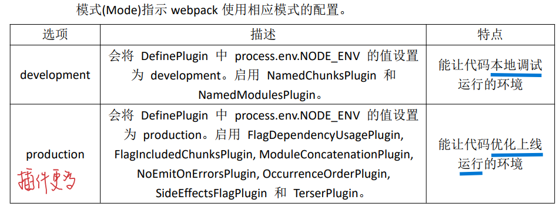

## 2 webpack初体验
- 1 初始化package.json(即初始化项目)，在webpack文件加下直接初始化，这里初始化过程中填写的项目内容后期均可以在package.json文件中进行修改
```
npm init
```   
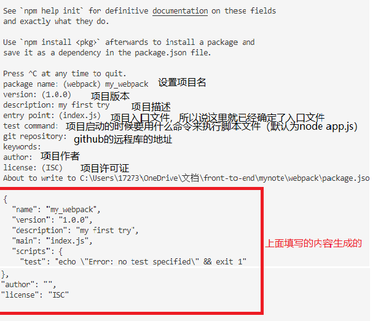  
- package.json中的内容：    
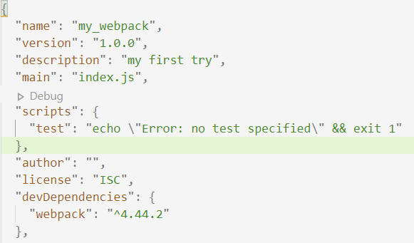  
- 2 将webpack直接安装到`webpack`文件夹下  
```  
npm install webpack webpack-cli -g  //全局安装
npm install webpack webpack-cli -D  //本地安装
```     
-   
  - 注意：这一步可能会出现以下问题    
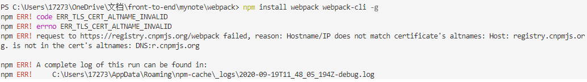    
  - 解决办法：执行下面的命令  
```  
npm config set registry http://registry.npmjs.org  
 // 如果上面的操作执行了还有问题，则可以将镜像改为淘宝  
 npm config set registry http://registry.npm.taobao.org  
```   
- 3 编译打包  
    - 开发环境指令：`webpack ./src/js/index.js -o ./build/js/built.js --mode=production`
    - 生产环境指令：`webpack ./src/jsindex.js -o ./build/jsbuilt.js -mode=production`
    - 以开发环境打包得到结果：    
  
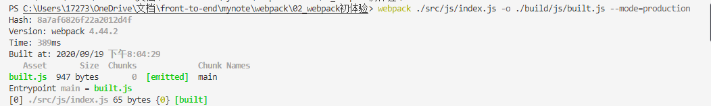  
    - 观察开发环境和生产环境下的打包结果，可以发现在**开发环境下的打包结果压缩了**  
- 另外，可以发现webpack可以直接编译打包的文件有：js和json
- 其他的文件不能直接编译打包，比如css,img.less等，这些文件需要借助loader工具预先处理，html等文件需要借助插件plugin进行预先处理

## 3 webpack开发环境的基本配置

- 注意：一旦确定以某个js文件作为入口文件，则需要**将其他需要编译打包的文件import到该入口文件中**，例如：  
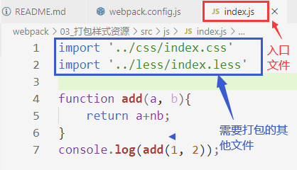

#### 3.1 创建配置文件webpack.config.js
- 这是webpack的配置文件，直接指示webpack如何干活，干哪些活
- 配置文件的基本内容如下：**只包含js或者json的编译打包时webpack.config.js的文件的内容**：
    
```
// 引入nodejs的内置path模块，处理路径问题
const {resolve} = require('path');  

// 设置编译打包的输出
module.exports = {
    // 入口文件
    entry:'./src/js/index.js',
    // 输出配置
    output:{
        filename:'./build/js/built.js',
        // 输出路径
        // __dirname是nodejs的一个变量，表示当前文件(webpack.config.js)的目录路径
        path: resolve(__dirname, 'built.js')W
        // 上面两句话的意思：文件输出到webpack.config.js文件的目录/build/built.js
    },
    // loader配置
    module:{
        // 详细地loader配置
       rules:[] 
    },
    // plugin配置
    plugins:[
        // 详细配置
    ],
    // 设置开发环境
    mode: 'development'
}
```
  
- 编译打包的结果：  
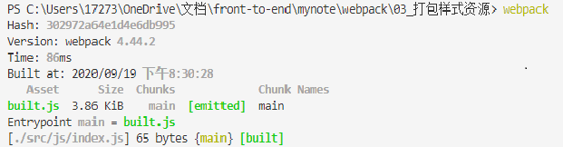

#### 3.2 打包样式资源 css less
- 首先确定入口文件，将其他需要打包的文件(css,less)引入到入口文件中  


- 1 下载安装loader包:`css-loader style-loader less-loader`以及`less`
  
```
// 第一种方法：
npm install style-loader css-loader less-loader less -g

// 使用了第一种方法后面webpack有问题，可以使用第二种方法：
npm install style-loader --save
npm install css-loader --save
npm install less-loader --save
npm install less --save
```
  
- 2 在上面的webpack.config.js中直接修改module的内容
  
```
module: {
   rules:[
       // 详细地loader配置
       // 对于不同的文件需要配置不同的loader处理

       // 1 css文件
       {
           // 设置匹配哪些文件，使用正则表达式，下面表示匹配以css结尾的文件
           test:/\.css$/,
           // 进行哪些loader处理
           use: [
               // user中loader执行顺序：从右至左 依次执行
               // 首先css-loader将css文件变成commonjs模块加载到目标js文件中，以字符串样式呈现
               // 然后style-loader将目标js文件中的样式资源插入style标签中，添加到head中
               'style-loader','css-loader'
           ]
       },

       // 2 less文件
       {
        // 设置匹配哪些文件，使用正则表达式，下面表示匹配以css结尾的文件
        test:/\.less$/,
        // 进行哪些loader处理
        use: [
            // user中loader执行顺序：从右至左 依次执行
            // 首先less-loader将less文件编译成css文件
            // 然后css-loader将css文件变成commonjs模块加载到目标js文件中，以字符串样式呈现
            // 最后style-loader将目标js文件中的样式资源插入style标签中，添加到head中
            'style-loader','css-loader','less-loader'
        ]
    }
   ] 
},
```
  
- 3 然后使用webpack编译打包，效果如下：  
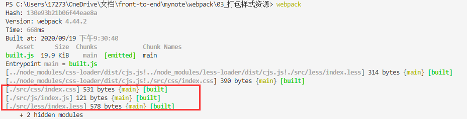

### 3.3 打包HTML资源:plugins
- html文件不用import进入口文件，在html中也不需要引入js文件或者less文件
- 1 下载html-webpack-plugin插件处理包
   
```
npm install html-webpack-plugin --save
```
  
- 2 修改webpack.config.js中plugins部分的内容
    
```
plugins:[
    // html-webpack-plugin插件配置
    new HtmlWebpackPlugin()
],
```

- 3 执行webpack命令，得到结果：  
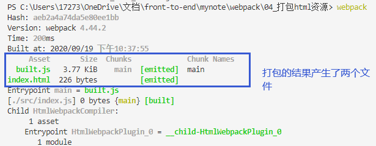

### 3.4 图片资源的打包
- 1 安装包：
  -  首先，需要使用`html-loader`引入html中的图片到目标js文件中，所以先安装`html-loader`
   
  ```
  npm install html-loader ---save
  ```
    
  - 默认情况下，webpack处理不了img图片，处理样式中的图片资源需要借助`url-loader`,而它又是依赖于`file-loader`产生作用的，所以首先就需要下载这两个loader包；另外，处理html中的图片需要使用'html-loader'先将图片引入到目标js文件中，然后再将使用`html-loader`解析图片的地址，所以也需要下载`html-loader`这个包
    
  ```
  npm install url-loader file-loader html-loader ---save
  ```
    
- 2 搭配项目：  
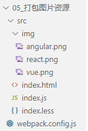
  - ./src/index.html文件的内容：不需要引入less文件
    
  ```
  <!DOCTYPE html>
  <html lang="en">
  <head>
      <meta charset="UTF-8">
      <meta name="viewport" content="width=device-width, initial-scale=1.0">
      <title>Document</title>
  </head>
  <body>
      <div id="div1"></div>
      <div id="div2"></div>
      <div id="div3"></div>
      
  </body>
  </html>
  ```

- 3 配置webpack.config.js文件：
  - 执行顺序：
    - （1）通过入口文件开始打包，html-loader解析HTML文件中的图片文件
    -  (2) less-loader,css-loader,style-loader处理样式文件
    -  (3) url-loader解析样式中的图片路径问题，file-laoder处理其他文件格式
    -  (4) Plugins中的html-webpack-plugin则负责打包HTML文件;
   
```
const {resolve} = require('path');
const HtmlWebpackPlugin = require('html-webpack-plugin');

module.exports = {
    entry:'./src/index.js',
    output:{
        filename:'built.js',
        path:resolve(__dirname, 'build')
    },
    module:{
        rules:[
            // less文件
            {
                test:/\.less$/,
                use:['style-loader','css-loader','less-loader']
            },
            {
                // 1 匹配html文件，将html文件中的img引入目标js文件中，以commonjs模块化的形式
                test:/\.html$/,
                loader:'html-loader'
            },
            // png,jpg,gif
            {
                // 2 匹配图片，解析目标js文件中的样式的图片路径问题
                test:/\.(png|jpg|gif)$/,
                loader:'url-loader',
                options:{
                    // 限制如果图片大小小于12kb,则使用base64处理，这样可以减轻服务器的压力，但是如果图片太大使用base64处理就会导致请求速度变慢
                    limit:12*1024,
                    // 修改图片的命名，取图片的hash的前10位，ext表示取文件原来的扩展名
                    name: '[hash:10].[ext]'
                }
            }
        ]
    },
    plugins:[
        new HtmlWebpackPlugin({
            template: './src/index.html'
        })
    ],
    mode: 'development'
}
```
  
- 4 执行webpack指令，得到效果:  
  - 打包得到了4个文件，built.js,index.html,还有两张图片
  - 本来有3张图片，打包时却只有2张图片，这是因为还有一张图片的大小小于12kb,所以使用base64编码处理了
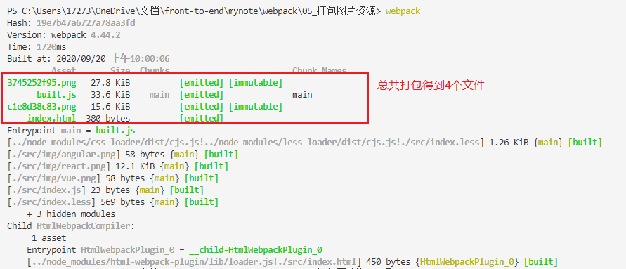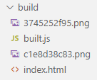

### 3.5 webpack打包其他资源
- 其他文件的打包方式：file-loader,排除js,css,html文件
  
```
module:{
    rules:[
        {
            test:/\.css$/,
            use:['style-loader','css-loader']
        },
        //打包其他资源（除了html,css,js之外的资源)
        {
            // 排除js,css,html文件
            exclude:/\.(js|css|html)$/,
            loader:'file-loader',
            options:{
                name: '[hash:10].[ext]'
            }
        }
    ]
}
```
  
- 例如：字体文件的打包：在网上下载一个字体包，然后找到下面的文件：  
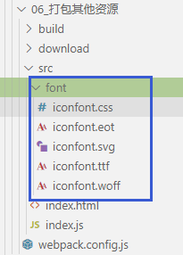
- html中内容如下：创建四个span,引入四个图标字体
   
```
<!DOCTYPE html>
<html lang="en">
<head>
    <meta charset="UTF-8">
    <meta name="viewport" content="width=device-width, initial-scale=1.0">
    <title>Document</title>
</head>
<body>
    <span class="iconfont icon-icon-test"></span>
    <span class="iconfont icon-icon-test2"></span>
    <span class="iconfont icon-icon-test3"></span>
    <span class="iconfont icon-icon-test1"></span>
</html>
```
  
- 在index.js中需要引入iconfont.css
- 向上面说的添加module的rules,配置webpack.config.js文件
- 执行webpack命令后效果：  
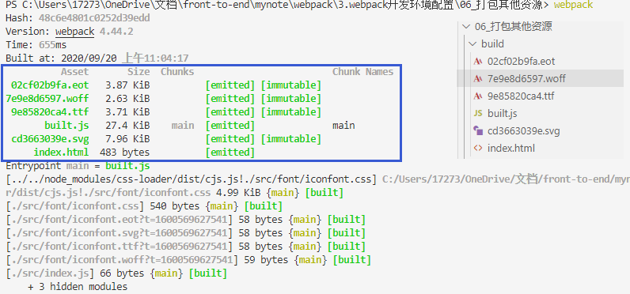

### 3.6 devServer
- 之前使用webpack打包需要每次添加一个新的内容就使用webpack命令编译打包一次，有些麻烦，所以出现了devServer,实现自动编译，自动打开浏览器，自动刷新
- 开发服务器有一个特点：只会在内存中编译打包，不会有任何输出，帮助我们在浏览器中实时观测页面的变化
- 1 首先需要下载`webpack-dev-server`这个包
    
```
npm install webpack-dev-server --save
npm install webpack-cli --save
```
  
- 2 在webpack.config.js文件中配置devserver:
  
```
const { resolve } = require("path");
const HtmlWebpackPlugin = require('html-webpack-plugin');

module.exports = {
    entry: './src/index.js',
    output:{
        filename:'built.js',
        path:resolve(__dirname, 'build')
    },
    module:{
        rules:[
            {
                test:/\.css$/,
                use:['style-loader','css-loader']
            },
            //打包其他资源（除了html,css,js之外的资源)
            {
                // 排出js,css,html文件
                exclude:/\.(js|css|html)$/,
                loader:'file-loader',
                options:{
                    name: '[hash:10].[ext]'
                }
            }
        ]
    },
    plugins:[
        new HtmlWebpackPlugin({
            template: './src/index.html'
        })
    ],
    mode:'development',

    // 开发服务器 devServer
    devServer: {
        // 项目构建后的路径
        contentBase: resolve(__dirname, 'build'),
        // 启动gzip压缩
        compress: true,
        // 指定端口号
        port: 3000,
        // 在启动devServer指令后，自动打开在浏览器中打开`localhost:3000`页面
        open: true
    }
}
```

- 3 启动devServer的指令：
  
```
npx webpack-dev-server
```
  
- 也就是说每次只要修改`./src`中的内容，即可直接在浏览器中看到变化,并且可以发现并没有生成新的打包文件，可以帮助我们得到满意的效果后再打包

### 3.7 开发环境的配置总结：
- webpack.config.js文件配置如下，负责匹配各个类型的文件，从而实现打包处理
  - 这里指定了各个文件的打包规则
  - 并且对于图片及其他文件的输出位置做了规定，让打包得到的文件关系更加清晰明了
  - 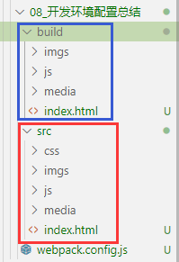
    
```
// nodejs的路径模块
const {resolve} = require('path');
// html文件打包的插件
const HtmlWebpackPlugin = require('html-webpack-plugin');

module.exports = {
    // 入口文件
    entry:'./src/js/index.js',
    // 只决定入口文件的输出位置和名字
    output:{
        filename:'js/built.js',
        path:resolve(__dirname, 'build')
    },
    // 配置各个资源的匹配规则和打包方式
    module:{
        rules:[
            // less   less文件和css文件会打包到js文件中保存
            {
                test:/\.less$/,
                use:['style-loader','css-loader','less-loader']
            },
            // css
            {
                test:/\.css$/,
                use:['style-loader','css-loader']
            },
            // 样式中的图片资源
            {
                test:/\.(png|jpg|gif)$/,
                loader:'url-loader',
                options:{
                    limit:10*1024,
                    name:'[hash:10].[ext]',
                    // 设定图片输出到哪个位置
                    outputPath:'imgs'
                }
                
            },
            // html中的图片资源
            {
                test:/\.html$/,
                loader:'html-loader'
            },
            // 其他的资源
            {
                exclude:/\.(html|css|less|js|jpg|png|gif)$/,
                loader:'file-loader',
                options:{
                    name:'[hash:10].[ext]',
                    // 设置其他文件打包到media目录下
                    outputPath:'media'
                }
            }
        ]
    },
    plugins:[
        // 打包html文件
        new HtmlWebpackPlugin({
            template:'./src/index.html'
        })
    ],
    // 设置开发模式
    mode:'development',
    // 开启自启动浏览器，自更新服务
    devServer:{
        contentBase: resolve(__dirname, 'build'),
        compress: true,
        port:3000,
        open:true
    }
}
```
  

## 4 webpack构建生产环境介绍

### 4.1 在开发模式下提取css为单独文件
- 在开发模式下，css文件打包后会直接存在于js文件中，如果想要提取css文件，需要下载一个插件：
  - 这个插件在下载后，存在一个loader，可以将目标js文件中的样式提取出来成为一个单独的main.css文件，然后在打包得到的index.html中会自动引入该css文件
    
```
npm install mini-css-extract-plugin --save
```
  
- 项目的内容：  
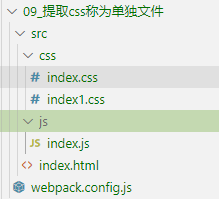
- 修改webpack.config.js的内容：
   
```
const {resolve} = require('path'); 
const HtmlWebpackPlugin = require('html-webpack-plugin');
const MiniCssExtractPlugin = require('mini-css-extract-plugin');

module.exports = {
    entry: './src/js/index.js',
    output:{
        filename:'js/built.js',
        path:resolve(__dirname, 'build')
    },
    module:{
        rules:[
            // css文件
            {
                test:/\.css$/,
                use:[
                    // 这个插件.loader取代了style-loader
                    // style-loader将样式内容从js中文件中读出，然后放在style标签中
                    // 这个loader直接提取js中的样式内容成为单独文件
                    MiniCssExtractPlugin.loader,
                    'css-loader'
                ],
                // options:{
                //     outputPath: 'css'
                // }
            }
        ]
    },
    plugins:[
        new HtmlWebpackPlugin({
            template: './src/index.html'
        }),
        new MiniCssExtractPlugin()
    ],
    mode: 'development'
}
```
  
- 使用webpack命令打包之后得到的结果为：  
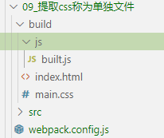
- 当然我们可以自定义css文件的名字和位置：
    
```
plugins:[
    new HtmlWebpackPlugin({
        template: './src/index.html'
    }),
    new MiniCssExtractPlugin({
        // 对输出的文件进行重命名
        filename:'css/index.css'
    })
],
```  
  
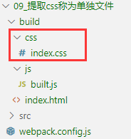

### 4.2 css兼容性处理
- 如果css样式中存在一些浏览器不兼容的样式，就会出现兼容性问题，此时就需要使用postcss处理
- 首先需要下载两个包：`postcss-loader postcss-preset-env`
    
```
npm install postcss-loader postcss-preset-env --save
```
  
- 在css文件中添加两个不兼容的样式：
    
```
display: flex;
backface-visibility: hidden;
```
  
- 写配置webpack.config.js
    
```
const { resolve } = require('path');
const HtmlWebpackPlugin = require('html-webpack-plugin');
const MiniCssExtractPlugin = require('mini-css-extract-plugin');

// 设置nodejs环境变量
process.env.NODE_ENV = 'development';

module.exports = {
  entry: './src/js/index.js',
  output: {
    filename: 'js/built.js',
    path: resolve(__dirname, 'build')
  },
  module: {
    rules: [
      {
        test: /\.css$/,
        use: [
          MiniCssExtractPlugin.loader,
          'css-loader',


          // 修改loader的配置
          {
            loader: 'postcss-loader',
          }


        ]
      }
    ]
  },
  plugins: [
    new HtmlWebpackPlugin({
      template: './src/index.html'
    }),
    new MiniCssExtractPlugin({
      filename: 'css/built.css'
    })
  ],
  mode: 'development'
};
```
  
- 新建文件：postcss.config.js
    
```
module.exports = {
  plugins: [  
    // postcss的插件
    require('postcss-preset-env')()
  ]
}
```
  
- 在package.json中添加以下内容：默认会使用生产模式，所以我们在上面的文件中即使设置为开发模式，打包时也会默认使用生产模式打包
  - 要想变成开发环境，需要设置node环境变量：process.env.NODE_ENV = 'development';
    
```
"browserslist":{
    // 开发环境
  "development":[
    "last 1 chrome version",
    "last 1 firefox version",
    "last 1 safari version"
  ],
  // 生产环境
  "production":[
    ">0.2%",
    "not dead",
    "not op_mini all"
  ]
}
```
  
- 上面的内容就是帮postcss找到package.json中browserlist里面的配置，通过配置加载指定的css兼容性样式
- 然后执行webpack命令，可以得到此时打包得到的css文件的内容为：  
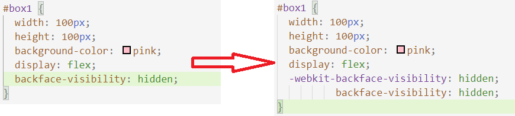

### 4.3 压缩css
- 需要引入一个插件：
    
```
npm install optimize-css-assets-webpack-plugin --save
```
  
- 在webpack.config.js中添加配置：
    
```
const OptimizeCssAssetsWebpackPlugin = require('optimize-css-assets-webpack-plugin');
plugins:[
    new OptimizeCssAssetsWebpackPlugin()
]
```
  
- 运行webpack指令后得到结果：  
  - 可以发现此时css文件中的内容就被压缩啦  
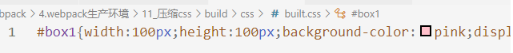

### 4.4 js语法检查eslint
- 语法检查只检查用户自己写的代码，不检查第三方库引入的代码
- 首先需要下载eslint和eslint-loader
    
```
npm install eslint eslint-loader --save
```
  
- 添加配置
    
```
rules:[
    {
        test:/\.js$/,
        // 不检查第三方库引入的代码
        exclude:/node_modules/,
        loader:'eslint-loader',
        options:{
            
        }
    }
]
```
  
- 设置检查规则，在package.json中eslintConfig中设置
  - airbib --> eslint-config-airbnb-base eslint eslint-plugin-import
  - 所以还需要下载`eslint-plugin-import`和`eslint-config-airbnb-base`
  
```

```
