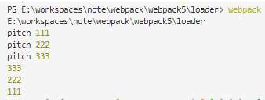

<!-- TOC -->

- [个人笔记](#个人笔记)
  - [1 webpack 基本概念](#1-webpack-基本概念)
      - [1.1 webpack 的 5 个核心概念](#11-webpack-的-5-个核心概念)
  - [2 webpack 初体验](#2-webpack-初体验)
  - [3 webpack 开发环境的基本配置](#3-webpack-开发环境的基本配置)
      - [3.1 创建配置文件 webpack.config.js](#31-创建配置文件-webpackconfigjs)
      - [3.2 打包样式资源 css less](#32-打包样式资源-css-less)
    - [3.3 打包 HTML 资源:plugins](#33-打包-html-资源plugins)
    - [3.4 图片资源的打包](#34-图片资源的打包)
    - [3.5 webpack 打包其他资源](#35-webpack-打包其他资源)
    - [3.6 devServer](#36-devserver)
    - [3.7 开发环境的配置总结：](#37-开发环境的配置总结)
  - [4 webpack 构建生产环境介绍](#4-webpack-构建生产环境介绍)
    - [4.1 在开发模式下提取 css 为单独文件](#41-在开发模式下提取-css-为单独文件)
    - [4.2 css 兼容性处理](#42-css-兼容性处理)
    - [4.3 压缩 css](#43-压缩-css)
    - [4.4 js 语法检查 eslint](#44-js-语法检查-eslint)

<!-- /TOC -->

# WebPack个人笔记

## 1 webpack 基本概念

```
webpack 是一种前端资源构建工具，一个静态的模块打包器(module bundler)

webpack 会将所有的 js/json/less/img/css 等文件均作为模块处理

它会设定一个入口文件，通过分析各个模块的依赖关系形成一个依赖关系图，然后依次将所有模块打包成静态资源(bundle)

中文文档不是最新的，可以直接查看英文文档 https://webpack.js.org/
```


chunk都是根据0,1,2,3作为id编号的，第一个chunk包含两个bundle，一个是js，一个是css,第二个chunk包含一个js文件

#### 1.1 webpack 的 5 个核心概念

- Entry
  - 入口(Entry)指示 webpack 以哪个文件为入口起点开始打包，分析构建内部依赖图。
  
- Output
  - 输出(Output)指示 webpack 打包后的资源 bundles 输出到哪里去，以及如何命名。
  
- Loader
  - loader 是预处理器, 让 webpack 能够去处理那些非 JavScript 文件(webpack 自身只理解 JavScript)
    - 识别出应该被loader转化的文件， 使用test属性
    - 转换这些文件，使他们添加到依赖图中，最终添加到bundle中，使用use属性
  
- Plugins
  - 插件(Plugins)可以用于执行范围更广的任务。插件的范围包括，从打包优化和压缩，一直到重新定义环境中的变量等。`plugins` 选项用于以各种方式自定义 webpack 构建过程。
  - loader即为文件加载器，操作的是文件，将文件A通过loader转换成文件B，是一个单纯的文件转化过程。
  - plugin即为插件，是一个扩展器，丰富webpack本身，增强功能 ，针对的是在loader结束之后，webpack打包的整个过程，他并不直接操作文件，而是基于事件机制工作，监听webpack打包过程中的某些节点，执行广泛的任务。
  
- Mode  
  
  **开发环境**是程序猿们专门用于开发的服务器，配置可以比较随意， 为了开发调试方便，一般打开全部错误报告。(程序员接到需求后，开始写代码，开发，运行程序，看看程序有没有达到预期的功能；
  
  **测试环境**：一般是克隆一份生产环境的配置，一个程序在测试环境工作不正常，那么肯定不能把它发布到生产机上。(程序员开发完成后，交给测试部门全面的测试，看看所实现的功能有没有bug，测试人员会模拟各种操作情况；
  
  **生产环境**是指正式提供对外服务的，一般会关掉错误报告，打开错误日志。(就是线上环境，发布到对外环境上，正式提供给客户使用的环境。
  
  

## 2 webpack 初体验

- 1 初始化 package.json(即初始化项目)，在 webpack 文件加下直接初始化，这里初始化过程中填写的项目内容后期均可以在 package.json 文件中进行修改

```
npm init
```


- package.json 中的内容：  
  
- 2 将 webpack 直接安装到`webpack`文件夹下

```
npm install webpack webpack-cli -g  //全局安装
npm install webpack webpack-cli -D  //本地安装
```

-
- 注意：这一步可能会出现以下问题  
  
- 解决办法：执行下面的命令

```
npm config set registry http://registry.npmjs.org
 // 如果上面的操作执行了还有问题，则可以将镜像改为淘宝
 npm config set registry http://registry.npm.taobao.org
```

- 3 编译打包
  - 开发环境指令：`webpack ./src/js/index.js -o ./build/js/built.js --mode=production`
  - 生产环境指令：`webpack ./src/jsindex.js -o ./build/jsbuilt.js -mode=production`
  - 以开发环境打包得到结果：


- 观察开发环境和生产环境下的打包结果，可以发现在**开发环境下的打包结果压缩了**

- 另外，可以发现 webpack 可以直接编译打包的文件有：js 和 json
- 其他的文件不能直接编译打包，比如 css,img.less 等，这些文件需要借助 loader 工具预先处理，html 等文件需要借助插件 plugin 进行预先处理

## 3 webpack 开发环境的基本配置

- 注意：一旦确定以某个 js 文件作为入口文件，则需要**将其他需要编译打包的文件 import 到该入口文件中**，例如：  
  

### 3.1 创建配置文件 webpack-config.js

- 这是 webpack 的配置文件，直接指示 webpack 如何干活，干哪些活
- 配置文件的基本内容如下：**只包含 js 或者 json 的编译打包时 webpack-config.js 的文件的内容**：

```
// 引入nodejs的内置path模块，处理路径问题
const {resolve} = require('path');

// 设置编译打包的输出
module.exports = {
    // 入口文件
    entry:'./src/js/index.js',
    // 输出配置
    output:{
        filename:'./build/js/built.js',
        // 输出路径
        // __dirname是nodejs的一个变量，表示当前文件(webpack.config.js)的目录路径
        path: resolve(__dirname, 'built.js')
        // 上面两句话的意思：文件输出到webpack.config.js文件的目录/build/built.js
    },
    // loader配置
    module:{
        // 详细地loader配置
       rules:[]
    },
    // plugin配置
    plugins:[
        // 详细配置
    ],
    // 设置开发环境
    mode: 'development'
}
```

- 编译打包的结果：  
  

### 3.2 打包样式资源 css less

- 首先确定入口文件，将其他需要打包的文件(css,less)引入到入口文件中  
  

- 1 下载安装 loader 包:`css-loader style-loader less-loader`以及`less`

```
// 第一种：全局安装：
npm install style-loader css-loader less-loader less -g

// 使用了第一种方法后面webpack有问题，可以使用第二种：
npm install style-loader --save
npm install css-loader --save
npm install less-loader --save
npm install less --save
```

- 2 在上面的 webpack.config.js 中直接修改 module 的内容

```
module: {
   rules:[
       // 详细地loader配置
       // 对于不同的文件需要配置不同的loader处理

       // 1 css文件
       {
           // 设置匹配哪些文件，使用正则表达式，下面表示匹配以css结尾的文件
           test:/\.css$/,
           // 进行哪些loader处理
           use: [
               // user中loader执行顺序：从右至左 依次执行
               // 首先css-loader将css文件变成commonjs模块加载到目标js文件中，以字符串样式呈现
               // 然后style-loader将目标js文件中的样式资源提取出来插入style标签中，添加到head中
               'style-loader','css-loader'
           ]
       },

       // 2 less文件
       {
        // 设置匹配哪些文件，使用正则表达式，下面表示匹配以css结尾的文件
        test:/\.less$/,
        // 进行哪些loader处理
        use: [
            // user中loader执行顺序：从右至左 依次执行
            // 首先less-loader将less文件编译成css文件
            // 然后css-loader将css文件变成commonjs模块加载到目标js文件中，以字符串样式呈现
            // 最后style-loader将目标js文件中的样式资源插入style标签中，添加到head中
            'style-loader','css-loader','less-loader'
        ]
    }
   ]
},
```

- 3 然后使用 webpack 编译打包，效果如下：  
- 
- 注意：此时样式文件会变成commonJS模块插入到built.js中，此时style-loader尚未起作用，**此时还未对html文件进行打包，所以可以手动创建一个index.html，引入built.js,则可以看到在运行后的浏览器的html组成中多出了一个style标签**

### 3.3 打包 HTML 资源:plugins

- html 文件不用 import 进入口文件，在 html 中也不需要引入 js 文件或者 less 文件
- 1 下载 html-webpack-plugin 插件处理包

```
npm install html-webpack-plugin --save
```

- 2 修改 webpack.config.js 中 plugins 部分的内容

```
plugins:[
    // html-webpack-plugin插件配置
    // 默认会创建一个没有任何结构和样式的html文件，引入打包输出的所有资源(js/css/less)
    new HtmlWebpackPlugin({
    	// 复制这个文件，并引入打包输出的所有资源(js/css/less)
    	template:'./src/index.html'
    })
],

注意：此时由于样式文件并没有单独输出，则只会引入built.js,即此时style-loader还未其起到作用
```

- 3 执行 webpack 命令，得到结果：  
  
- 注意：**style-loader产生的style标签并不会直接显示在打包后的html中，当我们运行打包得到的index.html文件时，就可以看到在浏览器的开发工具下的元素的Head中出现了一个style标签**，即在浏览器中打开时，style-loader才会解析built.js中的样式模块，将其提取出来产生一个style标签，插入到html中
- 

### 3.4 图片资源的打包

- 1 安装包：
  
  - 首先，需要使用`html-loader`引入 html 中的图片到目标 js 文件中，所以先安装`html-loader`
  ```
  npm install html-loader ---save
  ```
  - 默认情况下，webpack 处理不了 img 图片，处理样式中的图片资源需要借助`url-loader`,而它又是依赖于`file-loader`产生作用的，所以首先就需要下载这两个 loader 包；另外，处理 html 中的图片需要使用'html-loader'先将图片引入到目标 js 文件中，然后再将使用`html-loader`解析图片的地址，所以也需要下载`html-loader`这个包
  ```
  npm install url-loader file-loader html-loader ---save
  ```
- 2 搭配项目：  
  

  - ./src/index.html 文件的内容：不需要引入 less 文件

  ```
  <!DOCTYPE html>
  <html lang="en">
  <head>
      <meta charset="UTF-8">
      <meta name="viewport" content="width=device-width, initial-scale=1.0">
      <title>Document</title>
  </head>
  <body>
      <div id="div1"></div>
      <div id="div2"></div>
      <div id="div3"></div>
      
  </body>
  </html>
  ```

- 3 配置 webpack.config.js 文件：
  - 执行顺序：
    - （1）通过入口文件开始打包，html-loader 解析 HTML 文件中的图片文件
    - (2) less-loader,css-loader,style-loader 处理样式文件
    - (3) url-loader 解析样式中的图片路径问题，file-laoder 处理其他文件格式
    - (4) Plugins 中的 html-webpack-plugin 则负责打包 HTML 文件;

```
const {resolve} = require('path');
const HtmlWebpackPlugin = require('html-webpack-plugin');

module.exports = {
    entry:'./src/index.js',
    output:{
        filename:'built.js',
        path:resolve(__dirname, 'build')
    },
    module:{
        rules:[
            // less文件
            {
                test:/\.less$/,
                use:['style-loader','css-loader','less-loader']
            },
            {
                // 1 匹配html文件，将html文件中的img引入目标js文件中，以commonjs模块化的形式
                test:/\.html$/,
                loader:'html-loader'
            },
            // png,jpg,gif
            {
                // 2 匹配图片，解析目标js文件中的样式的图片路径问题
                test:/\.(png|jpg|gif)$/,
                loader:'url-loader',
                options:{
                    // 限制如果图片大小小于12kb,则使用base64处理，这样可以减轻服务器的压力，但是如果图片太大使用base64处理就会导致请求速度变慢
                    limit:12*1024,
                    // 修改图片的命名，取图片的hash的前10位，ext表示取文件原来的扩展名
                    name: '[hash:10].[ext]'
                }
            }
        ]
    },
    plugins:[
        new HtmlWebpackPlugin({
            template: './src/index.html'
        })
    ],
    mode: 'development'
}
```

- 4 执行 webpack 指令，得到效果:
  - 打包得到了 4 个文件，built.js,index.html,还有两张图片
  - 本来有 3 张图片，打包时却只有 2 张图片，这是因为还有一张图片的大小小于 12kb,所以使用 base64 编码处理了
    

### 3.5 webpack 打包其他资源

- 其他文件的打包方式：file-loader,排除 js,css,html 文件

```
module:{
    rules:[
        {
            test:/\.css$/,
            use:['style-loader','css-loader']
        },
        //打包其他资源（除了html,css,js之外的资源)
        {
            // 排除js,css,html文件
            exclude:/\.(js|css|html)$/,
            loader:'file-loader',
            options:{
                name: '[hash:10].[ext]'
            }
        }
    ]
}
```

- 例如：字体文件的打包：在网上下载一个字体包，然后找到下面的文件：  
  
- html 中内容如下：创建四个 span,引入四个图标字体

```
<!DOCTYPE html>
<html lang="en">
<head>
    <meta charset="UTF-8">
    <meta name="viewport" content="width=device-width, initial-scale=1.0">
    <title>Document</title>
</head>
<body>
    <span class="iconfont icon-icon-test"></span>
    <span class="iconfont icon-icon-test2"></span>
    <span class="iconfont icon-icon-test3"></span>
    <span class="iconfont icon-icon-test1"></span>
</html>
```

- 在 index.js 中需要引入 iconfont.css
- 向上面说的添加 module 的 rules,配置 webpack.config.js 文件
- 执行 webpack 命令后效果：  
  

### 3.6 devServer

- 之前使用 webpack 打包需要每次添加一个新的内容就使用 webpack 命令编译打包一次，有些麻烦，所以出现了 devServer,实现自动编译，自动打开浏览器，自动刷新
- 开发服务器有一个特点：只会在内存中编译打包，不会输出打包结果，帮助我们在浏览器中实时观测页面的变化
- 1 首先需要下载`webpack-dev-server`这个包

```
npm install webpack-dev-server --save
```

- 2 在 webpack.config.js 文件中配置 devserver:

```
const { resolve } = require("path");
const HtmlWebpackPlugin = require('html-webpack-plugin');

module.exports = {
    entry: './src/index.js',
    output:{
        filename:'built.js',
        path:resolve(__dirname, 'build')
    },
    module:{
        rules:[
            {
                test:/\.css$/,
                use:['style-loader','css-loader']
            },
            //打包其他资源（除了html,css,js之外的资源)
            {
                // 排出js,css,html文件
                exclude:/\.(js|css|html)$/,
                loader:'file-loader',
                options:{
                    name: '[hash:10].[ext]'
                }
            }
        ]
    },
    plugins:[
        new HtmlWebpackPlugin({
            template: './src/index.html'
        })
    ],
    mode:'development',

    // 开发服务器 devServer
    devServer: {
        // 项目构建后的路径
        contentBase: resolve(__dirname, 'build'),
        // 启动gzip压缩
        compress: true,
        // 指定端口号
        port: 3000,
        // 在启动devServer指令后，自动打开在浏览器中打开`localhost:3000`页面
        open: true
    }
}
```

- 3 启动 devServer 的指令：

```
npx webpack-dev-server
```

- 也就是说每次只要修改`./src`中的内容，即可直接在浏览器中看到变化,并且可以发现并没有生成新的打包文件，可以帮助我们得到满意的效果后再打包

### 3.7 开发环境的配置总结：

- webpack.config.js 文件配置如下，负责匹配各个类型的文件，从而实现打包处理
  - 这里指定了各个文件的打包规则
  - 并且对于图片及其他文件的输出位置做了规定，让打包得到的文件关系更加清晰明了
  - 

```
// nodejs的路径模块
const {resolve} = require('path');
// html文件打包的插件
const HtmlWebpackPlugin = require('html-webpack-plugin');

module.exports = {
    // 入口文件
    entry:'./src/js/index.js',
    // 只决定入口文件的输出位置和名字
    output:{
        filename:'js/built.js',
        path:resolve(__dirname, 'build')
    },
    // 配置各个资源的匹配规则和打包方式
    module:{
        rules:[
            // less   less文件和css文件会打包到js文件中保存
            {
                test:/\.less$/,
                use:['style-loader','css-loader','less-loader']
            },
            // css
            {
                test:/\.css$/,
                use:['style-loader','css-loader']
            },
            // 样式中的图片资源
            {
                test:/\.(png|jpg|gif)$/,
                loader:'url-loader',
                options:{
                    limit:10*1024,
                    name:'[hash:10].[ext]',
                    // 设定图片输出到哪个位置
                    outputPath:'imgs'
                }

            },
            // html中的图片资源
            {
                test:/\.html$/,
                loader:'html-loader'
            },
            // 其他的资源
            {
                exclude:/\.(html|css|less|js|jpg|png|gif)$/,
                loader:'file-loader',
                options:{
                    name:'[hash:10].[ext]',
                    // 设置其他文件打包到media目录下
                    outputPath:'media'
                }
            }
        ]
    },
    plugins:[
        // 打包html文件
        new HtmlWebpackPlugin({
            template:'./src/index.html'
        })
    ],
    // 设置开发模式
    mode:'development',
    // 开启自启动浏览器，自更新服务
    devServer:{
        contentBase: resolve(__dirname, 'build'),
        compress: true,
        port:3000,
        open:true
    }
}
```

## 4 webpack 构建生产环境

### 4.1 提取 css 为单独文件

- 在开发模式下，如果想要提取 css 文件为一个单独的文件，不和js文件混杂，需要下载一个插件：
  - 这个插件在下载后，存在一个 loader，可以将目标 js 文件中的样式提取出来成为一个单独的 main.css 文件，然后在打包得到的 index.html 中会自动引入该 css 文件

```
npm install mini-css-extract-plugin --save
```

- 项目的内容：  
  
- 修改 webpack.config.js 的内容：

```
const {resolve} = require('path');
const HtmlWebpackPlugin = require('html-webpack-plugin');
const MiniCssExtractPlugin = require('mini-css-extract-plugin');

module.exports = {
    entry: './src/js/index.js',
    output:{
        filename:'js/built.js',
        path:resolve(__dirname, 'build')
    },
    module:{
        rules:[
            // css文件
            {
                test:/\.css$/,
                use:[
                    // 这个插件.loader取代了style-loader
                    // style-loader将样式内容从js中文件中读出，然后放在style标签中
                    // 这个loader直接提取js中的样式内容成为单独文件
                    MiniCssExtractPlugin.loader,
                    'css-loader'
                ],
                // options:{
                //     outputPath: 'css'
                // }
            }
        ]
    },
    plugins:[
        new HtmlWebpackPlugin({
            template: './src/index.html'
        }),
        new MiniCssExtractPlugin()
    ],
    mode: 'development'
}
```

- 使用 webpack 命令打包之后得到的结果为：  
  
- 当然我们可以自定义 css 文件的名字和位置：

```
plugins:[
    new HtmlWebpackPlugin({
        template: './src/index.html'
    }),
    new MiniCssExtractPlugin({
        // 对输出的文件进行重命名
        filename:'css/index.css'
    })
],
```


注意：**此时查看index.html可以发现它引入了两个文件：index.css和built.js**


### 4.2 css 兼容性处理

- 如果 css 样式中存在一些浏览器不兼容的样式，就会出现兼容性问题，此时就需要使用 postcss 处理
- 首先需要下载两个包：`postcss-loader postcss-preset-env`

```
npm install postcss-loader postcss-preset-env --save
```

- 在 css 文件中添加两个不兼容的样式：

```
display: flex;
backface-visibility: hidden;
```

- 写配置 webpack.config.js

```
const { resolve } = require('path');
const HtmlWebpackPlugin = require('html-webpack-plugin');
const MiniCssExtractPlugin = require('mini-css-extract-plugin');

// 设置nodejs环境变量，不设置时默认是生产环境
process.env.NODE_ENV = 'development';

module.exports = {
  entry: './src/js/index.js',
  output: {
    filename: 'js/built.js',
    path: resolve(__dirname, 'build')
  },
  module: {
    rules: [
      {
        test: /\.css$/,
        use: [
          MiniCssExtractPlugin.loader,
          'css-loader',
          // 修改loader的配置
          {
            loader: "postcss-loader",
            options: {
              postcssOptions: {
                ident: "postcss",
                plugins: () => [
                  // 帮postcss找到package.json中browserslist里面的配置，通过配置加载指定的css兼容性样式
                  require("postcss-preset-env")(),
                ],
              },
            },
          },
        ]
      }
    ]
  },
  plugins: [
    new HtmlWebpackPlugin({
      template: './src/index.html'
    }),
    new MiniCssExtractPlugin({
      filename: 'css/built.css'
    })
  ],
  mode: 'development'
};
```

- 在 package.json 中添加以下内容，指定在不同的模式下兼容哪些版本的浏览器，默认情况下，使用生产模式的兼容性

```
"browserslist":{ 
    // 开发环境
  "development":[
    "last 1 chrome version",
    "last 1 firefox version",
    "last 1 safari version"
  ],
  // 生产环境
  "production":[
    ">0.2%",
    "not dead",
    "not op_mini all"
  ]
}
```

- 要想将兼容性修改为开发环境下的配置，需要设置 node 环境变量：process.env.NODE_ENV = 'development';
  - 不设置node环境变量时，默认是匹配下面的生产环境的兼容性
  - 可以添加别的配置项
- 上面的内容就是帮 postcss 找到 package.json 中 browserlist 里面的配置，通过配置加载指定的 css 兼容性样式
- 然后执行 webpack 命令，可以得到此时打包得到的 css 文件的内容为：  
  

### 4.3 压缩 css

- 需要引入一个插件：

```
npm install optimize-css-assets-webpack-plugin --save
```

- 在 webpack.config.js 中添加配置：

```
const OptimizeCssAssetsWebpackPlugin = require('optimize-css-assets-webpack-plugin');

plugins:[
    new OptimizeCssAssetsWebpackPlugin()
]
```

- 运行 webpack 指令后得到结果：
  - 可以发现此时 css 文件中的内容就被压缩啦  
    

### 4.4 js 语法检查 eslint

- 语法检查只检查用户自己写的代码，不检查第三方库引入的代码
- 首先需要下载 eslint 和 eslint-loader

```
npm install eslint eslint-loader --save

在 package.json 设置检查规则：
"eslintConfig": {
    "extends": "airbnb-base",
    "env": {
      "browser": true     // 设置匹配浏览器环境，从而可以识别浏览器的全局变量
    }
  }

安装包：下载`eslint-plugin-import`和`eslint-config-airbnb-base`
```

- 添加配置

```
rules:[
    {
        test:/\.js$/,
        // 不检查第三方库引入的代码
        exclude:/node_modules/,
        loader:'eslint-loader',
        options:{
        	fix:true;  // 自动修复格式中存在的问题
        }
    }
]
```

但是注意：这里对于js文件的语法检查，不包括将es6语句转换为js语句，所以如果js文件中存在es6新语法，则打包后的文件在不兼容该新语法的浏览器中就会报错

```
例如:
const add = (x, y) => x + y;
// 下一行eslint所有规则均失效（下一行不进行eslint检查)
// eslint-disable-next-line
console.log(add(1, 2));

打包后：
eval("var add = (x, y) => {\n  return x + y;\n};\n// 下一行eslint所有规则均失效（下一行不进行eslint检查)\n// eslint-disable-next-line\nconsole.log(add(1, 2));\n\n\n//# sourceURL=webpack:///./src/js/index.js?");

箭头函数还是箭头函数，ie11是不支持箭头函数的，需要使用babel转换
```

### 4.5 js兼容性处理，es6->es5

#### 4.5.1 方法1

打包时将es6新语法转换为js语句,注意各个包之间的版本兼容性,参考[webpack,es6转es5](https://blog.csdn.net/qq_32842925/article/details/83059208)

```
webpack 4.x | babel-loader 7.x | babel 6.x 版本
npm install -D babel-loader@7 babel-core@6 babel-preset-es2015 webpack@4
可以是babel-preset-env或者babel-preset-es2015

#webpack 4.x | babel-loader 8.x | babel 7.x 最新版本
yarn add babel-loader @babel/core @babel/preset-env -D
```

本文选择后面的配置：

```
rules:[
    {
        loader:'babel-loader',
        options:{
        	"presets": ["@babel/preset-env"]
        }
    }
]
```

使用`webpack`命令打包后，可以发现箭头函数和const等es6新语法已经变成了es5语法：

```
"use strict";
eval("\n\nvar add = function add(x, y) {\n  return x + y;\n}; // 下一行eslint所有规则均失效（下一行不进行eslint检查)\n// eslint-disable-next-line\nconsole.log(add(1, 2));\nvar a = 1;\n// eslint-disable-next-line\nconsole.log(a);\n\n//# sourceURL=webpack:///./src/js/index.js?");
```

这种方法的缺点：它只能转换一些es6的基本语法，类似于promise等不能做转换

#### 方法2：es6全部转es5

这种方法的缺点：引入文件的体积过大，为了解决部分兼容性问题，引入了所有的兼容性代码

```
第一步：yarn add babel-polyfill -D  
	或者 yarn add @babel/polyfill -D

第二步：在入口文件中引入：
import 'babel-polyfill'
// 或者 import '@babel/polyfill'
const promise = new Promise((resolve) => {
  console.log("lalalal");
});

第三步：
使用webpack命令打开即可,可以看到在未引入之前，打包后的promise是不能被识别的；在引入该包后，可以执行Promise语句
```


#### 方法3：按需加载

```
第一步：yarn add core-js -D

第二步：配置
首先：去除方法2中引入的兼容包
其次：
    presets: [
        [
          "@babel/preset-env",
          // 按需加载
          {
            useBuiltIns: "usage",
            corejs: {
              //core-js的版本
              version: 3,
            },
            //需要兼容的浏览器
            targets: {
              chrome: "60",
              firefox: "60",
              ie: "9",
              safari: "10",
              edge: "17",
            },
          },
        ],
      ],

第三步：webpack打包
```


### 4.6 html，js代码压缩

js压缩：设置`mode:"production"`，去除空格和注释

html压缩：去除空格和注释

```
new HtmlWebpackPlugin({
  template: "./src/index.html",
  minify: {
    collapseWhitespace: true,
    removeComments: true,
  },
}),
```

### 4.7 生产环境的配置总结

```
const { resolve } = require("path");
const HtmlWebpackPlugin = require("html-webpack-plugin");
const MiniCssExtractPlugin = require("mini-css-extract-plugin");
const optimizeCssAssetsWebpackPlugin = require("optimize-css-assets-webpack-plugin");

// 设置nodejs的环境变量，指定使用package.json中的broswerlist的哪个环境
process.env.NODE_ENV = "production";

// 复用
const commonCssLoader = [
  MiniCssExtractPlugin.loader,
  "css-loader",
  {
    // css样式的兼容
    // 还需要再package.json中指定开发和生产环境兼容的版本
    loader: "postcss-loader",
    options: {
      ident: "postcss",
      plugins: () => {
        require("postcss-preset-env")();
      },
    },
  },
];

module.exports = {
  entry: "./src/js/index.js",
  output: {
    filename: "js/built.js",
    path: resolve(__dirname, "build"),
  },
  module: {
    rules: [
      {
        test: /\.css$/,
        use: [...commonCssLoader],
      },
      {
        test: /\.less$/,
        use: [...commonCssLoader, "less-loader"],
      },
      // 正常来讲一个文件只能同时被一个loader处理，先执行bable-loader,再执行eslint-loader
      // eslint-loader   js语法检查
      {
        test: /\.js$/,
        exclude: /node_modules/, // 排除这个
        enforce: "pre", // 指定eslint-loader先执行
        loader: "eslint-loader",
        options: {
          // 自动修复代码中存在的格式问题
          fix: true,
        },
      },
      // es6转js
      {
        test: /\.js$/,
        loader: "babel-loader",
        exclude: /node_modules/, // 排除第三方库的检查
        options: {
          // "presets":"@babel/preset-env"
          presets: [
            [
              "@babel/preset-env",
              // 按需加载
              {
                useBuiltIns: "usage",
                corejs: {
                  //core-js的版本
                  version: 3,
                },
                //需要兼容的浏览器
                targets: {
                  chrome: "60",
                  firefox: "60",
                  ie: "9",
                  safari: "10",
                  edge: "17",
                },
              },
            ],
          ],
        },
      },
      // png,jpg,gif
      {
        test: /\.(png|jpg|gif)$/,
        loader: "url-loader",
        options: {
          limit: 12 * 1024,
          name: "[hash:10].[ext]",
          outputPath: "imgs", // 设定输出路径
          esModule: false, //
        },
      },
      // 处理html文件中的图片
      {
        test: /\.html$/,
        loader: "html-loader",
      },
      //打包其他资源（除了html,css,js之外的资源)
      {
        // 排除js,css,html文件
        exclude: /\.(js|css|html)$/,
        loader: "file-loader",
        options: {
          name: "[hash:10].[ext]",
          outputPath: "media",
        },
      },
    ],
  },
  plugins: [
    new HtmlWebpackPlugin({
      template: "./src/index.html",
      // html压缩
      minify: {
        collapseWhitespace: true,
        removeComments: true,
      },
    }),
    // 提取css为单独的文件
    new MiniCssExtractPlugin({
      // 对输出的文件进行重命名
      filename: "css/index.css",
    }),
    // 压缩css
    new optimizeCssAssetsWebpackPlugin(),
  ],
  mode: "production",
};
```

## 5 webpack性能优化

```
开发环境优化：
	1 优化打包构建速度
	2 代码调试快速定位
生产环境优化：
	1 优化打包速度
	2 提升用户体验感
```

### 5.1 开发环境中的性能优化

#### 5.1.1 HMR

模块热替换:hot module replacement

使用webpack-dev-server可以实现自动打包，但是目前存在的问题是它每次一个模块发生更新，它就会直接重新打包所有的模块，导致速度较低

HMR:hot module Replacement  ，一个模块发生变化，只会重新打包这个模块，而不是重新打包所有的模块，极大提升构建速度，**基于dev-server**

```
注意版本号：
"webpack": "^5.4.0",
"webpack-cli": "^3.3.12",
"webpack-dev-server": "^3.11.0"
```

配置：

```
其他的开发配置：

// 开启自启动浏览器，自更新服务
  devServer: {
    contentBase: resolve(__dirname, "build"),
    compress: true,
    port: 3000,
    open: true,
    hot: true,    // 开启HMR功能
  },
```


存在的问题：

```
只能处理样式文件的重新打包处理，因为style-loader内部实现了该功能

js文件，默认不能使用HMR功能
html文件，默认不能使用HMR功能,不用做HMR功能，因为主界面就一个html文件，更新时肯定更新的是那个文件
```

html文件实现HMR功能：

```
// 入口文件:将html文件加入入口
  entry: ["./src/js/index.js", "./src/index.html"]
```

js文件实现HMR功能：

- 修改js代码，添加支持HMR功能的代码
- 只能处理非入口js文件

```
./index.js
import "../css/iconfont.css";
import "../css/index.less";
import print from "./print";

function add(a, b) {
  return a + b;
}
console.log(add(1, 2));

if (module.hot) {
  module.hot.accept("./print.js", function () {
    // 方法会监听print.js的变化，一旦发生变化，其他模块不会重新打包构建，执行该回调
    print();
  });
}

./print.js
function print() {
  console.log("print.js执行了");
}

export default print;
```


#### 5.1.2  代码调试快速定位

```
source-map:一种提供源代码到构建后代码的映射技术，如果构建后代码出错了，通过映射关系可以追溯到源代码的错误

inline-source-map：内联，只生成一个内联的source-map
hidden-source-map:外部
eval-source-map:内联，每个文件都生成对应的source-map
```

配置：

```
module.exports = {
	devtools:'source-map'
}
```

### 5.2 生产环境性能优化

#### 5.2.1 oneOf

```
oneOf:以下loader只会执行一个，不能有两个loader执行同一个loader
modules:{
	rules:[
		// eslint-loader
		{
		},
		{
			oneOf:[
				// css
				// less
				// babel-loader
			]
		},
	]
}
```

#### 5.2.2 缓存

##### 1. babel缓存：

```
{
    test: /\.js$/,
    loader: "babel-loader",
    exclude: /node_modules/, // 排除第三方库的检查
    options: {
      presets: [
        [
          "@babel/preset-env",
          // 按需加载
          {
            useBuiltIns: "usage",
            corejs: {
              //core-js的版本
              version: 3,
            },
            //需要兼容的浏览器
            targets: {
              chrome: "60",
              firefox: "60",
              ie: "9",
              safari: "10",
              edge: "17",
            },
          },
        ],
      ],
      // 开启babel缓存，第二次构建时会读取之前的缓存
      cacheDirectory: true,
    },
},
```

##### 2. 文件资源缓存

```
文件资源缓存：存在一个问题，每次打包都是产生相同的文件名，例如built.js等，如果第一次打包，则会产生缓存；第二次访问发现文件名相同，则会直接从缓存中查找。如果第一次缓存后，修改了某个文件的内容，并且重新打包了，则由于文件名相同，则浏览器会认为该资源不用请求，从而导致新的更新没有立刻被获取到

解决：每次打包都会产生一个hash值，考虑在文件名中添加hash值，这样每次打包后的文件名都不相同，从而可以实时更新缓存

1.修改文件名，每次打包都产生一个唯一的hash值
	filename: "js/built.[hash:10].js",
	filename: "css/index.[hash:10].css"
	问题：所有资源添加的hash值相同，则每次重新打包，所有资源的文件名都会修改，从而所有资源都需要重新请求，浪费
	
2.chunkhash:根据chunk生成的hash值，打包来自于同一个chunk,则hash值相同
	filename: "js/built.[chunkhash:10].js",
	filename: "css/index.[chunkhash:10].css"
	对于属于同一个依赖图中的js和css文件来说，它们同属于一个chunk,所以生成的hash值是相同的
	问题：这样如果一个chunk内的其中一个文件发生变化，会导致最终生成的同属于一个chunk的其他bundle文件名也发生变化，从而导致不必要的更新
	
3.contenthash:根据文件的内容生成hash值，所以js文件和css文件的hash值不同
	filename: "js/built.[contenthash:10].js",
	filename: "css/index.[contenthash:10].css"
	在使用contenthash时，js文件和css文件的hash值不同，所以某个文件发生变化，重新打包后，只有内容变化的文件才会产生新的文件名，从而只会重新请求该文件，其余文件名未发生变化的文件则直接从缓存中获取即可
```


#### 5.2.2 tree_shaking

```
前提：
	1. 必须使用ES6模块化 import { fun1 } from './print';
	2. 开启production环境
作用：只会打包入口文件中使用了的函数

比如在./print.js中声明了两个函数fun1,fun2,在入口文件中只使用了fun1,则打包后的结果中只会包含fun1；如果在入口文件中引入了fun2,但是没有使用，则打包会出错

package.json中：
如果配置了"sideEffects":false;   表示所有的代码都是没有副作用的代码，都可以进行treeshaking，从而会导致将入口文件中的css文件treeshaking掉，不会被打包，因为在入口文件中样式并没有执行
如果不希望样式文件被treeshaking,则"sideEffects":["*.css"];
```

#### 5.2.3 代码分割

单入口：后两种方式皆可

多入口：三种方式皆可

##### 1.配置方式1

```
// 多入口，几个入口就对应几个chunk，一个chunk可以包含多个bundle(js和css文件等)
  entry: {
    main: "./src/js/index.js",
    test: "./src/js/print.js",
  },
  output: {
  	// name就是main和test
    filename: "js/[name].[contenthash:10].js",
    path: resolve(__dirname, "build"),
  },
```

下面就包含两个chunks，第一个chunk包含两个bundle文件：css和js, 第二个chunk包含一个js文件


##### 2. 配置方式2

```
对于单入口：optimization可以将node_modules中的代码单独打包成一个chunk输出，我们自己设置的入口会作为一个单独的chunk打包
module.exports = {
	entry:main: "./src/js/index.js",
	output:{filename: "js/built.[contenthash:10].js"},
	plugins:[],
	// 可以将node_modules中的代码单独打包成一个chunk输出，我们自己设置的入口会作为一个单独的chunk打包
	optimization:{
		splitChunks:{
			chunks:'all',
		}
	}
}

对于多页面应用，（多入口）：optimization可以将每个入口都打包成一个chunk,对于第三方库，会生成一个共同的chunk
  entry: {
    main: "./src/js/index.js",
    test: "./src/js/print.js",
  },
  output: {
  	// name就是main和test
    filename: "js/[name].[contenthash:10].js",
    path: resolve(__dirname, "build"),
  },
  optimization:{
	splitChunks:{
		chunks:'all',
	}
  }
 
 优点：如果main和test中均引入了Math模块，在只会打包产生一个Math的chunk,这样方便两个页面都可以使用
```

##### 3. 配置方式3

```
在单入口配置的情况下，在入口文件中设置将另一个js文件单独打包

import('./print')
.then((result)=>{
	console.log('文件加载成功!!!');
	console.log(result);// result是整个module对象, result.fun1
})
.catch(()=>{
	console.log('文件加载失败!!!');
})

配置:.eslintrc文件，解决import动态引入的问题
{
  "parserOptions": {
    "ecmaVersion": 2017,
    "sourceType": "module",
    "parser": "babel-eslint"
  },
  "extends": ["eslint:recommended", "prettier"]
}
```

设置打包文件的名字：

```
output: {
    chunkFilename: "js/[name].chunk.js",
}

// 设置名字为print
import(/*webpackChunkName:'[print]'*/ "./print")
  .then((result) => {
    console.log("文件加载成功!!!");
    console.log(result);
  })
  .catch(() => {
    console.log("文件加载失败!!!");
  });
```


但是这个方法存在一个问题：如果在index.js中使用import()加载和打包了print.js,则会在生成的built.js中产生一个记录该文件的hash值，从而当print.js发生变化，则它的contenthash值就变了，从而导致index.js中的内容也会产生更新，从而index.js文件的hashcontent也会发生变化，导致缓存失效。


解决：

```
optimization: {
	splitChunks: {
		chunks: 'all',
	},
	// 将当前模块中记录其他模块的hash单独打包为一个文件 runtime
	runtimeChunk: {
		name: entrypoint => `runtime-${entrypoint.name}`
	}
}
```

runtime将A模块中引用了B模块的部分单独打包成一个runtime模块，从而每次都只会更新B.js和runtime.js


#### 5.2.4 懒加载和预加载

##### 1. 懒加载LazyLoading

在指定条件满足时，再加载，执行

```
./index.js

document.getElementById("btn").onclick = function () {
  import(/*webpackChunkName:'[print]'*/ "./print")
    .then((result) => {
      console.log("文件加载成功!!!");
      console.log(result);
    })
    .catch(() => {
      console.log("文件加载失败!!!");
    });
};

第一次加载完之后，第二次就会自动读取缓存
```

##### 2. 预加载

添加：`webpackPrefetch:true`，在页面第一次显示时就加载好，在指定条件成立后即不需要再加载，立刻执行

```
// 设置名字为print
document.getElementById("btn").onclick = function () {
  import(/*webpackChunkName:'[print]',webpackPrefetch:true*/ "./print")
    .then((result) => {
      console.log("文件加载成功!!!");
      console.log(result);
    })
    .catch(() => {
      console.log("文件加载失败!!!");
    });
};
```

#### 5.2.5 PWA

PWA：(Progressive Web App)渐进式网络开发应用程序（离线可访问），通过workbox使用

```
第一步：安装插件 
yarn add workbox-webpack-plugin -D

第二步：帮助serviceworker快速启动，删除旧的serviceworker,生成一个serviceworker的配置文件
var workboxWebpackPlugin = require('workbox-webpack-plugin');
plugins:[
	new workboxWebpackPlugin.GenerateSW({
		clientsClaim:true,
		skipWaiting:true
	})
]
```

eslint不认识浏览器的全局变量，需要修改配置,使其可以识别浏览器端的全部变量，如果需要识别nodejs的全局变量，则设置为node

```
"eslintConfig": {
    "extends": "airbnb-base",
    "env": {
      "browser": true  
    }
  }
```

注册service-worker

```
index.js
// 注册serviceworker
if (navigator.serviceWorker) {
  window.addEventListener('load', () => {
    navigator.serviceWorker.register('service-worker.js').then(
      (registration) => {
        // Registration was successful
        console.log(
          'ServiceWorker registration successful with scope: ',
          registration.scope,
        );
      },
      (err) => {
        // registration failed :(
        console.log('ServiceWorker registration failed: ', err);
      },
    );
  });
}
```

注意：**webpack的版本号要在4.40.0及至上，因为其中用到的一些方法是在这个版本之后加入的**

serviceworker代码必须运行在服务器上，安装serve,运行,也可以使用vscode自带的服务器

```
yarn add serve -g
serve -s build
```


之前在[http交互](../http交互/http交互.md)中是在代码阶段自定义对于静态文件的缓存，这里直接在打包阶段实现文件缓存

注意代码执行的过程中可能会报错误，`TypeError: Failed to register a ServiceWorker for scope ('http://127.0.0.1:5000）`，经过检查发现文件名写错了，注意细心一些

#### 5.2.6 多进程打包

开启多进程打包

- 如果使用的好，则可以提升打包速度
- 但是由于进程开启需要时间，大约是600ms，进程之间还需要通信，同样需要花费时间，所以只有工作时间消耗很长的情况下，才会使用多进程打包

```
下载包：
yarn add thread-loader -D

修改配置：
{
    test: /\.js$/,
    exclude: /node_modules/, // 排除第三方库的检查
    use: [
      // 指定多进程打包
      {
        loader: "thread-loader",
        options: {
          workers: 2, // 设置进程数为2
        },
      },
      {
        loader: "babel-loader",
        options: {
          // "presets":"@babel/preset-env"
          presets: [
            [
              "@babel/preset-env",
              // 按需加载
              {
                useBuiltIns: "usage",
                corejs: {
                  //core-js的版本
                  version: 3,
                },
                //需要兼容的浏览器
                targets: {
                  chrome: "60",
                  firefox: "60",
                  ie: "9",
                  safari: "10",
                  edge: "17",
                },
              },
            ],
          ],
        },
      },
    ],
  },
```

#### 5.2.7 externals

```
第一步：在配置中忽略入口文件中使用到的某些库的打包
module.exports = {
	entry:,
	output:,
	...,
	externals: {
    	// 忽略对于某些库的打包
    	jquery: "jQuery",
  	},
}

第二步：在html中引入该库对应的CDN，即网络资源
<script src="https://cdn.bootcdn.net/ajax/libs/jquery/3.6.0/jquery.min.js"></script>

第三步：打包即可，可以发现jquery并未被打包，但是由于在html文件中引入了，所以打包后的文件依旧可以使用
```

cdn链接可以在：`bootcdn.cn`中查找

#### 5.2.8 dll

指定webpack那些库不需要打包，并且会将某些库打包成一个单独的chunk

```
第一步：新建一个配置文件webpack.dll.js,这个配置文件会产生一个单独的chunk

const { resolve } = require("path");
const webpack = require("webpack");
// 对某些库进行单独打包，一般值第三方库
module.exports = {
  entry: {
    // 最终打包生成的name是jquery，['jquery']指定打包的库
    jquery: ["jquery"],
  },
  output: {
    filename: "[name].js",
    path: resolve(__dirname, "dll"),
    library: "[name]_[hash]", // 指定打包的库向外暴露出去的内容的名字
  },
  plugins: [
    //   打包生成一个manifest.json文件，提供和jquery的映射
    new webpack.DllPlugin({
      name: "[name]_[hash]", //映射库暴露的名称
      path: resolve(__dirname, "dll/manifest.json"),
    }),
  ],
  mode: "production",
};
```

当运行webpack时，默认查找的是webpack.config.js配置文件，而我们现在需要运行webpack.dll.js文件，需要使用`webpack --config webpack.dll.js`


```
在webpack.config.js中：

const webpack = require("webpack");
const addAssetHtmlWebpackPlugin = require("add-asset-html-webpack-plugin");
plugins: [
	// 告诉webpack哪些库不参与打包，同时使用的名称也发生了变化，打包时需要注意修改名称
    new webpack.DllReferencePlugin({
      manifest: resolve(__dirname, "dll/manifest.json"),
    }),
    // 将某个文件单独打包输出，并在Html中自动引入,从而将单独打包的第三方库和打包后的文件联系起来
    new addAssetHtmlWebpackPlugin({
      filepath: resolve(__dirname, "dll/jquery.js"),
    }),
  ],
```

使用`webpack`命令打包得到：


问题：**jquery同样被打包了，就有点迷，但是可以看到它是打包成了一个单独的chunk,直接利用dll中打包得到的结果，内容和dll中的打包结果jquery.js相同**

#### 5.2.9 性能优化总结

```
开发环境的优化：
	- HMR
	- 代码调试优化 source-map
	
生产环境优化：
	- 优化打包构建速度，提升开发者的体验
		- oneOf
		- babel缓存
		- 多进程打包
	- 优化代码运行的性能
		- 文件缓存（hash,chunkhash,contenthash)
		- tree-shaking:去除没有使用的代码，从而代码体积小，请求快
		- 代码分割 code split
		- 懒加载，预加载  js模块
		- PWA
		- externals
		- dll
	
```

## 6 其他

### 6.1 entry的详细配置

```
module.exports = {
  entry: "./src/index.js",
  output: {
    // filename:'[name].js',   默认打包后的名称是main.js
    filename: "built.js",
    path: resolve(__dirname, "build"),
  },
  plugins: [new htmlWebpackPlugin()],
  mode: "development",
};

// 数组形式的多入口,只会产生一个chunk,一般只会用在HMR功能中让html的热更新生效
module.exports = {
  entry: ["./src/index.js", "./src/print.js"],
  output: {
    // filename:'[name].js',   默认打包后的名称是main.js,形成一个chunk
    filename: "built.js", // 形成一个chunk
    path: resolve(__dirname, "build"),
  },
  plugins: [new htmlWebpackPlugin()],
  mode: "development",
};

// 对象形式的多入口,有几个入口文件就有几个chunk,产生几个bundle文件
module.exports = {
  entry: { main: "./src/index.js", print: "./src/print.js" },
  output: {
    filename: "[name].js", // 会形成多个chunk
    path: resolve(__dirname, "build"),
  },
  plugins: [new htmlWebpackPlugin()],
  mode: "development",
};

//混合形式的多入口,有几个入口文件就有几个chunk,产生几个bundle文件
module.exports = {
  entry: {    // 两个chunk
  	index:["./src/index.js", "./src/print.js"],
  	add:"./src/add.js"
  },
  output: {
    filename: "[name].js", // 会形成多个chunk
    path: resolve(__dirname, "build"),
  },
  plugins: [new htmlWebpackPlugin()],
  mode: "development",
};
在dll中对于jquery打包时就使用了这种用法
```

### 6.2 output详细配置

```
module.exports = {
  entry: "./src/index.js",
  output: {
    // filename:'js/[name].js',   默认打包后的名称是main.js
    // 指定入口文件打包后的输出的文件名称
    filename: "built.js",
    // 指定输出的文件目录，所有资源打包的公共目录
    path: resolve(__dirname, "build"),
    // 指定所有资源引入的公共路径
    publicPath:'/',
    chunkFilename:'js/[name]_chunk.js',  // 指定非入口chunk的名称
    library:'[name]',  // 整个库向外暴露的变量名
    // libraryTarget:'window'  // 变量名添加到哪个对象上，window global等
    libraryTarget:'commonjs'  // 通过模块化的语法引入
   },
  plugins: [new htmlWebpackPlugin()],
  mode: "development",
};

publicPath:
    比如打包后，入口文件在html中引入了，则不加publicPath时，路径是js/main.js
    加入publicPath:'/' 后得到的是：/js/main.js ,是从服务器的根路径开始计算的
    
chunkFilename：
	例如使用import()导入某个模块，会造成该模块的单独打包，默认情况下该模块是使用id命名的，即0,1,2等，设定chunkFilename:'js/[name]_chunk.js'后，该文件就会被放到js目录下，并且命名为0_chunk.js
```

### 6.3 module的详细配置

```
module:{
	rulers:[
		{
			test:/\.css$/,
			use:['style-loader','css-loader'],
		},
		{
			test:/\.js$/,
			exclude:/node_modules/,  // 排除第三方库的模块的检查
			include:resolve(__dirname,'src'),  // 只检查src下的js文件
			enforce:'pre',  //优先执行
			// enforce:'post',  //延后执行
			loader:eslint-loader,
			options:{
				
			}
		},
		{
			// 以下配置只会生效其中一个
			oneOf:[
				{},
				{},
			]
		}
	]
}
```

### 6.4 resolve详细配置

```
module.exports = {
  entry: {    // 两个chunk
  	index:["./src/index.js", "./src/print.js"],
  	add:"./src/add.js"
  },
  output: {
    filename: "[name].js", // 会形成多个chunk
    path: resolve(__dirname, "build"),
  },
  module:{
	rulers:[
		{
			test:/\.css$/,
			use:['style-loader','css-loader'],
		},
	]
  }
  plugins: [new htmlWebpackPlugin()],
  mode: "development",
  // 解析模块的规则
  resolve: {
  	// 配置解析模块路径别名,可以简写路径，缺点路径就不会提示了
  	alias:{
  		$css:resolve(__dirname,'src/css'),
  	},
  	// 配置省略文件路径的后缀名
  	extentions:['.js','css','json'],
  	// 告诉webpack，解析模块时去哪个目录
  	modules:[
  		resolve(__dirname,'../../node_modules'),
  		'node_modulse'
  	]
  }
};


alias：这样写在入口文件中引入样式表时就可以直接写import '$css/index.css'，webpack就会自动去对应的位置resolve（__dirname,'src/css'）找到该样式文件

对于extentions，在入口文件中引入样式时就可以直接不写后缀名，webpack就会依次匹配数组中的后缀，找到一个存在的文件，则就直接加载该文件。问题：如果路径下同时存在print.js和print.css,则容易发生混乱
```

### 6.5 devServer详细配置

基于开发环境：

```
devServer: {
	contentBase: resolve(__dirname,'build'),
	watchContentBase:true,  // 监视文件目录contentBase下的所有文件，一旦文件变化，就reload
	watchOptions:{
		ignore: /node_modules/,   // 忽略第三方库文件变动的监视
	}
	// 启动gzip压缩
	compress:true,   // 启动gzip压缩
	port:5000,       // 开启端口号
	host:'localhost',   // 域名
	open:true,  // 自动打开浏览器
	hot:true,   // 开启HMR功能
	clientLogLevel: 'none',  // 不显示启动服务器的日志信息
	quiet:true,  // 除了一些基本的启动信息外，其他内容都不要打印
	overlay: false,  // 一旦出错，不要全屏提示~
	proxy: { // 服务器代理，开发环境的跨域问题
		'/api':{
			// 一旦服务器接收到/api/xxx的请求，就会将该请求转发给另一个服务器3000
			target: 'http://localhost:3000'
			pathRewrite: {
				'^/api':'',  // 路径重写，将/api/xxx修改为/xxx
			}
		}
	}
}
```

### 6.6 optimization的详细配置

生产环境：     分割代码

```
// 安装4.x版本，  webpack4.x与terser-webpack-plugin5.x不兼容
const terserWebpackPlugin = require('terser-webpack-plugin');

optimization: {
	splitChunks: {
		chunks: 'all',
		minSize: 30*1024,  // 分割的chunk最小为30kb
		maxSize: 0,   // 最大没有限制
		minChunks: 1, // 要提取的chunk最少被引用一次
		maxAsyncRequest: 5, // 按需加载时并行加载的文件的最大数量为5，chunk数最大为5
		maxInitialRequest: 3,  // 入口js文件最大并行请求数量
		automaticNameDelimiter:'~' , // 名称连接符
		name: true,   // 可以使用命名规则
		cacheGroups: {
			// 分割chunk的组
			
			node_modules中的文件会被打包到vendors组的chunk中
			vendors: {
				test:/[\\/]node_modules[\\/]/,
				priority: -10,    // 打包优先级
			},
			default: {
				minChunks:2,      // 要提取的chunk最少被引用两次
				priority: -20,    // 打包优先级
				reuseExistingChunk: true, // 如果当前要打包的模块和之前已经被提取的模块是同一个，则复用，不再重新打包
			},
		}
	},
	// 将当前模块中记录其他模块的hash单独打包为一个文件 runtime
	runtimeChunk: {
		name: entrypoint => `runtime-${entrypoint.name}`
	},
	minimizer: {
		// 配置生产环境的压缩方案： js和css
		new terserWebpackPlugin({
			// 开启缓存
			cache: true, 
			parallel: true,   // 开启多进程打包
			source-map: true
		})
	}
}
```

## 7 Webpack 5

### 7.1  react中的webpack

```
第一步：使用react脚手架新建react项目
	npx create-react-app react_test
	
第二步：将webpack配置暴露出来，这个动作是一个不可逆的动作
	yarn eject
```


可以发现此时package.json中的启动项目的命令变成了原始的node命令，不再是使用包启动

```
"scripts": {
    "start": "node scripts/start.js",   // 代表开发环境
    "build": "node scripts/build.js",   // 代表生产环境
    "test": "node scripts/test.js"      // 代表测试环境
  },
```

### 7.2 loader

#### 7.2.1 loader本身

```
loader本身就是一个函数

console.log("loader", 111);
// 自定义loader
module.exports = function (content, map, meta) {
  // contetn就是整个loader.js的全部代码,string类型
  console.log(111);
  this.callback(null, content, map, meta);
  // return content;
};

module.exports.pitch = function () {
  console.log("pitch", 111);
};
```

webpack.config.js中设置了多个loader时 的执行顺序：

```
var path = require("path");

console.log(__dirname);

module.exports = {
  // 默认入口文件就是src/index.js,输出位置：
  module: {
    rules: [
      {
        test: /\.js$/,
        // loader执行顺序是从由往左执行
        // 但是loader的pitch方法是从左向右执行的
        use: ["loader1", "loader2", "loader3"],
      },
    ],
  },
  //   配置loader的解析规则
  resolveLoader: {
    //   配置loader的解析路径，如果在node_modules中没有找到对应的loader，则自动去loaders目录下查找
    modules: ["node_modules", path.resolve(__dirname, "loaders")],
  },
};
```

其中loader2,loader3都是和loader1相同的js文件,得到的执行结果是：



#### 7.2.2 同步loader和异步loader

loader的执行分为同步执行和异步执行，

同步loader：

```
// 自定义loader,loader本身就是一个函数
module.exports = function (content, map, meta) {
  // contetn就是整个loader.js的全部代码,string类型
  console.log(111);
  this.callback(null, content, map, meta);
  return content;
};

module.exports.pitch = function () {
  console.log("pitch", 111);
};
```

异步loader：

```
// 自定义loader,loader本身就是一个函数
module.exports = function (content, map, meta) {
  // contetn就是整个loader.js的全部代码,string类型
  console.log(111);
  const callback = this.async();
  setTimeout(function () {
    callback();
    console.log("异步loader", 1111);
  }, 1000);
};

module.exports.pitch = function () {
  console.log("pitch", 111);
};
```


#### 7.2.3 loader的options

```
webpack.config.js

use: [
  "loader1",
  "loader2",
  {
    loader: "loader3",
    options: {
      name: "whh",
    },
  },
],

在loader3.js中获取所设置的options的值：
1. 下载loader-utils库
2. getOptions(this)获取对应的值

const { getOptions } = require("loader-utils");

// 自定义loader
module.exports = function (content, map, meta) {
  // contetn就是整个loader.js的全部代码,string类型
  console.log(333);
  const options = getOptions(this);
  console.log(options); // { name: 'whh' }
};

定义校验规则：新建schema.json

{
  "type": "object",   // 首先得是一个对象
  "properties": {
    "name": {    // 检验name属性
      "type": "string",   // 属性值必须是字符串
      "description": "名称~"
    }
  },
  "addtionalProperties": true   // 可额外添加属性,即options可以不只有name这个属性
}

在loader3.js中获取该规则：
const { getOptions } = require("loader-utils");
const { validate } = require("schema-utils");

const schema = require("./schema.json");

// 自定义loader
module.exports = function (content, map, meta) {
  // contetn就是整个loader.js的全部代码,string类型
  console.log(333);
  // 获取options
  const options = getOptions(this);
  console.log(options); // { name: 'whh' }
  // 校验options是否合法
  validate(schema, options, {
    name: "loader3",
  });
};

此时webpack打包，则不会发生错误，因为loader3.js中的option就是一个对象，并且它的name属性是string类型，如果修改为其他类型，则会报错
```

#### 7.2.4 自定义babel-loader

webpack.config.js

```
var path = require("path");

module.exports = {
  // 默认入口文件就是src/index.js,输出位置：
  module: {
    rules: [
      {
        test: /\.js$/,
        loader: "babelLoader",
        options: {
          // 需要安装这个库
          presets: ["@babel/preset-env"],
        },
      },
    ],
  },
  //   配置loader的解析规则
  resolveLoader: {
    //   配置loader的解析路径，如果在node_modules中没有找到对应的loader，则自动去loaders目录下查找
    modules: ["node_modules", path.resolve(__dirname, "loaders")],
  },
};

```

babelLoader.js

```
const { getOptions } = require("loader-utils");
const { validate } = require("schema-utils");
const babel = require("@babel/core");
const util = require("util");

const schema = require("./babelSchema.json");
// babel.transform是一个普通的异步方法,用于编译代码
const transform = util.promisify(babel.transform); // 将transform方法转换为promise形式的transform方法

// 自定义loader
module.exports = function (content, map, meta) {
  // 获取options配置
  const options = getOptions(this) || {}; // 如果没有设置options,则会获得一个空对象
  console.log(options); // { presets: [ '@babel/preset-env' ] }
  // 校验options是否合法
  validate(schema, options, {
    name: "babelLoader",
  });
  //   校验合格后，就可以执行异步loader了
  const callback = this.async();
  //   1. 使用Babel编译代码
  transform(content, options)
    .then(({ code, map }) => {
      callback(null, code, map, meta);
    })
    .catch((e) => {
      callback(e);
    });
};
```

babelSchema.json

```
{
  "type": "object",   // 首先得是一个对象
  "properties": {
    "name": {    // 检验name属性
      "type": "array",   // 属性值必须是字符串
      "description": "名称~"
    }
  },
  "addtionalProperties": true   // 可额外添加属性,即options可以不只有name这个属性
}
```

index.js中加入es6语法：

```
console.log("我在测试loader");

class Person {
  constructor(name) {
    this.name = name;
  }
  setName(name) {
    this.name = name;
  }
}

console.log(new Person("whh"));
```

使用webpack打包就可以了，es6的语法就可以实现转换了


### 7.3 plugin

#### 7.3.1 tapable

tapable提供了很多的钩子类，可以用来为plugins创造钩子

```
tapable提供的钩子函数：分为同步钩子和异步钩子
    const {
        SyncHook,
        SyncBailHook,
        SyncWaterfallHook,
        SyncLoopHook,
        AsyncParallelHook,
        AsyncParallelBailHook,
        AsyncSeriesHook,     
        AsyncSeriesBailHook,
        AsyncSeriesWaterfallHook
     } = require("tapable");
```

- 1.SyncHook/SyncBailHook:
  - SyncHook:触发hooks后，会依次执行容器中的所有回调
  - SyncBailHook:触发hooks后，如果回调中均不包含return语句，则会依次执行所有回调；如果一个回调中包含return语句，则不会执行后面的回调
  - 注册钩子使用的是tap方法

```
const {
  SyncHook,
  SyncBailHook,
} = require("tapable");

class Lesson {
  constructor() {
    //   初始化Hooks容器
    this.hooks = {
      go: new SyncHook(["address"]),  // 依次执行所有的回调函数
      go: new SyncBailHook(["address"]), // 前一个回调有返回值，则不会再执行下一个回调函数
    };
  }
  tap1() {
    // 向hooks中注册事件/添加回调函数:address=>console.log("class0318", address);  可以添加多个回调
    this.hooks.go.tap("class0318", (a) => {
      console.log("class0318", a);
      return 111;
    });
    this.hooks.go.tap("class0410", (address) => {
      console.log("class0410", address);
    });
  }
  start() {
    //   触发hooks中的回调函数
    this.hooks.go.call("c318");
  }
}

const l = new Lesson();
l.tap1();   // 向go hooks容器中加入回调函数
console.log(111);
l.start();  // 触发go hooks，执行回调函数
```


- 2.AsyncParallelHook,AsyncSeriesHook
  - 异步钩子
  - AsyncParallelHook:**异步并行**,各个回调之间并行执行。如第一个回调延迟2秒执行，第二个回调延迟1秒执行，则会先等待1秒后，执行第二个回调，再等待1秒后，执行第一个回调，两个回调的延迟时间是同时计算的。并不是先等待1秒执行第二个回调，再等待2秒执行第一个回
  - AsyncSeriesHook:**异步串行**,各个回调之间异步串行，依次执行。如第一个回调延迟2秒执行，第二个回调延迟1秒执行，则会先等待2秒后，执行第一个回调，再等待1秒后，执行第二个回调，两个回调的延迟时间是先后分别计算的。
  - 注册钩子的方法：
    - tapAsync方法接收第三个参数，作为回调保存
    - tapPromise方法返回一个promise对象，其成功或失败的回调作为回调保存在hooks容器中

```
const {
  AsyncParallelHook,
  AsyncSeriesBailHook,
} = require("tapable");

class Lesson {
  constructor() {
    //   初始化Hooks容器
    this.hooks = {
      //   异步钩子
      leave: new AsyncParallelHook(["name", "age"]), //各个回调之间并行执行，即同时执行
      // leave: new AsyncSeriesHook(["name", "age"]),   // 各个回调之间异步串行，依次执行
    };
  }
  tap1() {
    console.log("我是tap1");
    // tapAsync 接收第三个参数，作为回调保存
    this.hooks.leave.tapAsync("class0511", (name, age, callback) => {
      setTimeout(() => {
        console.log("class0511", name, age);
        callback();
      }, 2000);
    });
    // tapPromise返回一个promise对象，其成功或失败的回调作为回调保存在hooks容器中
    this.hooks.leave.tapPromise("class0611", (name, age) => {
      return new Promise((resolve) => {
        setTimeout(() => {
          console.log("class0611", name, age);
          resolve();
        }, 1000);
      });
    });
  }
  start() {
    this.hooks.leave.callAsync("whh", 18, function () {
      // 所有leave容器中的钩子触发完了，才触发
      console.log("end");
    });
  }
}

const l = new Lesson();
l.tap1();
console.log(111);
l.start();
```


#### 7.3.2 complier

compiler扩展自Tapable类，用于注册和调用插件，complier中包含很多钩子，例如emit和afterEmit

emit和afterEmit是继承了AsyncSeriesHook的hook容器，所以使用同步方法tap注册回调时，回调依次执行；使用tapAsync和tapPromise注册回调时，回调并行串行

在webpack.config.js中引入插件，就会自动执行该插件的apply方法，从而注册各个hook容器的回调，并且按照一定的顺序执行它们

```
./plugins/Plugin1.js

class Plugin1 {
  apply(compiler) {
    compiler.hooks.emit.tap("Plugin1", (compilation) => {
      console.log("emit.tap 111");
    });
    compiler.hooks.emit.tapAsync("Plugin1", (compilation, cb) => {
      setTimeout(() => {
        console.log("emit.tapAsync 111");
        cb();
      }, 1000);
    });
    complier.hooks.emit.tapPromise("Plugin1", (compilation) => {
      return new Promise((resolve) => {
        setTimeout(() => {
          console.log("emit.tapPromise 111");
          resolve();
        }, 2000);
      });
    });
    compiler.hooks.afterEmit.tap("Plugin1", (compilation) => {
      console.log("afterEemit.tap 111");
    });
    compiler.hooks.done.tap("Plugin1", (stats) => {
      console.log("done.tap 111");
    });
  }
}

module.exports = Plugin1;


module.exports = Plugin1;

./webpack.config.js

const Plugin1 = require('./plugins/Plugin1')
module.exports = {
    plugins:[
        new Plugin1(),
    ]
}
```

使用webpack命令打包后，得到的结果：


#### 7.3.2 complication

thisCompilation继承自SyncHook，负责初始化compilation

```
Plugin2.js

class Plugin2 {
  apply(compiler) {
    // thisCompilation容器负责初始化compilation
    compiler.hooks.thisCompilation.tap("Plugin2", (compilation) => {
      console.log(compilation);
    });
  }
}

module.exports = Plugin2;
```

然后在webpack.config.js中引入该插件即可得到compilation的结果。

这儿存在一个问题，node的版本问题，在node 14.10.1版本中，prototype不能指向null,否则会报错

```
node 14.10.1
webpack 5.10.0

[webpack-cli] TypeError: Function has non-object prototype 'null' in instanceof check
at Function.[Symbol.hasInstance] ()
at getConstructorName (internal/util/inspect.js:535:13)
at formatRaw (internal/util/inspect.js:803:23)
at formatValue (internal/util/inspect.js:793:10)
at formatProperty (internal/util/inspect.js:1679:11)
at formatRaw (internal/util/inspect.js:1007:9)
at formatValue (internal/util/inspect.js:793:10)
at formatProperty (internal/util/inspect.js:1679:11)
at formatRaw (internal/util/inspect.js:1007:9)
at formatValue (internal/util/inspect.js:793:10)
```

所以为了解决这个问题，需要将node升级到 14.16.1版本,直接将nodejs的最新版下载下载，然后覆盖本地的nodejs文件夹即可，此时再使用webpack打包则不会存在其他问题。

由于compilation是一个包含很多属性的对象，所以不能在vscode的终端直接看到其全部的属性，所以可以借助于调试模式:

```
"script": {
    "start": "node --inspect-brk ./node_modules/webpack/bin/webpack.js"
  }
```

在Plugin2.js中添加一个debugger,yarn start后，打开网址`https://webpack.docschina.org/api/compiler-hooks/#thiscompilation`,然后打开开发者模式


即可看到compilation的全部属性

- 新增打包资源：使用compilation的additionalAssets 钩子容器
  - 方式1：直接将内容打包到一个文件中
  - 方式2：将一个文件打包为另一个文件

```
Plugin2.js中：

const fs = require("fs");
const util = require("util");
const path = require("path");
const webpack = require("webpack");

// 将fs.readFile方法变为基于promise的readFile方法
const readFile = util.promisify(fs.readFile);
const { RawSource } = webpack.sources;

class Plugin2 {
  apply(compiler) {
    compiler.hooks.thisCompilation.tap("Plugin2", (compilation) => {
      // debugger;
      // console.log(compilation);
      
      // 添加资源
      compilation.hooks.additionalAssets.tapAsync("Plugin2", (cb) => {
        // console.log(compilation);
        
        // 方式1：直接定义要打包的内容，然后将其打包到一个文件a.txt中
        const content = "hello,plugin";
        // 往要输出的资源中添加一个a.txt
        compilation.assets["a.txt"] = {
          // 文件大小
          size() {
            return content.length;
          },
          // 文件内容
          source() {
            return content;
          },
        };
        
        // 方式2：直接打包一个文件b.txt(内容在该文件中)，打包后的文件名b1.txt
        readFile(path.resolve(__dirname, "./b.txt")).then((data) => {
          compilation.assets["b1.txt"] = new RawSource(data);
          // 或者
          // compilation.emitAsset("b.txt", new RawSource(data));
        });

        cb();
      });
    });
  }
}

module.exports = Plugin2;
```

#### 7.3.4 自定义copy-webpack-plugin

1 在webpack.config.js中引入

```
// const Plugin1 = require("./plugins/Plugin1");
// const Plugin2 = require("./plugins/Plugin2");
const CopyWebpackPlugin = require("./plugins/CopyWebpackPlugin");
module.exports = {
  plugins: [
    new CopyWebpackPlugin({
      from: "public",   // 复制哪个文件夹中的文件进行打包
      to: ".",     // 打包输出到哪个文件夹中，.表示dist文件夹下
      ignore: ["**/index.html"], // 忽略public文件夹下的index.html文件的打包
    }),
  ],
};
```

在Schema.json中定义options的格式校验：

```
{
  "type": "object",
  "properties": {
    "from": {
      "type": "string"
    },
    "to": {
      "type": "string"
    },
    "ignore": {
      "type": "array"
    },
    "addtionalProperties": false   // 不允许添加额外的属性
  }
}
```

在public文件夹下添加文件，内容随意，index.html和index.css

在CopyWebpackPlugin.js中定义插件：

```
const { validate } = require("schema-utils");
const globby = require("globby"); // 用于匹配文件列表
const path = require("path");
const fs = require("fs");
const webpack = require("webpack");

const { RawSource } = webpack.sources;
const util = require("util");
const Schema = require("./schema.json");
const readFile = util.promisify(fs.readFile);

class CopyWebpackPlugin {
  constructor(options = {}) {
    //   验证options是否符合规范
    validate(Schema, options, { name: "CopyWebpackPlugin" });
    this.options = options;
  }

  apply(compiler) {
    // 通过compiler注册一个钩子
    compiler.hooks.thisCompilation.tap("CopyWebpackPlugin", (compilation) => {
      // 添加资源的hooks
      compilation.hooks.additionalAssets.tapAsync("CopyWebpackPlugin", (cb) => {
        // 将from中的资源复制到to中输出
        // 1 读取from中的所有资源
        const { from, ignore } = this.options;
        const to = this.options.to || "."; // to可能未指定
        // 将输出路径变成绝对路径
        //      获取上下文执行路劲
        const context = compiler.options.context;
        var AbsoluteFrom = path.isAbsolute(from)
          ? from
          : path.resolve(context, from);
        //   需要将路径中的反斜杠\全部转换为斜杠/
        const AbsoluteFrom1 = AbsoluteFrom.replace(/\\/g, "/");
        //
        globby(AbsoluteFrom1, { ignore }).then((paths) => {
          console.log("paths", paths); // paths所有要加载的文件的绝对路径 [ 'E:/workspaces/note/webpack/webpack5/plugins/public/index.css' ]
          // 2 过滤掉要忽略的文件   在webpack.config.js中设置，所以此时paths已经是过滤后的绝对路径的数组了
          // 3 生成webpack格式的资源
          Promise.all(
            paths.map(async (absolutepath) => {
              // 读取文件
              const data = await readFile(absolutepath); //二进制数据 <Buffer 2a 20 7b 0a 20 20 6d 61 72 67 69 6e 3a 20 30 3b 0a 7d 0a>
              const filename = path.basename(absolutepath); // 'index.css'
              return {
                // 文件数据
                data,
                //文件名称
                filename,
              };
            })
          ).then((files) => {
            // files: [{data: <Buffer 2a 20 7b 0a 20 20 6d 61 72 67 69 6e 3a 20 30 3b 0a 7d 0a>,filename: 'index.css'}]
            // 4 添加到compilation中，输出
            // 4.1 将资源变成webpack格式的资源
            const assets = files.map((file) => {
              const source = new RawSource(file.data);
              console.log("source", source);
              /* 
              source RawSource {
                _valueIsBuffer: true,
                _value: <Buffer 2a 20 7b 0a 20 20 6d 61 72 67 69 6e 3a 20 30 3b 0a 7d 0a>,
                _valueAsBuffer: <Buffer 2a 20 7b 0a 20 20 6d 61 72 67 69 6e 3a 20 30 3b 0a 7d 0a>
              }
              */
              return {
                source,
                filename: file.filename,
              };
            });
            // 4.2 添加到compilation中
            assets.forEach((asset) => {
              compilation.emitAsset(asset.filename, asset.source);
            });
          });
        });
        // 4.3 输出
        cb();
      });
    });
  }
}

module.exports = CopyWebpackPlugin;
```

最后webpack打包可以发现index.css已被成功复制到dist目录下

### 7.4 自定义webpack


#### 7.4.1 准备工作，建立所有文件


在`./lib/myWebpack/index.js`中定义webpack:

```

```

在`./config/webpack.cnfig.js`中定义配置文件：

```
const path = require("path");
module.exports = {
  entry: "./src/index.js",
  output: {
    path: path.resolve(__dirname, "../dist"),
    filename: "main.js",
  },
};
```

在`./script/build.js`中引入webpack和config，进行打包

```
// 搭建调试环境
const webpack = require("../lib/myWebpack");
const config = require("../config/webpack.config");

const compiler = webpack(config);
// 开始打包
compiler.run();
```

yarn init初始化文件产生package.json,并且添加`scripts`属性

```
{
  "name": "myWebpack",
  "version": "1.0.0",
  "main": "index.js",
  "license": "MIT",
  "scripts": {
    "build": "node ./script/build.js"
  }
}
```

#### 7.4.2 创建webpack

```
const fs = require("fs");
const babelParser = require("@babel/parser");
const traverse = require("@babel/traverse").default;
const { transformFromAst } = require("@babel/core");
const path = require("path");

function myWebpack(config) {
  // 返回一个Compiler对象
  return new Compiler(config);
}

class Compiler {
  constructor(options = {}) {
    this.options = options;
  }
  //   启动webpack的打包
  run() {
    // 1.读取入口文件
    const filepath = this.options.entry;
    const file = fs.readFileSync(filepath, "utf-8");
    // 2.将其解析成ast抽象语法树   使用babel的parser  @babel/parser
    const ast = babelParser.parse(file, {
      sourceType: "module", // 解析文件的模块化方案是ES module
    });
    console.log(ast);
    // 获取文件的文件夹路径
    const dirname = path.dirname(filepath);
    //  定义存储依赖的容器
    const deps = {};
    // 3. 收集所有的依赖,traverse会遍历body的所有项
    traverse(ast, {
      // 内部会遍历ast中的program.body,并且判断里面的语句类型
      // 如果 type:ImportDeclaration 就会触发当前函数
      ImportDeclaration({ node }) {
        //   文件相对路径：'./add.js'
        const relativePath = node.source.value;
        // 生成基于入口文件的绝对路径
        const absolutePath = path.resolve(dirname, relativePath);
        // 添加依赖
        deps[relativePath] = absolutePath;
      },
    });
    // debugger;
    console.log(deps);
    /* 
    {
      './add.js': 'E:\\workspaces\\note\\webpack\\webpack5\\myWebpack\\src\\add.js',
      './count.js': 'E:\\workspaces\\note\\webpack\\webpack5\\myWebpack\\src\\count.js'
    }
    */
    //  4. 编译代码：将代码中浏览器不能识别的语法进行编译
    const { code } = transformFromAst(ast, null, {
      presets: ["@babel/preset-env"],
    });
    console.log(code); // 从es6语法变成了commonjs语法
    /* 
    "use strict";

    var _add = _interopRequireDefault(require("./add.js"));

    var _count = _interopRequireDefault(require("./count.js"));

    function _interopRequireDefault(obj) { return obj && obj.__esModule ? obj : { "default": obj }; }

    console.log((0, _add["default"])(1, 2));
    console.log((0, _count["default"])(3, 1));
    */
  }
}

module.exports = myWebpack;
```

deps:


#### 7.4.3 封装模块

在`./lib/myWebpack/index.js`中定义webpack:

```
const Compiler = require("./Compiler");

function myWebpack(config) {
  // 返回一个Compiler对象
  return new Compiler(config);
}

module.exports = myWebpack;
```

在`./lib/myWebpack/parser.js`中定义入口文件的解析代码:

```
const fs = require("fs");
const babelParser = require("@babel/parser");
const path = require("path");
const traverse = require("@babel/traverse").default;
const { transformFromAst } = require("@babel/core");

const parser = {
  // 将文件解析成ast
  getAst(filepath) {
    //   读取文件
    const file = fs.readFileSync(filepath, "utf-8");
    // 2.将其解析成ast抽象语法树   使用babel的parser  @babel/parser
    const ast = babelParser.parse(file, {
      sourceType: "module", // 解析文件的模块化方案是ES module
    });
    return ast;
  },
  //   获取依赖
  getDeps(ast, filepath) {
    // 获取文件的文件夹路径
    const dirname = path.dirname(filepath);
    //  定义存储依赖的容器
    const deps = {};
    // 3. 收集所有的依赖,traverse会遍历body的所有项
    traverse(ast, {
      // 内部会遍历ast中的program.body,并且判断里面的语句类型
      // 如果 type:ImportDeclaration 就会触发当前函数
      ImportDeclaration({ node }) {
        //   文件相对路径：'./add.js'
        const relativePath = node.source.value;
        // 生成基于入口文件的绝对路径
        const absolutePath = path.resolve(dirname, relativePath);
        // 添加依赖
        deps[relativePath] = absolutePath;
      },
    });
    return deps;
    // debugger;
    // console.log(deps);
    /* 
    {
      './add.js': 'E:\\workspaces\\note\\webpack\\webpack5\\myWebpack\\src\\add.js',
      './count.js': 'E:\\workspaces\\note\\webpack\\webpack5\\myWebpack\\src\\count.js'
    }
    */
  },
  //   解析：将ast解析成code
  getCode(ast) {
    //  4. 编译代码：将代码中浏览器不能识别的语法进行编译
    const { code } = transformFromAst(ast, null, {
      presets: ["@babel/preset-env"],
    });
    return code;
    // console.log(code); // 从es6语法变成了commonjs语法
    /* 
      "use strict";
  
      var _add = _interopRequireDefault(require("./add.js"));
  
      var _count = _interopRequireDefault(require("./count.js"));
  
      function _interopRequireDefault(obj) { return obj && obj.__esModule ? obj : { "default": obj }; }
  
      console.log((0, _add["default"])(1, 2));
      console.log((0, _count["default"])(3, 1));
      */
  },
};

module.exports = parser;
```

在`./lib/myWebpack/Compiler.js`中定义webpack:

```
const parser = require("./parser");
const { getAst, getDeps, getCode } = parser;

class Compiler {
  constructor(options = {}) {
    this.options = options;
  }
  //   启动webpack的打包
  run() {
    // 1.读取入口文件
    const filepath = this.options.entry;
    // 将文件解析成ast
    const ast = getAst(filepath);
    // 获取ast中的所有依赖
    const deps = getDeps(ast, filepath);
    // 将ast解析成code
    const code = getCode(ast);
    console.log(code);
  }
}

module.exports = Compiler;
```

到目前为止完成的工作：实现了入口文件的解析，将入口文件转换成了commonJs模块

#### 7.4.4 递归实现其他文件的解析

在`./lib/myWebpack/Compiler.js`中定义webpack:

```
const parser = require("./parser");
const { relative } = require("path");
const { getAst, getDeps, getCode } = parser;

class Compiler {
  constructor(options = {}) {
    //   options就是Webpack里面的配置
    this.options = options;
    this.modules = []; // 所有依赖容器
  }
  //   启动webpack的打包
  run() {
    // 1.读取入口文件
    const filepath = this.options.entry;
    // 第一次构建，得到入口文件的信息
    const fileInfo = this.build(filepath);
    // 将处理得到的依赖文件的信息放入模块中
    this.modules.push(fileInfo);

    // 递归处理其依赖模块
    this.modules.forEach((fileInfo) => {
      // 取出当前文件的依赖
      const deps = fileInfo.deps;
      // 提取deps,遍历
      for (let relativePath in deps) {
        //   得到模块依赖的绝对路径
        const absolutePath = deps[relativePath];
        // 对依赖文件递归进行处理
        const fileInfo = this.build(absolutePath);
        // 将处理得到的依赖文件的信息放入模块中
        this.modules.push(fileInfo);
      }
    });
    console.log(this.modules);
  }
  //   开始构建
  build(filepath) {
    // 将文件解析成ast
    const ast = getAst(filepath);
    // 获取ast中的所有依赖
    const deps = getDeps(ast, filepath);
    // 将ast解析成code
    const code = getCode(ast);
    return {
      filepath, // 文件路径
      deps, // 当前文件的所有依赖
      code, // 当前文件编译后的代码
    };
  }
}

module.exports = Compiler;
```

得到的this.modules(依赖容器)的结果：

```
[
  {
    filepath: './src/index.js',
    deps: {
      './add.js': 'E:\\workspaces\\note\\webpack\\webpack5\\myWebpack\\src\\add.js',
      './count.js': 'E:\\workspaces\\note\\webpack\\webpack5\\myWebpack\\src\\count.js'
    },
    code: '"use strict";\n' +
      '\n' +
      'var _add = _interopRequireDefault(require("./add.js"));\n' +
      '\n' +
      'var _count = _interopRequireDefault(require("./count.js"));\n' +
      '\n' +
      'function _interopRequireDefault(obj) { return obj && obj.__esModule ? obj : { "default": obj }; }\n' +
      '\n' +
      'console.log((0, _add["default"])(1, 2));\n' +
      'console.log((0, _count["default"])(3, 1));'
  },
  {
    filepath: 'E:\\workspaces\\note\\webpack\\webpack5\\myWebpack\\src\\add.js',
    deps: {},
    code: '"use strict";\n' +
      '\n' +
      'Object.defineProperty(exports, "__esModule", {\n' +
      '  value: true\n' +
      '});\n' +
      'exports["default"] = void 0;\n' +
      '\n' +
      'function add(x, y) {\n' +
      '  return x + y;\n' +
      '}\n' +
      '\n' +
      'var _default = add;\n' +
      'exports["default"] = _default;'
  },
  {
    filepath: 'E:\\workspaces\\note\\webpack\\webpack5\\myWebpack\\src\\count.js',
    deps: {},
    code: '"use strict";\n' +
      '\n' +
      'Object.defineProperty(exports, "__esModule", {\n' +
      '  value: true\n' +
      '});\n' +
      'exports["default"] = void 0;\n' +
      '\n' +
      'function count(x, y) {\n' +
      '  return x - y;\n' +
      '}\n' +
      '\n' +
      'var _default = count;\n' +
      'exports["default"] = _default;'
  }
]
```

#### 7.4.5 修改依赖关系容器的形式

```
const parser = require("./parser");
const { relative } = require("path");
const { getAst, getDeps, getCode } = parser;

class Compiler {
  constructor(options = {}) {
    //   options就是Webpack里面的配置
    this.options = options;
    this.modules = []; // 所有依赖容器
  }
  //   启动webpack的打包
  run() {
    // 1.读取入口文件
    const filepath = this.options.entry;
    // 第一次构建，得到入口文件的信息
    const fileInfo = this.build(filepath);
    // 将处理得到的依赖文件的信息放入模块中
    this.modules.push(fileInfo);

    // 递归处理其依赖模块
    this.modules.forEach((fileInfo) => {
      // 取出当前文件的依赖
      const deps = fileInfo.deps;
      // 提取deps,遍历
      for (let relativePath in deps) {
        //   得到模块依赖的绝对路径
        const absolutePath = deps[relativePath];
        // 对依赖文件递归进行处理
        const fileInfo = this.build(absolutePath);
        // 将处理得到的依赖文件的信息放入模块中
        this.modules.push(fileInfo);
      }
    });
    // console.log(this.modules);
    
    // 将依赖整理成更好的依赖关系图
    /* 
    {
        'index.js':{
            code:'zzz',
            deps:{'add.js':'xxx','count.js':'yyy'},
        },
        'add.js':{
            code:'xxx',
            deps:{},
        },
        'count.js':{
            code:'yyy',
            deps:{},
        }
    }
    */
    const graph = this.modules.reduce((graph, module) => {
      return {
        ...graph,
        [module.filepath]: {
          code: module.code,
          deps: module.deps,
        },
      };
    }, {});
    console.log(graph);
  }
  //   开始构建
  build(filepath) {
    // 将文件解析成ast
    const ast = getAst(filepath);
    // 获取ast中的所有依赖
    const deps = getDeps(ast, filepath);
    // 将ast解析成code
    const code = getCode(ast);
    return {
      filepath, // 文件路径
      deps, // 当前文件的所有依赖
      code, // 当前文件编译后的代码
    };
  }
}

module.exports = Compiler;
```

得到的依赖容器的结果：

```
{
  './src/index.js': {
    code: '"use strict";\n' +
      '\n' +
      'var _add = _interopRequireDefault(require("./add.js"));\n' +
      '\n' +
      'var _count = _interopRequireDefault(require("./count.js"));\n' +
      '\n' +
      'function _interopRequireDefault(obj) { return obj && obj.__esModule ? obj : { "default": obj }; }\n' +
      '\n' +
      'console.log((0, _add["default"])(1, 2));\n' +
      'console.log((0, _count["default"])(3, 1));',
    deps: {
      './add.js': 'E:\\workspaces\\note\\webpack\\webpack5\\myWebpack\\src\\add.js',
      './count.js': 'E:\\workspaces\\note\\webpack\\webpack5\\myWebpack\\src\\count.js'
    }
  },
  'E:\\workspaces\\note\\webpack\\webpack5\\myWebpack\\src\\add.js': {
    code: '"use strict";\n' +
      '\n' +
      'Object.defineProperty(exports, "__esModule", {\n' +
      '  value: true\n' +
      '});\n' +
      'exports["default"] = void 0;\n' +
      '\n' +
      'function add(x, y) {\n' +
      '  return x + y;\n' +
      '}\n' +
      '\n' +
      'var _default = add;\n' +
      'exports["default"] = _default;',
    deps: {}
  },
  'E:\\workspaces\\note\\webpack\\webpack5\\myWebpack\\src\\count.js': {
    code: '"use strict";\n' +
      '\n' +
      'Object.defineProperty(exports, "__esModule", {\n' +
      '  value: true\n' +
      '});\n' +
      'exports["default"] = void 0;\n' +
      '\n' +
      'function count(x, y) {\n' +
      '  return x - y;\n' +
      '}\n' +
      '\n' +
      'var _default = count;\n' +
      'exports["default"] = _default;',
    deps: {}
  }
}
```

#### 7.4.6 生成buddles

```
const parser = require("./parser");
const fs = require("fs");
const path = require("path");
const { getAst, getDeps, getCode } = parser;

class Compiler {
  constructor(options = {}) {
    //   options就是Webpack里面的配置
    this.options = options;
    this.modules = []; // 所有依赖容器
  }
  //   启动webpack的打包
  run() {
    // 1.读取入口文件
    const filepath = this.options.entry;
    // 第一次构建，得到入口文件的信息
    const fileInfo = this.build(filepath);
    // 将处理得到的依赖文件的信息放入模块中
    this.modules.push(fileInfo);

    // 递归处理其依赖模块
    this.modules.forEach((fileInfo) => {
      // 取出当前文件的依赖
      const deps = fileInfo.deps;
      // 提取deps,遍历
      for (let relativePath in deps) {
        //   得到模块依赖的绝对路径
        const absolutePath = deps[relativePath];
        // 对依赖文件递归进行处理
        const fileInfo = this.build(absolutePath);
        // 将处理得到的依赖文件的信息放入模块中
        this.modules.push(fileInfo);
      }
    });
    // console.log(this.modules);
    // 将依赖整理成更好的依赖关系图
    /* 
    {
        'index.js':{
            code:'zzz',
            deps:{'add.js':'xxx','count.js':'yyy'},
        },
        'add.js':{
            code:'xxx',
            deps:{},
        },
        'count.js':{
            code:'yyy',
            deps:{},
        }
    }
    */
    const graph = this.modules.reduce((graph, module) => {
      return {
        ...graph,
        [module.filepath]: {
          code: module.code,
          deps: module.deps,
        },
      };
    }, {});
    this.generate(graph);
  }
  //   开始构建
  build(filepath) {
    // 将文件解析成ast
    const ast = getAst(filepath);
    // 获取ast中的所有依赖
    const deps = getDeps(ast, filepath);
    // 将ast解析成code
    const code = getCode(ast);
    return {
      filepath, // 文件路径
      deps, // 当前文件的所有依赖
      code, // 当前文件编译后的代码
    };
  }
  //   生成输出资源bundle
  generate(depsGraph) {
    const bundle = `
    (function(depsGraph){
        // require加载入口文件
        function require(module){
            // 定义模块内部的require函数
            function localRequire(relativePath){
                // 为了找到当前要引入模块的绝对路径，再通过require函数加载进来
                return require(depsGraph[module].deps[relativePath]);
            }
            // 定义暴露对象(将来模块要暴露的内容)
            var exports = {};  // exports的更新发生在各个模块中
            (function(require,exports,code){
                eval(code);
            })(localRequire,exports,depsGraph[module].code);

            // 为了后面的require函数可以得到暴露的内容
            return exports;
        }
        // 加载入口文件
        require('${this.options.entry}');
    })(${JSON.stringify(depsGraph)})`;
    // 定义输出文件的路径
    const filePath = path.resolve(
      this.options.output.path,
      this.options.output.filename
    );
    // 写入文件
    fs.writeFileSync(filePath, bundle, "utf-8");
  }
}

module.exports = Compiler;
```

进入eval执行代码时，会继而引入其他的依赖模块，_interopRequireDefault会自动调用localRequire,从而实现其他模块的代码的执行和引入


最后yarn build即可在dist文件夹下打包得到main.js

```
(function (depsGraph) {
  // require加载入口文件
  function require(module) {
    // 定义模块内部的require函数
    function localRequire(relativePath) {
      // 为了找到当前要引入模块的绝对路径，再通过require函数加载进来
      return require(depsGraph[module].deps[relativePath]);
    }
    // 定义暴露对象(将来模块要暴露的内容)
    var exports = {};
    (function (require, exports, code) {
      eval(code);
    })(localRequire, exports, depsGraph[module].code);

    // 为了后面的require函数可以得到暴露的内容
    return exports;
  }
  // 加载入口文件
  require("./src/index.js");
})({
  "./src/index.js": {
    code:
      '"use strict";\n\nvar _add = _interopRequireDefault(require("./add.js"));\n\nvar _count = _interopRequireDefault(require("./count.js"));\n\nfunction _interopRequireDefault(obj) { return obj && obj.__esModule ? obj : { "default": obj }; }\n\nconsole.log((0, _add["default"])(1, 2));\nconsole.log((0, _count["default"])(3, 1));',
    deps: {
      "./add.js":
        "E:\\workspaces\\note\\webpack\\webpack5\\myWebpack\\src\\add.js",
      "./count.js":
        "E:\\workspaces\\note\\webpack\\webpack5\\myWebpack\\src\\count.js",
    },
  },
  "E:\\workspaces\\note\\webpack\\webpack5\\myWebpack\\src\\add.js": {
    code:
      '"use strict";\n\nObject.defineProperty(exports, "__esModule", {\n  value: true\n});\nexports["default"] = void 0;\n\nfunction add(x, y) {\n  return x + y;\n}\n\nvar _default = add;\nexports["default"] = _default;',
    deps: {},
  },
  "E:\\workspaces\\note\\webpack\\webpack5\\myWebpack\\src\\count.js": {
    code:
      '"use strict";\n\nObject.defineProperty(exports, "__esModule", {\n  value: true\n});\nexports["default"] = void 0;\n\nfunction count(x, y) {\n  return x - y;\n}\n\nvar _default = count;\nexports["default"] = _default;',
    deps: {},
  },
});
```

## 8 webpack面试题目

### 8.1 什么是bundle,chunk,module?

bundle是webpack打包出来的文件，chunk是webpack在进行模块的依赖分析的时候，代码分割出来的代码块。module是开发中的单个模块

### 8.2 webpack的工作原理

webpack是把项目当作一个整体，通过给定的一个主文件，webpack将从这个主文件开始找到你项目当中的所有依赖的文件，使用loaders来处理它们，最后打包成一个或多个浏览器可识别的js文件

### 8.3 有哪些常见的Loader？他们是解决什么问题的？
```
解决样式的打包问题：
        less-loader: 将less文件编译为css文件
        postcss-loader:配合postcss-preset-env使用，处理css样式在不同版本浏览器的兼容性问题
        css-loader:将css文件编译为commonJs模块，插入到目标js文件中
        style-loader:将目标js文件中的样式模块提取出来，新建一个style标签，将样式放入到该标签中，插入到页面的head标签中，这一步骤通常在浏览器端运行页面时实现
        
 
解决文件的打包问题：
	file-loader：把文件输出到一个文件夹中，在代码中通过相对 URL 去引用输出的文件
	
解决图片的打包问题：
	url-loader：和 file-loader 类似，但是能在文件很小的情况下以 base64 的方式把文件内容注入到代码中去
	html-loader:解决html中img图片资源的打包

解决ES6语法不兼容问题：
	babel-loader：把 ES6 转换成 ES5
	配合@babel/core @babel/preset-env使用
	
解决代码问题：
	eslint-loader：通过 ESLint 检查 JavaScript 代码
	
thread-loader：实现多进程打包
```

### 8.4 有哪些常用的Plugin?解决什么问题

```
HtmlWebpackPlugin:实现html资源的打包，并且引入所有的打包输出的资源（js/css)

MiniCssExtractPlugin:配合MiniCssExtractPlugin.loader,将样式文件从目标js文件中提取出来，打包为一个单独的文件，并且在html中引入

optimize-css-assets-webpack-plugin：压缩CSS文件，去除空格

workbox-webpack-plugin：结合serviceWorker实现资源的缓存，离线访问
```

### 8.5 Loader和Plugin的不同？

**不同的作用**

- **Loader**直译为"加载器"。Webpack将一切文件视为模块，但是webpack原生是只能解析js文件，如果想将其他文件也打包的话，就会用到`loader`。 所以Loader的作用是让webpack拥有了加载和解析*非JavaScript文件*的能力。
- **Plugin**直译为"插件"。Plugin可以扩展webpack的功能，让webpack具有更多的灵活性。 在 Webpack 运行的生命周期中会广播出许多事件，Plugin 可以监听这些事件，在合适的时机通过 Webpack 提供的 API 改变输出结果。

**不同的用法**

- **Loader**在`module.rules`中配置，也就是说他作为模块的解析规则而存在。 类型为数组，每一项都是一个`Object`，里面描述了对于什么类型的文件（`test`），使用什么加载(`loader`)和使用的参数（`options`）
- **Plugin**在`plugins`中单独配置。 类型为数组，每一项是一个`plugin`的实例，参数都通过构造函数传入。

### 8.6 webpack的执行流程

Webpack 的运行流程是一个串行的过程，从启动到结束会依次执行以下流程：

- 初始化参数：从配置文件和 Shell 语句中读取与合并参数，得出最终的参数；

- 开始编译：用上一步得到的参数初始化 Compiler 对象，加载所有配置的插件，执行对象的 run 方法开始执行编译；

- 确定入口：根据配置中的 entry 找出所有的入口文件；

- 编译模块：从入口文件出发，调用所有配置的 Loader 对模块进行翻译，再找出该模块依赖的模块，再递归本步骤直到所有入口依赖的文件都经过了本步骤的处理；

- 完成模块编译：在经过第4步使用 Loader 翻译完所有模块后，得到了每个模块被翻译后的最终内容以及它们之间的依赖关系；

- 输出资源：根据入口和模块之间的依赖关系，组装成一个个包含多个模块的 Chunk，再把每个 Chunk 转换成一个单独的文件加入到输出列表，这步是可以修改输出内容的最后机会；

- 输出完成：在确定好输出内容后，根据配置确定输出的路径和文件名，把文件内容写入到文件系统。

  

  在以上过程中，Webpack 会在特定的时间点广播出特定的事件，插件在监听到感兴趣的事件后会执行特定的逻辑，并且插件可以调用 Webpack 提供的 API 改变 Webpack 的运行结果。

### 8.7是否写过Loader和Plugin？描述一下编写loader或plugin的思路？

- Loader像一个"翻译官"把读到的源文件内容转义成新的文件内容，并且每个Loader通过链式操作，将源文件一步步翻译成想要的样子。
  - 编写Loader时要遵循单一原则，每个Loader只做一种"转义"工作。 每个Loader的拿到的是源文件内容（`source`），可以通过返回值的方式将处理后的内容输出，也可以调用`this.callback()`方法，将内容返回给webpack。 还可以通过 `this.async()`生成一个`callback`函数，再用这个callback将处理后的内容输出出去。 此外`webpack`还为开发者准备了开发loader的工具函数集——`loader-utils`。

- 相对于Loader而言，Plugin的编写就灵活了许多。 webpack在运行的生命周期中会广播出许多事件，Plugin 可以监听这些事件，在合适的时机通过 Webpack 提供的 API 改变输出结果。

### 8.8 webpack的热更新是如何做到的？说明其原理？

webpack的热更新又称热替换（Hot Module Replacement），缩写为HMR。 这个机制可以做到不用刷新浏览器而将新变更的模块替换掉旧的模块。

**原理：**

图片来自饿了么前端@知乎专栏

首先要知道server端和client端都做了处理工作

1. 第一步，在 webpack 的 watch 模式下，文件系统中某一个文件发生修改，webpack 监听到文件变化，根据配置文件对模块重新编译打包，并将打包后的代码通过简单的 JavaScript 对象保存在内存中。
2. 第二步是 webpack-dev-server 和 webpack 之间的接口交互，而在这一步，主要是 dev-server 的中间件 webpack-dev-middleware 和 webpack 之间的交互，webpack-dev-middleware 调用 webpack 暴露的 API对代码变化进行监控，并且告诉 webpack，将代码打包到内存中。
3. 第三步是 webpack-dev-server 对文件变化的一个监控，这一步不同于第一步，并不是监控代码变化重新打包。当我们在配置文件中配置了devServer.watchContentBase 为 true 的时候，Server 会监听这些配置文件夹中静态文件的变化，变化后会通知浏览器端对应用进行 live reload。注意，这儿是浏览器刷新，和 HMR 是两个概念。
4. 第四步也是 webpack-dev-server 代码的工作，该步骤主要是通过 sockjs（webpack-dev-server 的依赖）在浏览器端和服务端之间建立一个 websocket 长连接，将 webpack 编译打包的各个阶段的状态信息告知浏览器端，同时也包括第三步中 Server 监听静态文件变化的信息。浏览器端根据这些 socket 消息进行不同的操作。当然服务端传递的最主要信息还是新模块的 hash 值，后面的步骤根据这一 hash 值来进行模块热替换。
5. webpack-dev-server/client 端并不能够请求更新的代码，也不会执行热更模块操作，而把这些工作又交回给了 webpack，webpack/hot/dev-server 的工作就是根据 webpack-dev-server/client 传给它的信息以及 dev-server 的配置决定是刷新浏览器呢还是进行模块热更新。当然如果仅仅是刷新浏览器，也就没有后面那些步骤了。
6. HotModuleReplacement.runtime 是客户端 HMR 的中枢，它接收到上一步传递给他的新模块的 hash 值，它通过 JsonpMainTemplate.runtime 向 server 端发送 Ajax 请求，服务端返回一个 json，该 json 包含了所有要更新的模块的 hash 值，获取到更新列表后，该模块再次通过 jsonp 请求，获取到最新的模块代码。这就是上图中 7、8、9 步骤。
7. 而第 10 步是决定 HMR 成功与否的关键步骤，在该步骤中，HotModulePlugin 将会对新旧模块进行对比，决定是否更新模块，在决定更新模块后，检查模块之间的依赖关系，更新模块的同时更新模块间的依赖引用。
8. 最后一步，当 HMR 失败后，回退到 live reload 操作，也就是进行浏览器刷新来获取最新打包代码。

### 8.9 如何利用webpack来优化前端性能？（提高性能和体验）

用webpack优化前端性能是指优化webpack的输出结果，让打包的最终结果在浏览器运行快速高效。

- 开发环境的优化：
  - HMR:配合dev-Server使用，实现在浏览器不刷新的情况下自动实现更改文件的重新打包，没有更改的文件尽量不重新打包
   - 代码调试优化 source-map
- 生产环境优化：
   - 优化打包构建速度，提升开发者的体验
     - oneOf: oneOf中的loader只能执行一个，加快打包的速度
     - babel缓存
     - 多进程打包
  - 优化代码运行的性能
    - 文件缓存（hash,chunkhash,contenthash)：只有内容发生变化后，打包后的文件名才会发生变化，从而高模块会被重新打包
    - tree-shaking:删除死代码，去除没有使用的代码，从而代码体积小，请求快。可以通过在启动webpack时追加参数`--optimize-minimize`来实现
    - 代码分割 code split：optimization可以将node_modules中的代码单独打包成一个chunk输出，我们自己设置的入口会作为一个单独的chunk打包，如果使用import动态引入进行单独打包，则需要结合runtime模块实现代码的分离，优化打包性能
    - 懒加载，预加载  js模块
    - PWA：结合serviceWorker实现打包资源的离线缓存
    - externals:配合CDN资源，在配置中通过externals设置不打包某些资源，然后直接在html中引入该资源对应的网页链接
    - dll

### 8.10 如何提高webpack的构建速度？

1. 多入口情况下，使用`CommonsChunkPlugin`来提取公共代码
2. 通过`externals`配置来提取常用库
3. 利用`DllPlugin`和`DllReferencePlugin`预编译资源模块 通过`DllPlugin`来对那些我们引用但是绝对不会修改的npm包来进行预编译，再通过`DllReferencePlugin`将预编译的模块加载进来。
4. 使用`Tree-shaking`来剔除多余代码

### 8.11 怎么配置单页应用？怎么配置多页应用？

单页应用可以理解为webpack的标准模式，直接在`entry`中指定单页应用的入口即可，这里不再赘述

多页面应用可以手动指定多个入口，动态化指定多个出口文件的名称

多页应用的话，可以使用webpack的 `AutoWebPlugin`来完成简单自动化的构建，但是前提是项目的目录结构必须遵守他预设的规范。 多页应用中要注意的是：

- 每个页面都有公共的代码，可以将这些代码抽离出来，避免重复的加载。比如，每个页面都引用了同一套css样式表
- 随着业务的不断扩展，页面可能会不断的追加，所以一定要让入口的配置足够灵活，避免每次添加新页面还需要修改构建配置

```
const { AutoWebPlugin } = require("web-webpack-plugin");

// 使用AutoWebPlugin自动寻找pages目录下的所有目录，将每一个目录看成一个单页应用
const autoWebPlugin = new AutoWebPlugin("pages", {
  template: "./template.html", // HTML模板文件所在的文件路径
  postEntrys: ["./common.css"], // 所有的页面都依赖的共用的css样式文件
  // 提取所有页面的公共代码
  commonsChunk: {
    name: "common", // 提取出公共代码的Chunk名称
  },
});

module.exports = {
  // AutoWebPlugin会为寻找到的所有单页应用生成对应的入口配置
  // autoWebPlugin.entry方法可以获取所有由autoWebPlugin生成的入口配置
  entry: autoWebPlugin.entry({}),
  output: {
    filename: "[name]_[chunkhash:8].js",
    path: path.resolve(__dirname, "./dist"),
  },

  module: {
    rules: [
      {
        test: /\.js$/,
        use: ["babel-loader"],
        exclude: path.resolve(__dirname, "node_modules"),
      },
      {
        test: /\.css/,
        use: [MiniCssExtractPlugin.loader, "css-loader"],
      },
    ],
  },
  plugins: [
    autoWebPlugin,
    new MiniCssExtractPlugin({
      filename: "[name]_[contenthash:8].css",
    }),
  ],
};
```

### 8.12 npm打包时需要注意哪些？如何利用webpack来更好的构建？

`Npm`是目前最大的 JavaScript 模块仓库，里面有来自全世界开发者上传的可复用模块。你可能只是JS模块的使用者，但是有些情况你也会去选择上传自己开发的模块。 关于NPM模块上传的方法可以去[官网](https://link.zhihu.com/?target=https%3A//docs.npmjs.com/)上进行学习，这里只讲解如何利用webpack来构建。

NPM模块需要注意以下问题：

1. 要支持CommonJS模块化规范，所以要求打包后的最后结果也遵守该规则。
2. Npm模块使用者的环境是不确定的，很有可能并不支持ES6，所以打包的最后结果应该是采用ES5编写的。并且如果ES5是经过转换的，请最好连同SourceMap一同上传。
3. Npm包大小应该是尽量小（有些仓库会限制包大小）
4. 发布的模块不能将依赖的模块也一同打包，应该让用户选择性的去自行安装。这样可以避免模块应用者再次打包时出现底层模块被重复打包的情况。
5. UI组件类的模块应该将依赖的其它资源文件，例如`.css`文件也需要包含在发布的模块里。


基于以上需要注意的问题，我们可以对于webpack配置做以下扩展和优化：

1. CommonJS模块化规范的解决方案： 设置`output.libraryTarget='commonjs2'`使输出的代码符合CommonJS2 模块化规范，以供给其它模块导入使用
2. 输出ES5代码的解决方案：使用`babel-loader`把 ES6 代码转换成 ES5 的代码。再通过开启`devtool: 'source-map'`输出SourceMap以发布调试。
3. Npm包大小尽量小的解决方案：Babel 在把 ES6 代码转换成 ES5 代码时会注入一些辅助函数，最终导致每个输出的文件中都包含这段辅助函数的代码，造成了代码的冗余。解决方法是修改`.babelrc`文件，为其加入`transform-runtime`插件
4. 不能将依赖模块打包到NPM模块中的解决方案：使用`externals`配置项来告诉webpack哪些模块不需要打包。
5. 对于依赖的资源文件打包的解决方案：通过`css-loader`和`mini-css-extract-plugin`来实现，配置如下：

```js
const MiniCssExtractPlugin = require('mini-css-extract-plugin');

module.exports = {
  module: {
    rules: [
      {
        // 增加对 CSS 文件的支持
        test: /\.css/,
        // 提取出 Chunk 中的 CSS 代码到单独的文件中
        use: [MiniCssExtractPlugin.loader,'css-loader']
        }),
      },
    ]
  },
  plugins: [
    new MiniCssExtractPlugin({
      // 输出的 CSS 文件名称
      filename: 'index.css',
    }),
  ],
};
```

### 8.13 @babel/polyfill和@babel-runtime的区别

Babel默认只转换新的JavaScript语法，而不转换新的API。 例如，Iterator、Generator、Set、Maps、Proxy、Reflect、Symbol、Promise 等全局对象，以及一些定义在全局对象上的方法（比如 Object.assign）都不会转译。 如果想使用这些新的对象和方法，则需要为当前环境提供一个polyfill

- @babel/polyfill直接在代码中插入了帮助函数，引入文件的体积过大。为了解决部分兼容性问题，引入了所有的兼容性代码；可以使用core-js配置实现按需加载      4.5

- Babel为了解决这个问题，提供了单独的包babel-runtime用以提供编译模块的工具函数， 启用插件babel-plugin-transform-runtime后，Babel就会使用babel-runtime下的工具函数实现转换，体积小，不污染全局环境
